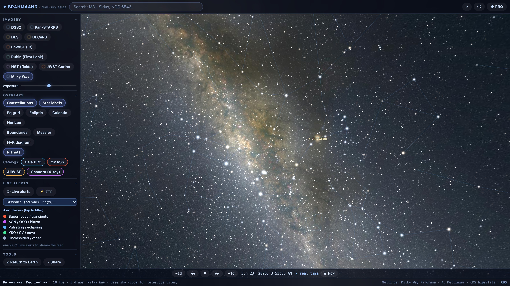
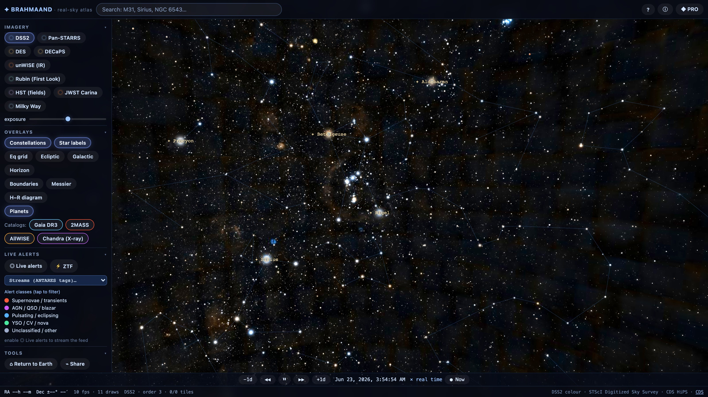
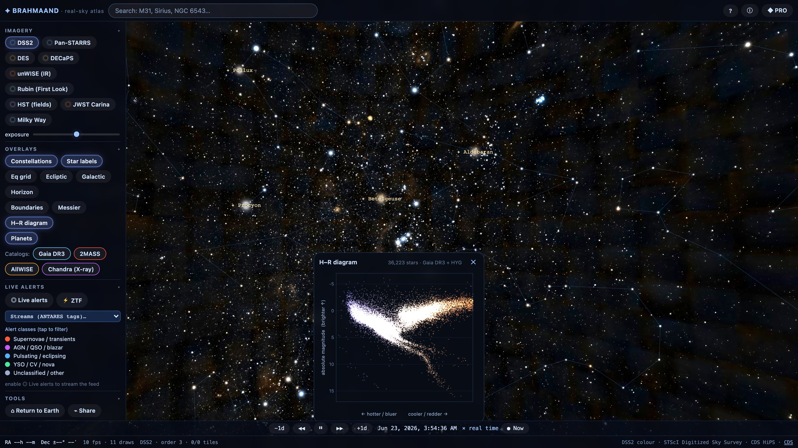
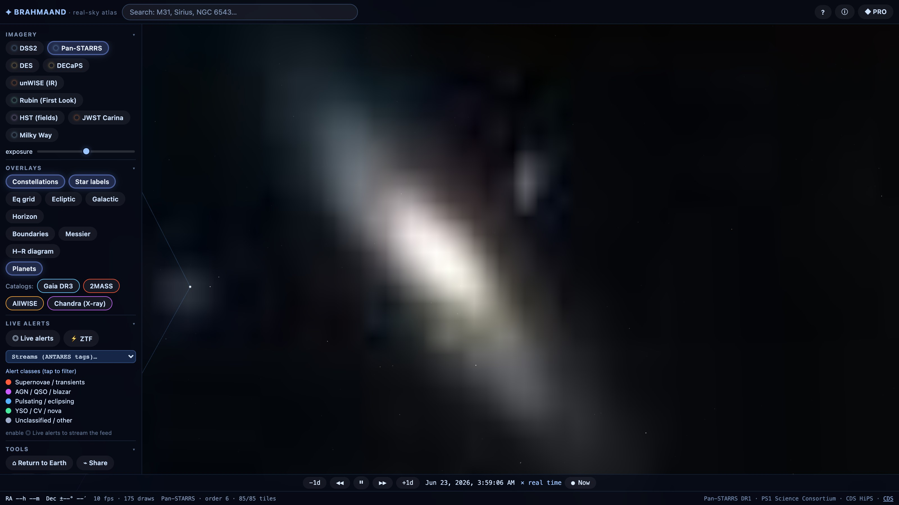
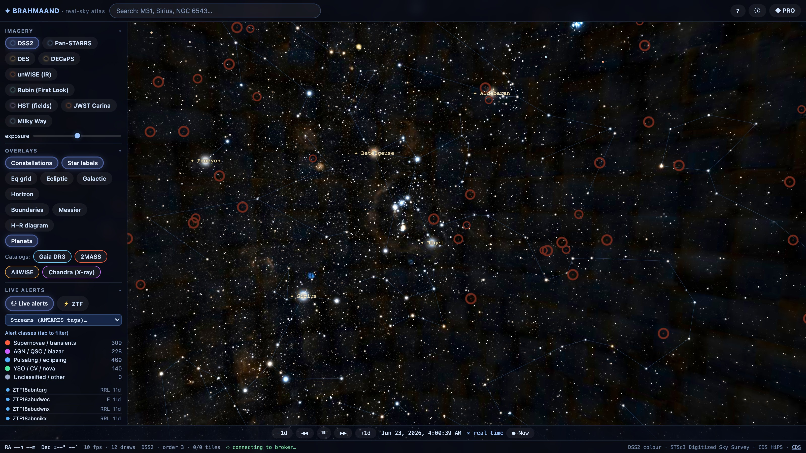
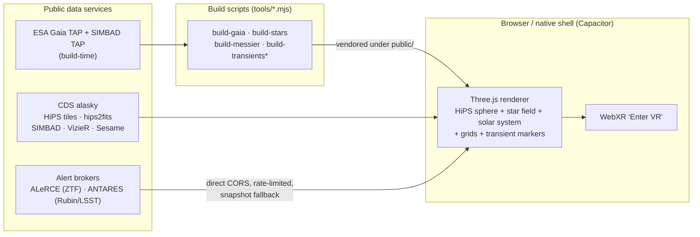

# ✦ Brahmaand

**A real-sky astronomy app — explore the actual night sky in your browser, on your phone, and in VR.**

[](https://kunalb541.github.io/Brahmaand/)
[](https://github.com/kunalb541/Brahmaand/actions/workflows/deploy.yml)
[](LICENSE)


Brahmaand (Sanskrit for *the cosmos*) is a real-imagery sky atlas **and** a real-distance 3D flight
through the stars — fed entirely by public astronomy services, with **no backend and no accounts**.
Pan and zoom across real telescope photography of the whole sky, fly through ~747,000 real stars at
their true distances, watch an arcsecond-accurate solar system run on a time machine, and (in Pro
mode) follow live transient alerts from the same brokers professional astronomers use. It runs as a
web app, installs as **native iOS / Android apps**, works offline as a **PWA**, and has an additive
**“Enter VR”** mode for headsets.

### ▶ [**Try it now → kunalb541.github.io/Brahmaand**](https://kunalb541.github.io/Brahmaand/)



---

## Contents

- [Screenshots](#screenshots)
- [What it is](#what-it-is) · [Who it's for](#who-its-for-public-vs-pro)
- [Feature highlights](#feature-highlights)
- [Run it on your phone](#run-it-on-your-phone) · [Quick start (web)](#quick-start-web)
- [Keyboard shortcuts](#keyboard-shortcuts--command-palette)
- [Tech stack](#tech-stack) · [How it works](#how-it-works)
- [Data sources & credits](#data-sources--credits) · [Contributing](#contributing) · [License](#license)

---

## Screenshots

| | |
|---|---|
|  |  |
| **Real sky + constellations.** Orion over DSS2 survey imagery with constellation figures, star labels and overlays. | **Hertzsprung–Russell diagram.** A live colour–magnitude diagram built from ~98k loaded Gaia DR3 + HYG stars. |
|  |  |
| **Telescope-resolution zoom.** Stream deeper survey tiles down to galaxies and nebulae — here, M31 in Pan-STARRS. | **Pro time-domain mode.** Live ZTF/LSST transient alerts as classified markers with a scrollable, filterable feed. |

---

## What it is

Three pillars:

1. **Real-imagery sky.** Actual survey photography — a DSS2 colour all-sky base with deeper surveys
   (Pan-STARRS, DES, DECaPS, unWISE, Rubin First Look, HST and JWST fields, Mellinger Milky Way)
   streamed as **HiPS** tiles (the IVOA Hierarchical Progressive Survey standard) from CDS. Pan,
   zoom to telescope resolution, switch surveys, adjust exposure — everything you see is a real
   photograph of the sky, correctly aligned so every overlay sits on the right stars.
2. **Real-distance 3D flythrough.** ~747,000 real stars — 638k from **Gaia DR3** plus the 109k
   brightest from **HYG** — placed at their true parallax distances and rendered as a custom
   Three.js point field. Leave Earth and fly through the actual solar neighbourhood.
3. **Live time-domain layer (Pro).** All-sky transient and variable-star alerts from community
   brokers — **ALeRCE/ZTF** (dense, classified) and **ANTARES** (the real Rubin/LSST + ZTF stream) —
   with machine-learning classifications, light curves, image-subtraction stamps, period-finding and
   catalogue cross-matches.

### Who it's for: Public vs Pro

One codebase, two experiences — switch by toggle or `?mode=` URL, remembered per device:

- **Public mode** — a clean, friendly sky: search, fly, “what’s up tonight”, share. Research chrome
  hidden; the app auto-picks the best survey as you zoom.
- **Pro mode** (default) — catalogues, classifiers, RA/Dec readout, exposure, the full survey ladder
  and the complete time-domain toolset.

---

## Feature highlights

<details open>
<summary><b>Sky &amp; imagery</b></summary>

- **Real-sky survey atlas** — pan/zoom the whole night sky rendered from real telescope photography.
- **Streaming telescope-resolution zoom (HiPS)** — deeper image tiles stream in and fade up as you zoom.
- **Multi-survey ladder** — DSS2 colour base + Pan-STARRS, DES, DECaPS, unWISE (IR), Rubin First Look, HST and JWST fields.
- **Survey switcher** *(Pro)* — a wavelength-coloured chip strip; each flies you to a famous target (Eagle Nebula, JWST Cosmic Cliffs…).
- **Auto-survey selection** *(Public)* — the app silently picks the deepest survey for wherever you look.
- **Adaptive level-of-detail** — loads only the tiles you can see at the right resolution for your zoom.
- **Exposure / brightness control** — a photographic slider brightens imagery and 3D stars together.
</details>

<details>
<summary><b>Stars &amp; 3D flythrough</b></summary>

- **Real-distance 3D star field** — ~747k stars (Gaia DR3 + HYG) at true parallax distances, brightness from real photometry.
- **Fly through the stars** — WASD/QE or an on-screen joystick, with boost and distance-scaled speed.
- **Return to Earth** — snap the camera back home anytime.
- **Bright-star labels** — Sirius, Vega, Polaris and other naked-eye stars labelled on the sky.
- **Hertzsprung–Russell diagram** — a live colour–magnitude diagram from the loaded stars; the main sequence, red-giant branch and white-dwarf region emerge from real data.
</details>

<details>
<summary><b>Solar system &amp; time machine</b></summary>

- **Solar system with correct Moon phase** — Sun, phase-lit Moon and 7 planets at real positions and true angular sizes; Saturn’s ring drawn, the Moon’s bright limb correctly turned toward the Sun.
- **Arcsecond-accurate ephemeris** — positions, phases, brightness, distance and apparent size via `astronomy-engine` (VSOP87/ELP), validated to arcseconds against JPL Horizons.
- **Time machine** — scrub to any date and animate from real-time up to a year per second, step by days, or jump back to *now*; the clock turns amber when time-warped.
</details>

<details>
<summary><b>Constellations, grids &amp; reference lines</b></summary>

- **Constellation figures &amp; labels** — classic stick figures over the real stars, with bright-star names.
- **IAU constellation boundaries** — the official borders dividing the sky into the 88 constellations.
- **Equatorial (RA/Dec) grid** — ICRS/J2000 grid with the celestial equator, drawn as accurate great/small circles.
- **Ecliptic &amp; precession circles** — the Sun’s yearly path plus the 25,800-year precession circles.
- **Galactic plane** — the mid-plane of the Milky Way.
- **Local horizon &amp; alt/az grid** — a translucent ground hemisphere, horizon line, N/E/S/W markers and an alt-az grid for your location and time.
</details>

<details>
<summary><b>Catalogues &amp; deep-sky objects</b></summary>

- **Messier catalogue (M1–M110)** — all 110 galaxies, nebulae and clusters from SIMBAD, with clickable fly-to labels that declutter at wide fields.
- **VizieR multiwavelength overlays** *(Pro)* — overlay real source catalogues (Gaia optical, 2MASS near-IR, AllWISE mid-IR, Chandra X-ray) on the same field.
- **Deep-sky image cutouts** — real survey imagery for any field, as a picture or as scientific FITS data.
</details>

<details>
<summary><b>Observability &amp; planning</b></summary>

- **Set your location** — device GPS or manual lat/long; every altitude and rise/set is computed for where you actually are.
- **Altitude, azimuth &amp; air mass** — how high and where any target sits right now.
- **Rise, transit &amp; set times** — when a target rises, peaks and sets tonight (flags circumpolar / never-rises).
- **Tonight’s altitude curve** — altitude-vs-time with sunset/sunrise, twilight shading and a *now* marker.
- **Sidereal time &amp; frame correction** *(Pro)* — reconciles J2000 catalogue coordinates with the of-date sky so pointing stays accurate.
</details>

<details>
<summary><b>Identify, search &amp; inspect</b></summary>

- **Click or tap to identify anything** — solar-system body, then live transient, otherwise the nearest SIMBAD source.
- **Search by name or coordinates** — “M31”, “Vega”, or a raw RA/Dec pair (via Sesame + SIMBAD).
- **Rich object info panel** — type, coordinates, magnitudes, spectral class, distance, proper motion, radial velocity, with links to SIMBAD and ESASky.
- **Finder-chart cutouts** — a DSS2 thumbnail with centring reticle, N/E marks and a field-scaled bar, like a telescope finder.
- **Angular-separation tool** — click two points for the great-circle angle in °/′/″, with a drawn, chainable arc.
- **Live RA/Dec readout** — sky coordinates under the cursor or view centre.
- **FOV framing circle** *(Pro)* — a true-angular-size circle cycling common eyepiece/detector fields.
</details>

<details>
<summary><b>Pro time-domain tools</b></summary>

- **Live all-sky transient alerts** — colour-coded markers + a scrollable feed, polling the broker near your view.
- **Two brokers** — switch ZTF via **ALeRCE** ⇄ Rubin/LSST + ZTF via **ANTARES**, with consistent labels and links.
- **ANTARES community streams** — browse alerts by tag (nuclear transients/TDEs, anomalies, solar-system objects, dwarf-nova outbursts…).
- **ML classifications &amp; filter** — supernova / AGN / RR Lyrae verdicts with ranked probabilities; tap a class to hide/show.
- **Light curves with non-detections** — per-band magnitude-vs-time with error bars and upper-limit arrows.
- **Image-subtraction triptych** — the science / template / difference stamps used to vet a real change.
- **Real/bogus scores** — the broker’s deep-learning real-vs-bogus verdict.
- **Lomb–Scargle period search &amp; phase folding** — an off-thread periodogram on the best-sampled band, with peak period, false-alarm probability and a phase-folded curve.
- **AAVSO VSX cross-match** — compares your measured period against the published one, flagging ½×/2× aliases.
- **SIMBAD cross-match triage** — the nearest catalogued source: host galaxy, re-detected known variable, or uncatalogued discovery.
- **Flux photometry &amp; CSV export** — peak flux in microjanskys; export detections + upper limits as CSV, fully client-side.
- **FITS quantitative mode** — true per-pixel values, a WCS RA/Dec cursor readout and zscale + linear/log/√/asinh stretches.
- **Offline snapshot fallback** — a bundled real all-sky alert snapshot when the live broker is slow.
</details>

<details>
<summary><b>Devices, VR &amp; AR</b></summary>

- **Phone as a window on the sky** — gyroscope tracking; with GPS + compass it locks to the real sky in the direction you point.
- **Drag-to-align calibration** — nudge the sky to match what you see; the correction is saved (counters unreliable phone compasses).
- **WebXR immersive VR** — on a headset, point a controller ray to identify, fly with the thumbstick and snap-turn.
- **Installable offline PWA** — a service worker caches the app shell, catalogues, textures and a capped set of tiles for offline use.
</details>

<details>
<summary><b>Interface &amp; experience</b></summary>

- **Pro / Public dual mode** — selectable by toggle or URL and remembered.
- **Responsive app shell** — a fixed, non-overlapping frame that becomes a drawer + bottom sheet on phones.
- **Command palette** — `⌘K` / `Ctrl-K` runs any toggle or tool and falls through to object search.
- **Keyboard shortcuts** — Stellarium-style single keys for every overlay, tool and time control.
- **Shareable deep-link views** — a Share button copies a URL encoding the exact view (RA, Dec, FOV, survey).
- **Help &amp; About panels** — controls, gyro modes, install steps, and full data-source credits.
- **Performance HUD** — optional FPS / draw-call readout for diagnostics.
</details>

---

## Run it on your phone

The fastest path is the **PWA**: open [the live demo](https://kunalb541.github.io/Brahmaand/) on your
phone and add it to your home screen — it then works offline and full-screen.

For the **native apps** (built with [Capacitor](https://capacitorjs.com/)) you build and install from
source — no store account needed for personal use:

- **iOS** — `npm run ios:sync && npm run ios:open`, then ▶ to your iPhone from Xcode (free Apple-ID
  signing works). Full walkthrough: **[docs/IOS.md](docs/IOS.md)**.
- **Android** — `cd android && ./gradlew assembleDebug` produces a sideloadable
  `app-debug.apk` (~18 MB) you can AirDrop/email to a friend. Full walkthrough:
  **[docs/ANDROID.md](docs/ANDROID.md)**.

---

## Quick start (web)

```bash
npm install
npm run dev        # → http://localhost:5173
npm run build      # typecheck + production bundle into dist/
npm test           # 42 unit tests (frames, ephemeris, observability, FITS, periodogram, device-sky)
```

Real assets are already vendored under `public/` (DSS2 + Mellinger all-sky JPEGs, constellation
lines + IAU boundaries, the star binaries, the Messier catalogue and transient snapshots), and a
service worker provides an offline shell — so a fresh clone runs with no extra downloads.

**Regenerate the bundled data** (all from real services, re-runnable):

```bash
node tools/build-stars.mjs        # HYG v4.1 (data-src/hyg.csv) → public/catalogs/hyg.bin
node tools/build-gaia.mjs         # ESA Gaia DR3 TAP            → public/catalogs/gaia.bin
node tools/build-messier.mjs      # SIMBAD TAP                  → public/data/messier.json
node tools/build-transients-ztf.mjs   # ALeRCE/ZTF             → public/transients/tonight.json
node tools/build-transients.mjs       # ANTARES Rubin/LSST     → public/transients/tonight-antares.json
```

> **WebXR** needs a secure context — `localhost` counts. No headset? The VR button shows
> “VR NOT SUPPORTED” and everything works as a normal 3D app; develop against the
> [Immersive Web Emulator](https://github.com/meta-quest/immersive-web-emulator).

### Keyboard shortcuts & command palette

| Key | Action | Key | Action |
|---|---|---|---|
| `C` | constellation figures | `B` | IAU boundaries |
| `L` | star labels | `M` | Messier objects |
| `R` | H–R diagram | `,` | ecliptic |
| `G` | equatorial grid | `H` | horizon grid |
| `P` | planets | `F` | FOV circle |
| `T` | live alerts (Pro) | `/` | search |
| `[` `]` | time ∓1 day | `N` | back to now |
| `?` | help | `⌘K` / `Ctrl-K` | command palette |

---

## Tech stack

| Component | Choice |
|---|---|
| Language / build | **TypeScript + Vite** (`typescript@6`, `vite@8`) |
| 3D engine | **Three.js** `WebGLRenderer` (`three@0.184`, pinned) |
| Ephemeris | `astronomy-engine` (MIT — VSOP87/ELP) |
| HEALPix math | `healpix-ts` (MIT) |
| Native shell | **Capacitor** (iOS via SPM, Android via Gradle) |
| Tests | **Vitest** (42 unit tests) |
| Data pipeline | Node scripts in `tools/` (Gaia TAP, SIMBAD TAP, ALeRCE, ANTARES, HYG) |
| Hosting / CI | Static GitHub Pages; GitHub Actions runs typecheck + test + build and deploys on every push to `main` |

## How it works

Everything is computed in the browser and every datum comes from a public astronomy service — there
is **no server to run, no database, and no accounts**. Catalogues and base imagery are vendored as
static files; HiPS tiles are hotlinked (and browser-cached) directly from CDS; alert brokers and
catalogue services are queried directly with client-side rate limiting and polite, `Retry-After`-aware
backoff so the app is a good citizen of shared scientific infrastructure.



---

## Data sources & credits

Brahmaand is built on the generosity of public astronomy infrastructure. Imagery and data are © their
providers and carry their own licenses — **see [DATA-LICENSES.md](DATA-LICENSES.md) for the full,
authoritative attribution**, and [docs/USAGE-AND-LEGAL.md](docs/USAGE-AND-LEGAL.md) for per-provider
usage rules. In short, with gratitude:

- **CDS, Strasbourg** — HiPS tiles, hips2fits, SIMBAD, VizieR, Sesame, MocServer.
- **ESA / Gaia / DPAC** — Gaia DR3 (the star distances); **astronexus** — the HYG database.
- **STScI / DSS2**, **Pan-STARRS**, **DES**, **DECaPS / NOIRLab**, **unWISE**, **Rubin Observatory**,
  **HST**, **JWST**, and the **Mellinger** Milky Way panorama — survey imagery.
- **ALeRCE** and **ANTARES (NOIRLab)** brokers — ZTF and Rubin/LSST alert streams; **AAVSO VSX** —
  the variable-star index.

## Contributing

Contributions and bug reports are welcome — open an [issue](https://github.com/kunalb541/Brahmaand/issues)
or a PR. Good places to start:

- **Data pipelines** (`tools/*.mjs`) — each script regenerates a bundled dataset from a real service.
- **Tests** (`*.test.ts`, run with `npm test`) — coordinate frames, ephemeris anchors (the 2020 great
  conjunction, the 2017 total eclipse), observability, FITS, periodogram and device-sky.
- **Subsystems** live under `src/` (`sky/`, `stars/`, `data/`, `ui/`, `core/`). `npm run typecheck`
  must stay clean.

The original up-front design blueprint, phase plans, research notes and design decisions are kept in
[`docs/internal/`](docs/internal/) for transparency — they’re build history, not user docs.

## License

Source code is **[MIT](LICENSE)**. Bundled astronomical **data and imagery are not** — they carry
their providers’ terms (Gaia DR3 + HYG star binaries are CC BY-SA; the Mellinger panorama is
non-commercial; constellation data is BSD-3). See **[DATA-LICENSES.md](DATA-LICENSES.md)** for full
attribution and the implications for public and commercial use.
