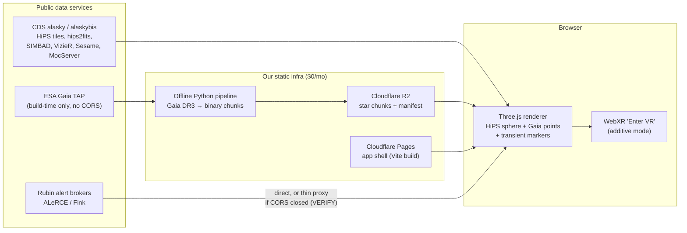

# Brahmaand — real-sky astronomy app (web · iOS · Android · VR)

A real-imagery sky atlas and real-distance 3D star-field flythrough, built on **TypeScript + Vite +
Three.js + WebXR** and fed entirely by public astronomy services. It runs as a desktop/mobile web
app, ships as **native iOS and Android apps via Capacitor**, and has an additive **WebXR "Enter VR"**
mode. As functional as a planetarium, but modern — with **professional time-domain tools**. Two
audiences sharing one modern shell: a **Pro** mode for astronomers and a simplified **Public** mode.

Repo: **[github.com/kunalb541/Brahmaand](https://github.com/kunalb541/Brahmaand)** (public).

> **Status: BUILT, RUNNABLE & VERIFIED — web + native iOS (Xcode `BUILD SUCCEEDED`) + native Android
> (`app-debug.apk`).** Highlights, all live-verified:
> - **Modern, zero-overlap UI.** App-frame layout (top bar + accordion dock + docked detail panel +
>   one-line status), responsive with no overlaps at phone / tablet / desktop; ☰ drawer on phones.
> - **Telescope-resolution zoom, both hemispheres.** A survey ladder (DSS2 base → Pan-STARRS /
>   DES / DECaPS / unWISE / Rubin First Look / HST / JWST) streams live HiPS tiles from CDS.
> - **109,400 real stars** (HYG parallax distances) you fly through with WASD/QE or a touch joystick.
>   **Click or search any object** → real SIMBAD data + hips2fits cutout with a centre reticle.
> - **Live all-sky alert ingest (Pro)** with a scrollable **alert feed/inbox** + class filter, a
>   **broker toggle** ⚡ ZTF (ALeRCE, dense classified) ⇄ 🔭 LSST (ANTARES, real Rubin/LSST + ZTF),
>   the **difference-image triptych** (science / template / difference), a light curve with error
>   bars + upper-limit arrows, and real/bogus (drb) scores.
> - **FITS quantitative mode** — real per-pixel values + WCS RA/Dec readout + scientific stretch
>   (linear/log/√/asinh) and zscale, parsed accurately in-browser (no fake JPEG numbers).
> - **Observability** — accurate altitude / azimuth / airmass + rise / transit / set + a "tonight"
>   altitude curve for any object, from your GPS/saved location (pure client math, unit-tested).
> - **Phone as a window on the sky.** Star-Walk-smooth gyro + compass + GPS register the view to the
>   *real* sky (altitude from gyro, azimuth from compass, RA/Dec from location + sidereal time).
> - **Pro / Public dual mode**, deep-link sharing, WebXR VR, $0 backend.
>
> Plans & guidance: [docs/ACTION-PLAN.md](docs/ACTION-PLAN.md) (design + pro-feature roadmap),
> [docs/SCALING-COMMERCIAL.md](docs/SCALING-COMMERCIAL.md) (licensing + broker/CDS server-load),
> [docs/DECISIONS.md](docs/DECISIONS.md), [docs/IOS.md](docs/IOS.md) / [docs/ANDROID.md](docs/ANDROID.md)
> (build & install on a phone), [docs/USAGE-AND-LEGAL.md](docs/USAGE-AND-LEGAL.md) (attribution).

## Quick start

```bash
npm install
npm run dev          # → http://localhost:5173  (look around the real sky)
npm run build        # typecheck + production bundle into dist/
npm test             # unit tests (coordinate-frame math)

# Native apps (Capacitor) — see docs/IOS.md and docs/ANDROID.md
npm run ios:sync && npm run ios:open       # build web → open in Xcode → ▶ to your iPhone
npm run android:sync && npm run android:open  # build web → open in Android Studio → ▶ / build APK

# Refresh the live alert snapshots (real broker data; re-runnable nightly)
node tools/build-transients-ztf.mjs        # dense ZTF/ALeRCE  → public/transients/tonight.json
node tools/build-transients.mjs            # ANTARES Rubin/LSST → public/transients/tonight-antares.json
```

**Send the Android app to a friend:** build the debug APK (`cd android && ./gradlew assembleDebug`
→ `android/app/build/outputs/apk/debug/app-debug.apk`, ~18 MB) and share that file (AirDrop, email,
Drive, etc.). They enable *Settings → Apps → Special access → Install unknown apps* for the app they
received it through, then tap the APK to install. No Play Store or developer account needed. See
[docs/ANDROID.md](docs/ANDROID.md) for signed-release and Play Store options.

Real assets are already vendored under `public/` (DSS2 + Mellinger all-sky JPEGs, constellation
lines) so it runs offline with no API calls. WebXR needs a secure context — `localhost` counts;
for a headset on your LAN, run `npm run dev -- --host` behind an HTTPS tunnel (see
[docs/research/deploy-assets.md](docs/research/deploy-assets.md) §5). No headset? The VR button
shows "VR NOT SUPPORTED" and everything works as a normal 3D app; test VR via the Immersive Web
Emulator.

**What's implemented vs. planned:** PHASE-0 (engine skeleton), PHASE-1 (real-imagery sky), PHASE-2
(live HiPS tile streaming), and PHASE-3 (3D star-field flythrough) are code. PHASE-4+ add the full
Gaia DR3 pipeline, object search, full WebXR, transients, and deploy — see [ROADMAP.md](ROADMAP.md).
Each shipped phase is a pragmatic subset of its full spec (e.g. PHASE-2: per-tile meshes, DSS2 only;
PHASE-3: HYG catalogue instead of the Gaia pipeline, no octree LOD / floating-origin) — see
[docs/DECISIONS.md](docs/DECISIONS.md) for the exact deviations and what's deferred.

The 3D star catalogue (`public/catalogs/hyg.bin`, 2 MB) is vendored. To regenerate it from source:
`curl -L <HYG v4.1 csv> -o data-src/hyg.csv && node tools/build-stars.mjs`.

---

## What the app is

Three pillars (detailed in [docs/00-vision.md](docs/00-vision.md)):

1. **Real-imagery sky.** Actual survey photography (DSS2 color, Pan-STARRS DR1, SDSS9, 2MASS,
   Mellinger, Rubin First Look) streamed as **HiPS tiles** (IVOA Hierarchical Progressive Survey
   standard) from CDS servers and textured onto an inside-out celestial sphere. Pan, zoom, and
   switch surveys; everything you see is a real photograph of the sky.
2. **Real-distance 3D flythrough.** 1.9M–4.7M stars from **Gaia DR3** with Bailer-Jones
   geometric/photogeometric distances, preprocessed offline into compact static binary chunks
   (~16 B/star, octree LOD), streamed into a custom Three.js point/impostor renderer. Leave Earth
   and fly through the actual solar neighborhood — parallax is real.
3. **Live transient layer ("what changed tonight", Pro).** All-sky alerts surfaced via community
   broker REST APIs with a runtime toggle: **ALeRCE/ZTF** (dense, classified — the LSST-precursor
   stream) and **ANTARES** (the real Rubin/LSST + ZTF stream, fuller per-object tags). Markers are
   coloured by ML class; click for classification, light curve, real/bogus flag, and cutout stamp.

Supporting features:

- **Object info on gaze/click** via SIMBAD cone search + TAP, name search via Sesame, postage-stamp
  cutouts via hips2fits — all CORS-open, called directly from the browser, no backend.
- **WebXR `immersive-vr` mode** (Quest-class headsets) as an additive layer over the same scene;
  mobile gets touch + opt-in gyroscope "magic window".
- **$0/month infrastructure**: static hosting (Cloudflare Pages) + Cloudflare R2 for catalog
  chunks + hotlinked CDS HiPS tiles; the only conditional server component is a ~15-line stateless
  caching proxy for alert brokers (only if their CORS turns out closed — VERIFY at M7).



## Tech stack (pinned, verified on npm 2026-06-11)

| Component | Choice | Version |
|---|---|---|
| Language / build | TypeScript + Vite (`vanilla-ts`) | `typescript@6.0.3`, `vite@8.0.16` |
| 3D engine | Three.js, **WebGLRenderer** (not WebGPU yet — see [ROADMAP.md](ROADMAP.md) §"What could change this plan") | `three@0.184.0` + `@types/three@0.184.1` (pin exactly, no `^`) |
| HEALPix math | `healpix-ts` (MIT, Development Seed) | `1.1.0` (fallback: `@hscmap/healpix@1.4.12`) |
| VR UI | `@pmndrs/uikit` (vanilla API) | `1.0.73` |
| XR emulation | Immersive Web Emulator extension + `iwer` | `iwer@2.2.1` |
| Offline pipeline | Python 3.12+, astroquery, astropy, numpy | — |
| Hosting | Cloudflare Pages + R2 (custom domain), GitHub Actions CI | — |

## Documentation map

**A new contributor or AI implementer must read [plan/AGENT_INSTRUCTIONS.md](plan/AGENT_INSTRUCTIONS.md) first** — it defines how to work in this repo, then proceed in the order below.

### Core design docs (`docs/`)

| Doc | Contents |
|---|---|
| [docs/00-vision.md](docs/00-vision.md) | Product vision: users, the three pillars, v1 non-goals, desktop vs VR UX walkthrough, design principles (scientific honesty) |
| [docs/01-architecture.md](docs/01-architecture.md) | System architecture: modules, scene graph, data flow, protocol abstractions (HiPS layer / TransientProvider / CutoutService), coordinate frames |
| [docs/02-data-sources.md](docs/02-data-sources.md) | Every external service: verified endpoints, CORS status, formats, limits, attribution requirements, failover |
| [docs/03-hips-implementation.md](docs/03-hips-implementation.md) | The HiPS sky renderer: tile addressing, HEALPix geometry, Allsky bootstrap, order selection, texture-array pool, UV-orientation verification |
| [docs/04-star-catalog-pipeline.md](docs/04-star-catalog-pipeline.md) | Offline Gaia DR3 pipeline: ADQL extraction, Bailer-Jones distances, color conversion, binary chunk format, octree LOD, hosting |
| [docs/05-webxr-vr.md](docs/05-webxr-vr.md) | WebXR integration: session wiring, input abstraction, VR UI, headset-free testing, Quest tuning, mobile magic-window |
| [docs/06-performance.md](docs/06-performance.md) | Frame budgets per platform, draw-call/texture/point ceilings, GC rules, profiling toolchain |
| [docs/07-pitfalls.md](docs/07-pitfalls.md) | Known traps (dead hostnames, CORS blocks, gl_PointSize clamps, sRGB blending, BigInt IDs…) and their mitigations |
| [docs/08-testing.md](docs/08-testing.md) | Test strategy: unit fixtures (healpy-validated HEALPix), visual diffs vs Aladin Lite, IWER-driven XR tests, perf regression gates |

### Build plan (`plan/`)

| Plan file | Milestone (see [ROADMAP.md](ROADMAP.md)) |
|---|---|
| [plan/AGENT_INSTRUCTIONS.md](plan/AGENT_INSTRUCTIONS.md) | **Read first** — working rules for implementing agents |
| [plan/PHASE-0.md](plan/PHASE-0.md) | M0 — Project scaffold & engine skeleton |
| [plan/PHASE-1.md](plan/PHASE-1.md) | M1 — HiPS sky renderer (pan/zoom real sky) |
| [plan/PHASE-2.md](plan/PHASE-2.md) | M2 — Gaia DR3 offline catalog pipeline |
| [plan/PHASE-3.md](plan/PHASE-3.md) | M3 — 3D star-field flythrough |
| [plan/PHASE-4.md](plan/PHASE-4.md) | M4 — Object info, search & cutouts |
| [plan/PHASE-5.md](plan/PHASE-5.md) | M5 — WebXR VR mode |
| [plan/PHASE-6.md](plan/PHASE-6.md) | M6 — Performance hardening & mobile |
| [plan/PHASE-7.md](plan/PHASE-7.md) | M7 — Rubin/LSST transient layer |

### Research dumps (`docs/research/`) — primary sources, live-verified 2026-06-11

| Dump | Topic |
|---|---|
| [docs/research/hips-format.md](docs/research/hips-format.md) | IVOA HiPS 1.0 spec at implementation depth; verified survey URLs, CORS, Allsky, tile math |
| [docs/research/healpix-math.md](docs/research/healpix-math.md) | HEALPix NESTED math (projection, corners, query_disc) + 2026 JS library survey |
| [docs/research/gaia-pipeline.md](docs/research/gaia-pipeline.md) | Gaia archive TAP, live-verified star counts, Bailer-Jones table, chunk format design |
| [docs/research/lsst-rubin.md](docs/research/lsst-rubin.md) | Rubin/LSST access state for unaffiliated devs; live-verified broker APIs and public HiPS |
| [docs/research/threejs-webxr.md](docs/research/threejs-webxr.md) | Three.js r184 + WebXR wiring, renderer choice, emulation, Vite/TS tooling |
| [docs/research/star-rendering.md](docs/research/star-rendering.md) | Million-star point rendering: hybrid Points/impostors, photometry, precision, prior art |
| [docs/research/tap-apis.md](docs/research/tap-apis.md) | TAP/cone/Sesame/hips2fits endpoints with live CORS probes; the ESA Gaia CORS block |
| [docs/research/performance-quest.md](docs/research/performance-quest.md) | Quest 2/3 frame budgets, FFR, texture pools, GC, profiling |
| [docs/research/deploy-assets.md](docs/research/deploy-assets.md) | Hosting comparison, chunk compression, service worker, CDS hotlinking policy, CI |
| [docs/research/existing-projects.md](docs/research/existing-projects.md) | License gate for Aladin Lite/WWT/Stellarium/Gaia Sky/etc.; what we may copy from (only MIT WWT) |

Each research dump separates **VERIFIED** facts (with source URLs and live HTTP probe results) from
UNVERIFIED/derived claims. Design docs carry forward unresolved items as explicit `VERIFY:` markers
— treat every `VERIFY:` as a required runtime test before the claim is relied on.

## How to start (new contributor or fresh AI model)

1. **Read [plan/AGENT_INSTRUCTIONS.md](plan/AGENT_INSTRUCTIONS.md).** It is the contract for how
   work proceeds in this repo (conventions, license rules, definition of done).
2. Read [docs/00-vision.md](docs/00-vision.md) and [docs/01-architecture.md](docs/01-architecture.md)
   for the what and the shape.
3. Read [ROADMAP.md](ROADMAP.md) and pick the lowest-numbered incomplete milestone.
4. Read that milestone's `plan/PHASE-N.md` plus the design docs it cites; consult
   `docs/research/*` when you need the primary evidence behind a decision.
5. Honor the hard rules: pin dependency versions exactly; **never copy code from GPL/AGPL/LGPL
   projects** (Aladin Lite, Stellarium Web Engine) — WWT (MIT) and OpenSpace (MIT) are the only
   surveyed copy-from codebases; keep every `VERIFY:` item as a test, not an assumption.

## Status & key constraints

- **Phase:** built, runnable & verified on web + native iOS + native Android (see status callout at
  top). The `plan/` + `docs/research/` files are the original blueprint; each shipped phase is a
  pragmatic subset of its spec — [docs/DECISIONS.md](docs/DECISIONS.md) records every deviation.
  Re-verify CORS headers and npm versions before relying on them at build time.
- **No VR headset on the team.** Everything must run as a plain desktop/mobile web app; VR is
  developed against the Immersive Web Emulator + IWER. On-device Quest performance validation is an
  open logistics item (see [ROADMAP.md](ROADMAP.md), M6).
- **No accounts, no stateful backend** in v1 (see non-goals in [docs/00-vision.md](docs/00-vision.md)).
- **Attribution is mandatory**: DSS2 (STScI acknowledgment), ESA/Gaia/DPAC (CC BY-SA 3.0 IGO),
  Rubin First Look (ODbL-1.0, RubinObs/NOIRLab/SLAC/NSF/DOE/AURA), CDS services, broker credits.
  The UI must display `obs_copyright` strings from HiPS `properties` files.

## License

Source code: **MIT** ([LICENSE](LICENSE)). Bundled data and imagery carry their own provider
licenses (HYG catalogue CC BY-SA 4.0; DSS2/STScI; Mellinger panorama non-commercial; constellation
lines BSD-3) — see **[DATA-LICENSES.md](DATA-LICENSES.md)** for full attribution and the implications
for public/commercial use.
