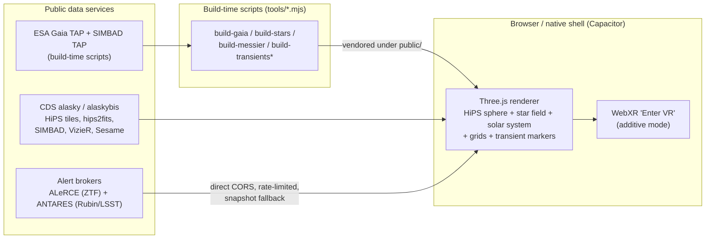

# Brahmaand — real-sky astronomy app (web · iOS · Android · VR)

A real-imagery sky atlas and real-distance 3D star-field flythrough, built on **TypeScript + Vite +
Three.js + WebXR** and fed entirely by public astronomy services. It runs as a desktop/mobile web
app, ships as **native iOS and Android apps via Capacitor**, and has an additive **WebXR "Enter VR"**
mode. As functional as a planetarium, but modern — with a **full solar system + time machine** and
**professional time-domain tools**. Two audiences sharing one modern shell: a **Pro** mode for
astronomers and a simplified **Public** mode.

Repo: **[github.com/kunalb541/Brahmaand](https://github.com/kunalb541/Brahmaand)** (public).

> **Status: BUILT, RUNNABLE & VERIFIED — web + native iOS (Xcode `BUILD SUCCEEDED`) + native Android
> (`app-debug.apk`).** Highlights, all live-verified:
> - **Modern, zero-overlap UI.** App-frame layout (top bar + accordion dock + docked detail panel +
>   time bar + one-line status), responsive with no overlaps at phone / tablet / desktop; ☰ drawer
>   on phones. Pro ⇄ Public modes share the shell.
> - **Telescope-resolution zoom, both hemispheres.** A survey ladder (DSS2 colour base →
>   Pan-STARRS / DES / DECaPS / unWISE / Rubin First Look / HST fields / JWST Carina / Mellinger)
>   streams live HiPS tiles from CDS, with exposure control and public-mode auto-survey.
> - **747k real stars** — Gaia DR3 (638k) + HYG (109k brightest) vendored binaries with real
>   parallax distances; fly through them with WASD/QE or a touch joystick, photometric exposure.
> - **Solar system, arcsecond-accurate.** Sun, Moon (correct phase drawn, bright limb toward the
>   Sun, topocentric parallax when location is set) and all 7 planets via the **astronomy-engine**
>   library (VSOP87/ELP, MIT, ~90 KB), validated to **arcseconds** against JPL Horizons. Positions
>   are J2000 ICRS, aberration-corrected and topocentric when an observer location is set;
>   magnitudes include Saturn's ring tilt; the Moon's illuminated fraction/phase is exact. Click any
>   body for distance, angular diameter, illumination/phase and observability. **Accuracy is proven
>   against real events:** unit tests reproduce the 2020-12-21 Jupiter–Saturn great conjunction and
>   the 2017-08-21 total solar eclipse (geocentric *and* topocentric from the totality path).
> - **Time machine.** Time bar with −1d/+1d, rates ±1 s/s to ±1 yr/s, pause, click-to-type date,
>   ● Now; amber when warped; drives the solar system, observability and the horizon grid.
> - **Observability** — altitude / azimuth / airmass + rise / transit / set + a "tonight" altitude
>   curve (sunset→sunrise, twilight shaded) for any object, from GPS or a saved manual location;
>   follows sim time (pure client math, unit-tested).
> - **Grids & catalogues.** Equatorial grid + celestial equator, ecliptic + precession circles,
>   galactic equator, observer horizon (alt/az) grid; constellation stick figures + official IAU
>   boundaries; all **110 Messier objects** (positions from SIMBAD) with clickable, decluttering labels.
> - **Tools.** FOV framing circle (5°/1°/30′/15′/5′, true angular size), 📐 two-click great-circle
>   measure (°/′/″, chainable), share deep links (`#ra&dec&fov&survey`), full hotkeys + ⌘K/Ctrl-K
>   command palette (see table below).
> - **Live all-sky alert ingest (Pro)** with a scrollable **alert feed** + class filter, a
>   **broker toggle** ⚡ ZTF (ALeRCE, dense classified) ⇄ 🔭 LSST (ANTARES, real Rubin/LSST + ZTF),
>   an **ANTARES Streams explorer** (12 community tags, e.g. `nuclear_transient`, anomaly detectors),
>   the **difference-image triptych** (science / template / difference), light curves with error
>   bars + upper-limit arrows (g/r/i), ML class probabilities and real/bogus (drb) scores.
> - **Period-finding (Pro).** A **Lomb-Scargle periodogram + phase-folding** runs on the best-sampled
>   photometric band of any transient — the standard period-finder for unevenly-sampled survey light
>   curves (variable stars, eclipsing binaries, RR Lyrae/Cepheids). Shows the periodogram and, when
>   significant, the phase-folded curve with "P = … · FAP … · significant/tentative". The frequency
>   grid is sized to the data (so long survey baselines aren't undersampled). Verified live on RR
>   Lyrae ZTF18abntqrg → P = 11.75 h (a textbook RRab period), FAP < 0.1%, corroborating "RRL 85%".
> - **Light-curve CSV export** (detections + upper limits) as a no-backend download — all users.
> - **Hertzsprung–Russell diagram.** A live colour–magnitude diagram built from the loaded Gaia DR3 +
>   HYG catalogues (absolute magnitude vs colour) — the main sequence, red-giant branch and
>   white-dwarf region from real data. Overlays toggle / `D` hotkey.
> - **SIMBAD cross-match on alerts.** Opening a transient runs a cone search at its position and shows
>   the nearest catalogued source + type + separation — a coincident known variable ("likely the same
>   source", a re-detection), a nearby galaxy/AGN ("possible host", extragalactic), or nothing
>   ("uncatalogued"). Verified live: RR Lyrae ZTF18abntqrg → `RR* · 0.1″ · likely the same source`.
> - **AAVSO VSX cross-match + period validation.** Also queries the AAVSO Variable Star Index (CORS-open)
>   for the catalogued variability type, **published period** and magnitude range, and **cross-checks our
>   measured Lomb-Scargle period against the literature** (✓ match / ½× or 2× alias / differs). Verified:
>   ZTF18abntqrg → `RRAB · P_cat = 11.75 h · ✓ your LS period matches` — four independent agreements
>   (broker ML, SIMBAD, VSX, our periodogram).
> - **Flux photometry.** Peak flux in physical units (`peak 279 µJy`) and a `flux_uJy` column in the CSV,
>   via the AB zero-points (µJy / nJy — the Rubin/LSST alert unit) — flux is the space difference-imaging
>   actually measures.
> - **Finder charts.** Object and alert cutouts carry N-up / E-left orientation marks and a field-sized
>   scale bar around the reticle — a telescope-ready finder. Plus per-target observability (rise / transit
>   / set, airmass, tonight's altitude curve) on every alert.
> - **Rendered horizon.** Stellarium/Star-Walk-style ground: a translucent ground hemisphere that
>   dims the below-horizon sky, a bright horizon line and N/E/S/W cardinal markers, built from the
>   observer location + time; works in look-around and phone-gyro modes; on the "Horizon" toggle.
> - **FITS quantitative mode (Pro)** — real per-pixel values + WCS RA/Dec readout + scientific
>   stretches (linear/log/√/asinh) and zscale, parsed accurately in-browser (no fake JPEG numbers).
> - **Phone as a window on the sky.** Star-Walk-smooth gyro + compass + GPS register the view to
>   the *real* sky (altitude from gravity, azimuth from compass, RA/Dec from location + sidereal
>   time); falls back to relative magic-window without sensors.
> - **Pro / Public dual mode**, deep-link sharing, WebXR VR, $0 backend.
>
> Plans & guidance: [docs/ACTION-PLAN.md](docs/ACTION-PLAN.md) (design + pro-feature roadmap),
> [docs/STELLARIUM-PARITY.md](docs/STELLARIUM-PARITY.md) (parity audit),
> [docs/SCALING-COMMERCIAL.md](docs/SCALING-COMMERCIAL.md) (licensing + broker/CDS server-load),
> [docs/DECISIONS.md](docs/DECISIONS.md), [docs/IOS.md](docs/IOS.md) / [docs/ANDROID.md](docs/ANDROID.md)
> (build & install on a phone), [docs/USAGE-AND-LEGAL.md](docs/USAGE-AND-LEGAL.md) (attribution).

## Quick start

```bash
npm install
npm run dev          # → http://localhost:5173  (look around the real sky)
npm run build        # typecheck + production bundle into dist/
npm test             # 35 unit tests (frames, ephemeris, observability, FITS, periodogram, device-sky)

# Native apps (Capacitor) — see docs/IOS.md and docs/ANDROID.md
npm run ios:sync && npm run ios:open       # build web → open in Xcode → ▶ to your iPhone
npm run android:sync && npm run android:open  # build web → open in Android Studio → ▶ / build APK

# Refresh the bundled data snapshots (all real services; re-runnable)
node tools/build-transients-ztf.mjs        # dense ZTF/ALeRCE  → public/transients/tonight.json
node tools/build-transients.mjs            # ANTARES Rubin/LSST → public/transients/tonight-antares.json
node tools/build-messier.mjs               # Messier M1–M110 from SIMBAD TAP → public/data/messier.json
```

**Send the Android app to a friend:** build the debug APK (`cd android && ./gradlew assembleDebug`
→ `android/app/build/outputs/apk/debug/app-debug.apk`, ~18 MB) and share that file (AirDrop, email,
Drive, etc.). They enable *Settings → Apps → Special access → Install unknown apps* for the app they
received it through, then tap the APK to install. No Play Store or developer account needed. See
[docs/ANDROID.md](docs/ANDROID.md) for signed-release and Play Store options.

Real assets are already vendored under `public/` (DSS2 + Mellinger all-sky JPEGs, constellation
lines + IAU boundaries, star binaries, Messier catalogue, transient snapshots) and a service worker
provides an offline shell. WebXR needs a secure context — `localhost` counts; for a headset on your
LAN, run `npm run dev -- --host` behind an HTTPS tunnel (see
[docs/research/deploy-assets.md](docs/research/deploy-assets.md) §5). No headset? The VR button
shows "VR NOT SUPPORTED" and everything works as a normal 3D app; test VR via the Immersive Web
Emulator.

The star binaries are vendored (`public/catalogs/hyg.bin` 2 MB, `public/catalogs/gaia.bin` 12 MB).
To regenerate: `curl -L <HYG v4.1 csv> -o data-src/hyg.csv && node tools/build-stars.mjs` for HYG,
and `node tools/build-gaia.mjs` for the Gaia DR3 extract (live ESA Gaia TAP, no account needed).

### Keyboard shortcuts

| Key | Action | Key | Action |
|---|---|---|---|
| `C` | constellation figures | `B` | IAU boundaries |
| `L` | star labels | `M` | Messier objects |
| `D` | H–R diagram | | |
| `G` | equatorial grid | `E` | ecliptic |
| `H` | horizon grid | `P` | planets |
| `T` | live alerts | `F` | FOV circle |
| `[` `]` | time ±1 day | `N` | back to now |
| `/` | search | `?` | help |

`⌘K` / `Ctrl-K` opens the command palette (all commands; falls through to sky search).

### Stopping local dev processes

The dev server and the native toolchains spawn background processes. To stop everything cleanly:

```bash
# Vite dev server (Ctrl-C in its terminal, or by port):
lsof -ti :5173 | xargs kill        # kills whatever holds the dev-server port

# Android Gradle daemons (they linger after a build):
cd android && ./gradlew --stop

# Any stray bundler/build workers:
pkill -f vite ; pkill -f esbuild   # optional, only if something is stuck

# Xcode/simulator (if a simulator build was launched):
xcrun simctl shutdown all          # stop running simulators
```

Nothing in this project runs as a service or daemon by default — closing the terminals that ran
`npm run dev` / Gradle / Xcode is enough; the commands above are the belt-and-suspenders version.

---

## What the app is

Three pillars (original vision in [docs/00-vision.md](docs/00-vision.md)):

1. **Real-imagery sky.** Actual survey photography (DSS2 colour base, Pan-STARRS, DES, DECaPS,
   unWISE, Rubin First Look, HST fields, JWST Carina, Mellinger Milky Way) streamed as **HiPS
   tiles** (IVOA Hierarchical Progressive Survey standard) from CDS servers and textured onto an
   inside-out celestial sphere. Pan, zoom to telescope resolution, switch surveys, adjust exposure;
   everything you see is a real photograph of the sky.
2. **Real-distance 3D flythrough.** 638k **Gaia DR3** stars + the 109k brightest from HYG, vendored
   as compact static binaries with real parallax distances, rendered as a custom Three.js point
   field with photometric exposure. Leave Earth and fly through the actual solar neighborhood
   (WASD/QE or touch joystick) — parallax is real.
3. **Live transient layer ("what changed tonight", Pro).** All-sky alerts surfaced via community
   broker REST APIs with a runtime toggle: **ALeRCE/ZTF** (dense, classified — the LSST-precursor
   stream) and **ANTARES** (the real Rubin/LSST + ZTF stream), plus an **ANTARES Streams** dropdown
   exploring 12 community tags (e.g. `nuclear_transient`, anomaly detectors, `sso_confirmed`).
   Markers are coloured by ML class; click for classification + probabilities, a light curve with
   error bars + upper-limit arrows, real/bogus score, the science/template/difference cutout
   triptych and a broker link. Live cone polling near the view; bundled snapshots as fallback.

Supporting features:

- **Solar system + time machine** — Sun, Moon and planets at arcsecond accuracy via astronomy-engine
  (VSOP87/ELP, validated vs JPL Horizons), driven by a scrubable simulation clock (±1 s/s to ±1 yr/s);
  see status callout above.
- **Object info on click/tap** — solar-system body, else transient marker, else SIMBAD cone search;
  name search via Sesame; catalog overlays Gaia DR3 / 2MASS / AllWISE / Chandra via VizieR;
  hips2fits postage-stamp cutouts with a centre reticle on every popup — all CORS-open, called
  directly from the browser, no backend.
- **Good-neighbour networking** — client rate limiters (CDS ≈4/s, brokers 3/s), cone caching,
  polite retry with exponential backoff honouring `Retry-After`, live polling paused in hidden
  tabs; HiPS tiles hotlinked and browser-cached, never mirrored.
- **WebXR `immersive-vr` mode** (Quest-class headsets) as an additive layer over the same scene;
  mobile gets touch + gyro/compass/GPS sky-lock AR (or relative magic-window without sensors).
- **$0/month infrastructure** — static hosting, vendored data under `public/`, hotlinked CDS HiPS
  tiles, no backend, no accounts.



## Tech stack (pinned — see package.json)

| Component | Choice | Version |
|---|---|---|
| Language / build | TypeScript + Vite (`vanilla-ts`) | `typescript@6.0.3`, `vite@8.0.16` |
| 3D engine | Three.js, **WebGLRenderer** | `three@0.184.0` + `@types/three@0.184.1` (pinned exactly, no `^`) |
| HEALPix math | `healpix-ts` (MIT, Development Seed) | `1.1.0` |
| Ephemeris | `astronomy-engine` (MIT, Don Cross; VSOP87/ELP) | `^2.1.19` |
| Native shell | Capacitor (iOS via SPM — no CocoaPods; Android via Gradle) | `@capacitor/*@^8.4` |
| Tests | Vitest | `3.2.4` |
| Data pipeline | Node scripts in `tools/` (Gaia TAP, SIMBAD TAP, ALeRCE, ANTARES, HYG) | — |
| Hosting / CI | Static hosting, no backend; GitHub Actions (typecheck + test + build on push; Pages deploy on manual dispatch) | — |

## Documentation map

### Current docs

| Doc | Contents |
|---|---|
| [docs/ACTION-PLAN.md](docs/ACTION-PLAN.md) | Design + pro-feature roadmap: what's done, what's next, in priority order |
| [docs/STELLARIUM-PARITY.md](docs/STELLARIUM-PARITY.md) | Feature-by-feature parity audit against Stellarium |
| [docs/SCALING-COMMERCIAL.md](docs/SCALING-COMMERCIAL.md) | What it takes to sell or scale: licensing blockers, broker/CDS server-load etiquette |
| [docs/USAGE-AND-LEGAL.md](docs/USAGE-AND-LEGAL.md) | Attribution requirements and usage rules for every data provider |
| [docs/IOS.md](docs/IOS.md) | Build & install the native iOS app (Xcode, SPM, free Apple-ID signing) |
| [docs/ANDROID.md](docs/ANDROID.md) | Build & install the native Android app (debug APK sideload, signed release) |
| [docs/DECISIONS.md](docs/DECISIONS.md) | Every deviation from the original blueprint, with reasons |
| [DATA-LICENSES.md](DATA-LICENSES.md) | Licenses and attribution for all bundled data and imagery |

### Original build blueprint (historical)

The repo was built from a detailed up-front blueprint, kept for reference: the numbered design docs
([docs/00-vision.md](docs/00-vision.md) … [docs/08-testing.md](docs/08-testing.md)), the phase plans
in [`plan/`](plan/) (with [plan/AGENT_INSTRUCTIONS.md](plan/AGENT_INSTRUCTIONS.md) as the working
contract), the live-verified research dumps in [`docs/research/`](docs/research/) (HiPS format,
HEALPix math, Gaia pipeline, Rubin/LSST access, TAP/CORS probes, Quest performance, deploy, license
gates for existing projects), and [ROADMAP.md](ROADMAP.md). Each shipped phase is a pragmatic subset
of its spec — [docs/DECISIONS.md](docs/DECISIONS.md) records the exact deviations.
[docs/PRO-ROADMAP.md](docs/PRO-ROADMAP.md) is superseded by [docs/ACTION-PLAN.md](docs/ACTION-PLAN.md).

## Status & key constraints

- **Phase: built, runnable & verified** on web + native iOS (Xcode `BUILD SUCCEEDED`, SPM, no
  CocoaPods) + native Android (`app-debug.apk` ~18 MB, `BUILD SUCCESSFUL`).
- **35 unit tests passing** — coordinate frames (4), FITS parsing (4), observability (6), ephemeris
  (8, including the 2020 great-conjunction and 2017 total-eclipse anchors), Lomb-Scargle periodogram
  (4), device-sky/gyro (9). Typecheck clean, production build green.
- **CI:** GitHub Actions runs typecheck + test + build on every push (green); Pages deploy only on
  manual dispatch (Pages not enabled yet).
- **Remaining (optional polish):** NGC/IC deep catalogue, eclipse/conjunction finder UI, exoplanet
  overlay, tabbed detail panel, i18n, planet moons, Gaia deep tiers, constellation art/cultures.
  Backend-gated (out of scope for the $0 design): ZTF/LSST forced photometry, TNS names,
  watchlists, Kafka streams.
- **Commercial blockers** (see [docs/SCALING-COMMERCIAL.md](docs/SCALING-COMMERCIAL.md)): the
  Mellinger panorama is non-commercial and must be replaced before selling; the Gaia/HYG-derived
  star binaries are CC BY-SA; an attribution UI is mandatory.
- **No VR headset on the team.** Everything runs as a plain desktop/mobile web app; VR is developed
  against the Immersive Web Emulator. The AR compass calibration knobs (`AZ_SIGN`/`AZ_OFFSET_DEG`)
  await an on-device check.
- **No accounts, no stateful backend** — all services are called directly from the browser with
  client-side rate limiting and polite backoff.
- **Attribution is mandatory**: DSS2 (STScI acknowledgment), ESA/Gaia/DPAC (CC BY-SA 3.0 IGO),
  Rubin First Look (ODbL-1.0, RubinObs/NOIRLab/SLAC/NSF/DOE/AURA), CDS services, broker credits.
  The UI must display `obs_copyright` strings from HiPS `properties` files.

## License

Source code: **MIT** ([LICENSE](LICENSE)). Bundled data and imagery carry their own provider
licenses (Gaia DR3 + HYG derived star binaries CC BY-SA; DSS2/STScI; Mellinger panorama
non-commercial; constellation lines + boundaries BSD-3) — see
**[DATA-LICENSES.md](DATA-LICENSES.md)** for full attribution and the implications for
public/commercial use.
