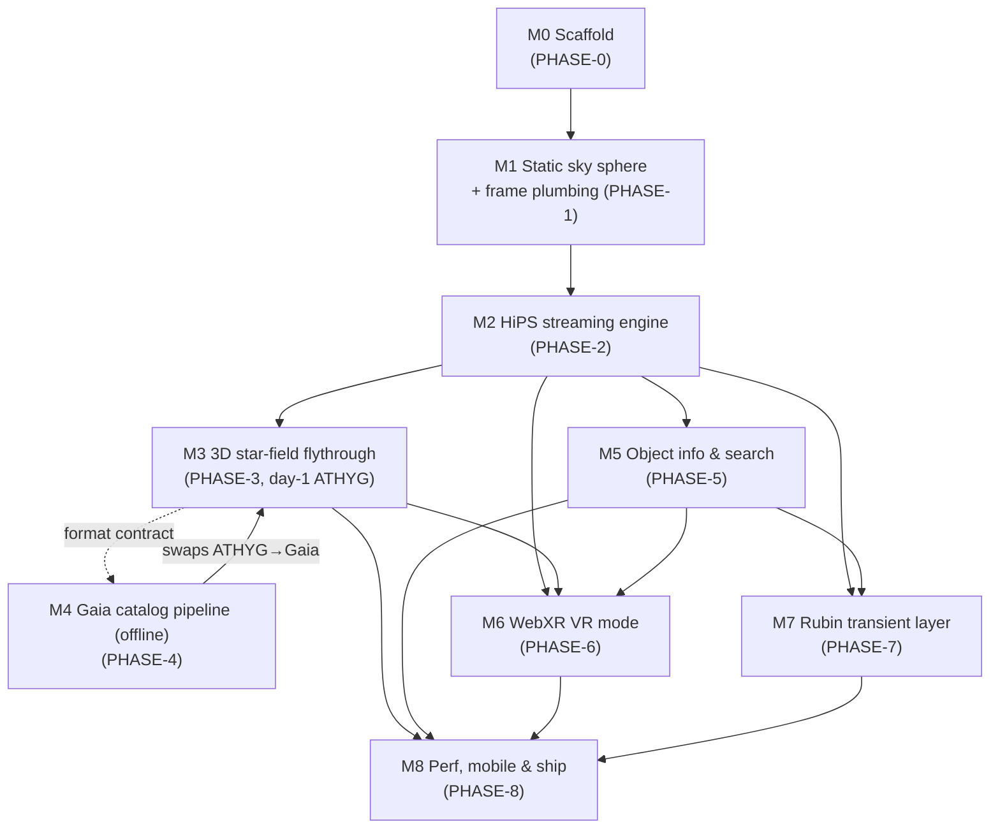

# ROADMAP — Master Build Plan

> **Status (2026-06-13): all original phases (0–8) are built, runnable & verified** — web + native
> iOS (`BUILD SUCCEEDED`) + native Android (`app-debug.apk`). This file is kept as the **original
> build blueprint** (historical); some specifics shifted in implementation (e.g. the secondary
> broker is **ANTARES**, not Fink; the live broker pair is **ALeRCE/ZTF ⇄ ANTARES/Rubin-LSST**).
> For the current state and plan see **[docs/ACTION-PLAN.md](docs/ACTION-PLAN.md)**,
> **[docs/STELLARIUM-PARITY.md](docs/STELLARIUM-PARITY.md)**, and **[README.md](README.md)**.

```yaml
doc: ROADMAP
status: stable (planning phase)
date: 2026-06-11
effort_unit: "session" = one focused implementation session by an AI agent or developer
             (one coherent context window of work, roughly a half-day human-equivalent)
```

This roadmap defines milestones **M0–M8**, each mapping **1:1 onto a phase runbook**
`plan/PHASE-n-*.md` (see the table in [plan/AGENT_INSTRUCTIONS.md](plan/AGENT_INSTRUCTIONS.md) §3 —
that mapping is canonical and every phase file's `milestone:` tag follows it). Work milestones in
order except where the dependency graph allows parallelism (notably **M4, the offline Gaia
pipeline, alongside M0–M3**, since M3 runs on day-1 ATHYG data and only needs M3 to have *frozen*
the chunk format).

Anything marked `VERIFY:` is an unresolved research item carried into the plan — it must be
resolved by a test, never assumed.

> **Numbering note:** an earlier draft narrated "the HiPS sky" as one milestone and listed the
> Gaia pipeline as M2. The canonical scheme below splits HiPS into **M1 (static sphere + coordinate
> plumbing)** and **M2 (the streaming engine)**, moves the **Gaia pipeline to M4** (it's offline and
> parallelizable), and folds **performance/mobile into M8 (ship)**. This matches the phase files on
> disk. If you see the old mapping anywhere, this table wins.

## Milestone → phase file

| Milestone | Phase file | Delivers |
|---|---|---|
| M0 | `plan/PHASE-0-setup.md` | Scaffold & engine skeleton |
| M1 | `plan/PHASE-1-sky-sphere.md` | Static sky sphere, look controls, coordinate plumbing, survey registry |
| M2 | `plan/PHASE-2-hips-engine.md` | HiPS streaming engine (LOD, tile cache, Allsky, failover, survey switch) |
| M3 | `plan/PHASE-3-starfield.md` | 3D star-field flythrough (day-1 ATHYG data) |
| M4 | `plan/PHASE-4-gaia-pipeline.md` | Offline Gaia DR3 → GSC1 chunk pipeline (swaps ATHYG → Gaia) |
| M5 | `plan/PHASE-5-data-layer.md` | Object info, name search & cutouts |
| M6 | `plan/PHASE-6-webxr.md` | WebXR VR mode (+ phone magic-window) |
| M7 | `plan/PHASE-7-transients-lsst.md` | Rubin/LSST transient layer + readiness |
| M8 | `plan/PHASE-8-ship.md` | Performance hardening, mobile, service worker, deploy, v1.0 release gate |

## Dependency graph



Total estimated effort: **27–46 sessions** (sum of ranges below).

---

## M0 — Project scaffold & engine skeleton (`plan/PHASE-0.md`)

**Goal:** a deployed, CI-built, empty-but-correct Three.js app: the chassis every later milestone
bolts onto.

**Key deliverables**
- Vite 8 + TypeScript 6 `vanilla-ts` scaffold; exact-pinned deps (`three@0.184.0`,
  `@types/three@0.184.1`, `typescript@6.0.3`, `vite@8.0.16`) — no `^` ranges.
- `createRenderer()` factory (WebGLRenderer now; swap point for WebGPU later),
  `renderer.setAnimationLoop` from day one, camera-rig pattern (camera parented under a rig group).
- Desktop look-around + orbit controls; `PointerLike` input-ray abstraction stub.
- Debug HUD (`renderer.info`: draw calls, triangles, textures; frame-time p95).
- Placeholder inside-out sphere with a static equirect texture (proves winding/culling/frames).
- Tooling: ESLint + Vitest; GitHub Actions CI; deploy to Cloudflare Pages via
  `wrangler pages deploy`; `_headers` file with long-cache rules; HTTPS dev setup
  (`@vitejs/plugin-basic-ssl`, `--host`).

**Acceptance criteria**
- `npm run dev` shows the placeholder sphere; you can look around at 60 fps; zero console errors.
- CI builds, tests, and deploys on push to `main`; the deployed HTTPS URL renders identically.
- Frame loop allocates nothing in steady state (verified once with the DevTools allocation
  timeline — establishes the discipline early).

**Effort:** 1–2 sessions. **Risk:** Low. **Depends on:** nothing.

---

## M1 — HiPS sky renderer (`plan/PHASE-1.md`)

**Goal:** the real sky. Pan and zoom photographic survey imagery across the full sphere.

**Key deliverables**
- HiPS `properties` parser; survey registry seeded with the six verified starter surveys (DSS2
  color default, Pan-STARRS DR1, SDSS9, 2MASS, Mellinger, Rubin First Look); attribution UI from
  `obs_copyright`.
- `healpix-ts@1.1.0` integration (`VERIFY:` spike its `cornersNest`/`queryDiscInclusiveNest`
  against healpy-generated fixtures; fallback = pin `@hscmap/healpix@1.4.12` or port ~400 lines
  from michitaro/healpix per `docs/research/healpix-math.md`).
- Allsky bootstrap (order-3 file sliced into 768 sub-textures → instant full sky).
- Tile streaming: URL builder (`Norder{K}/Dir{D}/Npix{N}.{ext}`), bounding-cone view query, order
  selection (~1 tile px per screen px), parent-tile fallback while children load, worker-pool
  `fetch → blob → createImageBitmap` decode, throttled GPU uploads, LRU cache,
  alasky → alaskybis failover, MOC-aware skipping of out-of-coverage requests.
- Per-tile curvilinear quad meshes (n×n subdivision via inverse HEALPix face projection); fixed
  galactic→ICRS rotation for Mellinger.
- **UV-orientation verification** — the known blocking correctness risk: render one DSS2 field and
  visually diff against Aladin Lite (8 possible orientations; `VERIFY:` per
  `docs/research/hips-format.md` §7 before anything else is built on the renderer).

**Acceptance criteria**
- **You can pan a DSS2 sky at 60 fps** on a mid-range laptop, and zoom from full sky down to
  Pan-STARRS order-11 detail with progressive sharpening and no permanent seams/holes.
- First sky pixels visible < 2 s on a cold load (Allsky path).
- Orientation matches Aladin Lite for at least 3 fields (Orion's belt, Crab, a pole region) —
  screenshot evidence committed.
- Partial surveys (SDSS9, Rubin First Look) show coverage boundaries; no 404 storms (MOC honored).
- Switching surveys takes effect < 1 s with no WebGL context loss; tile uploads never block a
  frame > 2 ms (HUD assertion).

**Effort:** 4–6 sessions. **Risk:** Medium (UV parity, HEALPix library health, frame-budget
discipline). **Depends on:** M0.

---

## M2 — Gaia DR3 offline catalog pipeline (`plan/PHASE-2.md`)

**Goal:** the star data product: reproducible Python pipeline turning Gaia DR3 into static binary
chunks. Pure offline work — can run in parallel with M1.

**Key deliverables**
- Registered (free) ESA archive account; async ADQL job joining `gaiadr3.gaia_source` ×
  `external.gaiaedr3_distance` with cuts G < 11.5 / G < 12.5 ∧ `parallax_over_error > 5`
  (+ `ruwe < 1.4`; `VERIFY:` post-cut row count) → lite (1.94 M) and full (4.68 M) extracts.
- Distance = `COALESCE(r_med_photogeo, r_med_geo)`; color = `teff_gspphot` else
  Ballesteros(bp_rp) → 256-entry blackbody sRGB LUT; ICRS → parsec XYZ with the fixed
  ICRS→Three.js axis mapping shared with the HiPS sphere.
- ATHYG v3.3 bright-star patch (G ≲ 4 / missing HIP stars) + proper-name index (kept out of the
  binary chunks); dedupe on `source_id`.
- SoA binary chunk format, 16 B/star (Float32 chunk-relative xyz + uint8 palette color + Float16
  G-mag + spare), magnitude-stratified octree (~64 k stars/leaf), `manifest.json` (chunk ids,
  centers in f64, radii, mag ranges, sha256, color LUT).
- Round-trip validation suite (decode chunks in TS, compare against source CSV rows); compression
  benchmark (`VERIFY:` measured gzip/brotli ratios vs the int16-quantized variant per
  `docs/research/deploy-assets.md` §4); upload job to Cloudflare R2 with immutable cache headers.
- Pipeline parameterized by release (DR3 today, DR4 on 2026-12-02), re-runnable with one command.

**Acceptance criteria**
- One command regenerates both catalogs end-to-end from a clean machine (given credentials);
  outputs are checksummed and byte-stable for a fixed input.
- Lite catalog ≤ 35 MB raw; full ≤ 80 MB raw; manifest validates against a JSON schema.
- TS round-trip test passes: positions within quantization tolerance, magnitudes exact to
  Float16, colors exact.
- Sanity plots committed: HR diagram, sky-density map, distance histogram (catches unit/axis bugs
  before any rendering exists).

**Effort:** 3–5 sessions. **Risk:** Low–Medium (archive job wall-clock `VERIFY:` vs the 120-min
cap; NULL-fraction fallback ordering `VERIFY:`). **Depends on:** M0 for the repo/CI only; not on M1.

---

## M3 — 3D star-field flythrough (`plan/PHASE-3.md`)

**Goal:** the signature feature: fly through millions of real stars without jitter, pops, or
ping-pong-ball stars.

**Key deliverables**
- Hybrid renderer: `THREE.Points` + custom ShaderMaterial for the bulk; instanced-quad billboard
  impostors for bright stars (gl_PointSize is clamped to 64 px on Apple GPUs — queried at startup).
- Photometry pipeline in-shader: stored absolute magnitude → per-frame apparent magnitude from
  camera distance → linear intensity (10^(−0.4Δm)) with exposure control → size grows only past
  display saturation (sqrt of intensity); sub-pixel alpha fade for faint stars.
- Camera-relative rendering: f64 camera on CPU, per-chunk `uChunkOffset` uniforms, chunk-local
  f32 positions, camera pinned at origin; **no `logarithmicDepthBuffer`** — stars draw additive
  with depth test/write off after the depth-less sky sphere.
- Octree chunk streaming against `manifest.json`: distance/solid-angle load set, LRU GPU budget,
  manual frustum culling by bounding sphere, 300–500 ms intensity fades on load/unload.
- Mode transition sky ↔ flythrough; HiPS sphere fade beyond ~100 pc (`VERIFY:` what replaces it
  visually — Milky Way billboard vs starless map — needs prototyping); travel-to-star action.

**Acceptance criteria**
- **1 M+ Gaia stars flyable at 60 fps** on a mid-range desktop GPU (lite catalog fully streamed),
  with HUD-verified draw calls within budget.
- Fly Sun → Pleiades (~136 pc): no positional jitter at any point (camera-relative math), no
  visible chunk pops (fades), star brightening obeys inverse-square.
- At the origin, the rendered naked-eye sky is recognizable against the real sky (Orion, Big
  Dipper validated against a planetarium reference) and bright-star colors look plausible.
- Memory stays under the LRU budget while crossing the catalog diagonally; steady-state frame loop
  allocates zero.

**Effort:** 5–8 sessions. **Risk:** High (shader photometry tuning, precision plumbing, LOD
heuristics — the most novel engineering in the app). **Depends on:** M1 (scene/frame conventions,
sky fade interplay) + M2 (chunks).

---

## M4 — Object info, search & cutouts (`plan/PHASE-4.md`)

**Goal:** "what am I looking at?" everywhere, from real catalogs, with zero backend.

**Key deliverables**
- Shared picker on the `PointerLike` ray (mouse now; XR controller/gaze joins in M5); raycast
  throttled ≤ 15 Hz.
- SIMBAD modern cone endpoint (`/cone?RA&DEC&SR&RESPONSEFORMAT=json`) as primary lookup; SIMBAD
  TAP `FORMAT=json` for enriched data (fluxes via `allfluxes`, type labels via `otypedef`).
  Never the legacy `sim-id` JSON path (verified server-side NPE).
- Name search via Sesame at `https://cds.unistra.fr/cgi-bin/nph-sesame` (the only resolving host —
  `sesame.unistra.fr` is dead DNS), parsed with `DOMParser`.
- hips2fits postage stamps (`/hips-image-services/hips2fits`, jpg ≤ 512², alaskybis failover).
- Gaia detail lookups via VizieR TAP `"I/355/gaiadr3"` (the CORS-safe Gaia path; ESA archive is
  browser-blocked — verified).
- One shared CDS etiquette module: rate limiter (≤ 5 req/s aggregate), debounce, LRU response
  cache keyed on full URL; info-card UI (HTML/CSS on desktop/mobile).

**Acceptance criteria**
- Click near the Crab Nebula → card identifies M 1 with type, magnitudes, and a DSS2 cutout in
  < 1.5 s on a typical connection; clicking empty sky reports "no SIMBAD match" honestly.
- Search "Betelgeuse", "M 31", "NGC 7000" → view centers correctly; unresolvable names produce a
  clear error.
- Network panel shows every call browser-direct (no proxy), debounced, and cached on repeat.
- Mode-aware: in flythrough, picking a 3D star resolves it via cone search on its catalog ra/dec
  (`VERIFY:` latency acceptable vs storing per-star source_id — decide with a measurement).

**Effort:** 2–4 sessions. **Risk:** Low (every endpoint live-verified with CORS `*`).
**Depends on:** M1 (sky + rays); enriched by M3.

---

## M5 — WebXR VR mode (`plan/PHASE-5.md`)

**Goal:** the additive "Enter VR" mode — same scene, same features, headset presence. Built and
tested entirely headset-free.

**Key deliverables**
- `renderer.xr.enabled`, `XRButton` (`optionalFeatures: ['hand-tracking','layers']`),
  `local-floor` reference space, OrbitControls disabled on `sessionstart`.
- Controller + hand wiring (`XRControllerModelFactory` with **self-hosted**
  `@webxr-input-profiles` assets, `XRHandModelFactory`); controller/gaze rays implement
  `PointerLike` so M4 picking works unchanged; all `select*` events unified.
- In-headset UI panels via `@pmndrs/uikit@1.0.73` vanilla API (`localClippingEnabled`,
  `reversePainterSortStable`, `root.update(delta)`), mirroring the HTML UI state store.
- Per-eye correctness pass for the star shader (gl_PointSize scaled by per-eye
  pixels-per-radian); session tuning: query `supportedFrameRates`, request 90/72;
  `setFoveation(0.3–0.5)` (`VERIFY:` r184 default foveation = 1.0 — stars blur badly at max);
  `setFramebufferScaleFactor` pre-session.
- Headset-free test rig: Immersive Web Emulator for interactive checks; `iwer@2.2.1` injected in
  CI to enter a fake `immersive-vr` session and assert render-loop/controller behavior.
- VR comfort: thumbstick locomotion with vignette option; no DOM Overlay (handheld-AR-only).

**Acceptance criteria**
- "Enter VR" in the Immersive Web Emulator renders correct stereo (sky + stars in both eyes, no
  eye divergence), maintains the desktop feature set, and exits cleanly back to the identical 2D
  state.
- Emulated controller trigger picks an object and shows the uikit info panel; emulated head
  movement look-arounds the sky correctly.
- CI includes an IWER smoke test (session start → 100 frames → controller select → session end)
  that fails on regression.
- Desktop/mobile behavior is byte-identical when XR is unavailable (no regressions).

**Effort:** 3–5 sessions. **Risk:** Medium (emulator-only validation; real-headset unknowns are
explicitly deferred to M6). **Depends on:** M1 (and effectively M3/M4 for content worth entering).

---

## M6 — Performance hardening & mobile (`plan/PHASE-6.md`)

**Goal:** hit the written budgets on every tier; make the phone experience first-class; prepare
for real Quest hardware.

**Key deliverables**
- Enforce the budget table from `docs/06-performance.md` (Quest 2 baseline: ≤ 80 draw calls,
  ≤ 300 k points, ≤ 4 ms JS, 128-layer tile pool, 1 tile upload/frame) with dev-build assertions.
- WebGL2 `TEXTURE_2D_ARRAY` tile pool (`texStorage3D`, merged sphere geometry → ≤ 4 sky draw
  calls) replacing any per-tile meshes from M1; two-tier star pass (bulk 1–2 px points + ≤ 5 k
  additive sprites).
- Zero-allocation frame-loop audit (scratch pools, throttled raycasts, no closures in rAF);
  frame-time governor (rolling p95 → drop framebuffer scale / request 72 Hz).
- Service worker: precached app shell; CacheFirst immutable chunks; CORS-only HiPS tile cache
  (maxEntries ~2000 — never cache opaque responses); `navigator.storage.persist()`; documented
  Safari 7-day eviction caveat.
- Mobile polish: touch controls, pinch zoom, gyro magic-window (vendored DeviceOrientation
  controller; iOS permission flow), data-saver tier.
- KTX2 pre-encode for self-hosted static textures only (sprites, baked low-order base sky) —
  never for live HiPS tiles.
- On-device Quest validation plan: `VERIFY:` the team has no headset — acquire a Quest 3S dev
  unit or device cloud; measure `ALIASED_POINT_SIZE_RANGE`, real texture-memory ceiling, tile
  upload cost, `updateTargetFrameRate(72)` behavior. Until then, Quest budgets remain
  assertions-by-construction, not measurements.

**Acceptance criteria**
- Desktop: 60 fps p95 in both modes on a 4-year-old mid-range laptop; cold load to interactive
  sky < 3 s on fast 3G-class throttling.
- Mobile: 30+ fps on a mid-range Android phone; gyro mode aligns with touch mode; iOS permission
  flow works under HTTPS.
- Emulated XR: frame loop holds 90 Hz-equivalent timing headroom on the dev machine; draw
  calls/texture memory within Quest 2 budget columns.
- Second visit renders the sky offline-from-cache (airplane-mode test, Chrome).
- *Conditional (hardware-gated):* on a real Quest 2/3, sky mode 72/90 Hz and flythrough within
  point budget — explicitly tracked as open until hardware exists.

**Effort:** 3–5 sessions (+ hardware logistics). **Risk:** Medium–High (no headset; undocumented
Quest browser ceilings). **Depends on:** M3, M5.

---

## M7 — Rubin/LSST transient layer (`plan/PHASE-7.md`)

**Goal:** "what changed tonight" — the live Rubin feature available to everyone today, plus the
Rubin imagery showcase.

**Key deliverables**
- `TransientProvider` interface with two adapters: **ALeRCE** (GET + OpenAPI,
  `api-lsst.alerce.online`, primary) and **Fink** (POST + JSON, `api.lsst.fink-portal.org`,
  secondary), with retry/backoff/circuit-breaking (5xx observed live) and cross-broker failover.
- `diaObjectId` handled as **string/BigInt everywhere** (int64 > 2^53 — verified IDs corrupt as JS
  numbers); nJy flux → AB magnitude conversion at the adapter boundary.
- "Tonight" panel: recent transients (class/probability filters, classifier provenance labels),
  sky markers, light curves, cutout stamps (`VERIFY:` stamp payload format PNG vs FITS — the
  end-to-end fetch 502'd during research).
- `VERIFY:` browser CORS on both broker APIs; if closed, ship the contingency: a stateless
  Cloudflare Worker caching proxy that also materializes one static "tonight.json" per night
  (politeness + 502 absorption).
- Featured **Rubin First Look** HiPS layer (`CDS/P/Rubin/FirstLook`, ODbL) with MOC coverage
  outline and a "why is Rubin data so small here?" explainer reflecting the data-rights reality;
  hips2fits cutouts for transient context images.
- A periodic (manual or CI cron) MocServer re-check for new public `ID=*Rubin*` HiPS.

**Acceptance criteria**
- The panel lists real transients from the latest available night, anonymously; each shows broker,
  classifier, and probability; selecting one centers the sky and renders its light curve.
- Kill ALeRCE at the network layer → Fink fallback produces the same object (IDs verified
  broker-portable); both brokers down → graceful "stream unavailable" state.
- A known `diaObjectId` (e.g. 170226393632735260) round-trips with no precision loss (unit test).
- Rubin First Look renders with its coverage boundary; markers align with the imagery.

**Effort:** 3–5 sessions. **Risk:** Medium (young broker APIs, unverified CORS, evolving
endpoints — Fink's class-based "latest" endpoint must be rediscovered via `GET /api/v1/schema`).
**Depends on:** M1 (sky/markers), M4 (info-card framework, etiquette module).

---

## M8 — v1.0 release gate (no phase file — cross-cutting)

**Goal:** ship. Re-verify everything as deployed, close the licensing loop, polish failure states.

**Key deliverables**
- Full acceptance-criteria re-run of M1–M7 **on the production URL** (not localhost), across
  Chrome, Firefox, Safari, Android Chrome, iOS Safari, + emulated XR.
- Attribution & licensing audit: visible credits page (DSS2/STScI acknowledgment, ESA/Gaia/DPAC
  CC BY-SA 3.0 IGO for derived chunks, ATHYG CC BY-SA 4.0, Rubin First Look ODbL-1.0, CDS
  services, broker credits); `VERIFY:` ShareAlike obligations on the mixed Gaia+ATHYG binary
  bundle resolved (documented decision, license file shipped alongside the data).
- Error/empty states for every network dependency (CDS down, broker down, R2 unreachable, WebGL
  context loss recovery); user-facing help/about page; final deep-link URL schema frozen.
- Production config: custom domain, R2 custom domain (never `r2.dev`), immutable cache headers
  verified with curl, service-worker version bump discipline documented.
- Tag `v1.0.0`; archive a reproducibility bundle (pipeline inputs hashes, dependency lockfile,
  survey registry snapshot).

**Acceptance criteria**
- Every M1–M7 criterion passes on production; zero console errors on all tested platforms; a
  cold-cache Lighthouse performance pass meets the M6 load targets.
- The credits page satisfies every data provider's stated terms; repo license check (no
  GPL/AGPL/LGPL code) passes.
- A complete stranger can use sky mode, flythrough, search, and the tonight panel without
  instructions.

**Effort:** 2–3 sessions. **Risk:** Low. **Depends on:** M0–M7.

---

## Later / post-v1 backlog

Ordered roughly by expected value; none may compromise the v1 non-goals retroactively.

1. **Public Rubin/LSST data-release layer.** First fully public Rubin DR is realistically **~2029**
   (DR1 ≥ late 2027 for rights-holders + 2-year proprietary period). Per DMTN-230 it will ship as
   static public HiPS on Google Cloud Storage — i.e., exactly one new `HipsLayerDescriptor`
   registry entry if the M1/M7 abstractions hold. Interim watch items: DP2 (Jul–Sep 2026)
   showcase HiPS at CDS or images.rubinobservatory.org; periodic MocServer `ID=*Rubin*` queries.
2. **Gaia DR4 catalog rebuild** (DR4 verified for 2026-12-02, ~2B sources, new source_ids): re-run
   the M2 pipeline; gated on a Bailer-Jones-style distance product for DR4 and VizieR ingestion.
3. **HDR linear rendering pipeline** (RGBA16F target + tonemap/bloom) — fixes the sRGB additive
   blending error in dense fields; needs Quest fill-rate headroom data from M6.
4. **WebXR Layers sky path** (`XREquirectLayer`/`XRCubeLayer` compositor offload, measured
   ~2.4 ms / 25% GPU savings) — Quest-only progressive enhancement.
5. **WebGPU renderer migration** (reversed-Z, compute culling, multiview) — see "What could change
   this plan".
6. **AR mode** (`immersive-ar` on Android Chrome; "hold the device at the sky" alignment via
   absolute orientation/compass) — iOS still excluded by Safari's missing WebXR.
7. **Multiplayer / shared sessions** (presence, guided tours with a presenter cursor) — requires
   the first real backend; explicitly post-v1.
8. **Deep-sky 3D models** (volumetric nebulae, dust maps) — must be visibly badged "model" per the
   scientific-honesty principle.
9. **Epoch propagation / time travel:** add proper motions (+6 B/star variant) and animate the sky
   across millennia.
10. **FITS tile support** (client-side stretch/colormap, JS/WASM FITS decoder) for quantitative
    pixel work; constellation/sky-culture overlays (d3-celestial BSD-3 data); solar-system
    ephemerides; PWA install + full offline catalog download UX.

## What could change this plan

| Watch item | Current state (2026-06-11) | Impact if it moves |
|---|---|---|
| **Rubin/LSST access timing** | DP1/DP2 rights-only behind RSP (401 verified); DR1 redefined as full Year-1 release, date unannounced (≥ late 2027); first public DR ~2029; alert stream public now | If a public DP2-era showcase HiPS appears (watch ~Jul–Sep 2026 and the v7.1 early-science update ~Dec 2026), pull a "Rubin imagery" expansion forward from the backlog into a point release. The plan deliberately bets nothing on RSP access. |
| **Broker API stability/CORS** | ALeRCE/Fink anonymous REST verified, but CORS unprobed and 502s observed; Fink LSST endpoints still reorganizing | Closed CORS or unstable APIs convert M7's optional proxy into a required deliverable (+1 session) and add a nightly materialization job. |
| **Three.js WebGPU-XR maturity** | r184 stable; native WebGPU-backend XR closed against unreleased r185; WebGL-backend multiview has an open right-eye bug (#32538) | If r185 (~Jun/Jul 2026) ships working XR **and** Quest Browser exposes the WebXR-WebGPU binding, schedule a renderer-swap spike (the `createRenderer()` factory is the designed seam). Until both are confirmed, stay on WebGLRenderer; do not enable multiview. |
| **Gaia DR4 (2026-12-02)** | Verified date; new source_ids; BJ-style distances for DR4 unknown | Mid-implementation release: do **not** retarget v1 to DR4 — ship DR3, rebuild via the parameterized pipeline post-v1. |
| **Quest hardware access** | Team has no headset; emulator cannot measure performance | Without a device by M6, Quest-specific acceptance criteria stay open and v1 ships "VR (emulator-verified)"; a loaner/device-cloud unlocks the full M6 sign-off. |
| **CDS policy / rate limits** | Hotlinking is intended usage; no written volume policy; ~5–6 req/s etiquette | If traffic outgrows hobby scale, email cds-question@unistra.fr and/or self-mirror low HiPS orders (`clonableOnce` permits one clone) — an ops task, not a redesign. |
| **healpix-ts viability** | v1.1.0 (MIT, May 2026) recommended but unproven in anger | M1's spike decides; fallbacks are pre-planned (frozen @hscmap/healpix, or a ~400-line MIT-source port), so worst case costs ~1 session. |
| **Browser feature drift** | Float16Array baseline since Apr 2025; `DecompressionStream('brotli')` newly specced; iOS WebXR still absent | All are feature-detected with fallbacks (JS Float16 decode, gzip, magic-window). iOS gaining WebXR would simply widen M5's audience. |
| **ESA Gaia CORS whitelist** | Preflight 403 with `Vary: Origin` suggests a whitelist exists; no public process | If ESDC ever whitelists deployed origins, live DR4-era queries could go direct; otherwise VizieR mirror + offline pipeline remain sufficient. |
