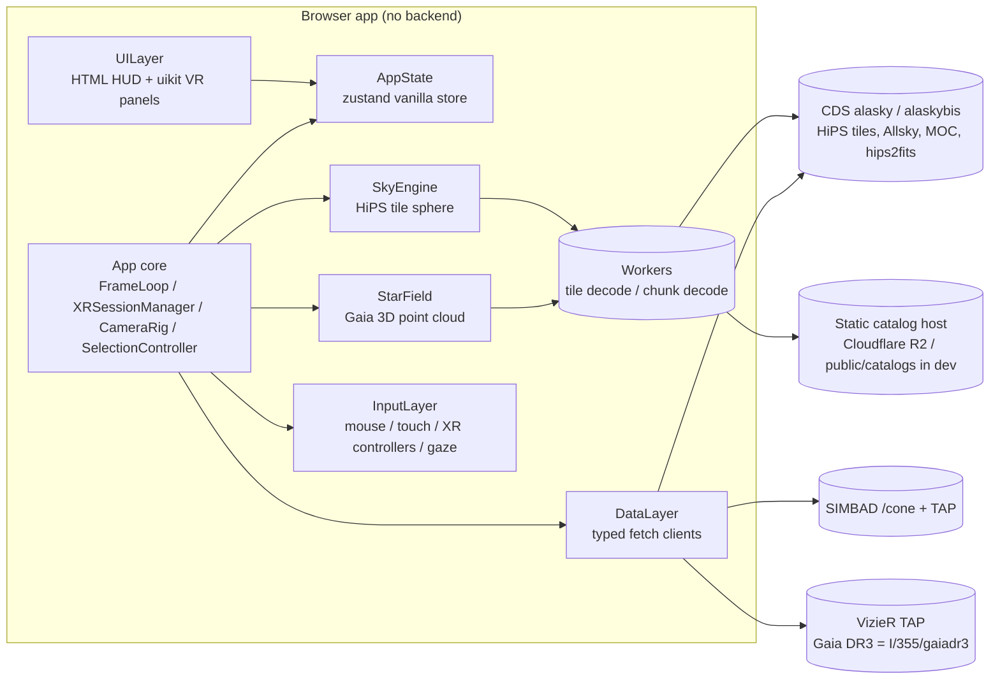
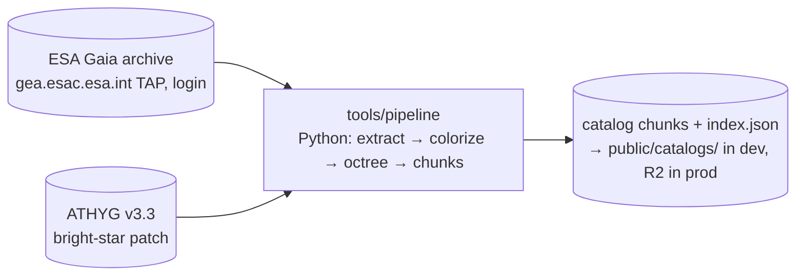
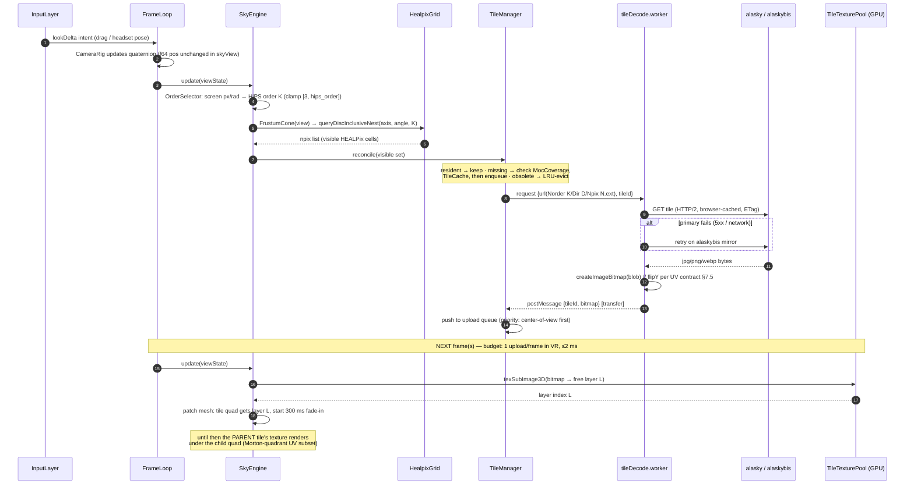

# 01 — Software Architecture

```yaml
doc: 01-architecture
project: vr-astronomy-app ("desktop-first, VR-ready" web 3D/VR astronomy)
date: 2026-06-11
status: blueprint (no app code exists yet)
audience: an implementing AI/engineer with NO other context than docs/
sources:
  - docs/research/threejs-webxr.md      # stack versions, XR wiring, renderer decision
  - docs/research/star-rendering.md     # star pipeline, precision, camera-relative scheme
  - docs/research/hips-format.md        # HiPS spec, tile URLs, surveys, CORS
  - docs/research/performance-quest.md  # budgets, texture arrays, worker decode
  - docs/research/healpix-math.md       # healpix-ts library choice, cone queries
  - docs/research/gaia-pipeline.md      # chunk format, octree, Python tooling
  - docs/research/tap-apis.md           # browser-safe TAP/SIMBAD endpoints
  - docs/research/deploy-assets.md      # hosting split (Pages + R2), compression
  - docs/research/existing-projects.md  # license gates (no GPL/AGPL code ingestion)
conventions:
  - "VERIFY:" marks a claim research could not confirm; each carries a fallback.
  - All package versions marked (verified 2026-06-11) were live-checked on npm.
```

This document defines the complete software architecture: pinned tech stack,
repository layout, module contracts, data flows, the coordinate-system
contract, state management, and error/offline behavior. Rendering algorithms,
the data pipeline, and deployment have their own blueprint docs; where detail
lives elsewhere, this doc states the *contract* and points at the research dump
that justifies it.

---

## 1. Tech stack (pinned) and why

### 1.1 Decision table

| Layer | Choice | Pinned version | Why (one line; details below) |
|---|---|---|---|
| Language | TypeScript | `typescript@6.0.3` (verified 2026-06-11) | Strict typing across a math-heavy codebase; `@types/three` exists in lockstep |
| Bundler/dev server | Vite | `vite@8.0.16` (verified) | Vanilla-TS template, instant HMR, worker bundling, static-deploy story documented |
| 3D engine | three.js | `three@0.184.0` = r184 (verified) + `@types/three@0.184.1` | The only mature WebXR-capable JS engine; r184 is current stable |
| Renderer | **`WebGLRenderer`** (not WebGPU) | n/a (part of three) | Native-WebGPU XR lands only in unreleased r185; WebGL-backend multiview has open stereo bug #32538 → WebGL2 is the only battle-tested XR path today |
| XR entry | `XRButton` addon | ships with three r184 | Picks immersive-vr today, forward-compatible with AR later |
| HEALPix math | `healpix-ts` | `healpix-ts@1.1.0` (verified, MIT, Development Seed, pub. 2026-05-19) | Maintained fork of healpy-validated `@hscmap/healpix`; adds `nestParent/nestChildren`, zero runtime deps, ESM+d.ts |
| HEALPix fallback | `@hscmap/healpix` | `1.4.12` (verified, MIT, frozen 2022) | Drop-in if healpix-ts regresses; order ≤ 15 limit is fine (we need ≤ 12–13) |
| VR UI | `@pmndrs/uikit` | `@pmndrs/uikit@1.0.73` (verified, pub. 2026-05-27) | Only actively maintained 3D UI lib with a vanilla three.js API; three-mesh-ui is dormant since 2023 — banned |
| State | `zustand` (vanilla store) | `zustand@5.x` — **VERIFY:** exact 5.x patch at scaffold time (not live-verified) | See §8; fallback = 60-line typed emitter behind the same facade |
| XR emulation (dev) | IWER + Immersive Web Emulator | `iwer@2.2.1` (verified); Chrome ext id `cgffilbpcibhmcfbgggfhfolhkfbhmik` | Team has no headset; IWER also drives CI XR tests |
| Dev HTTPS | `@vitejs/plugin-basic-ssl` | `2.3.0` (verified) | LAN/phone testing needs a secure context; `http://localhost` needs nothing |
| Unit tests | Vitest | `vitest@^3` — **VERIFY:** current major on npm at scaffold (not live-verified) | Vite-native; fallback: any Vite-compatible runner, the tests are plain TS |
| Offline pipeline | Python | Python ≥ 3.12; `astroquery`, `astropy`, `numpy` | `astroquery.gaia` is the only first-class Gaia TAP client; one-shot offline job → no reason to share code with the TS app |
| Backend | **None for v1** | — | Every runtime service (CDS HiPS, SIMBAD, VizieR TAP, Sesame, hips2fits, MocServer) returns `Access-Control-Allow-Origin: *` (live-verified); catalogs are static files |
| Hosting | Cloudflare Pages (app) + R2 custom domain (catalog chunks) | — | $0 egress, `_headers` support; full rationale in docs/research/deploy-assets.md |

**Pinning policy:** exact versions, no `^`/`~` for `three` and `@types/three`
(three.js has no semver — breaking changes land in any rXXX). Upgrade one
release at a time against
<https://github.com/mrdoob/three.js/wiki/Migration-Guide>.

### 1.2 `package.json` dependency block (scaffold target)

```jsonc
{
  "dependencies": {
    "three": "0.184.0",
    "healpix-ts": "1.1.0",
    "@pmndrs/uikit": "1.0.73",
    "zustand": "5.x"                  // VERIFY exact latest 5.x; pin it
  },
  "devDependencies": {
    "typescript": "6.0.3",
    "vite": "8.0.16",
    "@types/three": "0.184.1",
    "@vitejs/plugin-basic-ssl": "2.3.0",
    "iwer": "2.2.1",
    "vitest": "VERIFY-latest"         // pin at scaffold
  }
}
```

Scaffold command: `npm create vite@latest vr-astronomy -- --template vanilla-ts`
(re-check the template prompt on Vite 8), then replace the template's `src/`.

### 1.3 WebGLRenderer vs WebGPURenderer — the decision, spelled out

Ship **`THREE.WebGLRenderer`**. Reasons (all from
docs/research/threejs-webxr.md, verified against GitHub/npm on 2026-06-11):

1. Native-WebGPU-backend XR is tracked in three.js issue #28968, closed
   against the **r185 milestone, which is unreleased** as of 2026-06-11.
2. `WebGPURenderer({ forceWebGL: true })` does run XR, but **multiview has an
   open right-eye-projection bug (#32538)** and antialias+multiview flickers
   (#32151).
3. Every WebXR example, doc, and community fix assumes `WebGLRenderer`; our
   risk budget is better spent on HiPS/HEALPix correctness.
4. The whole perf plan (docs/research/performance-quest.md) is WebGL2-native:
   `TEXTURE_2D_ARRAY` via `texStorage3D`, `gl_PointSize` points, additive
   blending.

**Mandatory isolation:** renderer construction lives in ONE factory function
(`src/app/createRenderer.ts`). Nothing else may call `new THREE.WebGLRenderer`.
Re-evaluation triggers (revisit, do not auto-switch): (a) r185+ ships native
WebGPU XR, (b) Quest Browser confirms a WebXR-WebGPU binding, (c) #32538
closed. Until all three: WebGL.

### 1.4 Why no backend in v1

Verified by live CORS probes (docs/research/tap-apis.md, hips-format.md):

- HiPS tiles, `properties`, Allsky, Moc: `alasky.cds.unistra.fr` +
  mirror `alaskybis.cds.unistra.fr` — CORS `*`.
- Object lookup: SIMBAD `/cone` REST + SIMBAD TAP — CORS `*`.
- Gaia catalog queries from the browser: **VizieR TAP** table
  `"I/355/gaiadr3"` (full DR3 copy) — CORS `*`. The ESA archive
  (`gea.esac.esa.int`) blocks browsers (no ACAO, OPTIONS 403) and is used
  **only** by the offline Python pipeline.
- Cutouts: `https://alasky.cds.unistra.fr/hips-image-services/hips2fits` — CORS `*`.
- Star catalog chunks: static binary files we host (Cloudflare Pages/R2).

The single future case needing a serverless proxy: LSST alert brokers
(Fink/ALeRCE CORS unverified) and any direct ESA Gaia DR4 access — both v2
concerns. Keep all service base URLs in `src/app/config.ts` so a proxy is a
config change, not a refactor.

### 1.5 Why Python for the offline pipeline

The Gaia extraction is an authenticated **async TAP job** against
`https://gea.esac.esa.int/tap-server/tap` joining
`gaiadr3.gaia_source × external.gaiaedr3_distance` (anonymous async caps at
3 M rows; our "full" cut is 4.68 M → registered login required).
`astroquery.gaia` handles login/jobs natively; `astropy` provides the
coordinate machinery we also use to generate cross-validation fixtures for the
TS unit tests; `numpy` writes the SoA binary chunks. The pipeline runs offline,
on a dev machine or CI, and must be re-runnable for Gaia DR4 (release verified:
2026-12-02) — see `tools/pipeline/` in §3 and docs/research/gaia-pipeline.md.

---

## 2. System overview



Offline (not in the browser):



Render order each frame (contract, from docs/research/star-rendering.md §10):
**(1) HiPS sky sphere** (`renderOrder -100`, `depthWrite:false`,
`depthTest:false`) → **(2) star points + bright-star impostors** (additive,
`depthTest:false`, `depthWrite:false`, `renderOrder 10`) → **(3) opaque local
objects** (future planets; normal depth) → **(4) UI** (uikit panels, labels).

---

## 3. Repository layout (complete planned tree)

One line per file = its single responsibility. An implementer should create
exactly this skeleton; empty stubs are fine until the relevant milestone.

```text
vr-astronomy-app/
├── index.html                      # single page; canvas mount point + HTML HUD root + loading splash
├── package.json                    # pinned deps (§1.2); scripts: dev/build/preview/test/typecheck
├── tsconfig.json                   # ES2022, strict, moduleResolution "bundler", types: vite/client + @types/three
├── vite.config.ts                  # basicSsl plugin, server.host=true, build.target es2022, worker format 'es'
├── .env.example                    # VITE_CATALOG_BASE_URL (default '/catalogs'), VITE_HIPS_PRIMARY/MIRROR hosts
├── .gitignore                      # node_modules, dist, public/catalogs/** (pipeline output, too big for git)
├── .github/
│   └── workflows/
│       ├── ci.yml                  # typecheck + vitest + dependency-cruiser boundary check on PR
│       └── deploy.yml              # build + deploy to Cloudflare Pages (wrangler); see docs/research/deploy-assets.md
│
├── public/                         # served verbatim by Vite / Pages
│   ├── catalogs/                   # DEV ONLY mirror of pipeline output (prod = R2 custom domain)
│   │   ├── index.json              # catalog manifest: octree metadata, chunk URLs, color LUT, attribution
│   │   └── chunks/                 # chunk_<nodeId>.bin files (SoA binary, §6.3 of docs/02; format in gaia-pipeline.md)
│   ├── profiles/                   # self-hosted copy of @webxr-input-profiles/assets dist/profiles (no jsDelivr at runtime)
│   ├── textures/
│   │   ├── star-impostor.png       # optional diffraction-spike sprite for bright-star impostor pass
│   │   └── milkyway-fallback.ktx2  # optional pre-baked backdrop shown when HiPS fades out beyond ~100 pc (KTX2: self-hosted assets only)
│   └── favicon.svg                 # app icon
│
├── src/
│   ├── main.ts                     # entry: capability probe → create App → start frame loop; nothing else
│   │
│   ├── app/                        # composition root; the ONLY package allowed to import everything else
│   │   ├── App.ts                  # wires renderer, scene, modules, store subscriptions; owns lifecycles/dispose
│   │   ├── config.ts               # all constants: service base URLs, survey seed registry (§10 of hips-format.md), budget profiles, SKY_SPHERE_RADIUS
│   │   ├── createRenderer.ts       # THE renderer factory (WebGLRenderer now; future WebGPU swap point) — sole `new WebGLRenderer` site
│   │   ├── FrameLoop.ts            # renderer.setAnimationLoop body: zero-alloc update order, per-frame budgets, upload-queue draining
│   │   ├── CameraRig.ts            # f64 camera position (Vec3d) + rig Group; camera-relative rendering owner (§7.3)
│   │   ├── XRSessionManager.ts     # sessionstart/sessionend handling, frame-rate negotiation, foveation, reference space
│   │   ├── SelectionController.ts  # orchestrates pick → provisional selection → DataLayer enrichment → AppState
│   │   ├── PerfGovernor.ts         # rolling frame-time p95; switches budget profile / framebufferScale / target Hz
│   │   ├── Capabilities.ts         # startup probe: WebXR?, ALIASED_POINT_SIZE_RANGE, max array layers, Float16Array, DecompressionStream('brotli')?
│   │   └── DebugHud.ts             # dev-only overlay: renderer.info, tile pool occupancy, chunk count, budget assertions
│   │
│   ├── sky/                        # SkyEngine module — HiPS celestial sphere (knows HEALPix + textures; knows NOTHING about stars/UI/network policy)
│   │   ├── SkyEngine.ts            # public facade (§4.1): setSurvey/update/fade/dispose; owns the sky scene subtree
│   │   ├── SurveyRegistry.ts       # curated survey descriptors + runtime `properties` fetch/merge; MocServer-backed picker later
│   │   ├── HipsProperties.ts       # parser for {base}/properties key=value text (spec §4.4.1); typed HipsProperties record
│   │   ├── HealpixGrid.ts          # thin wrapper over healpix-ts: ang2pix/pix2ang nest, cornersNest, queryDiscInclusiveNest, parent/children
│   │   ├── OrderSelector.ts        # pick HiPS order so 1 tile px ≈ 1 screen px; clamp to [max(3,hips_order_min), hips_order]
│   │   ├── FrustumCone.ts          # camera frustum → bounding cone (axis + max corner angle) feeding the disc query
│   │   ├── TileManager.ts          # visible-set diffing, request scheduling, parent-fallback LOD, fade-in state machine
│   │   ├── TileCache.ts            # two-level LRU: decoded ImageBitmaps (CPU) + layer indices (GPU); hard ceilings from budget profile
│   │   ├── TileTexturePool.ts      # WebGL2 TEXTURE_2D_ARRAY (texStorage3D, SRGB8_ALPHA8, 512², N layers); layer alloc/evict; throttled texSubImage3D uploads
│   │   ├── TileMeshBuilder.ts      # per-tile curvilinear quad: n×n grid via inverse HEALPix face projection; UV per orientation contract (§7.5)
│   │   ├── SkyMaterial.ts          # ShaderMaterial: sampler2DArray + per-vertex layer index + per-tile fade; survey-wide alpha for HiPS fade-out
│   │   ├── AllskyLoader.ts         # fetch Norder3/Allsky.{ext}, slice 27-wide / 64px grid into 768 order-3 textures (bootstrap sky)
│   │   ├── MocCoverage.ts          # load MOC (MocServer ?get=moc&fmt=json) → "is tile N in coverage?" to avoid 404 storms on partial surveys
│   │   └── shaders/
│   │       ├── sky.vert.glsl       # passes layer index + uv; vertices are precomputed unit-sphere positions × SKY_SPHERE_RADIUS
│   │       └── sky.frag.glsl       # sample sampler2DArray, per-tile fade multiply, survey alpha
│   │
│   ├── stars/                      # StarField module — Gaia 3D point cloud (knows chunks + shaders; NOTHING about HiPS/UI/TAP)
│   │   ├── StarField.ts            # public facade (§4.2): load manifest, per-frame update(viewState), exposure, pick, dispose
│   │   ├── CatalogManifest.ts      # index.json loader/validator: octree node table, chunk URLs, color LUT, attribution
│   │   ├── StarOctree.ts           # runtime octree: node states (unloaded/loading/resident), traversal by distance/solid-angle, LRU unload
│   │   ├── ChunkLoader.ts          # fetch + (worker) decompress + parse queue; concurrency limits from budget profile
│   │   ├── ChunkParser.ts          # SoA binary → typed arrays (Float32 pos ×3, uint8 palette idx, Float16 abs G mag); validates 'GSC1' magic
│   │   ├── StarChunk.ts            # one resident node: THREE.Points + (optional) impostor InstancedBufferGeometry; sets uChunkOffset each frame
│   │   ├── StarMaterial.ts         # ShaderMaterial for bulk points: abs-mag → apparent → intensity/size, additive, depth off (star-rendering.md §11)
│   │   ├── ImpostorMaterial.ts     # instanced-quad material for bright stars (> point-size clamp); same photometry, view-space billboards
│   │   ├── Photometry.ts           # pure functions: absMag↔appMag, mag→intensity(exposure), saturation→size; shared by materials + picker + tests
│   │   ├── ColorLUT.ts             # 256-entry blackbody palette (from manifest) → Float32 texture/attribute conversion
│   │   ├── StarPicker.ts           # angular-nearest pick along a ray over resident chunks (throttled ≤15 Hz); returns StarHit with chunk-local data
│   │   └── shaders/
│   │       ├── stars.vert.glsl     # camera-relative position, per-frame apparent mag, gl_PointSize clamp, energy-conserving overflow
│   │       ├── stars.frag.glsl     # gl_PointCoord PSF (gaussian core + halo), additive output
│   │       ├── impostor.vert.glsl  # billboard corners from camera basis; same photometry as points
│   │       └── impostor.frag.glsl  # PSF + optional spike texture
│   │
│   ├── data/                       # DataLayer — typed async clients; NO three.js imports, NO DOM, NO store
│   │   ├── TapClient.ts            # generic ADQL-over-TAP sync POST (FORMAT=json), AbortController, typed row mapping
│   │   ├── SimbadClient.ts         # SIMBAD /cone REST (RESPONSEFORMAT=json, distance-sorted) + sim-tap ADQL for detail joins
│   │   ├── VizierGaiaClient.ts     # cone searches on VizieR TAP `"I/355/gaiadr3"` (the browser-safe Gaia path)
│   │   ├── SesameClient.ts         # name → position via https://cds.unistra.fr/cgi-bin/nph-sesame/-oxp/SNV? (XML via DOMParser)
│   │   ├── Hips2FitsClient.ts      # cutout URL builder + fetch for info-panel thumbnails (path MUST include /hips-image-services/)
│   │   ├── MocServerClient.ts      # survey discovery: ?expr=...&get=record&fmt=json; per-survey MOC fetch
│   │   ├── RequestQueue.ts         # global rate limiter (≤5 req/s aggregate to CDS), dedupe, retry/backoff, circuit breaker per host
│   │   └── types.ts                # DTOs: SimbadObject, GaiaRow, CutoutRequest, ConeSearch, ServiceError
│   │
│   ├── input/                      # InputLayer — devices → semantic intents; NO network, NO survey/catalog knowledge
│   │   ├── InputManager.ts         # public facade (§4.4): active PointerLike set, mode switch on XR session events, intent event emitter
│   │   ├── PointerLike.ts          # interface { getRay(out: Ray): boolean; cancel(): void } — one contract for all pointers
│   │   ├── MousePointer.ts         # mouse/touch NDC → camera ray; click vs drag disambiguation
│   │   ├── XRControllerPointer.ts  # controller target-ray space → ray; select/squeeze events from renderer.xr.getController(i)
│   │   ├── GazePointer.ts          # head-forward ray fallback (targetRayMode 'gaze' / Vision Pro transient-pointer); optional dwell
│   │   ├── LookControls.ts         # desktop look-around: pointer-drag yaw/pitch of the sky view (the Stellarium/Aladin interaction)
│   │   ├── FlyControls.ts          # flythrough translation/rotation in parsec space; writes to CameraRig's f64 position
│   │   ├── DeviceOrientationLook.ts# vendored gyro controller (three.js removed DeviceOrientationControls); iOS requestPermission flow
│   │   └── ControllerModels.ts     # XRControllerModelFactory + XRHandModelFactory setup, profile path → /profiles (self-hosted)
│   │
│   ├── ui/                         # UILayer — renders store state, dispatches actions; NO WebGL, NO fetch
│   │   ├── UILayer.ts              # facade: mounts HTML HUD, creates/destroys VR panel on XR session events
│   │   ├── hud/
│   │   │   ├── InfoPanel.ts        # selected-object card: name/type/coords/mags + hips2fits thumbnail + loading/error states
│   │   │   ├── SearchBox.ts        # name search → dispatches resolveAndGoTo action (Sesame via SelectionController)
│   │   │   ├── SurveyPicker.ts     # base-layer dropdown from SurveyRegistry; shows coverage + attribution
│   │   │   ├── SettingsPanel.ts    # exposure slider, max magnitude, gyro toggle, VR comfort options
│   │   │   ├── TimeAndModeBar.ts   # sky-view ⇄ flythrough mode switch; "return to Earth" button
│   │   │   ├── AttributionBar.ts   # mandatory survey/data credits (obs_copyright, Gaia/DPAC, ATHYG CC BY-SA)
│   │   │   ├── Toast.ts            # transient error/info messages (service down, VR denied, offline)
│   │   │   └── VrEntry.ts          # wraps three XRButton; hides itself when navigator.xr absent
│   │   ├── vr/
│   │   │   ├── VRPanelRoot.ts      # uikit root Container; created on sessionstart, update(delta) from FrameLoop
│   │   │   ├── VRInfoPanel.ts      # uikit mirror of InfoPanel (same store selectors)
│   │   │   └── VRQuickMenu.ts      # uikit: survey switch, exposure, mode toggle, exit VR
│   │   └── styles.css              # all HTML HUD styles (dark, high-contrast, mobile-safe)
│   │
│   ├── state/                      # AppState — plain serializable data + actions; imports NOTHING from engine modules
│   │   ├── AppState.ts             # zustand vanilla store: shape + actions (§8.2)
│   │   ├── settings.ts             # Settings type, defaults, schema version, migration fn
│   │   ├── persistence.ts          # persist middleware config: localStorage key 'vrastro.v1', partialize whitelist
│   │   └── selectors.ts            # memoized read helpers shared by HTML HUD and uikit panels
│   │
│   ├── utils/                      # leaf utilities; may be imported by anyone; import nothing app-specific
│   │   ├── coords.ts               # THE ICRS↔world conversion module (§7.2) — sole home of raDec↔Vector3 math
│   │   ├── frames.ts               # fixed galactic↔ICRS rotation (Matrix3 + quaternion) for galactic-frame HiPS
│   │   ├── Vec3d.ts                # minimal float64 vector (add/sub/scale/length) for camera + chunk origins
│   │   ├── angles.ts               # deg/rad/arcsec helpers, sexagesimal formatting (RA hms / Dec dms)
│   │   ├── Emitter.ts              # tiny typed event emitter (on/off/emit) used by engine modules
│   │   ├── LruCache.ts             # generic LRU with byte-size accounting + onEvict callback
│   │   ├── Pool.ts                 # object pools (Vector3/Ray/scratch) for the zero-alloc frame loop
│   │   ├── fetchUtils.ts           # fetchWithTimeout, retryWithBackoff, mirrorFailover(primary, mirror)
│   │   └── binary.ts               # DataView helpers, Float16 decode fallback, magic-number checks
│   │
│   ├── workers/                    # all off-main-thread code; communicate via transferables only
│   │   ├── tileDecode.worker.ts    # fetch tile URL → blob → createImageBitmap({imageOrientation per §7.5}) → transfer
│   │   ├── chunkDecode.worker.ts   # fetch chunk → DecompressionStream('gzip') → ArrayBuffer parse-ready → transfer
│   │   └── WorkerPool.ts           # N-worker pool (2–3), request/response correlation, cancellation by tileId/chunkId
│   │
│   └── types/
│       ├── shims.d.ts              # ?raw glsl imports, .bin asset types
│       └── webxr.d.ts              # supplements for session.updateTargetFrameRate / supportedFrameRates if @types/webxr lags (VERIFY coverage)
│
├── tools/
│   └── pipeline/                   # OFFLINE Python: Gaia DR3 → static catalog chunks (full spec: docs/research/gaia-pipeline.md)
│       ├── pyproject.toml          # python ≥3.12; deps: astroquery, astropy, numpy (healpy only in fixtures extra)
│       ├── README.md               # how to run: make catalog RELEASE=dr3 CUT=lite|full
│       ├── Makefile                # extract → colorize → octree → chunks → validate → fixtures, checksummed stages
│       ├── config.py               # release-parameterized: table names, cuts (G<11.5 lite / G<12.5 full, plx/err>5, ruwe<1.4)
│       ├── extract.py              # authenticated async TAP job: gaiadr3.gaia_source ⋈ external.gaiaedr3_distance → CSV.gz
│       ├── colorize.py             # teff_gspphot else Ballesteros(bp_rp) → Teff → Charity-table palette index (256-LUT)
│       ├── octree.py               # magnitude-stratified octree (~64k stars/leaf, brightest at root), parsec ICRS coords
│       ├── write_chunks.py         # SoA chunk writer (16 B/star: f32 pos×3 chunk-relative, u8 palette, f16 ABS G mag, u8 spare) + index.json
│       ├── patch_bright.py         # merge ATHYG v3.3 bright stars missing/saturated in DR3; dedupe on source_id
│       ├── validate.py             # re-read every chunk, bounds/NaN checks, star-count reconciliation, SHA-256 manifest
│       └── make_fixtures.py        # healpy + astropy golden files for the TS unit tests (tests/fixtures/)
│
├── tests/
│   ├── unit/
│   │   ├── healpixGrid.test.ts     # healpix-ts wrapper vs healpy fixtures: ang2pix/pix2ang/corners/disc queries; pins N,W,S,E corner order
│   │   ├── coords.test.ts          # raDec↔world round-trips + golden values vs astropy fixture (vernal equinox, poles, Galactic center)
│   │   ├── frames.test.ts          # galactic↔ICRS rotation vs astropy fixture (M31, Sgr A*, NGP)
│   │   ├── tileUrl.test.ts         # Norder/Dir/Npix builder incl. Dir=floor(N/10000)*10000 spec example (order 6, Npix 10302 → Dir10000)
│   │   ├── hipsProperties.test.ts  # parser vs captured real properties files (DSS2, Rubin FirstLook, Mellinger galactic)
│   │   ├── allskyLayout.test.ts    # order-3 Allsky slicing: 27-wide grid, 768 cells, runtime cell-size detection
│   │   ├── orderSelector.test.ts   # screen-pixel → order selection incl. clamping and non-512 tile widths
│   │   ├── chunkParser.test.ts     # golden chunk .bin → typed arrays; magic, counts, Float16 decode fallback
│   │   ├── photometry.test.ts      # absMag↔appMag, mag→intensity, saturation size growth, energy conservation at clamp
│   │   ├── lruCache.test.ts        # eviction order, byte accounting, onEvict dispose calls
│   │   ├── requestQueue.test.ts    # rate limiting, dedupe, mirror failover, circuit breaker
│   │   └── state.test.ts           # actions, persistence partialize/migration, selector stability
│   ├── xr/
│   │   └── xrSession.test.ts       # IWER-injected fake navigator.xr: enter/exit VR flips input mode + controls + UI without errors
│   └── fixtures/
│       ├── healpy_nested.json      # generated by tools/pipeline/make_fixtures.py
│       ├── astropy_coords.json     # golden ICRS/galactic conversions
│       ├── properties_dss2.txt     # captured live 2026-06-11
│       ├── properties_rubin.txt    # captured live 2026-06-11
│       └── golden_chunk.bin        # tiny 3-star chunk written by write_chunks.py
│
└── docs/                           # this blueprint + research dumps (already present)
```

**Boundary enforcement:** add `dependency-cruiser` (**VERIFY:** current version
at scaffold; fallback: ESLint `no-restricted-imports` rules) to CI with these
rules: `sky/`, `stars/`, `data/`, `input/`, `ui/`, `state/` may import
`utils/` and their own subtree only; `ui/` may additionally import `state/`;
**only `app/` may import across modules**. `data/` and `state/` must not
import `three`.

---

## 4. Module specifications

Every module = facade class/object + internal files. "Must NOT know" lists are
hard rules; violating them is an architecture bug even if the code works.

### 4.1 SkyEngine (`src/sky/`)

**Responsibilities**

- Render the HiPS celestial sphere: survey selection, `properties` parsing,
  HEALPix visible-set computation, tile fetch/decode/upload orchestration,
  parent-tile LOD fallback, Allsky bootstrap, per-tile fade-in, MOC-aware
  request suppression, survey-wide fade (for the >100 pc flythrough fade-out).
- Own its GPU resources: one `TEXTURE_2D_ARRAY` pool, merged tile meshes,
  one `SkyMaterial`; ≤4 draw calls for the whole sky (performance-quest.md §6).

**Public interface**

```ts
// src/sky/SkyEngine.ts
export interface SkyEngineEvents {
  surveyReady: { surveyId: string; properties: HipsProperties };
  surveyError: { surveyId: string; error: ServiceError };
  coverageGap: { order: number; npix: number };   // 404 inside MOC — rare
}

export interface SkyBudget {                       // injected per platform profile
  gpuLayerCount: number;       // e.g. 128 on Quest 2, 384 desktop
  uploadsPerFrame: number;     // 1 in VR, 2–4 desktop
  uploadMsBudget: number;      // ~2 ms
  concurrentFetches: number;   // 6–12
}

export class SkyEngine {
  constructor(opts: {
    gl: WebGL2RenderingContext;       // from renderer.getContext()
    parent: THREE.Group;              // sky subtree mount; App owns the scene
    workers: WorkerPool;
    budget: SkyBudget;
  });

  /** Switch base survey. Resolves when properties parsed + Allsky displayed. */
  setSurvey(descriptor: SurveyDescriptor): Promise<void>;

  /** Per-frame: recompute visible tile set, schedule fetches, drain ≤budget uploads. */
  update(view: ViewState): void;

  /** 0..1 global alpha — driven by App as camera leaves the solar origin. */
  setFade(alpha: number): void;

  /** Attribution strings for the UI (obs_copyright / obs_copyright_url). */
  getAttribution(): { text: string; url?: string } | null;

  setBudget(budget: SkyBudget): void;  // PerfGovernor may swap profiles live
  readonly events: Emitter<SkyEngineEvents>;
  dispose(): void;                      // releases ALL GL resources (texture array, geometries)
}

export interface SurveyDescriptor {     // seeded from config.ts, §10 of hips-format.md
  id: string;                           // 'dss2-color'
  baseUrl: string;                      // 'https://alasky.cds.unistra.fr/DSS/DSSColor'
  mirrorUrl?: string;                   // alaskybis equivalent
  name: string;
}
```

**Must NOT know about:** the zustand store (App subscribes and calls methods);
the DOM/UI; StarField; TAP/SIMBAD; XR session details (it sees only
`ViewState`); catalog chunk hosting. It receives the GL context and never
creates a renderer.

### 4.2 StarField (`src/stars/`)

**Responsibilities**

- Stream and render the Gaia octree: manifest load, node traversal by camera
  distance/solid angle, chunk fetch/parse (worker), per-chunk
  `THREE.Points` + bright-star impostors, per-frame camera-relative offsets,
  magnitude photometry with exposure, LRU unload with 300–500 ms fades,
  angular-nearest picking over resident chunks.

**Public interface**

```ts
// src/stars/StarField.ts
export interface StarHit {
  raDeg: number; decDeg: number;     // derived from chunk-local pos via coords.ts inverse
  distancePc: number;
  absMagG: number; apparentMagG: number;   // apparent computed at current camera pos
  colorIndex: number;                       // palette index (proxy for bp_rp/Teff)
  chunkId: string; indexInChunk: number;    // stable handle for re-highlight
  angularSepRad: number;                    // hit quality
}

export interface StarBudget {
  maxResidentBytes: number;   // LRU ceiling for chunk attribute data
  maxPointsRendered: number;  // post-cull cap (300k Quest 2 … 2M desktop)
  maxImpostors: number;       // ≤5k VR
  concurrentFetches: number;
}

export class StarField {
  constructor(opts: {
    parent: THREE.Group;
    workers: WorkerPool;
    budget: StarBudget;
    capabilities: Capabilities;     // maxPointSize feeds the shader clamp + impostor threshold
  });

  /** Load index.json from catalogBaseUrl; resolves when root node is renderable. */
  load(catalogBaseUrl: string): Promise<CatalogInfo>;

  /** Per-frame: octree traversal, chunk schedule, set uChunkOffset uniforms (f64 math). */
  update(view: ViewState): void;

  setExposure(ev: number): void;            // user slider; linear multiplier exponent
  setMagnitudeLimit(maxAbsMag: number): void;

  /** Angular-nearest star along ray; called ≤15 Hz by SelectionController, never per frame. */
  pick(ray: THREE.Ray, maxAngularSepRad: number): StarHit | null;

  highlight(hit: StarHit | null): void;      // selection ring/marker billboard
  setBudget(b: StarBudget): void;
  readonly events: Emitter<{ rootReady: {}; chunkError: { chunkId: string; error: ServiceError } }>;
  dispose(): void;
}
```

**Chunk contract note (reconciles two research dumps):** chunks store
**absolute** G magnitude (Float16). `docs/research/gaia-pipeline.md` §11
drafted "apparent G mag" in the same 16 B layout; this blueprint standardizes
on **absolute** per `docs/research/star-rendering.md` decision 3, because the
flythrough recomputes apparent magnitude per frame from camera distance —
the pipeline (`write_chunks.py`) converts `M = m − 5·(log10 d_pc − 1)` at
write time. The byte layout is unchanged.

**Must NOT know about:** HiPS/SkyEngine; SIMBAD/TAP (picking returns only
chunk-local data; enrichment is SelectionController's job); the store; the DOM.

### 4.3 DataLayer (`src/data/`)

**Responsibilities:** typed, cancellable, rate-limited HTTP clients for
SIMBAD `/cone`, SIMBAD TAP, VizieR TAP (Gaia DR3), Sesame, hips2fits,
MocServer. All requests flow through `RequestQueue` (≤5 req/s aggregate to
CDS hosts — etiquette from tap-apis.md; exceeding can blacklist the IP).

**Public interface (representative)**

```ts
// src/data/SimbadClient.ts
export class SimbadClient {
  constructor(queue: RequestQueue);
  coneSearch(raDeg: number, decDeg: number, radiusDeg: number,
             opts?: { maxRows?: number; signal?: AbortSignal }): Promise<SimbadObject[]>;
  objectDetail(mainId: string, opts?: { signal?: AbortSignal }): Promise<SimbadDetail | null>;
}

// src/data/Hips2FitsClient.ts
export class Hips2FitsClient {
  constructor(queue: RequestQueue);
  cutoutUrl(req: { hipsId: string; raDeg: number; decDeg: number; fovDeg: number;
                   width: number; height: number; format: 'jpg' | 'png' }): string;
  fetchCutout(req: CutoutRequest, signal?: AbortSignal): Promise<Blob>;
}

// src/data/RequestQueue.ts
export class RequestQueue {
  constructor(opts: { maxPerSecond: number; maxConcurrent: number });
  fetch(url: string, init?: RequestInit & { dedupeKey?: string; retries?: number }): Promise<Response>;
  hostHealth(host: string): 'ok' | 'degraded' | 'down';   // feeds the error matrix (§9)
}
```

All endpoint URLs come from `src/app/config.ts`:

```ts
export const SERVICES = {
  simbadCone:  'https://simbad.cds.unistra.fr/cone',
  simbadTap:   'https://simbad.cds.unistra.fr/simbad/sim-tap/sync',
  vizierTap:   'https://tapvizier.cds.unistra.fr/TAPVizieR/tap/sync',
  sesame:      'https://cds.unistra.fr/cgi-bin/nph-sesame/-oxp/SNV',
  hips2fits:   'https://alasky.cds.unistra.fr/hips-image-services/hips2fits',
  hips2fitsMirror: 'https://alaskybis.cds.unistra.fr/hips-image-services/hips2fits',
  mocServer:   'https://alasky.cds.unistra.fr/MocServer/query',
} as const;   // all live-verified CORS * on 2026-06-11 (tap-apis.md)
```

**Must NOT know about:** three.js, the DOM, the store, rendering. Pure
`fetch` + parsing into DTOs. Every method takes an optional `AbortSignal`.

### 4.4 InputLayer (`src/input/`)

**Responsibilities:** turn devices (mouse, touch, XR controllers, gaze, gyro)
into (a) camera control writes on `CameraRig` and (b) semantic intent events.
Implements the `PointerLike` abstraction so desktop and XR picking share one
code path (threejs-webxr.md decision 5).

```ts
// src/input/InputManager.ts
export type InputIntent =
  | { type: 'select'; ray: THREE.Ray }            // click / trigger / pinch
  | { type: 'hoverRay'; ray: THREE.Ray }          // throttled, for gaze highlight
  | { type: 'flyDelta'; translationPc: Vec3d; }   // flythrough locomotion (already f64)
  | { type: 'lookDelta'; yawRad: number; pitchRad: number }
  | { type: 'zoomDelta'; factor: number };

export class InputManager {
  constructor(opts: { renderer: THREE.WebGLRenderer; rig: CameraRig; dom: HTMLElement });
  setMode(mode: 'desktop' | 'xr' | 'magicWindow'): void;  // called by XRSessionManager
  setNavigation(nav: 'skyView' | 'flythrough'): void;
  readonly events: Emitter<{ intent: InputIntent }>;
  update(dtMs: number): void;     // per-frame: poll gamepads/joysticks, integrate fly velocity
  dispose(): void;
}
```

**Must NOT know about:** surveys, catalogs, network, the store, UI panels.
It may know `renderer.xr` (controller spaces) and DOM events on the canvas.

### 4.5 UILayer (`src/ui/`)

**Responsibilities:** render application state; dispatch store actions. Two
synchronized surfaces from the same selectors: HTML/CSS HUD
(desktop/mobile/always) and `@pmndrs/uikit` panels (only while
`renderer.xr.isPresenting`). Displays mandatory attribution (DSS2/STScI
acknowledgment, ESA/Gaia/DPAC CC BY-SA 3.0 IGO, ATHYG CC BY-SA 4.0).

```ts
// src/ui/UILayer.ts
export class UILayer {
  constructor(opts: {
    store: AppStore;                 // read + dispatch only
    mount: HTMLElement;              // HTML HUD root
    sceneRoot: THREE.Group;          // for uikit panels
    renderer: THREE.WebGLRenderer;   // needed once for uikit setup (localClippingEnabled, transparent sort)
  });
  onXRSessionStart(): void;          // hide HTML HUD, build uikit panel
  onXRSessionEnd(): void;            // reverse
  update(deltaS: number): void;      // uikit root.update(delta) only — no logic
  dispose(): void;
}
```

**Must NOT know about:** WebGL internals, HEALPix, fetch (it renders
`selection.enrichment` state that SelectionController fills; the only "data"
it touches are URLs/blobs already in the store), camera math.

### 4.6 AppState (`src/state/`)

**Responsibilities:** single source of truth for *low-frequency* application
state; persistence of settings. Explicitly NOT a per-frame data path (§8.3).

```ts
// src/state/AppState.ts  (zustand vanilla)
import { createStore } from 'zustand/vanilla';

export interface Selection {
  source: 'star' | 'sky' | 'search';
  raDeg: number; decDeg: number;
  local: StarHit | null;                        // immediate, from StarPicker
  enrichment:
    | { status: 'idle' }
    | { status: 'loading' }
    | { status: 'ready'; simbad: SimbadObject; cutoutUrl: string | null }
    | { status: 'error'; error: ServiceError };
}

export interface AppStateShape {
  // view
  navigationMode: 'skyView' | 'flythrough';
  viewTarget: { raDeg: number; decDeg: number; fovDeg: number };  // last desktop view (persisted)
  xr: { presenting: boolean; sessionSupported: boolean | null };
  // layers
  surveyId: string;                       // active HiPS base layer
  starsEnabled: boolean;
  exposure: number;                       // photometry slider
  // selection & search
  selection: Selection | null;
  searchStatus: 'idle' | 'resolving' | 'notFound' | 'error';
  // service health (drives toasts + degraded UI)
  serviceHealth: Record<'cds' | 'simbad' | 'vizier' | 'catalog', 'ok' | 'degraded' | 'down'>;
  online: boolean;
  // settings (persisted subset — see persistence.ts)
  settings: Settings;

  // actions (the ONLY way to mutate)
  actions: {
    setSurvey(id: string): void;
    setNavigationMode(m: 'skyView' | 'flythrough'): void;
    setSelection(sel: Selection | null): void;
    patchEnrichment(e: Selection['enrichment']): void;
    setExposure(v: number): void;
    setServiceHealth(svc: string, h: 'ok' | 'degraded' | 'down'): void;
    updateSettings(p: Partial<Settings>): void;
  };
}

export type AppStore = ReturnType<typeof createAppStore>;
export function createAppStore(): StoreApi<AppStateShape> { /* createStore + persist */ }
```

**Must NOT know about:** every other module. Zero imports from `three`,
`sky/`, `stars/`, `data/`, `input/`, `ui/`. Values must be
JSON-serializable (except transient `Selection.local` which is whitelisted
out of persistence).

### 4.7 App core (`src/app/`) — the composition root

Not a "module" with hiding rules; it is the only place allowed to see
everything. Key pieces:

- **`FrameLoop.ts`** — exact per-frame order (zero allocations in steady
  state; pools from `utils/Pool.ts`):
  1. `inputManager.update(dt)` → intents drained
  2. `cameraRig.applyIntents()` → f64 position, camera quaternion
  3. build `ViewState` (reused object, no `new`)
  4. `starField.update(view)`
  5. `skyEngine.update(view)` (includes ≤budget texture uploads)
  6. `uiLayer.update(dt)` (uikit root only)
  7. `renderer.render(scene, camera)`
  8. `perfGovernor.sample(frameDeltaMs)`

```ts
export interface ViewState {            // built once, mutated per frame
  cameraPosPc: Vec3d;                   // f64 — authoritative camera position, parsecs, ICRS-world
  viewDirWorld: THREE.Vector3;          // unit vector
  cameraQuat: THREE.Quaternion;
  fovYRad: number;
  viewportHeightPx: number;             // per-eye in XR
  frustum: THREE.Frustum;               // computed from the camera-relative matrices
  isPresenting: boolean;
  nowMs: number;
}
```

- **`XRSessionManager.ts`** — owns `renderer.xr` configuration:
  `setReferenceSpaceType('local-floor')` and
  `setFramebufferScaleFactor(profile)` **before** session start; on
  `sessionstart`: negotiate frame rate via `session.supportedFrameRates` →
  `updateTargetFrameRate` (72 on Quest-2 class, 90 otherwise), set
  `renderer.xr.setFoveation(0.3–0.5)` (stars hate heavy foveation —
  threejs-webxr.md / performance-quest.md), flip InputManager to `'xr'`,
  notify UILayer, swap budget profiles via PerfGovernor.
- **`SelectionController.ts`** — the pick→enrich orchestration (diagram §6.2).
- **`PerfGovernor.ts`** — rolling p95 frame time; degradation ladder:
  (1) reduce star points cap → (2) `framebufferScaleFactor` 0.9→0.8 (requires
  session restart; do at next session) → (3) drop target Hz. Budget profile
  tables (`QUEST2 | QUEST3 | DESKTOP | MOBILE2D`) live in `config.ts`, values
  copied from docs/research/performance-quest.md §10.

---

## 5. Threading model

| Thread | Work | Never does |
|---|---|---|
| Main | frame loop, GL calls, store, UI | fetch-decode of tiles/chunks, JSON parse of big payloads |
| `tileDecode.worker` ×2–3 (pool) | `fetch` tile → `blob` → `createImageBitmap` → transfer | GL, DOM |
| `chunkDecode.worker` (same pool) | `fetch` chunk → gunzip (`DecompressionStream`) → transfer `ArrayBuffer` | GL, DOM |

Rules: transferables only (`ImageBitmap`, `ArrayBuffer`); requests carry a
monotonically increasing id; stale responses (camera moved on) are dropped by
id check; workers are pooled in `WorkerPool.ts` and shared by SkyEngine and
StarField. GPU uploads (`texSubImage3D`, `bufferData`) happen ONLY on the main
thread inside the FrameLoop's upload budget (1 tile/frame in VR, ~2 ms cap).
No `SharedArrayBuffer` in v1 (avoids COOP/COEP entirely — deploy-assets.md).

---

## 6. Data flows (sequence diagrams)

### 6.1 Camera move → tile load → texture upload



### 6.2 User selects a star → TAP/SIMBAD query → info panel

```mermaid
sequenceDiagram
  autonumber
  participant U as User
  participant IN as InputLayer
  participant SC as SelectionController
  participant SF as StarField
  participant ST as AppState (store)
  participant UI as UILayer
  participant DQ as RequestQueue
  participant SB as SIMBAD /cone
  participant H2F as hips2fits

  U->>IN: click / trigger / pinch
  IN->>SC: intent {type:'select', ray}
  SC->>SF: pick(ray, maxSep=0.5°)
  SF-->>SC: StarHit {raDeg, decDeg, distPc, mags, ...} | null
  alt hit
    SC->>SF: highlight(hit)
    SC->>ST: setSelection({local: hit, enrichment:{status:'loading'}})
    ST-->>UI: subscription fires
    UI->>UI: InfoPanel opens IMMEDIATELY with local data<br/>(coords, distance, apparent/abs mag, color)
    SC->>DQ: SimbadClient.coneSearch(ra, dec, r=2′, MAXREC=5)
    DQ->>SB: GET /cone?RA=&DEC=&SR=&RESPONSEFORMAT=json (rate-limited)
    SB-->>DQ: distance-sorted JSON
    DQ-->>SC: SimbadObject[0] (or empty)
    SC->>DQ: Hips2FitsClient.fetchCutout(ra, dec, fov=0.25°, 300×300, jpg)
    DQ->>H2F: GET /hips-image-services/hips2fits?...
    H2F-->>DQ: image/jpeg
    SC->>ST: patchEnrichment({status:'ready', simbad, cutoutUrl})
    ST-->>UI: InfoPanel adds name, otype, mags, thumbnail
  else no hit (empty sky / HiPS-only feature)
    SC->>ST: setSelection({source:'sky', ra, dec, local:null, enrichment:{status:'loading'}})
    Note over SC: same SIMBAD cone path; radius widens to 5′
  end
  alt SIMBAD timeout / 5xx / offline
    SC->>ST: patchEnrichment({status:'error', error})
    ST-->>UI: panel keeps local data + "lookup unavailable — Retry" button
  end
```

Picking internals: `StarPicker` is throttled (≤15 Hz for hover; immediate for
explicit select), iterates resident chunks' typed arrays, computes angular
separation between the ray and camera-relative star directions, returns the
brightest star within the threshold cone (brightness-weighted nearest —
matches user intent in dense fields). No `source_id` is stored in chunks
(gaia-pipeline.md open question 4): identity resolution = the SIMBAD/VizieR
cone search above. If VR gaze-pick latency testing shows cone-search results
mismatching dense fields, fallback plan: add an optional `sourceId` sidecar
file per chunk (+8 B/star, lazily fetched only on selection).

### 6.3 Enter VR → session reconfigure

```mermaid
sequenceDiagram
  autonumber
  participant U as User
  participant XB as XRButton (three addon)
  participant XR as navigator.xr
  participant XM as XRSessionManager
  participant PG as PerfGovernor
  participant IN as InputLayer
  participant UI as UILayer
  participant SE as SkyEngine
  participant SF as StarField

  Note over XM: at startup: renderer.xr.enabled = true ·<br/>setReferenceSpaceType('local-floor') ·<br/>setFramebufferScaleFactor(profile) — BEFORE any session
  U->>XB: click "ENTER VR"
  XB->>XR: requestSession('immersive-vr', {optionalFeatures:['hand-tracking','layers']})
  alt session granted
    XR-->>XB: XRSession
    XB->>XM: renderer.xr 'sessionstart' event
    XM->>XM: rates = session.supportedFrameRates<br/>await session.updateTargetFrameRate(72 or 90)
    XM->>XM: renderer.xr.setFoveation(0.3–0.5)
    XM->>PG: switch budget profile → QUEST2/QUEST3 table
    PG->>SE: setBudget(sky VR budget)   // 128-layer pool, 1 upload/frame
    PG->>SF: setBudget(star VR budget)  // ≤300k points, ≤5k impostors, 6 px clamp
    XM->>IN: setMode('xr')              // OrbitLook off, controller/gaze pointers on
    XM->>UI: onXRSessionStart()         // HTML HUD hidden, uikit VRPanelRoot built
    Note over SE,SF: scene graph unchanged — same sky sphere & chunks;<br/>three.js renders per-eye via ArrayCamera automatically
  else denied / unsupported / user cancels
    XR-->>XB: rejection
    XB->>UI: (via store) toast "VR unavailable — continuing on desktop"
    Note over UI: app keeps running; VR button reflects state
  end
  U->>XR: exits session (system gesture / menu)
  XR-->>XM: 'sessionend'
  XM->>IN: setMode('desktop')           // restore LookControls + controls.update()
  XM->>UI: onXRSessionEnd()             // uikit panel destroyed, HTML HUD restored
  XM->>PG: switch profile → DESKTOP
```

---

## 7. Coordinate systems contract

This section is normative. All conversions live in exactly the named files;
duplicating the math anywhere else is a defect.

### 7.1 Frames

- **Catalog/sky frame: ICRS (J2000), epoch 2016.0** for Gaia positions
  (proper motion ignored for rendering — sub-arcsecond over decades).
- **World frame = ICRS axes permuted into three.js Y-up** (three.js is
  right-handed Y-up; ICRS is right-handed Z-up). Fixed cyclic permutation
  (a proper rotation — handedness preserved):

  ```
  three.x = icrs.y      // ICRS basis: X → (RA 0°, Dec 0°) vernal equinox
  three.y = icrs.z      //             Z → north celestial pole
  three.z = icrs.x      //             Y → (RA 90°, Dec 0°)
  ```

  Consequences: three.js **+Y = north celestial pole**, **+Z = vernal
  equinox**, **+X = RA 6h on the equator**. The HiPS sphere mesh and the star
  chunks use this same mapping, so imagery and 3D stars align by construction
  (gaia-pipeline.md §9 decision).

### 7.2 Canonical conversions — `src/utils/coords.ts` (the ONLY home)

```ts
/** ICRS spherical → world-frame unit direction. Out-param, no allocation. */
export function raDecToWorldDir(raRad: number, decRad: number, out: THREE.Vector3): THREE.Vector3 {
  const cd = Math.cos(decRad);
  // icrs: x = cd·cos(ra), y = cd·sin(ra), z = sin(dec); permuted per §7.1:
  out.set(cd * Math.sin(raRad),      // three.x = icrs.y
          Math.sin(decRad),          // three.y = icrs.z
          cd * Math.cos(raRad));     // three.z = icrs.x
  return out;
}

/** Inverse: world unit direction → {raRad ∈ [0,2π), decRad}. */
export function worldDirToRaDec(dir: THREE.Vector3): { raRad: number; decRad: number } {
  const decRad = Math.asin(THREE.MathUtils.clamp(dir.y, -1, 1));
  let raRad = Math.atan2(dir.x, dir.z);            // atan2(icrs.y, icrs.x)
  if (raRad < 0) raRad += 2 * Math.PI;
  return { raRad, decRad };                         // (allocation OK: never called per-frame)
}

/** ICRS spherical + distance → world position in parsecs (f64). */
export function raDecDistToWorldPc(raRad: number, decRad: number, distPc: number, out: Vec3d): Vec3d;
```

Unit tests (`tests/unit/coords.test.ts`) pin golden values generated by
astropy (`tools/pipeline/make_fixtures.py`): vernal equinox → (0,0,1)·three,
NCP → (0,1,0)·three, RA 6h Dec 0 → (1,0,0)·three, plus 10 random round-trips
at 1e-12 tolerance.

- **`src/utils/frames.ts`**: the fixed galactic→ICRS rotation used ONLY for
  galactic-frame HiPS (e.g. Mellinger, `hips_frame = galactic`). Implemented
  as a constant `THREE.Quaternion`/`Matrix3` derived from the standard J2000
  galactic pole (αGP = 192.85948°, δGP = 27.12825°, l of NCP = 122.93192°).
  **VERIFY:** these constants are textbook values not re-verified by research;
  the unit test `frames.test.ts` validates against astropy fixtures (Sgr A*,
  M31, NGP) before first use — if mismatch, regenerate the matrix numerically
  from the astropy fixture itself. Application point: the survey root `Group`
  of a galactic HiPS gets this quaternion; everything else stays ICRS.

### 7.3 Scale and camera-relative rendering

- **1 world unit = 1 parsec.** Gaia usable-parallax stars lie within ~2×10⁴
  pc, comfortably inside float32 precision (~1e-3 pc absolute resolution at
  10 kpc); the float32 cliff at ~1.6e7 is never approached
  (star-rendering.md §7).
- **The authoritative camera position is float64** (`Vec3d` in
  `CameraRig.ts`); JS numbers are f64 — free. The three.js `camera.position`
  is pinned at the origin every frame.
- **Per chunk, per frame:** `uChunkOffset = chunkCenter(f64) − cameraPos(f64)`
  computed in f64, THEN truncated to f32 and uploaded as a uniform. Star
  vertex positions in VBOs are chunk-relative f32 (small numbers). Vertex
  shader: `camRel = position + uChunkOffset` — all arithmetic near the
  camera, where precision matters. This is the Cesium "RTC" pattern;
  three.js has no native floating origin.
- **Two navigation modes** (stored in AppState):
  - `skyView`: camera position locked to the solar origin (0,0,0) pc;
    rotation only. The HiPS sphere is fully opaque.
  - `flythrough`: `FlyControls` integrates velocity into the f64 position.
    App fades the HiPS sphere via `skyEngine.setFade(α)` with
    `α = clamp(1 − (|cameraPosPc| − 50)/450, 0, 1)` (fade 50→500 pc;
    exact curve is a tuning knob — see star-rendering.md open question 6).
- **Depth policy:** no `logarithmicDepthBuffer`, ever, in v1 (it writes
  `gl_FragDepth`, killing early-Z, and breaks MSAA). Sky sphere and stars
  render with `depthTest:false, depthWrite:false` in fixed `renderOrder`;
  only future local opaque objects use the depth buffer with a sane near/far
  (0.01–1e5 world units).

### 7.4 Sky sphere geometry

- The HiPS mesh vertices are unit-sphere directions (from the inverse HEALPix
  face projection, `TileMeshBuilder.ts`) scaled by
  `SKY_SPHERE_RADIUS = 100` world units (constant in `config.ts`; any value
  between near and far planes works because depth is ignored — 100 keeps
  vertex magnitudes friendly).
- The sky sphere group is re-centered on the camera every frame (trivially
  position (0,0,0) under camera-relative rendering) → zero parallax,
  represents infinity.

### 7.5 HiPS in-tile UV orientation (the one flagged unknown)

Working contract (MEDIUM confidence, derived from spec Fig. 4 +
top-down jpg/png row order — hips-format.md §7): with
`createImageBitmap(blob)` (no flip) and cell corners named N/E/S/W from
HEALPix `cornersNest`, assign `uv(E)=(0,0), uv(N)=(1,0), uv(S)=(0,1),
uv(W)=(1,1)`.

**VERIFY (blocking, first rendering spike):** render one DSS2 field, compare
against Aladin Lite (<https://aladin.cds.unistra.fr/AladinLite/>) for
orientation + mirror parity. There are 8 candidate orientations; the contract
isolates the fix to ONE table in `TileMeshBuilder.ts`
(`const UV_ORIENTATION: [corner: 'N'|'E'|'S'|'W', u: 0|1, v: 0|1][]`) plus the
worker's `imageOrientation` option — nothing else may compensate elsewhere.

### 7.6 Where every conversion lives (summary table)

| Conversion | Owner file | Notes |
|---|---|---|
| RA/Dec ↔ world unit vector | `src/utils/coords.ts` | sole implementation; out-params |
| RA/Dec + distance → world pc | `src/utils/coords.ts` | f64 output (`Vec3d`) |
| Galactic ↔ ICRS | `src/utils/frames.ts` | applied only as survey-root quaternion |
| World dir ↔ HEALPix npix | `src/sky/HealpixGrid.ts` | converts world→ICRS lon/lat first via coords.ts |
| Chunk-local f32 ↔ world | `src/stars/StarChunk.ts` + vertex shader | via per-frame `uChunkOffset` |
| Screen NDC → ray | `src/input/MousePointer.ts` | three `Raycaster.setFromCamera` |
| Sky pixel scale → HiPS order | `src/sky/OrderSelector.ts` | never trust `hips_pixel_scale` keyword; compute from order + tile width |
| RA/Dec formatting (hms/dms) | `src/utils/angles.ts` | UI-only |

---

## 8. State management

### 8.1 Decision: zustand (vanilla store), not a hand-rolled emitter

Chosen: **`zustand@5` via `zustand/vanilla`** (no React anywhere).
Justification:

1. Two UI surfaces (HTML HUD + uikit VR panels) must render identical state;
   selector-based subscriptions (`subscribeWithSelector` middleware) give
   each widget a minimal, typed subscription without hand-writing
   event-name bookkeeping.
2. The `persist` middleware solves settings persistence (versioned,
   migratable, partialized) in ~10 lines instead of bespoke localStorage code.
3. ~1 kB, zero dependencies, framework-agnostic, stable v5 API.
4. A plain emitter grows ad-hoc derived-state and ordering bugs as the store
   grows past ~10 fields; we already have 15+.

**VERIFY:** exact zustand 5.x version + that `zustand/vanilla` with
`persist`/`subscribeWithSelector` works under Vite 8 vanilla-TS (no React) —
high confidence, 5-minute scaffold check. **Fallback:** the store facade in
`AppState.ts` exposes only `getState/subscribe(selector, cb)/actions`; if
zustand disappoints, replace internals with a ~60-line typed emitter + manual
localStorage without touching any consumer.

### 8.2 Store usage rules

- **Engine modules (sky/stars/input/data) never import the store.** `App.ts`
  subscribes and calls module methods (`store.surveyId → skyEngine.setSurvey`).
  This keeps engines testable and the dependency graph acyclic.
- Actions are the only mutation path; no `setState` outside `AppState.ts`.

### 8.3 The hot-path exclusion rule (critical for VR)

Per-frame data — camera pose, tile queues, chunk residency, frame timings —
**never flows through the store** (store writes allocate and notify
subscribers; the frame loop has a zero-allocation budget,
performance-quest.md §8). Hot data lives in module-internal fields and the
reused `ViewState` object. The store receives at most *throttled summaries*
(e.g. `serviceHealth`, ~1 Hz from PerfGovernor/RequestQueue), and selection
events (user-rate).

### 8.4 Settings persistence (localStorage)

- Key: `vrastro.v1`; JSON via zustand `persist` with `version: 1` and a
  `migrate` function (`src/state/persistence.ts`).
- Persisted (partialize whitelist): `settings` (exposure, magnitude limit,
  gyro opt-in, foveation override, desaturation, UI scale, attribution-seen),
  `surveyId`, `viewTarget` (last RA/Dec/FoV → restored on next visit),
  `navigationMode`.
- Never persisted: selection, service health, XR flags, anything with
  blobs/objects.
- localStorage unavailable (private mode/quota): persist middleware falls back
  to in-memory storage; app must boot normally (test in `state.test.ts`).

---

## 9. Error / offline behavior matrix

Detection plumbing: `RequestQueue.hostHealth()` (per-host circuit breaker:
≥3 consecutive failures → `down`, half-open retry every 30 s),
`window.online/offline` events, and per-module error events. UI reflects
`serviceHealth` from the store; engines degrade autonomously.

| # | Failure | Detection | Runtime behavior | User-visible |
|---|---|---|---|---|
| 1 | Single tile fetch fails (network/5xx) | worker fetch error | retry once on `alaskybis` mirror; then exponential backoff (2 s → 60 s cap) per tile; parent tile keeps rendering under it | none (progressive refinement just stalls locally) |
| 2 | Tile 404 | HTTP 404 | NOT an error for partial surveys: mark cell out-of-coverage, render transparent/black; if MOC said in-coverage, emit `coverageGap` (log only) | none |
| 3 | Whole tile host down (alasky **and** alaskybis) | circuit breaker `down` on both | stop tile requests; keep resident tiles + Allsky bootstrap (cached); retry half-open every 30 s; star field unaffected | toast "Sky imagery server unreachable — showing cached imagery"; survey picker disabled |
| 4 | `properties` fetch fails on survey switch | fetch error in `setSurvey` | reject promise; stay on current survey; seed registry in `config.ts` carries last-known properties snapshot for the 6 starter surveys as cold-start fallback | toast "Couldn't load survey X" |
| 5 | Allsky fetch fails | fetch error | fall back to fetching the 12 order-0…768 order-3 tiles individually at low priority (slower bootstrap, same result) | slightly slower first paint |
| 6 | Catalog `index.json` / chunk host down | fetch error / breaker | retries with backoff; already-resident chunks keep rendering; octree stops expanding | toast "Star catalog streaming paused"; `serviceHealth.catalog = down` |
| 7 | Corrupt chunk (bad magic/length) | `ChunkParser` validation throw | discard, mark node `failed`, never auto-retry same build; report chunkId to console/telemetry | none (LOD hole only) |
| 8 | SIMBAD/VizieR down or timeout (>8 s) | AbortSignal timeout / 5xx / breaker | InfoPanel keeps local (chunk-derived) data; enrichment status `error`; Retry button re-dispatches; hover enrichment disabled while `down` | panel shows "name lookup unavailable" + Retry |
| 9 | SIMBAD rate-limit risk (429 or self-imposed) | RequestQueue token bucket | queue pauses; dedupe collapses repeat cone searches; ≤5 req/s aggregate hard cap (CDS can blacklist IPs ~1 h) | spinner persists slightly longer |
| 10 | hips2fits down | fetch error | InfoPanel renders without thumbnail (layout reserves space, collapses gracefully); retry on next selection | missing thumbnail only |
| 11 | Sesame name search fails / no match | error vs empty XML | distinguish: `notFound` → "no object found"; error → "search unavailable, try later" | inline message under SearchBox |
| 12 | WebXR not supported (desktop Safari, iOS) | `navigator.xr` undefined / `isSessionSupported` false | VR button never rendered; `xr.sessionSupported=false`; iOS offers gyro magic-window instead (gesture-gated permission) | "Look around with your phone" button on iOS |
| 13 | `requestSession` rejected (permission denied / user cancel) | promise rejection | remain in desktop mode; nothing torn down (session setup is idempotent) | toast "VR unavailable — continuing on desktop" |
| 14 | XR session ends unexpectedly (headset removed, system kill) | `sessionend` event | XRSessionManager restores desktop mode, input mode, budget profile, HTML HUD — same code path as voluntary exit | seamless return to desktop view |
| 15 | DeviceOrientation permission denied (iOS) | `requestPermission() !== 'granted'` | gyro mode stays off; drag look-around remains | button reverts with hint text |
| 16 | Fully offline (page already loaded) | `offline` event + all breakers down | render loop continues: resident tiles + chunks still draw; all fetch paths pause; auto-resume on `online` | persistent offline banner |
| 17 | Fully offline (cold load) | — | v1: app does not load (no service worker). v2 backlog: SW precache of app shell + Allsky + root chunk | browser error page (accepted for v1) |
| 18 | WebGL context lost | `webglcontextlost` on canvas | prevent default, halt loop; on `webglcontextrestored` re-run GPU-resource init (texture pool, materials re-upload); if not restored in 10 s → reload prompt | brief freeze, then auto-recovery or "Reload" dialog |
| 19 | localStorage blocked | exception on persist init | in-memory settings; defaults each visit | none (settings just don't stick) |
| 20 | Float16Array missing (old browser) | `Capabilities` probe | use ~5-line JS decode fallback in `binary.ts` (binary16 → f32) at chunk parse time | none |

---

## 10. Cross-cutting rules (binding for all implementers)

1. **Zero allocations in the frame loop** — no `new`, closures, spreads,
   `Array.map`, or string building inside `FrameLoop`/`update()` paths; use
   `utils/Pool.ts` scratch objects. Raycast/hover work throttled to ≤15 Hz.
   Regression-checked with DevTools allocation timeline (flat sawtooth).
2. **All network calls outside the frame loop** — fetches start from worker
   messages, store subscriptions, or debounced controllers; never from
   `update()` (scheduling a request id into a queue is fine; the `fetch` call
   itself happens in workers/microtasks).
3. **GPU resources are owned, counted, disposed** — every module exposes
   `dispose()`; LRU evictions call `.dispose()` on three objects (three.js
   never garbage-collects GPU memory). `DebugHud` asserts
   `renderer.info` against the active budget profile in dev builds.
4. **License hygiene** — NEVER copy code from Aladin Lite (LGPL-3 — embed-only
   if ever used), Stellarium Web Engine (AGPL-3 — banned entirely), Celestia
   (GPL-2 — study only). Copying is allowed from: wwt-webgl-engine (MIT),
   michitaro/healpix (MIT), Gaia Sky *format design* (MPL-2.0 — re-spec, don't
   copy source). See docs/research/existing-projects.md license gate table.
5. **Every external base URL is config** (`src/app/config.ts`), with
   primary + mirror where one exists; nothing hardcodes hosts inline.
6. **Capability probing over assumptions** — `Capabilities.ts` reads
   `ALIASED_POINT_SIZE_RANGE` (Apple caps at 64 px — verified), max
   texture-array layers, WebXR availability, `DecompressionStream('brotli')`
   (gzip is the guaranteed path), `Float16Array`. Budgets and shader uniforms
   derive from the probe, not constants.
7. **Attribution is a feature, not a footnote** — `AttributionBar` must show
   `obs_copyright` for the active survey, "ESA/Gaia/DPAC" for star data, and
   ATHYG CC BY-SA where applicable. DSS2 requires the STScI acknowledgment.

---

## 11. Acceptance criteria for this architecture

The architecture is correctly implemented when:

1. `npm run build` + `tsc --noEmit` pass with `strict: true` and the pinned
   versions of §1.2.
2. The dependency-cruiser CI rule set (§3 boundary rules) passes — proving
   SkyEngine/StarField/DataLayer/InputLayer/UILayer/AppState mutual ignorance.
3. Swapping `createRenderer.ts` internals to
   `WebGPURenderer({forceWebGL:true})` compiles without touching any other
   file (renderer-factory isolation test).
4. `tests/unit/` all green, including coords/frames golden tests against
   astropy fixtures and healpix tests against healpy fixtures — BEFORE any
   rendering work begins (the conversions are the foundation everything sits
   on).
5. The IWER-driven `tests/xr/xrSession.test.ts` enters and exits a fake
   immersive-vr session: input mode flips, HTML HUD hides, uikit root is
   created/destroyed, no exceptions, no leaked event listeners.
6. With the dev server running and network throttled to "offline" in
   DevTools after load, the render loop continues at full rate with resident
   data (matrix rows 16) and recovers on reconnect.
7. DebugHud shows draw calls ≤ 4 (sky) + ≤ 48 (star chunks) + UI under the
   Quest 2 emulated profile, and steady-state allocations/frame = 0 in a
   60 s DevTools allocation recording.

## 12. Open items carried from research (do not silently resolve)

| Item | Where it bites | Plan |
|---|---|---|
| HiPS in-tile UV orientation (§7.5) | first sky render | visual diff vs Aladin Lite; fix the single UV table |
| three.js r184 default foveation value & `XRButton.createButton` options shape | XRSessionManager | read r184 source at scaffold time |
| `healpix-ts` `queryBoxInclusiveNest` frame semantics | only if box queries adopted | use the healpy-validated cone path (`queryDiscInclusiveNest`) exclusively until verified |
| zustand exact pin / vanilla persist behavior | scaffold day 1 | §8.1 fallback facade |
| Quest texture-memory ceiling, `supportedFrameRates`, point-size max on Adreno | budget profiles | on-device pass when a Quest 3S dev unit is acquired (performance-quest.md open Qs) |
| Brotli `DecompressionStream` availability | chunk decode | feature-detect; gzip-encoded chunks are the shipped baseline |
| CDS hotlinking volume policy | launch scale | hobby scale fine (Aladin-Lite-style embedding is intended use); email cds-question@unistra.fr before any scale-up; never proxy or mirror without permission |
