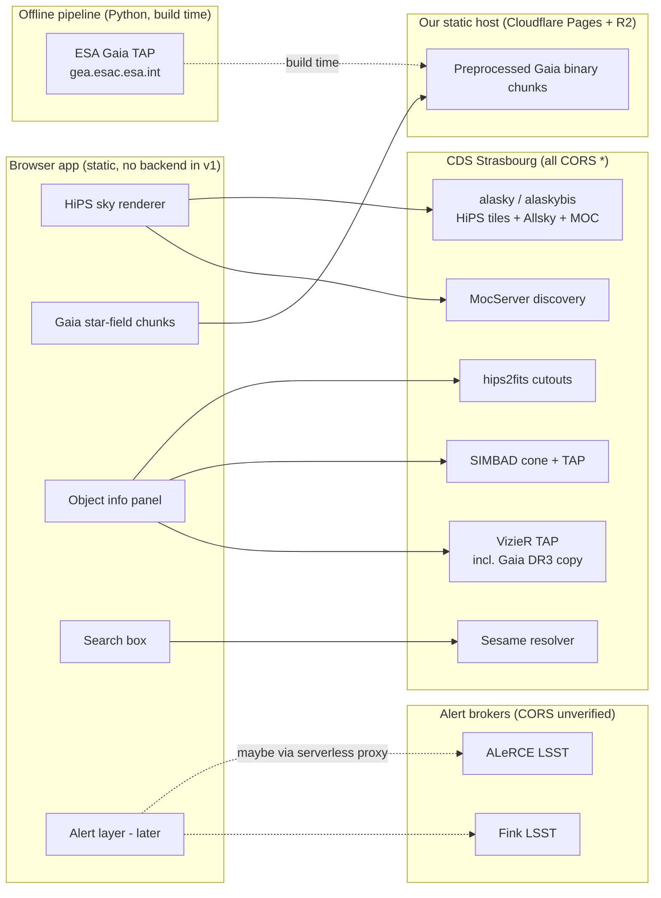

# 02 — External Data Sources Catalogue

```yaml
doc: 02-data-sources
status: blueprint-final (facts verified 2026-06-11 unless marked VERIFY)
audience: implementing engineer/model with no other context
sources-of-truth:
  - docs/research/tap-apis.md        (CORS probes, endpoints, limits)
  - docs/research/hips-format.md     (HiPS servers, starter surveys, properties)
  - docs/research/lsst-rubin.md      (Rubin/LSST access state, broker APIs)
  - docs/research/gaia-pipeline.md   (Gaia archive limits, table names)
  - docs/research/deploy-assets.md   (CDS hotlinking policy)
conventions: |
  VERIFIED  = confirmed by live HTTP probe or primary doc on 2026-06-11.
  VERIFY:   = not yet confirmed — the marked claim MUST be tested at implementation
              time; a fallback is always given.
```

This document is the single catalogue of every external service the app talks to.
Every URL below is real and was probed unless marked VERIFY. **No API keys or
accounts are required for any v1 feature.** No backend is required for v1; a
serverless-proxy slot is reserved for two future cases (§6.4, §9.4).

---

## 1. Quick-reference table

| # | Service | Base URL | Used for | Formats | CORS (`Access-Control-Allow-Origin: *`) | Auth |
|---|---|---|---|---|---|---|
| 1 | CDS HiPS tiles (primary) | `https://alasky.cds.unistra.fr/` | sky imagery tiles | jpg, png, webp (per survey) | **YES** (verified, incl. tiles + Allsky + properties) | none |
| 2 | CDS HiPS tiles (mirror) | `https://alaskybis.cds.unistra.fr/` | failover for #1 | same (identical ETags) | **YES** (verified) | none |
| 3 | SIMBAD cone search (REST) | `https://simbad.cds.unistra.fr/cone` | gaze/click "what is this" | JSON, VOTable | **YES** (verified) | none |
| 4 | SIMBAD TAP | `https://simbad.cds.unistra.fr/simbad/sim-tap/sync` | rich object data (ADQL) | JSON, CSV, VOTable, TSV | **YES** (verified) | none |
| 5 | VizieR TAP | `https://tapvizier.cds.unistra.fr/TAPVizieR/tap/sync` | live Gaia DR3 + any catalog | JSON, CSV, VOTable | **YES** (verified) | none |
| 6 | Sesame name resolver | `https://cds.unistra.fr/cgi-bin/nph-sesame` | search box: name → coords | XML, plain text | **YES** (verified) | none |
| 7 | hips2fits cutouts | `https://alasky.cds.unistra.fr/hips-image-services/hips2fits` | postage-stamp images | fits, jpg, png | **YES** (verified; mirror on alaskybis too) | none |
| 8 | CDS MocServer | `https://alasky.cds.unistra.fr/MocServer/query` | survey discovery, coverage MOCs | JSON, ASCII | **YES** (verified, fullest CORS config) | none |
| 9 | ESA Gaia archive TAP | `https://gea.esac.esa.int/tap-server/tap/` | **offline pipeline only** | votable, csv, json, fits | **NO** (verified: no ACAO header; OPTIONS preflight 403 even for localhost) | optional (free) |
| 10 | Gaia bulk CDN | `https://cdn.gea.esac.esa.int/Gaia/gdr3/gaia_source/` | offline pipeline (rejected for our scale; see research) | gzipped ECSV | n/a (server-side only) | none |
| 11 | ALeRCE LSST API | `https://api-lsst.alerce.online/` | Rubin transient layer (primary) | JSON (GET, OpenAPI) | **VERIFY:** untested — proxy fallback §9.4 | none |
| 12 | Fink LSST API | `https://api.lsst.fink-portal.org` | Rubin transient layer (secondary) | JSON (POST) | **VERIFY:** untested — proxy fallback §9.4 | none |
| 13 | ANTARES API | `https://api.antares.noirlab.edu/v1/` | optional third broker | JSON (Elasticsearch DSL) | **VERIFY:** untested | none for search; Kafka needs credentials |
| 14 | Lasair LSST API | `https://api.lasair.lsst.ac.uk/` | optional fourth broker | JSON | **VERIFY:** untested | free API token required |
| 15 | Rubin-hosted Virgo HiPS | `https://images.rubinobservatory.org/hips/asteroids/color_ugri` | demo Rubin imagery | webp tiles | **YES** (verified) | none — but undocumented bucket, may vanish |
| 16 | Rubin Science Platform | `https://data.lsst.cloud/api/...` | **NOT usable** (data rights only) | — | — (401 without token, verified) | data-rights account |



---

## 2. CDS HiPS tile servers (the sky imagery backbone)

### 2.1 Hosts and usage policy

- **Primary:** `https://alasky.cds.unistra.fr/` — **Mirror:** `https://alaskybis.cds.unistra.fr/`
  (VERIFIED: identical content, same ETags, both CORS `*`, both HTTP/2).
- Legacy hostnames (`alasky.u-strasbg.fr`) still appear inside some properties files —
  **always rewrite to the `.cds.unistra.fr` names.**
- **Hotlinking tiles directly from the browser is the intended usage** of the HiPS
  standard and of CDS's servers (Aladin Lite, served from CDS, does exactly this from
  arbitrary third-party origins). VERIFIED from Aladin Lite embedding docs.
- **Mirroring (wholesale re-hosting) is NOT allowed without the copyright owner's
  agreement** (stated in the CDS hipslist; `hips_status=clonableOnce` permits one clone
  from the master, coordinated with CDS). Do not put our own caching CDN/proxy in front
  of CDS — that is mirroring. Browser HTTP cache + per-user Service Worker cache is fine.
- VERIFY: there is no explicit written policy on hotlink *volume*. For hobby scale this
  is accepted practice; if traffic grows, email `cds-question@unistra.fr` before launch
  of any high-traffic build. Fallback: clone the low orders (0–6) of our default surveys
  to our own static host (HiPS is plain files) with CDS's agreement.
- No published rate limit for tile fetches. Apply the global CDS etiquette budget (§11).

### 2.2 URL shapes (full algorithm in doc 03)

```text
properties:  {base}/properties
tile:        {base}/Norder{K}/Dir{D}/Npix{N}.{ext}     D = floor(N/10000)*10000
allsky:      {base}/Norder3/Allsky.{ext}
coverage:    {base}/Moc.fits        (or MocServer ?ID=...&get=moc&fmt=json, see §8)
```

Gotcha (VERIFIED): alasky serves `.webp` tiles with **no `Content-Type` header**. Load
tiles via `fetch → blob → createImageBitmap(blob)`, never via content-type sniffing.

---

## 3. Starter survey registry

### 3.1 Registry JSON schema

The app describes every HiPS survey with a static registry entry. The registry is the
**only** place survey URLs live; everything else (exact max order, tile width, formats,
attribution text) is re-read at runtime from `{base}/properties` and merged over the
registry entry (properties win on conflict, except `baseUrls`).

JSON Schema (draft 2020-12) — store as `src/config/survey-registry.schema.json`:

```json
{
  "$schema": "https://json-schema.org/draft/2020-12/schema",
  "$id": "https://example.app/schemas/hips-survey.json",
  "title": "HipsSurveyDescriptor",
  "type": "object",
  "required": ["id", "name", "hipsId", "baseUrls", "maxOrder", "tileFormats", "frame", "attribution"],
  "additionalProperties": false,
  "properties": {
    "id": {
      "type": "string", "pattern": "^[a-z0-9-]+$",
      "description": "App-internal stable slug, e.g. 'dss2-color'"
    },
    "name": { "type": "string", "description": "UI display name" },
    "hipsId": {
      "type": "string",
      "description": "creator_did short form used by hips2fits and MocServer, e.g. 'CDS/P/DSS2/color'"
    },
    "creatorDid": { "type": "string", "description": "Full IVOID, e.g. 'ivo://CDS/P/DSS2/color'" },
    "baseUrls": {
      "type": "array", "minItems": 1, "items": { "type": "string", "format": "uri" },
      "description": "Ordered: [0]=primary, rest=mirrors for failover. No trailing slash."
    },
    "maxOrder": { "type": "integer", "minimum": 0, "description": "hips_order from properties (deepest available)" },
    "minRenderOrder": { "type": "integer", "minimum": 0, "default": 3,
      "description": "Never render below this order (orders 0-2 are too distorted; Allsky covers them)" },
    "tileWidth": { "type": "integer", "enum": [128, 256, 512, 1024], "default": 512 },
    "tileFormats": {
      "type": "array", "minItems": 1,
      "items": { "type": "string", "enum": ["jpeg", "png", "webp", "fits"] },
      "description": "Preference order. NOTE file extensions: jpeg->'.jpg', png->'.png', webp->'.webp', fits->'.fits'"
    },
    "frame": { "type": "string", "enum": ["equatorial", "galactic", "ecliptic"],
      "description": "hips_frame. 'equatorial' = ICRS. Non-equatorial needs the fixed frame rotation (doc 03 §6.5)" },
    "skyFraction": { "type": "number", "minimum": 0, "maximum": 1,
      "description": "moc_sky_fraction. < 1.0 means partial survey: MUST load the MOC to avoid 404 storms" },
    "mocUrl": { "type": "string", "format": "uri", "description": "Coverage MOC; default {baseUrls[0]}/Moc.fits" },
    "initialView": {
      "type": "object",
      "properties": {
        "raDeg": { "type": "number" }, "decDeg": { "type": "number" }, "fovDeg": { "type": "number" }
      },
      "description": "hips_initial_ra/dec/fov from properties"
    },
    "attribution": {
      "type": "object", "required": ["text"],
      "properties": {
        "text": { "type": "string", "description": "Shown in UI attribution overlay; seed from obs_copyright" },
        "url": { "type": "string", "format": "uri", "description": "obs_copyright_url" },
        "license": { "type": "string", "description": "hips_license if present, e.g. 'ODbL-1.0'" }
      }
    },
    "requiresAuth": { "type": "boolean", "default": false,
      "description": "Always false today. Placeholder so a future authenticated Rubin HiPS is a registry change, not an engine change (§9.5)" },
    "category": { "type": "string", "enum": ["base", "deep-zoom", "overlay", "demo"],
      "description": "UI grouping hint" }
  }
}
```

TypeScript twin (keep in `src/sky/types.ts`):

```ts
export interface HipsSurveyDescriptor {
  id: string;
  name: string;
  hipsId: string;                 // "CDS/P/DSS2/color" — hips2fits + MocServer key
  creatorDid?: string;            // "ivo://CDS/P/DSS2/color"
  baseUrls: string[];             // [primary, ...mirrors], no trailing slash
  maxOrder: number;               // hips_order
  minRenderOrder?: number;        // default 3
  tileWidth?: number;             // default 512
  tileFormats: ("jpeg" | "png" | "webp" | "fits")[];  // preference order
  frame: "equatorial" | "galactic" | "ecliptic";
  skyFraction?: number;           // moc_sky_fraction
  mocUrl?: string;
  initialView?: { raDeg: number; decDeg: number; fovDeg: number };
  attribution: { text: string; url?: string; license?: string };
  requiresAuth?: boolean;         // always false in v1
  category?: "base" | "deep-zoom" | "overlay" | "demo";
}

export const EXT_FOR_FORMAT = { jpeg: "jpg", png: "png", webp: "webp", fits: "fits" } as const;
```

### 3.2 Starter registry instance (ALL parameters VERIFIED live 2026-06-11)

Store as `src/config/surveys.json`. Mirror URLs are the alaskybis twins (verified
identical). `obs_copyright` strings below are placeholders to be overwritten at runtime
from each survey's `properties` (the runtime merge is mandatory — see VERIFY in §10.2).

```json
[
  {
    "id": "dss2-color",
    "name": "DSS2 color (optical, full sky)",
    "hipsId": "CDS/P/DSS2/color",
    "creatorDid": "ivo://CDS/P/DSS2/color",
    "baseUrls": [
      "https://alasky.cds.unistra.fr/DSS/DSSColor",
      "https://alaskybis.cds.unistra.fr/DSS/DSSColor"
    ],
    "maxOrder": 9,
    "minRenderOrder": 3,
    "tileWidth": 512,
    "tileFormats": ["jpeg"],
    "frame": "equatorial",
    "skyFraction": 1.0,
    "initialView": { "raDeg": 85.30251, "decDeg": -2.25468, "fovDeg": 2 },
    "attribution": { "text": "Digitized Sky Survey — STScI/NASA, Colored & Healpixed by CDS", "license": "ODbL-1.0" },
    "category": "base"
  },
  {
    "id": "panstarrs-dr1-color",
    "name": "Pan-STARRS DR1 color (deep zoom)",
    "hipsId": "CDS/P/PanSTARRS/DR1/color-z-zg-g",
    "creatorDid": "ivo://CDS/P/PanSTARRS/DR1/color-z-zg-g",
    "baseUrls": [
      "https://alasky.cds.unistra.fr/Pan-STARRS/DR1/color-z-zg-g",
      "https://alaskybis.cds.unistra.fr/Pan-STARRS/DR1/color-z-zg-g"
    ],
    "maxOrder": 11,
    "minRenderOrder": 3,
    "tileWidth": 512,
    "tileFormats": ["jpeg"],
    "frame": "equatorial",
    "skyFraction": 0.781,
    "attribution": { "text": "Pan-STARRS DR1 — STScI / Pan-STARRS consortium, HiPS by CDS" },
    "category": "deep-zoom"
  },
  {
    "id": "sdss9-color",
    "name": "SDSS DR9 color",
    "hipsId": "CDS/P/SDSS9/color",
    "creatorDid": "ivo://CDS/P/SDSS9/color",
    "baseUrls": [
      "https://alasky.cds.unistra.fr/SDSS/DR9/color",
      "https://alaskybis.cds.unistra.fr/SDSS/DR9/color"
    ],
    "maxOrder": 10,
    "minRenderOrder": 3,
    "tileWidth": 512,
    "tileFormats": ["jpeg"],
    "frame": "equatorial",
    "skyFraction": 0.363,
    "attribution": { "text": "SDSS DR9 — Sloan Digital Sky Survey, HiPS by CDS" },
    "category": "deep-zoom"
  },
  {
    "id": "mellinger-color",
    "name": "Mellinger Milky Way panorama",
    "hipsId": "CDS/P/Mellinger/color",
    "creatorDid": "ivo://CDS/P/Mellinger/color",
    "baseUrls": [
      "https://alasky.cds.unistra.fr/MellingerRGB",
      "https://alaskybis.cds.unistra.fr/MellingerRGB"
    ],
    "maxOrder": 4,
    "minRenderOrder": 3,
    "tileWidth": 512,
    "tileFormats": ["jpeg"],
    "frame": "galactic",
    "skyFraction": 1.0,
    "attribution": { "text": "© Axel Mellinger, Milky Way panorama, HiPS by CDS" },
    "category": "base"
  },
  {
    "id": "2mass-color",
    "name": "2MASS color (near-IR JHK)",
    "hipsId": "CDS/P/2MASS/color",
    "creatorDid": "ivo://CDS/P/2MASS/color",
    "baseUrls": [
      "https://alasky.cds.unistra.fr/2MASS/Color",
      "https://alaskybis.cds.unistra.fr/2MASS/Color"
    ],
    "maxOrder": 9,
    "minRenderOrder": 3,
    "tileWidth": 512,
    "tileFormats": ["jpeg"],
    "frame": "equatorial",
    "skyFraction": 1.0,
    "attribution": { "text": "2MASS — Univ. of Massachusetts / IPAC-Caltech / NASA / NSF, HiPS by CDS" },
    "category": "base"
  },
  {
    "id": "rubin-firstlook",
    "name": "Rubin Observatory First Look (Trifid/Lagoon + Virgo)",
    "hipsId": "CDS/P/Rubin/FirstLook",
    "creatorDid": "ivo://CDS/P/Rubin/FirstLook",
    "baseUrls": [
      "https://alasky.cds.unistra.fr/Rubin/CDS_P_Rubin_FirstLook",
      "https://alaskybis.cds.unistra.fr/Rubin/CDS_P_Rubin_FirstLook"
    ],
    "maxOrder": 12,
    "minRenderOrder": 3,
    "tileWidth": 512,
    "tileFormats": ["webp", "png"],
    "frame": "equatorial",
    "skyFraction": 0.000566,
    "initialView": { "raDeg": 271.60, "decDeg": -23.88, "fovDeg": 6 },
    "attribution": {
      "text": "RubinObs/NOIRLab/SLAC/NSF/DOE/AURA — Rubin First Look, HiPS by CDS",
      "url": "https://rubinobservatory.org/media/design-resources/use-policy",
      "license": "ODbL-1.0"
    },
    "category": "demo"
  }
]
```

Notes:
- **Default base layer = `dss2-color`** (full sky, battle-tested). `panstarrs-dr1-color`
  is the deep-zoom layer. `rubin-firstlook` proves the Rubin pipeline early; it covers
  only ~23–29 deg², so its MOC **must** be loaded (doc 03 §14) or the layer looks broken.
- `mellinger-color` is `frame: "galactic"` — the renderer must apply the galactic→ICRS
  rotation (doc 03 §6.5). All other starters are equatorial/ICRS.
- All starters: `hips_tile_width=512`, `hips_order_min=0`, `hips_status=public master clonableOnce`.
- `rubin-firstlook` tile format note: webp is a de facto Aladin Lite extension, not in
  HiPS 1.0; only 3 CDS datasets serve it. Prefer webp (smaller), fall back to png.
- The Rubin-hosted Virgo HiPS (`https://images.rubinobservatory.org/hips/asteroids/color_ugri`,
  order 11, webp, CORS `*` VERIFIED) is deliberately **not** in the default registry:
  its `hips_status=private` and the bucket is undocumented — it may move. It can be added
  as a hidden/experimental entry.

### 3.3 Runtime survey discovery (optional, post-v1)

- Machine list of alasky HiPS: `https://alasky.cds.unistra.fr/hipslist` (CORS `*`).
- MocServer query for all image HiPS (1349 records as of 2026-06-11):
  `https://alasky.cds.unistra.fr/MocServer/query?expr=dataproduct_type%3Dimage%20%26%26%20hips_service_url%3D*&get=record&fmt=json`
- "Which surveys cover this point":
  `.../MocServer/query?RA=10.68&DEC=41.27&SR=0.1&expr=dataproduct_type%3Dimage%26%26hips_service_url%3D*&get=record&fmt=json&fields=ID,obs_title,hips_service_url,hips_order,hips_tile_format`
- Re-check periodically for new Rubin HiPS: `expr=ID%3D*Rubin*` (VERIFY: re-probe around
  DP2, Jul–Sep 2026).

---

## 4. SIMBAD (object identification)

### 4.1 Cone search REST — primary gaze/click lookup (VERIFIED)

```text
GET https://simbad.cds.unistra.fr/cone?RA={deg}&DEC={deg}&SR={radiusDeg}&MAXREC=5&RESPONSEFORMAT=json
```

- CORS `*`. Returns JSON `{request_parameters, data_origin, columns: [...], data: [...]}`,
  **rows sorted by distance from the target** — take row 0 for "what am I looking at".
- VERIFY: server reports `SIMBAD-ConeSearch/2.7-SNAPSHOT` — read column layout
  defensively from the `columns` array, never hardcode column indexes.

### 4.2 TAP — rich data (VERIFIED)

```text
POST https://simbad.cds.unistra.fr/simbad/sim-tap/sync
Content-Type: application/x-www-form-urlencoded
REQUEST=doQuery&LANG=ADQL&FORMAT=json&QUERY=<adql>
```

- JSON shape: `{"metadata":[{name,datatype,unit,ucd},...],"data":[[...row],...]}` — no
  VOTable parser needed.
- Limits (from `/capabilities`, VERIFIED): default 50,000 rows, hard cap 2,000,000;
  exec time default 1080 s.
- Working cone-search ADQL (VERIFIED returns rows):

```sql
SELECT TOP 50 basic.main_id, basic.ra, basic.dec, basic.otype, flux.flux AS V_mag
FROM basic
LEFT JOIN flux ON flux.oidref = basic.oid AND flux.filter = 'V'
WHERE CONTAINS(POINT('ICRS', ra, dec), CIRCLE('ICRS', 10.6847, 41.2687, 0.1)) = 1
```

- Cheapest magnitude lookup: `SELECT V, G FROM allfluxes JOIN ident USING(oidref) WHERE id='M31'`.
- **Do NOT use** the legacy `sim-id`/`sim-coo` endpoints with `output.format=json`:
  VERIFIED bug — HTTP 200 containing a Java `NullPointerException` body.

## 5. VizieR TAP (VERIFIED) — and the browser path to Gaia

```text
POST https://tapvizier.cds.unistra.fr/TAPVizieR/tap/sync
REQUEST=doQuery&LANG=ADQL&FORMAT=json&QUERY=<adql>
```

- CORS `*`. Same JSON shape as SIMBAD TAP. Table names contain `/` and must be
  double-quoted in ADQL.
- **Full Gaia DR3 lives here as `"I/355/gaiadr3"`** — this is how the *browser* queries
  Gaia live (the ESA archive blocks CORS, §6). VERIFIED query:

```sql
SELECT TOP 1000 Source, RA_ICRS, DE_ICRS, Gmag, BPmag, RPmag, Plx, pmRA, pmDE, RV
FROM "I/355/gaiadr3"
WHERE 1 = CONTAINS(POINT('ICRS', RA_ICRS, DE_ICRS), CIRCLE('ICRS', 10.6847, 41.2687, 0.05))
```

- Column mapping to ESA names: `Source`→`source_id`, `RA_ICRS`→`ra` (Ep=2016.0),
  `Plx`→`parallax`, `Gmag`→`phot_g_mean_mag`. Astrophysical parameters: `"I/355/paramp"`.
- VERIFY: VizieR's ingestion lag for Gaia **DR4** (ESA release 2026-12-02) is unknown.
  If DR4 columns are needed before VizieR has them, the serverless proxy (§6.4) becomes
  relevant.

## 6. ESA Gaia archive (offline star-field pipeline ONLY)

### 6.1 Endpoints (VERIFIED)

```text
sync:   https://gea.esac.esa.int/tap-server/tap/sync     (60 s timeout)
async:  https://gea.esac.esa.int/tap-server/tap/async    (120 min job timeout)
formats: votable | votable_plain | csv | json | fits
```

### 6.2 Limits (VERIFIED from ESA FAQ)

| Mode | Row cap | Notes |
|---|---|---|
| sync | (60 s timeout governs) | quick counts/tests |
| async anonymous | **3,000,000 rows** | results kept ~3 days |
| async registered | unlimited rows | free signup; 20 GB job quota; 1 GB user tables |

The 5M-star extraction (G<12.5 cut = 4,683,166 rows, VERIFIED count) therefore
**requires a (free) registered login**; the 1M-class extraction (G<11.5 = 1,937,515)
fits the anonymous cap.

### 6.3 Key tables (VERIFIED by live query)

- `gaiadr3.gaia_source` (152 cols; `gaia_source_lite` has 51).
- Bailer-Jones distances: **`external.gaiaedr3_distance`** on the ESA archive (NOT
  `gaiadr3.gaiadr3_distance`); columns `r_med_geo`, `r_lo_geo`, `r_hi_geo`,
  `r_med_photogeo`…, `flag`; parsecs; joins `gaiadr3.gaia_source USING (source_id)`.

### 6.4 CORS: blocked — and the workaround (VERIFIED)

- GET responses carry **no** `Access-Control-Allow-Origin`; OPTIONS preflight returns
  **403** even for `Origin: http://localhost:5173`. ARI Heidelberg
  (`gaia.ari.uni-heidelberg.de/tap`) and NOIRLab Data Lab mirrors also lack CORS.
- **Rule: the browser never talks to `gea.esac.esa.int`.** Live Gaia = VizieR (§5).
  Offline pipeline (Python `astroquery.gaia`, build time) is unaffected by CORS.
- If direct ESA access from the client ever becomes mandatory (e.g. DR4-only columns
  before VizieR ingests DR4): a **~15-line serverless proxy is required** (Cloudflare
  Worker: forward method/query/body to `gea.esac.esa.int`, add `Access-Control-Allow-Origin: *`,
  stream the response). There is no official JSONP, no CDS-hosted proxy, and no
  documented ESA origin-whitelist process (VERIFY: ask ESDC helpdesk if this ever matters).

### 6.5 Gaia DR4 (release-parameterization)

DR4 lands **2026-12-02** (~2B sources, new source_ids). The offline pipeline must take
the release name (`gaiadr3` vs `gaiadr4`) as a parameter; note there may be no
Bailer-Jones-style distance table for DR4 at release (VERIFY then).

## 7. Sesame name resolver (search box) — VERIFIED

```text
GET https://cds.unistra.fr/cgi-bin/nph-sesame/-oxp/SNV?{name}
     -o = output options; x = XML, p = plain text; S/N/V = SIMBAD, NED, VizieR (in order)
```

- CORS `*`. XML response contains `<jradeg>`, `<jdedeg>`, `<oname>`, `<otype>` —
  parse with the built-in `DOMParser` (~10 lines). No JSON mode exists.
- **TRAP (VERIFIED): `sesame.unistra.fr` does NOT resolve in DNS.** Neither do
  `sesame.u-strasbg.fr` / `sesame.cds.unistra.fr`. Hardcode the
  `cds.unistra.fr/cgi-bin/nph-sesame` URL. Avoid the `vizier.cds.unistra.fr` alias
  (302-redirects; redirects + CORS are fragile).

## 8. hips2fits (image cutouts) — VERIFIED

```text
GET https://alasky.cds.unistra.fr/hips-image-services/hips2fits
GET https://alaskybis.cds.unistra.fr/hips-image-services/hips2fits     (mirror/failover)
```

- **TRAP (VERIFIED): the bare path `/hips2fits` is a 404** — the `/hips-image-services/`
  prefix is mandatory. HEAD requests return 405; use GET.
- Parameters: `hips` (HiPS ID, e.g. `CDS/P/DSS2/color`, URL-encoded), `ra` `dec` `fov`
  (degrees) **or** `object` (server-side Sesame resolution) **or** a full `wcs` JSON dict;
  `width`/`height` px (product capped at **50 megapixels**); `projection` (TAN, SIN, AIT,
  MOL, MER, …); `coordsys` (`icrs`|`galactic`); `rotation_angle`; `format`
  (`fits` default | `jpg` | `png`); for jpg/png: `min_cut`/`max_cut` percentiles,
  `stretch` (`linear|sqrt|log|asinh|power`), `cmap` (matplotlib names).
- Verified working example (returns `image/jpeg`, CORS `*`):

```text
https://alasky.cds.unistra.fr/hips-image-services/hips2fits?hips=CDS%2FP%2FDSS2%2Fcolor&width=512&height=512&fov=1.0&projection=TAN&coordsys=icrs&ra=10.68&dec=41.27&format=jpg
```

- Works for Rubin imagery too: `hips=CDS%2FP%2FRubin%2FFirstLook` VERIFIED returning a JPEG.
- Usage rules: user-triggered only (never per-frame); ≤512×512 for UI panels; cache by
  URL; rate limits undocumented → stay within the global CDS budget (§11).
- VERIFY: error behavior of `object=` with unresolvable names was not probed — handle
  non-2xx and non-image bodies defensively.

## 9. Rubin / LSST

### 9.1 What is GATED (do not build against)

- **DP1** (released 2025-06-30), **DP2** (due Jul–Sep 2026), and all catalog/pixel data
  live behind the Rubin Science Platform (`data.lsst.cloud`); accounts require Rubin
  data rights (US/Chile affiliation or in-kind list). Unaffiliated developers cannot get
  accounts. All RSP APIs (TAP, SIAv2, SODA, HiPS) returned **401** without a token
  (VERIFIED live). **DR1** is now the full Year-1 release, date unannounced
  (realistically ≥ late 2027); each DR goes public **2 years after release** → first
  fully public Rubin DR ≈ 2029+. Do not build token plumbing now.

### 9.2 What is PUBLIC today (VERIFIED live)

1. **The alert stream** — world public, no proprietary period, streaming since
   2026-02-24 (800k alerts night one; up to ~7M/night at full survey). Accessed via
   community brokers, not directly.
2. **Two small Rubin HiPS** (see §3.2 `rubin-firstlook` and the Virgo HiPS note).
3. **hips2fits cutouts** of `CDS/P/Rubin/FirstLook` (VERIFIED).

### 9.3 Broker APIs (the "what changed tonight" layer)

**ALeRCE (primary — GET + OpenAPI, easiest for a browser):**

```text
Base: https://api-lsst.alerce.online/
OpenAPI: /object_api/openapi.json , /lightcurve_api/openapi.json ; Swagger UI /object_api/docs
GET /object_api/list_objects?survey=lsst&class_name=&probability=&n_det=&ra=&dec=&radius=...
GET /object_api/object?oid=&survey_id=
GET /lightcurve_api/lightcurve|/detections|/forced-photometry?oid=&survey_id=
GET /lightcurve_api/conesearch/objects_by_coordinates?ra=&dec=&radius=&neighbors=
POST /stamps_api/stamp , /stamps_api/get_avro
```

VERIFIED live anonymous: `list_objects?survey=lsst` returns real Rubin objects
(`oid` numeric, `meanra/meandec`, `n_det`, `class_name:"SN"` from
`stamp_classifier_rubin_beta` v2.0.1 with probabilities).

**Fink (secondary — POST + JSON):**

```text
Base: https://api.lsst.fink-portal.org
POST /api/v1/objects     {"diaObjectId":"170226393632735260"}
POST /api/v1/conesearch  {"ra":150.0,"dec":0.5,"radius":60}     (radius arcsec)
GET  /api/v1/schema      (endpoint discovery)
```

VERIFIED live anonymous; fields are `r:*` (Rubin) and `f:*` (Fink ML scores). Some
endpoints (`/api/v1/sources`, `/api/v1/cutouts`) returned intermittent **502** —
clients MUST retry with backoff. The ZTF-style `/api/v1/latests` is 404 on the LSST
host (VERIFY: find the class-based replacement via `/api/v1/schema` at implementation
time).

**ANTARES (optional):** `https://api.antares.noirlab.edu/v1/`, Elasticsearch-DSL
queries, anonymous search, Kafka streaming needs requested credentials.

**Lasair (optional):** `https://api.lasair.lsst.ac.uk/`, free API token required.
Documented limits (the only broker that publishes any): anonymous 10 calls/hr,
registered 100/hr, power 10k/hr; HTTP 429 on exceed.

**Data-model facts that bite (VERIFIED):**
- `diaObjectId` is int64 (e.g. `170226393632735260` > 2^53). **Parse as string/BigInt
  everywhere; never `Number()`.** The same id resolves in both ALeRCE and Fink
  (broker-portable).
- Broker photometry is **nJy flux**, not magnitudes:
  `mag_AB = -2.5 * log10(flux_nJy * 1e-9 / 3631)`. Convert at the adapter boundary.
- VERIFY: CORS on `api-lsst.alerce.online` and `api.lsst.fink-portal.org` was NOT
  captured. Test from a browser first; if absent (or to absorb the observed 502
  flakiness and be a polite client), deploy the thin caching proxy (§9.4).

### 9.4 Serverless proxy slot (the only backend the architecture reserves)

One Cloudflare Worker (or equivalent) with two jobs, both optional:
1. **Broker proxy/cache:** forward broker requests, add CORS headers, cache nightly
   "what changed tonight" lists (one cron pull/night materialized as static JSON).
2. **ESA Gaia proxy** (§6.4) — only if DR4-direct access ever becomes necessary.

Never proxy CDS endpoints (that is mirroring, §2.1) — they are already CORS-open.

### 9.5 The abstraction seam for LSST-later

Abstract **by protocol, not by survey**. Everything Rubin will eventually publish is
shaped like what the app consumes today: HiPS for pixels (DMTN-230: public releases
will be served as static public HiPS from Google Cloud Storage under per-release
domains), TAP/cone REST for catalogs, hips2fits/SODA-shaped cutouts, REST lists for
transients. Three interfaces make Rubin a registry entry, not an engine change:

```ts
// 1. Pixels: the HipsSurveyDescriptor of §3.1 (note requiresAuth placeholder).
//    A public LSST DR HiPS (~2029) = one new entry in surveys.json.

// 2. Transients: one adapter per broker.
export interface TransientProvider {
  id: "alerce" | "fink" | "antares" | "lasair";
  listRecent(opts: { sinceMjd?: number; className?: string; minProb?: number; limit: number }):
    Promise<TransientSummary[]>;
  coneSearch(raDeg: number, decDeg: number, radiusArcsec: number): Promise<TransientSummary[]>;
  lightcurve(id: string): Promise<PhotPoint[]>;          // {mjd, band, fluxNJy, fluxErr}
  cutoutUrl(id: string, kind: "science" | "template" | "difference"): string;
}
export interface TransientSummary {
  id: string;            // diaObjectId AS STRING (int64!)
  raDeg: number; decDeg: number;
  magLatest?: number;    // AB, converted from nJy at the adapter boundary
  band?: string; mjdLast: number;
  className?: string; classProb?: number;
}

// 3. Cutouts: hips2fits today; RSP SODA later — same call shape.
export interface CutoutService {
  cutout(opts: { hipsId: string; raDeg: number; decDeg: number; fovDeg: number;
                 width: number; height: number; format: "jpg" | "png" | "fits" }): Promise<Blob>;
}
```

Watch-list for the future drop-in: re-probe MocServer `expr=ID=*Rubin*` and
`images.rubinobservatory.org` around DP2 (Jul–Sep 2026); v7.1 early-science plan update
(~Dec 2026) should pin DR1 timing.

---

## 10. Licenses & attribution requirements

### 10.1 Summary table

| Source | License / terms | Required credit |
|---|---|---|
| CDS HiPS tiles (DSS2 etc.) | per-survey; DSS2 properties carry `hips_license = ODbL-1.0` (VERIFIED) | display each survey's `obs_copyright` (+link `obs_copyright_url`) in the UI attribution overlay; DSS2 additionally requires the STScI acknowledgment (see 10.2) |
| Rubin First Look HiPS | ODbL-1.0 (VERIFIED in MocServer record); imagery copyright RubinObs/NOIRLab/SLAC/NSF/DOE/AURA | credit line + link to https://rubinobservatory.org/media/design-resources/use-policy (press imagery generally CC BY 4.0) |
| SIMBAD / VizieR / Sesame / hips2fits / MocServer | free services of CDS | CDS acknowledgment text (10.2) on the About/credits screen |
| Gaia DR3 data (incl. our derived binary chunks) | "ESA/Gaia/DPAC, CC BY-SA 3.0 IGO" attribution (from Gaia data-use terms; VERIFY exact obligations for derived binaries before shipping chunks) | Gaia acknowledgment text (10.2) |
| ATHYG v3.3 (if bright-star patch is used) | CC BY-SA 4.0 (VERIFIED) | credit astronexus/ATHYG; VERIFY: ShareAlike implications for mixing rows into our chunk bundle |
| Broker data (ALeRCE/Fink/ANTARES) | public APIs, fair use | name the broker next to any transient data shown ("Data: ALeRCE / Fink — Rubin alert stream") |
| Aladin Lite (only if embedded as a 2D finder panel) | LGPL-3.0-or-later (≥ v3.8.0); embedding requires keeping the Aladin logo visible in the widget | n/a for our own renderer |

### 10.2 Exact attribution texts

The canonical CDS acknowledgment sentences below are the long-standing published forms.
**VERIFY: re-confirm the exact current wording at https://cds.unistra.fr (acknowledgment
page) before shipping the About screen** — research verified the *requirement to credit*
(via `obs_copyright` keys and CDS practice), not these sentences verbatim. Fallback if
unverifiable: show the literal `obs_copyright` string of every active survey plus
"Powered by services of CDS, Strasbourg Observatory, France".

- SIMBAD: `This research has made use of the SIMBAD database, operated at CDS, Strasbourg, France.`
- VizieR: `This research has made use of the VizieR catalogue access tool, CDS, Strasbourg, France (DOI: 10.26093/cds/vizier).`
- hips2fits: `Image cutouts provided by the hips2fits service, CDS, Strasbourg Observatory, France.`
- Gaia (VERIFY exact text at https://gea.esac.esa.int/archive/ → credits):
  `This work has made use of data from the European Space Agency (ESA) mission Gaia
  (https://www.cosmos.esa.int/gaia), processed by the Gaia Data Processing and Analysis
  Consortium (DPAC, https://www.cosmos.esa.int/web/gaia/dpac/consortium).`
  Short credit for UI: `Data: ESA/Gaia/DPAC (CC BY-SA 3.0 IGO)`.
- DSS2 (VERIFY exact text against the survey's `obs_ack`/`obs_copyright` properties and
  STScI's DSS acknowledgment page): the Digitized Sky Survey requires acknowledgment of
  STScI and the original observatories (Palomar/UK Schmidt). Fallback: render
  `obs_copyright` + `obs_copyright_url` from the properties file verbatim.

### 10.3 UI requirement (acceptance-criteria grade)

The sky view MUST render a persistent, unobtrusive attribution line for the currently
visible survey (Aladin-style bottom corner), sourced at runtime from the merged
registry + properties `attribution.text`, plus an About screen listing every service in
§1 with the texts of §10.2.

---

## 11. Rate-limit etiquette (one shared module)

| Service group | Budget | Source |
|---|---|---|
| All CDS services combined (SIMBAD, VizieR, Sesame, hips2fits, MocServer) | **≤ 5 requests/second aggregate per client**; exceeding ~5–6 req/s can blacklist the IP for up to ~1 hour | SIMBAD FAQ + astroquery docs (VERIFIED documented; enforcement per service VERIFY) |
| alasky/alaskybis tile fetches | no published limit; self-impose the concurrency budgets of doc 03 §10 (6 concurrent in VR, 12 desktop) and rely on browser HTTP cache + ETags | research (no published policy) |
| hips2fits / MocServer | undocumented; keep user-triggered + cached | VERIFY: burst-test before launch or just engineer to ≤5 req/s |
| Fink / ALeRCE / ANTARES | undocumented; assume fair use; route through the caching proxy when shipped | VERIFY |
| Lasair | 10/hr anon, 100/hr token, 10k/hr power; HTTP 429 | documented (VERIFIED) |
| ESA Gaia | server-side only; anonymous async ≤ 3M rows; registered unlimited | documented (VERIFIED) |

Implementation rules:
1. One `CdsRequestQueue` module fronts **all** CDS catalog/cutout calls: token bucket at
   5 req/s, per-URL LRU response cache, in-flight dedup.
2. Gaze/click lookups: debounce to ≤2 req/s; cache by rounded `(ra, dec, radius)`.
3. Never issue network requests from inside the render/XR frame loop.
4. Tile fetches are exempt from the 5 req/s catalog budget (they are static file serves
   designed for this) but obey the concurrency caps and never bypass HTTP caching.

---

## 12. CORS summary & required handling

| Endpoint | CORS verdict | Handling |
|---|---|---|
| alasky / alaskybis (tiles, properties, Allsky, MOC) | OPEN (verified `*`) | direct `fetch(url, {mode:'cors'})`; `createImageBitmap` for tiles (webp has no Content-Type) |
| simbad.cds.unistra.fr (cone, TAP) | OPEN (verified) | direct |
| tapvizier.cds.unistra.fr | OPEN (verified) | direct |
| cds.unistra.fr/cgi-bin/nph-sesame | OPEN (verified) | direct |
| hips2fits (both hosts) | OPEN (verified) | direct; use `crossOrigin='anonymous'` if loaded via TextureLoader |
| MocServer | OPEN (verified; GET,OPTIONS; headers `*`) | direct |
| images.rubinobservatory.org | OPEN (verified) | direct (but unstable asset, §3.2) |
| gea.esac.esa.int | **BLOCKED** (verified: no ACAO; preflight 403) | never call from browser; VizieR or proxy |
| ARI Heidelberg / NOIRLab TAP mirrors | BLOCKED (verified: no ACAO) | do not use from browser |
| api-lsst.alerce.online / api.lsst.fink-portal.org | **VERIFY** (untested) | browser probe first; proxy fallback §9.4 |

---

## 13. Acceptance criteria for this catalogue

1. `fetch('https://alasky.cds.unistra.fr/DSS/DSSColor/properties')` from the deployed
   origin succeeds and parses; all six §3.2 registry entries load their properties and
   the merged descriptor matches the registry values (order, width, formats, frame).
2. A gaze-click at (RA 10.6847, Dec 41.2687) returns "M 31" via the SIMBAD `/cone`
   endpoint in < 1 s on a warm connection, through the shared rate limiter.
3. Typing "M31" in the search box resolves via Sesame to RA 10.68471, Dec +41.26875
   (±0.001°) with no CORS error.
4. The VizieR Gaia cone query of §5 returns ≥ 1 row from the browser with no proxy.
5. A hips2fits jpg cutout (512×512, fov 1°, DSS2 color) renders in the info panel; the
   same call with `hips=CDS/P/Rubin/FirstLook` at (271.602, −23.878) also renders.
6. No request to `gea.esac.esa.int` appears in the browser network log, ever.
7. The attribution overlay shows the active survey's `obs_copyright` text and the About
   screen contains the §10.2 texts.
8. DevTools network shows ≤ 5 req/s to CDS catalog endpoints under stress-clicking.

## 14. Open items carried forward (all VERIFY)

1. Broker CORS (ALeRCE/Fink) — browser probe; proxy fallback designed (§9.4).
2. Exact current CDS acknowledgment wording + DSS2 `obs_ack` text (§10.2).
3. ESA Gaia origin-whitelist process — only if DR4-direct ever needed.
4. CDS hotlink-volume policy — email `cds-question@unistra.fr` if the app exceeds hobby scale.
5. Gaia CC BY-SA 3.0 IGO obligations for redistributed derived binary chunks; ATHYG
   CC BY-SA 4.0 mixing.
6. Fink LSST class-based "latest" endpoint name (`/api/v1/schema`).
7. Rubin DP2-era public HiPS — re-probe MocServer + images.rubinobservatory.org Jul–Sep 2026.
8. hips2fits `object=` error shape for unresolvable names.
