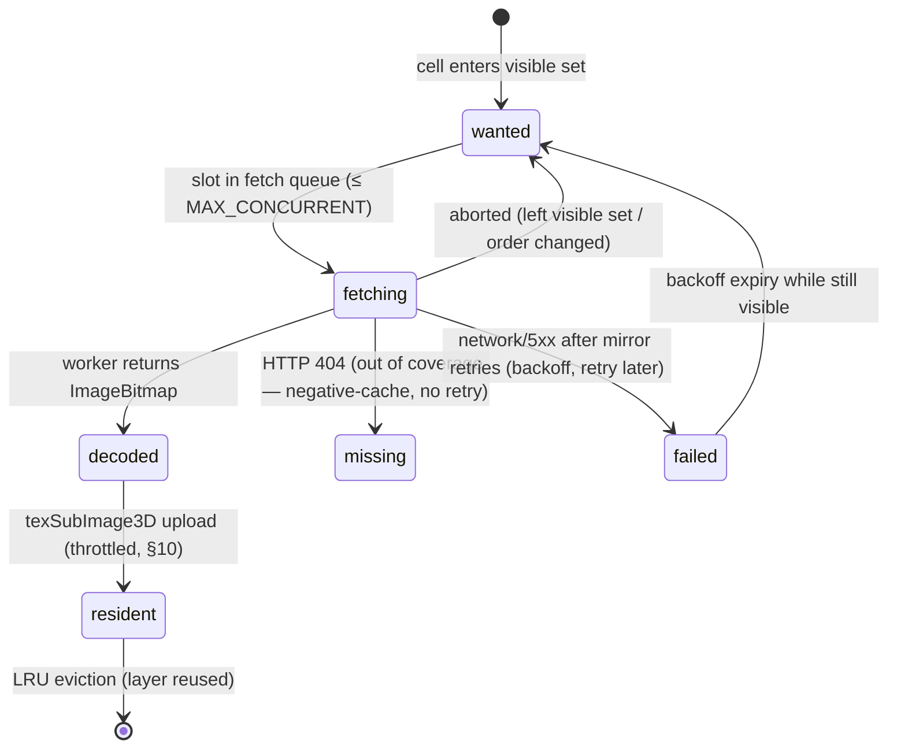

# 03 — HiPS Rendering Engine Specification

```yaml
doc: 03-hips-implementation
status: blueprint-final (implementation-grade)
audience: implementing engineer/model with no other context
depends-on:
  - docs/02-data-sources.md          (survey registry, URLs, CORS, etiquette)
sources-of-truth:
  - docs/research/hips-format.md     (IVOA HiPS 1.0 facts, live-verified URLs)
  - docs/research/healpix-math.md    (HEALPix math, healpix-ts library survey)
  - docs/research/performance-quest.md (budgets, texture arrays, upload throttling)
  - docs/research/lsst-rubin.md      (partial-survey handling rationale)
spec: IVOA HiPS 1.0, REC 2017-05-19 — https://www.ivoa.net/documents/HiPS/
      (PDF: https://www.ivoa.net/documents/20170519/REC-HIPS-1.0-20170519.pdf)
pinned-deps:
  three: "0.184.0"            # exact pin; three.js has no semver
  healpix-ts: "^1.1.0"        # MIT, Development Seed, published 2026-05-19
conventions: |
  VERIFIED = from the IVOA spec or a live probe on 2026-06-11.
  VERIFY:  = must be tested at implementation time; fallback always given.
  All code is TypeScript-flavored pseudocode: real signatures, elided bodies where
  marked "...". Angles are radians unless a variable name says Deg.
```

This document specifies the engine that paints real survey imagery (HiPS tiles) on an
inside-out celestial sphere, at 60–144 Hz desktop and 72–90 Hz in WebXR, alongside the
3D Gaia star field. It is written to be implementable without reading the research
dumps, but they are the provenance for every fact.

---

## 1. Concepts in five sentences

1. A HiPS survey is a static file tree of square tiles; tile at order `K`, index `N`
   **is** the HEALPix NESTED cell `N` at `Nside = 2^K` (VERIFIED, spec §4.1 — NESTED
   only, never RING).
2. A cell is an equal-area curvilinear quadrilateral ("diamond") on the sphere — not a
   lat/lon rectangle; its edges are not great circles, so flat quads distort textures
   (§6).
3. There are `12 · 4^K` cells at order `K`; cell angular size ≈ `58.63° / 2^K`; a
   512-px tile's pixels sit on the HEALPix grid of order `K + 9`
   (`9 = log2(512)`; generalize as `K + log2(hips_tile_width)`).
4. Parent/child math is bit-trivial: `parent = N >> 2`, `children = 4N .. 4N+3`,
   descendants of `N` at `+Δ` orders form the contiguous range `[N·4^Δ, (N+1)·4^Δ)`.
5. The renderer's per-frame job: pick an order (§7), list visible cells (§8), make sure
   each cell has the best available texture (self → ancestor → Allsky, §12), and draw
   the lot in ≤ 4 draw calls via a texture-array pool (§9).

---

## 2. Module layout

```text
src/sky/
  healpix/            # thin wrapper over healpix-ts + frame rotations (§5, §6.5)
  properties.ts       # fetch + parse {base}/properties (§3)
  tile-url.ts         # URL construction (§4)
  geometry.ts         # cell -> subdivided quad mesh (§6)
  lod.ts              # order selection (§7) + visible cells (§8)
  tile-manager.ts     # cache, fetch, decode, upload orchestration (§9-§11, §15)
  tile-worker.ts      # Worker: fetch + createImageBitmap (§10)
  sky-material.ts     # ShaderMaterial over sampler2DArray (§12, §16)
  sky-layer.ts        # THREE.Mesh ownership, render order, camera-relative (§13)
  moc.ts              # coverage MOC load + cell test (§14)
```

---

## 3. Properties file: fetch and parse

Plain UTF-8 `keyword = value` lines at `{base}/properties` (VERIFIED, spec §4.4.1).
`#` lines are comments; whitespace around `=` ignored; order irrelevant.

```ts
export function parseHipsProperties(text: string): Record<string, string> {
  const out: Record<string, string> = {};
  for (const line of text.split(/\r?\n/)) {
    if (!line.trim() || line.startsWith("#")) continue;
    const i = line.indexOf("=");
    if (i < 0) continue;
    out[line.slice(0, i).trim()] = line.slice(i + 1).trim();
  }
  return out;
}
```

Keys the renderer consumes (all seen live on alasky, VERIFIED):

| key | use | default if absent |
|---|---|---|
| `hips_order` | max tile order (LOD clamp) | required — fail the layer |
| `hips_order_min` | shallowest published order | treat **3** as the render floor regardless (spec §4.3.1 allows omitting orders 0–2; we never render below 3) |
| `hips_tile_width` | tile pixels, power of 2 | **512** |
| `hips_tile_format` | space-separated list; first = suggested default | required; pick first format we support in registry preference order |
| `hips_frame` | `equatorial` (=ICRS) \| `galactic` \| `ecliptic` | required |
| `dataproduct_subtype` | `color` for RGB tile sets | — |
| `moc_sky_fraction` | < 1.0 ⇒ partial survey ⇒ load MOC (§14) | 1.0 |
| `hips_initial_ra/dec/fov` | home view | registry value |
| `obs_copyright`, `obs_copyright_url` | attribution overlay (doc 02 §10) | registry value |
| `hips_release_date` | cache-busting key for properties/tiles revalidation | — |

Traps (VERIFIED):
- **Do not trust `hips_pixel_scale`** (DSS2 publishes `0.229`, inconsistent with the
  spec's "degrees" and order-9 math). Always compute pixel scale from
  `hips_order` + `hips_tile_width` (§7).
- `hips_version = 1.4` refers to the HiPS 1.0 REC's structure version — not an error.
- `webp` may appear in `hips_tile_format` (de facto Aladin Lite extension, not in the
  1.0 spec). Support it: browsers decode it natively, and alasky serves it **without a
  Content-Type header**, which is irrelevant to the `fetch → blob → createImageBitmap`
  path.

The runtime descriptor = registry entry (doc 02 §3.1) merged with parsed properties
(properties win, except `baseUrls`).

---

## 4. Tile URL construction (VERIFIED, spec §6.1/§6.2)

```ts
export const EXT: Record<string, string> = { jpeg: "jpg", png: "png", webp: "webp", fits: "fits" };

export function tileUrl(base: string, order: number, npix: number, fmt: string): string {
  const dir = Math.floor(npix / 10000) * 10000;
  return `${base}/Norder${order}/Dir${dir}/Npix${npix}.${EXT[fmt]}`;
}

export function allskyUrl(base: string, fmt: string): string {
  return `${base}/Norder3/Allsky.${EXT[fmt]}`;       // order 3 in practice on alasky
}
```

Worked examples (every one VERIFIED returning HTTP 200 on 2026-06-11):

| inputs | computed Dir | URL |
|---|---|---|
| DSS2, K=3, N=301, jpeg | `floor(301/10000)*10000 = 0` | `https://alasky.cds.unistra.fr/DSS/DSSColor/Norder3/Dir0/Npix301.jpg` |
| DSS2, K=9, N=2752671, jpeg | `floor(2752671/10000)*10000 = 2750000` | `https://alasky.cds.unistra.fr/DSS/DSSColor/Norder9/Dir2750000/Npix2752671.jpg` |
| Rubin FirstLook, K=3, N=433, webp | `0` | `https://alasky.cds.unistra.fr/Rubin/CDS_P_Rubin_FirstLook/Norder3/Dir0/Npix433.webp` |

Spec's own example: cell 10302 at order 6 → `Norder6/Dir10000/Npix10302.fits`.
Extensions MUST be lowercase; JPEG uses `.jpg` (spec §4.2.1.3).

Tree arithmetic used everywhere (VERIFIED):

```ts
const parent      = (n: number) => Math.floor(n / 4);            // order K-1
const children    = (n: number) => [4*n, 4*n+1, 4*n+2, 4*n+3];   // order K+1
const numTiles    = (k: number) => 12 * 4 ** k;
const cellSizeRad = (k: number) => Math.sqrt((4 * Math.PI) / (12 * 4 ** k)); // ≈ 58.63°/2^K
// Use Math.floor/multiply, NOT >> / <<, above order 14 (32-bit JS bitwise overflow).
```

---

## 5. HEALPix math layer

**Primary dependency: `healpix-ts@^1.1.0`** (MIT, zero runtime deps, ESM+CJS+d.ts,
healpy-validated lineage via michitaro/healpix; repo
https://github.com/developmentseed/healpix-ts). Functions used:

| need | healpix-ts export |
|---|---|
| direction → cell (picking) | `ang2PixNest(nside, theta, phi)` |
| cell center | `pix2AngNest`, `pix2VecNest` |
| cell corner vectors (geometry) | `cornersNest(nside, ipix)` → 4 unit vectors, order **N, W, S, E** |
| cone → cell list (tile selection) | `queryDiscInclusiveNest(nside, vec3, radiusRad, cb)` |
| LOD walk | `nestParent`, `nestChildren`, `nestAncestor`, `nestDescendants` |
| low-level grid stepping (§6) | `za2tu`, `tu2za`, `fxy2nest`, `nest2fxy`, `fxy2tu`, `bitCombine`/`bitDecombine` |

Conventions: `theta` = colatitude ∈ [0, π] (0 = north pole), `phi` = longitude ∈ [0, 2π);
`theta = π/2 − dec`, `phi = ra` (radians). Library hard limit: order ≤ 15 (32-bit Morton
interleave) — irrelevant, since CPU-side math caps at tile orders ≤ 13; image pixels
(order K+9) are never indexed on the CPU.

VERIFY (before relying on either): (a) `queryBoxInclusiveNest` may operate in geo
lon/lat space (geo heritage) — we don't use box queries; the cone path is the
healpy-validated one. (b) Corner order N,W,S,E is asserted from the michitaro test-suite
equivalence — pin it with a unit test on day one.

**Fallback A:** pin `@hscmap/healpix@1.4.12` (MIT, frozen 2022, healpy-validated; same
math, snake_case names, no hierarchy sugar — write `parent = ipix >> 2` yourself).

**Fallback B (port plan, ~400 lines, MIT attribution kept):** port from
`https://raw.githubusercontent.com/michitaro/healpix/master/src/index.ts` in this order
— (1) `za2tu/tu2za/sigma` ≈40 lines; (2) `tu2fpq/tu2fxy/fxy2tu` ≈50; (3)
`bitCombine/bitDecombine/fxy2nest/nest2fxy` ≈60; (4)
`ang2pixNest/pix2angNest/pix2vecNest/cornersNest` ≈60; (5)
`maxPixrad/queryDiscInclusiveNest` (+ ring walkers) ≈120; (6) parent/child one-liners.
Verbatim verified source for (1), (2), (5) is captured in
`docs/research/healpix-math.md` §2.4–2.11.

**Validation fixtures (do this on day one, library or port alike):** generate with
healpy (`pip install healpy`) for nside ∈ {1, 2, 64, 1024, 2048}: random + pole/seam
points (φ=0, θ=0/π, face boundaries) → assert exact integer equality for
`ang2pix`/`pix2ang` round-trips, ≤1e-12 vector error for corners, and that the JS disc
result is a superset of healpy `query_disc(inclusive=False)` and a subset of
`inclusive=True, fact=64`. This fixture suite is the regression net if the library is
ever swapped.

---

## 6. HEALPix cell → sphere geometry

### 6.1 Why subdivision is mandatory

A cell's 4 corners span a curvilinear diamond: edges follow `cosθ = a ± b·φ` (belt) /
`cosθ = a + b/φ²`-style curves (caps) — not great circles — and the in-cell texture
mapping is the HEALPix projection, not equirectangular. Drawing a tile as 2 triangles
with 4-corner bilinear UVs (the spec's "fast method", §6.3.1) visibly warps imagery,
worst near the 4 base cells touching the poles. The spec itself recommends subdividing
each tile into sub-cells. So: each tile is an **n×n grid of quads** whose vertices come
from the exact inverse HEALPix projection — no boundary-interpolation hacks.

### 6.2 Vertex computation (the (t,u) face-plane method, VERIFIED math)

For tile `(order K, npix N)` with `nside = 2^K`:

```ts
import { nest2fxy, fxy2tu, tu2za } from "healpix-ts"; // low-level exports

/** Build (n+1)^2 sphere positions + UVs for one tile. n = SUBDIV (§6.3). */
export function tileGrid(order: number, npix: number, n: number, radius: number) {
  const nside = 1 << order;
  const { f, x, y } = nest2fxy(nside, npix);        // face 0..11, in-face cell coords
  const { t, u } = fxy2tu(nside, f, x, y);          // cell CENTER in projection plane
  const d = (Math.PI / 4) / nside;                  // half-diagonal of the cell diamond
  const pos = new Float32Array((n + 1) ** 2 * 3);
  const uv  = new Float32Array((n + 1) ** 2 * 2);
  for (let j = 0; j <= n; j++) {
    for (let i = 0; i <= n; i++) {
      // fractional in-cell coords a,b ∈ [0,1] along the cell's x/y axes:
      const a = i / n, b = j / n;
      // corner offsets in the (t,u) plane: x-axis -> (t+d', u+d'), y-axis -> (t-d', u+d')
      // center ± d reaches the four corners; linear interpolation in (t,u) IS the
      // HEALPix mapping because the projection is affine per face-diamond:
      const tt = t + d * (a - b);                   // E->N along +x, E->W along +y
      const uu = u + d * (a + b - 1);
      const { z, a: phi } = tu2za(tt, uu);
      const s = Math.sqrt(Math.max(0, 1 - z * z));
      const k = j * (n + 1) + i;
      pos[3*k]   = radius * s * Math.cos(phi);      // sky-frame XYZ (frame note §6.5)
      pos[3*k+1] = radius * s * Math.sin(phi);
      pos[3*k+2] = radius * z;
      // UV: linear in in-face (x,y) space — NOT in RA/Dec (§6.4 orientation):
      uv[2*k]   = a;
      uv[2*k+1] = b;
    }
  }
  return { pos, uv };                               // index buffer: standard grid, 2n² triangles
}
```

The corner positions this produces agree with `cornersNest(nside, npix)` (N,W,S,E) at
`(a,b) = (1,1), (0,1), (0,0), (1,0)` respectively — assert that in a unit test
(VERIFY: pins both the corner-order convention and the grid orientation).

### 6.3 Subdivision factor N (decision)

- **n = 4 for everything at order ≥ 3** — sub-pixel projection error at typical FoVs
  (VERIFIED guidance from spec §4.3/§6.3.1 + Aladin Lite practice). 80 visible tiles ×
  16 quads × 2 tris ≈ 2,560 triangles: geometry cost is negligible; this engine is
  fragment/texture-bound.
- Orders 0–2 are never rendered at all (Allsky bootstrap covers the wide view, §11), so
  the n=8–16 they would need is moot.
- Keep `SUBDIV = 4` a constant; bump to 8 only if the §18 visual-diff test shows edge
  wobble against Aladin Lite at fov > 60°.

### 6.4 In-tile pixel orientation — MEDIUM confidence, gate on a visual test

Derived from spec Fig. 4 (FITS tile origin at the cell's **E corner**, x axis along
E→N, y along E→S) plus the spec note that JPEG/PNG rows are stored **top-down**
(vertical flip of FITS): for a jpg/png tile decoded with `imageOrientation: "none"` and
uploaded with `UNPACK_FLIP_Y_WEBGL = false`, the expected mapping is

```text
uv(E corner) = (0, 0)    uv(N) = (1, 0)    uv(S) = (0, 1)    uv(W) = (1, 1)
```

i.e. with the §6.2 grid, sample the texture at `vec2(a, b)` ↔ image (col=a·W, row=b·H).

**VERIFY: this is one of 8 possible orientations and MUST be settled empirically before
any other rendering work**: render one DSS2 order-3 tile containing Orion, open the same
field in Aladin Lite (https://aladin.cds.unistra.fr/AladinLite/), and compare slant +
mirror parity. Encapsulate the mapping in ONE function
(`uvFromCellCoords(a, b): [s, t]`) so fixing it is a one-line change (swap/flip
components). Do not scatter flips across the worker (`imageOrientation`), the texture
(`flipY`), and the shader — pick a single site (recommended: the UV function; set
`imageOrientation: "none"`, `flipY: false` everywhere).

### 6.5 Survey frames (galactic Mellinger)

`hips_frame = galactic` means cell indices/corners are galactic coordinates. Strategy:
build tile geometry in the **survey frame**, parent the survey's mesh group under one
`THREE.Group` with the fixed galactic→ICRS rotation; run §8's visibility query with the
view direction rotated **into** the survey frame (inverse rotation). Scene graph stays
ICRS/J2000 everywhere else.

Galactic→ICRS rotation matrix (standard J2000 values — VERIFY against astropy with the
test below before trusting the digits; from memory, not from the research dumps):

```ts
// columns = galactic basis vectors expressed in ICRS
const GAL_TO_ICRS = new THREE.Matrix3().set(
  -0.0548755604, +0.4941094279, -0.8676661490,
  -0.8734370902, -0.4448296300, -0.1980763734,
  -0.4838350155, +0.7469822445, +0.4559837762,
);
```

Unit test (also the VERIFY): galactic (l=0°, b=0°) must map to ICRS
RA 266.405°, Dec −28.936° (±0.01°); (l=0, b=90°) → RA 192.859°, Dec +27.128°.
Fallback if the matrix is wrong: compute it at build time with astropy
(`SkyCoord(l=..., b=..., frame='galactic').icrs`) and paste the 9 numbers.

---

## 7. LOD: order selection

Rule (spec §6.3.1): choose the order where **one tile pixel ≈ one screen pixel**.

```ts
/** Angular size of one tile pixel at order K (radians). NEVER use hips_pixel_scale. */
const tilePixRad = (K: number, tileWidth: number) =>
  Math.sqrt((4 * Math.PI) / 12) / (tileWidth * 2 ** K);     // = cellSizeRad(K)/tileWidth

export function pickOrder(
  fovYRad: number,            // vertical FoV of the (eye) camera
  viewportHeightPx: number,   // CSS px × DPR on desktop; per-eye framebuffer height in XR
  survey: { maxOrder: number; minRenderOrder: number; tileWidth: number },
  biasOrders = 0,             // VR quality knob, §10.4 (e.g. -0.5 to favor coarser tiles)
): number {
  const screenPixRad = fovYRad / viewportHeightPx;
  let k = survey.minRenderOrder;                            // floor is 3 (§3)
  while (k < survey.maxOrder && tilePixRad(k, survey.tileWidth) > screenPixRad) k++;
  return clamp(Math.round(k + biasOrders), survey.minRenderOrder, survey.maxOrder);
}
```

Numbers (512-px tiles, VERIFIED reference table): order 3 ≈ 51.5″/px, order 7 ≈ 3.2″/px,
order 9 ≈ 0.81″/px, order 11 ≈ 0.20″/px. A 60° FoV on a 1080-px-tall viewport
(screen pixel ≈ 200″) selects order 3; zoomed to 1° FoV (≈ 3.3″) selects order 9.

Because we stop at the first K with `tilePix ≤ screenPix`, minification is bounded by
2× — this is what makes the no-mips texture pool acceptable (§9.3).

**Hysteresis:** recompute on camera change, but only switch orders when the ideal order
differs from the current one by ≥ 1 AND the fov has crossed the threshold by ≥ 10%
(prevents flapping at boundaries). Generalization for non-512 tiles is automatic via
`tileWidth` (VERIFY whenever a future Rubin HiPS ships non-512 tiles).

---

## 8. Visible-cell determination (per camera change, debounced)

The camera sits at the center of the celestial sphere, so the visible region is exactly
the set of sky directions inside the view frustum → approximate with a **bounding
cone**, then an inclusive HEALPix disc query (over-fetching a few edge tiles is
harmless; holes are not).

```ts
import { queryDiscInclusiveNest } from "healpix-ts";

/** Bounding cone of the camera frustum, in the SURVEY frame. */
export function boundingCone(camera: THREE.PerspectiveCamera, icrsToSurvey: THREE.Matrix3) {
  const axis = camera.getWorldDirection(SCRATCH_V3).applyMatrix3(icrsToSurvey).normalize();
  let cosHalf = 1;
  for (const [nx, ny] of [[-1,-1],[1,-1],[-1,1],[1,1]]) {        // 4 NDC corners
    const ray = SCRATCH_V3B.set(nx, ny, 0.5).unproject(camera)
      .sub(camera.position).applyMatrix3(icrsToSurvey).normalize();
    cosHalf = Math.min(cosHalf, axis.dot(ray));
  }
  return { axis, halfAngle: Math.acos(cosHalf) + 0.017 };        // +1° safety margin
}

export function visibleCells(order: number, axis: V3, halfAngle: number, out: number[]) {
  out.length = 0;
  if (order <= 2 || halfAngle > Math.PI / 3) {                   // wide view: take all
    for (let i = 0; i < 12 * 4 ** order; i++) out.push(i);
    return out;
  }
  queryDiscInclusiveNest(1 << order, [axis.x, axis.y, axis.z], halfAngle, p => out.push(p));
  return out;                                                    // typically 30–80 cells
}
```

Notes:
- `queryDiscInclusiveNest` is the healpy-equivalent inclusive ring sweep
  (`center distance ≤ radius + max_pixrad`) — conservative over-approximation, exactly
  right for tile loading. It throws for radius > π/2, hence the wide-view branch.
- Optional refinement (only if over-fetch ever measurably hurts): drop cells whose 4
  corners AND center all fail the 4 frustum side-plane dot tests.
- **WebXR stereo (decision):** one shared query per frame using the union of both eye
  frusta (in practice: the head camera with the wider eye fov + margin). Eye separation
  (~63 mm) is angularly negligible against a sky sphere; per-eye queries would double
  CPU cost for identical results.
- Run on camera change debounced to ≥ 60 ms apart AND only when the view direction
  moved > 10% of a tile angular size, or fov/order changed. Cost is ~sub-ms at orders ≤ 11
  but there is no reason to churn the want-set every frame.
- Prioritize fetches by `acos(dot(cellCenter, axis))` ascending (center-out loading).

---

## 9. Tile cache design

### 9.1 Three cache tiers

| Tier | What | Ceiling (Quest 2 / Quest 3 / desktop) | Eviction |
|---|---|---|---|
| GPU pool | `TEXTURE_2D_ARRAY` layers, 512×512 sRGB8_ALPHA8 | 128 / 192 / 384 layers (≈170/256/510 MiB) | LRU by `lastUsedFrame`; never evict tiles drawn this frame or serving as fallback ancestors |
| Decoded CPU cache | `ImageBitmap`s awaiting upload | 64 / 96 / 256 tiles | FIFO overflow → `bitmap.close()` + re-queue as fetchable |
| HTTP cache | browser-managed (ETags VERIFIED on alasky) | n/a | browser |

GPU pool allocation (once, at layer init):

```ts
gl.texStorage3D(gl.TEXTURE_2D_ARRAY, 1 /* mip levels, §9.3 */, gl.SRGB8_ALPHA8, 512, 512, LAYERS);
```

Eviction = overwrite a layer index with a new tile; zero reallocation. One pool per
active survey (two surveys cross-fading during a survey switch = two pools; cap
active surveys at 2).

### 9.2 Tile record and state machine

```ts
type TileKey = string;                       // `${surveyId}/${order}/${npix}`
type TileState = "wanted" | "fetching" | "decoded" | "resident" | "missing" | "failed";

interface TileRecord {
  key: TileKey; order: number; npix: number;
  state: TileState;
  layer: number | -1;                        // GPU pool layer when resident
  lastUsedFrame: number;                     // LRU clock
  fadeStart: number;                         // performance.now() at residency (§12)
  abort?: AbortController;                   // fetch cancellation (§9.4)
  bitmap?: ImageBitmap;                      // decoded, pre-upload
  retries: number; mirrorIndex: number;      // failover bookkeeping (§14)
}
```



### 9.3 Mipmaps: deliberately none (v1 decision)

`generateMipmap` on a `TEXTURE_2D_ARRAY` regenerates **all** layers (multi-millisecond
stall) and per-layer mipping isn't available in WebGL2. Since §7 bounds minification to
≤ 2×, ship the pool with 1 mip level + `LINEAR` filtering. Mitigations if rotation
shimmer is visible on device (VERIFY on Quest): (a) set `biasOrders = -0.5` in VR
(slightly blurrier, less aliasing); (b) v2 option: build the mip chain from
parent-order tiles (HiPS's hierarchy is a free mip pyramid — open question: tile-border
seams, see research). Do not silently switch to per-tile textures with mips; that
reintroduces per-tile binds (§1.3 of performance research).

### 9.4 In-flight dedup and abort-on-stale

- One `Map<TileKey, TileRecord>` is the single source of truth; a second
  `Map<TileKey, Promise<...>>` is unnecessary — state on the record IS the dedup.
- Every fetch gets an `AbortController`. A reconcile pass (§15) aborts fetches whose
  key (a) left the want-set for > 30 consecutive frames, or (b) belongs to an order
  ≥ 2 away from the current order. Aborted records return to `wanted` (cheap to
  re-issue thanks to the browser HTTP cache).
- Concurrency cap: 6 in VR, 8 Quest 3, 12 desktop (doc 02 §11 / perf budget table).

---

## 10. Decode and upload pipeline

### 10.1 Worker decode (fetch + createImageBitmap off the main thread)

```ts
// tile-worker.ts — 2 workers desktop, 2 in VR (perf research: scheduling isolation)
self.onmessage = async ({ data: { key, url } }) => {
  try {
    const resp = await fetch(url, { mode: "cors", signal });    // signal wired via port msg
    if (resp.status === 404) { self.postMessage({ key, miss: true }); return; }
    if (!resp.ok) throw new Error(`http ${resp.status}`);
    const blob = await resp.blob();                              // works w/o Content-Type (webp!)
    const bmp = await createImageBitmap(blob, {
      imageOrientation: "none",        // ALL orientation handled in UV mapping (§6.4)
      premultiplyAlpha: "none",
      colorSpaceConversion: "none",
    });
    self.postMessage({ key, bmp }, [bmp]);                       // zero-copy transfer
  } catch (e) {
    self.postMessage({ key, error: String(e), aborted: e.name === "AbortError" });
  }
};
```

### 10.2 Throttled upload on the GL thread

Uploads are the only unavoidable main-thread cost; budget them per frame:

```ts
const UPLOAD_BUDGET_MS = { vr: 2.0, desktop: 4.0 };
const MAX_UPLOADS_PER_FRAME = { vr: 1, desktop: 4 };   // perf research budget table

function drainUploads(now: number) {
  let n = 0; const t0 = performance.now();
  while (uploadQueue.length
      && n < MAX_UPLOADS_PER_FRAME[mode]
      && performance.now() - t0 < UPLOAD_BUDGET_MS[mode]) {
    const rec = uploadQueue.shift()!;                  // priority: center-out (§8)
    rec.layer = pool.acquireLayer(rec);                // LRU-evicts if full (§9.1 rules)
    gl.bindTexture(gl.TEXTURE_2D_ARRAY, pool.tex);
    gl.texSubImage3D(gl.TEXTURE_2D_ARRAY, 0, 0, 0, rec.layer, 512, 512, 1,
                     gl.RGBA, gl.UNSIGNED_BYTE, rec.bitmap!);
    rec.bitmap!.close(); rec.bitmap = undefined;
    rec.state = "resident"; rec.fadeStart = now;
    drawListDirty = true; n++;
  }
}
```

VERIFY: real per-tile `texSubImage3D` cost on Adreno 650 is unmeasured — 1 tile/frame in
VR is the assumption; instrument with `performance.now()` brackets and adjust.

### 10.3 Zero-allocation discipline

The reconcile/draw path runs inside the XR frame loop: no `new`, no array spreads, no
closures, reused scratch `Vector3`s, preallocated `out` arrays for `visibleCells`
(perf research: per-frame allocations get tenured → major-GC hitches in WebXR).

### 10.4 VR knobs

`biasOrders = -0.5` default in VR (§7), foveation and framebufferScale are owned by the
XR bootstrap (doc on rendering/XR), not this engine.

---

## 11. Allsky bootstrap (first paint < 1 s)

Purpose (VERIFIED, spec §4.3): one HTTP request covers the whole low-res sky; orders
0–2 are never fetched as tiles.

- URL: `{base}/Norder3/Allsky.{ext}` — VERIFIED live for DSS2 (`Allsky.jpg`, 806 KB,
  200) and Rubin FirstLook (`Allsky.png`, 200). **`Allsky.webp` may not exist even when
  webp tiles do** (VERIFIED 404 for DSS) → try formats in registry preference order,
  fall back across formats on 404.
- Layout (VERIFIED): all 768 order-3 tiles packed row-major by tile index into a grid
  **27 tiles wide** (`floor(sqrt(768))`), 29 rows (last partial), each sub-tile
  downsampled to 64×64 → 1728×1856 px image. Detect sub-tile size at runtime:
  `cell = image.width / 27`.

```ts
function allskySubRect(npix: number, cellPx: number) {
  const col = npix % 27, row = Math.floor(npix / 27);
  return { x: col * cellPx, y: row * cellPx, w: cellPx, h: cellPx };
}
```

- Implementation: upload the whole Allsky image as ONE ordinary `THREE.Texture`
  (separate from the tile pool — its 64-px cells don't fit 512-px layers). The order-3
  mesh set (768 cells, always resident) samples it with sub-rect UVs
  (`uv = (rect.xy + uvCell * rect.wh) / imageSize`). Same §6.4 orientation question
  applies to each 64×64 sub-tile — covered by the same VERIFY test.
- Lifecycle: fetch Allsky immediately after `properties`; the order-3 layer renders as
  soon as it decodes; real `Norder3+` tiles then replace it cell-by-cell via the normal
  §12 crossfade. Keep the Allsky texture resident forever (~4 MB): it is the universal
  fallback when the camera whips around.

---

## 12. LOD fallback and fade-in

### 12.1 Best-available drawable per cell

When drawing cell `N` at order `K`, the texture source is the first hit in:

1. itself (`resident`),
2. nearest resident **ancestor** at `K−Δ` (Δ ≤ K−3), sampled in the sub-quadrant,
3. the Allsky order-3 cell (always available after bootstrap) with its sub-rect.

Ancestor sub-UV from Morton bits (VERIFIED math — the dropped bits are the in-cell
quadrant path):

```ts
import { bitDecombine } from "healpix-ts";

/** UV transform to sample ancestor (Δ orders up) at cell npix's footprint. */
function ancestorSubUv(npix: number, delta: number) {
  const sub = npix % 4 ** delta;            // low 2Δ bits (Math ops, not &, above order 14)
  const { x, y } = bitDecombine(sub);       // in-ancestor cell coords, each ∈ [0, 2^Δ)
  const s = 1 / 2 ** delta;
  return { scale: s, ox: x * s, oy: y * s };  // uv' = (ox,oy) + uvCell*(s,s), in §6.4's (a,b) space
}
```

### 12.2 Crossfade (one mechanism for fades AND fallback)

Each drawn cell carries **two** texture bindings and a mix factor as vertex attributes:

```text
aLayerA, aUvRectA   = fallback source (ancestor layer or Allsky)
aLayerB, aUvRectB   = target tile (the cell's own texture; = A if none)
aMix                = 0 → A only … 1 → B only
```

- On residency, `aMix` animates 0 → 1 over **300 ms** (`min(1, (now - fadeStart)/300)`),
  recomputed during draw-list patching, not per-vertex JS per frame (write the float
  attribute only while any fade is active).
- Order switches reuse the same path: when the engine moves from order K to K+1, the
  children initially draw with A = parent (mix 0) — visually identical to the parent —
  then fade to their own textures as they arrive. Moving K → K−1 draws parents at
  mix 1 immediately (their texture is usually still resident; else fallback chain).
- Fragment shader: `color = mix(texture(uTiles, vec3(uvA, layerA)), texture(uTiles, vec3(uvB, layerB)), mix)`.
  Two `sampler2DArray` lookups, same sampler — cheap, no state change.

---

## 13. Rendering the sphere at "infinity" alongside 3D stars

The sky sphere is background imagery from Earth's viewpoint; the Gaia star field is
real 3D geometry. Composition rules (from star-rendering + performance research):

1. **Render order:** sky first. `skyMesh.renderOrder = -100`; stars (additive points)
   after; UI last.
2. **Depth:** sky material `depthWrite: false`, `depthTest: false`. Stars also render
   with depth test/write off (additive). Nothing ever z-fights the sky, and FFR-friendly
   single-target rendering is preserved (no intermediate render targets in VR).
3. **Camera-relative ("at infinity"):** the sky mesh group's position is copied from
   the camera every frame (`skyGroup.position.copy(camera.position)`), so the sphere
   never exhibits parallax. Radius: any value comfortably inside the far plane —
   use `0.5 * camera.far` updated on far-plane change (with depthTest off, only
   frustum clipping matters). Geometry lives in f32 safely because vertices are
   camera-local and small.
4. **`frustumCulled = false`** on the sky mesh (we do our own culling in §8; three.js
   sphere-culling a camera-centered mesh is always "visible" anyway, but the flag
   avoids a wasted bounds computation on a mutating BufferGeometry).
5. **Star-field handoff:** as the user flies away from the Sun, the Earth-sky imagery
   becomes a lie (its stars stop matching the 3D star positions). Fade the HiPS layer's
   global opacity from 1 → 0 between camera distance 50 pc and 100 pc from the solar
   origin (uniform `uGlobalFade` multiplied onto the fragment). Beyond 100 pc only the
   Gaia points (and a future Milky Way backdrop, see star-rendering research open
   question) are drawn. Re-fade in on return.
6. **Draw calls:** the entire sky = 1 draw call for the tile mesh (single merged
   geometry + texture array) + 1 for the Allsky/order-3 mesh while any cell still
   relies on it (drop it once all visible cells have ≥ ancestor coverage in the pool) +
   1 per extra active survey during a survey crossfade. Budget ≤ 4 (perf table).

---

## 14. Failure handling

### 14.1 404 = out of coverage (partial surveys)

Pan-STARRS covers 78% of the sky, SDSS9 36%, Rubin FirstLook 0.057% — 404s at coverage
edges are **normal operation**, not errors (VERIFIED spec: partial tree).

- Negative-cache 404s for the session (`state = "missing"`); never retry, never log as
  error. Missing cells draw the fallback chain (§12.1) if an ancestor has pixels, else
  transparent black.
- **MOC pre-check (mandatory for `skyFraction < 0.99`):** fetch the coverage MOC at
  layer load and test cells *before* queueing fetches — prevents 404 storms (hundreds
  of doomed requests when panning along a survey edge).
  - Easiest source (VERIFIED): MocServer JSON —
    `https://alasky.cds.unistra.fr/MocServer/query?ID={hipsId}&get=moc&fmt=json` returns
    `{ "<order>": [npix, ...], ... }`. No FITS parsing needed in v1
    (`{base}/Moc.fits` exists but needs a FITS reader — defer).
  - Cell test using contiguous descendant ranges (VERIFIED math):

```ts
/** true if cell (order,npix) intersects the MOC */
function mocCovers(moc: Map<number, Set<number>>, order: number, npix: number): boolean {
  for (const [mOrder, cells] of moc) {
    if (mOrder <= order) {                       // is our ancestor in the MOC?
      if (cells.has(Math.floor(npix / 4 ** (order - mOrder)))) return true;
    } else {                                     // any MOC cell inside our footprint?
      const lo = npix * 4 ** (mOrder - order), hi = (npix + 1) * 4 ** (mOrder - order);
      for (const c of cells) if (c >= lo && c < hi) return true;  // optimize: sorted array + binary search
    }
  }
  return false;
}
```

### 14.2 Network errors / 5xx → mirror failover

- `baseUrls` is ordered (doc 02 §3.1): `[alasky, alaskybis]` (VERIFIED identical
  mirrors). On fetch failure (network error or 5xx — NOT 404): retry once immediately
  on the next mirror (`mirrorIndex = (mirrorIndex + 1) % baseUrls.length`).
- If both mirrors fail: `state = "failed"`, exponential backoff (1 s, 4 s, 16 s, then
  60 s cap) — retried only while the cell remains visible.
- **Per-host circuit breaker:** ≥ 5 failures within 30 s on one host → demote that host
  for 60 s (all new fetches go to the other mirror); restore after a successful probe.
- `properties` fetch failure (both mirrors) → layer enters an "unavailable" UI state;
  retry with backoff; the app keeps running on the other layers.
- Allsky failure → proceed without bootstrap (tiles still load; first paint is slower);
  retry in background.

### 14.3 Decode failures

Corrupt/truncated image (`createImageBitmap` rejects): treat as network failure
(mirror retry once, then backoff) — observed cause would be a truncated CDN response.

---

## 15. TileManager and the per-frame loop (reference pseudocode)

```ts
export class TileManager {
  private survey!: RuntimeSurvey;                  // registry ⊕ properties (doc 02 §3.1, §3 here)
  private records = new Map<TileKey, TileRecord>();
  private pool!: TileArrayPool;                    // §9.1
  private workers!: TileWorkerPool;                // §10.1
  private moc: Map<number, Set<number>> | null = null;
  private allsky: { texture: THREE.Texture; cellPx: number } | null = null;

  private currentOrder = 3;
  private want: number[] = [];                     // preallocated, reused (§10.3)
  private fetching = 0;
  private uploadQueue: TileRecord[] = [];
  private drawListDirty = true;
  private frame = 0;

  /** Layer init: properties → (parallel) Allsky + MOC; then ready to update(). */
  async load(desc: HipsSurveyDescriptor): Promise<void> { /* §3, §11, §14.1 */ }

  /** Called once per rendered frame BEFORE draw (from the app's update phase). */
  update(camera: THREE.PerspectiveCamera, nowMs: number): void {
    this.frame++;

    // 1. LOD + visibility — only when the camera moved enough (§7, §8 debounce)
    if (this.cameraMovedEnough(camera)) {
      const order = pickOrder(camera.fov * DEG2RAD, viewportHeightPx(), this.survey, biasOrders());
      const { axis, halfAngle } = boundingCone(camera, this.survey.icrsToSurvey);
      if (this.orderChanged(order) || this.coneChanged(axis, halfAngle)) {
        this.currentOrder = order;
        visibleCells(order, axis, halfAngle, this.want);
        sortByAngularDistance(this.want, axis, order);          // center-out priority
        this.reconcile(nowMs);                                  // step 2
        this.drawListDirty = true;
      }
    }

    // 3. drain decoded → GPU within budget (§10.2); sets drawListDirty on upload
    this.drainUploads(nowMs);

    // 4. rebuild merged draw buffers only when something changed (§12, §13)
    if (this.drawListDirty || this.anyFadeActive(nowMs)) this.patchDrawList(nowMs);
  }

  /** 2. Diff want-set against records: queue fetches, abort stale, mark LRU. */
  private reconcile(nowMs: number): void {
    for (const npix of this.want) {
      const key = `${this.survey.id}/${this.currentOrder}/${npix}`;
      let rec = this.records.get(key);
      if (!rec) {
        if (this.moc && !mocCovers(this.moc, this.currentOrder, npix)) {
          rec = makeRecord(key, "missing");                     // §14.1 pre-check
        } else {
          rec = makeRecord(key, "wanted");
        }
        this.records.set(key, rec);
      }
      rec.lastUsedFrame = this.frame;
      // keep fallback ancestors warm in the LRU:
      this.touchResidentAncestors(this.currentOrder, npix);
    }
    // abort stale in-flight fetches (§9.4)
    for (const rec of this.records.values()) {
      if (rec.state === "fetching" && this.isStale(rec)) rec.abort!.abort();
    }
    // fill fetch slots, priority order (want is sorted)
    for (const npix of this.want) {
      if (this.fetching >= MAX_CONCURRENT[mode]) break;
      const rec = this.records.get(this.key(this.currentOrder, npix))!;
      if (rec.state === "wanted" || (rec.state === "failed" && backoffExpired(rec, nowMs))) {
        this.startFetch(rec);                                   // → worker, §10.1, §14.2
      }
    }
  }

  /** Build/patch ONE merged BufferGeometry: per visible cell, SUBDIV grid (§6.2)
   *  + attributes aLayerA/aUvRectA/aLayerB/aUvRectB/aMix (§12.2).
   *  Buffers are preallocated for MAX_VISIBLE_CELLS(=512) cells; only ranges that
   *  changed are re-uploaded via BufferAttribute.updateRanges. */
  private patchDrawList(nowMs: number): void { /* §6, §12 */ }

  /** Survey switch: keep old manager alive, crossfade uGlobalFade over 400 ms, dispose. */
  dispose(): void { /* abort all, close bitmaps, pool.dispose(), texture.dispose() */ }
}
```

Per-frame call graph (the app's animation loop, XR-safe):

```text
onFrame(now):
  cameraRig.update()
  skyGroup.position.copy(camera.position)          # §13.3 (camera-relative)
  for layer of activeSkyLayers: layer.tileManager.update(camera, now)
  starField.update(camera, now)                    # separate doc
  renderer.render(scene, camera)                   # sky renderOrder -100 → drawn first
```

Everything network/decode-related happens in workers and microtasks **outside** this
loop; `update()` itself does only map lookups, array diffs, and ≤ budgeted uploads.

---

## 16. Shader sketch (sky-material.ts)

```glsl
// vertex
in vec3 position;            // camera-local sphere point (§13.3)
in vec2 uvCell;              // (a,b) in-cell coords (§6.2)
in float aLayerA; in vec4 aUvRectA;   // fallback: (ox, oy, scale, unused)
in float aLayerB; in vec4 aUvRectB;   // target tile
in float aMix;
out vec2 vUvA; out vec2 vUvB; out float vMix;
flat out float vLayerA; flat out float vLayerB;
void main() {
  vec2 uv = uvFromCellCoords(uvCell);              // §6.4 — the ONE orientation site
  vUvA = aUvRectA.xy + uv * aUvRectA.z;
  vUvB = aUvRectB.xy + uv * aUvRectB.z;
  vLayerA = aLayerA; vLayerB = aLayerB; vMix = aMix;
  gl_Position = projectionMatrix * modelViewMatrix * vec4(position, 1.0);
}

// fragment
uniform mediump sampler2DArray uTiles;
uniform float uGlobalFade;                          // §13.5 star-field handoff + survey crossfade
void main() {
  vec4 a = texture(uTiles, vec3(vUvA, vLayerA));
  vec4 b = texture(uTiles, vec3(vUvB, vLayerB));
  vec4 c = mix(a, b, vMix);
  fragColor = vec4(c.rgb, c.a * uGlobalFade);       // png alpha marks no-coverage (spec)
}
```

(The Allsky/order-3 mesh uses a plain `sampler2D` variant of the same shader.)
Material: `depthWrite:false, depthTest:false, transparent:true` (normal blending),
`side: THREE.BackSide` if winding is outward — or keep `FrontSide` and emit the §6.2
grid with inward-facing winding; assert one of them in the §18 visual test.

---

## 17. Performance budgets (engine-level, from perf research)

| Item | Quest 2 (72 Hz) | Quest 3/3S (90 Hz) | Desktop |
|---|---|---|---|
| Sky draw calls | ≤ 4 | ≤ 4 | ≤ 8 |
| GPU tile pool layers | 128 (~170 MiB, no mips) | 192 | 384 |
| Decoded CPU cache | 64 tiles | 96 | 256 |
| Tile uploads/frame | 1 (≤ 2 ms) | 1–2 | 2–4 |
| Concurrent fetches | 6 | 8 | 12 |
| TileManager.update() JS | ≤ 1 ms typical, 2 ms worst (order switch) | same | ≤ 3 ms |
| Steady-state allocations per frame | 0 | 0 | 0 |

Dev builds assert these via a `renderer.info` HUD (calls, textures) and console.warn on
breach. VERIFY: Quest texture-memory ceiling is undocumented — on-device stress test
(allocate layers until context loss) before finalizing the 128/192 numbers.

---

## 18. Acceptance criteria & verification plan

Ordered: each gates the next.

1. **HEALPix fixtures pass** (§5): healpy-generated fixtures for ang2pix/pix2ang/
   corners/query_disc at nside {1,2,64,1024,2048}, including poles/seams; corner order
   N,W,S,E pinned by test; `tileGrid` corners match `cornersNest` (§6.2).
2. **Orientation settled** (§6.4): side-by-side screenshot of our renderer vs Aladin
   Lite on the Orion field (DSS2 color, fov ~10°) shows identical star-pattern slant
   and parity. The chosen mapping is documented in `uvFromCellCoords`'s comment with
   the screenshot committed to `docs/assets/`.
3. **Galactic frame correct** (§6.5): Mellinger layer aligns with DSS2 layer (blink
   test at the galactic center, l=0 b=0 ↔ RA 266.405 Dec −28.936); rotation matrix
   unit tests pass.
4. **First paint:** cold load (cache cleared, fast 3G throttle) shows the full Allsky
   sky in < 1.5 s after properties resolve; no order-0/1/2 tile request ever appears in
   the network log.
5. **LOD behavior:** zooming Crab Nebula (RA 83.63, Dec 22.01) from fov 60° → 0.5°
   walks orders 3→9 on DSS2 (cap 9) and 3→11 on Pan-STARRS (cap 11); each transition
   crossfades (no pops, no blank cells — fallback chain always paints something).
6. **Partial surveys:** panning across the SDSS9 boundary produces zero 404s in the
   network log (MOC pre-check working) and renders transparent outside coverage;
   Rubin FirstLook shows imagery only in its ~23 deg² with no error spam.
7. **Failover:** blocking `alasky.cds.unistra.fr` via DevTools network rules makes all
   tiles load from `alaskybis` within one retry, with no user-visible stall > 1 s.
8. **Cache discipline:** after 2 minutes of random panning at order 9, GPU layer count
   ≤ pool size, `renderer.info.memory.textures` stable, decoded-cache ≤ cap, zero
   steady-state allocations in a 10 s Chrome allocation-timeline capture of idle orbit.
9. **Stars + sky composition:** stars render over the sky with no z-artifacts;
   flying out to 120 pc fades the HiPS sphere fully out; returning fades it back.
10. **VR (emulator now, device later):** in Immersive Web Emulator, stereo view shows
    the same tile set in both eyes (shared cone query); on a physical Quest 2-class
    device, 30-minute soak at order ≤ 9 holds 72 Hz with ≤ 1 dropped-frame burst per
    minute (VERIFY: requires the planned device test, perf research open question).

## 19. Open questions carried from research (with owners-at-implementation)

1. §6.4 tile orientation — settle in the first rendering spike (blocking).
2. §5 `healpix-ts` box-query frame + corner order — unit tests on day one.
3. §9.3 no-mips aliasing on device; parent-tile mip seams if mips become needed.
4. §10.2 real texSubImage3D cost on Adreno 650 → adjust uploads/frame.
5. §17 Quest texture-memory ceiling → adjust pool layers.
6. VR stereo shared-cone decision (§8) — revisit only if eye-edge tiles visibly pop.
7. Non-512px tiles in a future Rubin HiPS → `tileWidth` already parameterized (§7);
   re-test `pickOrder` then.
8. FITS tiles (client-side stretch/colormap) — deferred to v2; would add a FITS decoder
   in the worker and a colormap uniform path in §16.
9. `XREquirectLayer` compositor offload for the sky (perf research: ~2.4 ms GPU savings)
   — stretch optimization behind feature detection, after the in-scene path ships.
