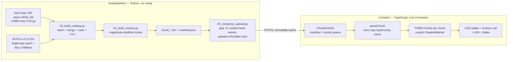

# 04 — Star Catalog Pipeline & Runtime Star Field

```yaml
doc: 04-star-catalog-pipeline
status: blueprint (no code exists yet — this doc specifies what to build)
audience: implementing AI/engineer with NO other context beyond this docs/ folder
depends_on:
  - docs/research/gaia-pipeline.md      (live-verified TAP queries, counts, table names)
  - docs/research/star-rendering.md     (shader design, photometry, LOD)
  - docs/research/performance-quest.md  (budgets)
  - docs/research/deploy-assets.md      (chunk serving, compression)
scope: |
  Part A — the OFFLINE Python pipeline (tools/pipeline/) that turns Gaia DR3 into
  static binary star chunks + manifest.json.
  Part B — the RUNTIME TypeScript star-field renderer (chunk fetch, parse,
  THREE.BufferGeometry, GLSL shaders, exposure, LOD/culling).
conventions: |
  All multi-byte binary values are LITTLE-ENDIAN.
  1 world unit = 1 parsec. Frame = ICRS Cartesian (see §A6 for Three.js axis mapping).
  Anything marked "VERIFY:" was not fully confirmed during research — it carries a
  fallback plan and must be checked at implementation time.
```

---

## Part 0 — Overview

Two deliverables, decoupled by a static file contract (`manifest.json` + `chunk_*.bin.gz`):



Key numbers (live-verified counts from `docs/research/gaia-pipeline.md`, queried against
the ESA archive on 2026-06-11, all with `parallax_over_error > 5`):

| Preset | Cut | Stars | Raw size @16 B/star |
|---|---|---|---|
| `lite` | `phot_g_mean_mag < 11.5` | **1,937,515** | **31.0 MB** |
| `full` | `phot_g_mean_mag < 12.5` | **4,683,166** | **74.9 MB** |
| (reference) | `phot_g_mean_mag < 13.5` | 10,794,696 | 172.7 MB |

The "1M target" ≈ `lite` (16 MB if further cut to exactly 1M brightest), the "5M target" ≈ `full` (80 MB at exactly 5M). Adding `ruwe < 1.4` (recommended) reduces these a few percent — VERIFY: run the `COUNT(*)` query (§A3) before freezing the manifest; the reduction was not measured during research.

---

# Part A — Offline pipeline (`tools/pipeline/`)

## A1. Directory layout & environment

```
tools/pipeline/
  README.md
  requirements.txt
  config.py                 # presets (lite/full), cuts, paths, release tag
  01_fetch_gaia.py          # TAP async job → data/raw/gaia_<preset>.csv.gz
  02_fetch_athyg.py         # download + verify ATHYG v3.3 → data/raw/athyg/
  03_build_catalog.py       # clean, merge, color, XYZ → data/stage/catalog.parquet
  04_build_chunks.py        # octree + binary chunks + manifest → data/out/<version>/
  05_compress_upload.py     # gzip -9 each chunk, hash-name, wrangler r2 put
  palette.py                # Teff→linear-RGB 256-entry palette generation
  tests/
    test_roundtrip.py       # decode chunk in Python, compare vs stage catalog
    fixtures/
```

`requirements.txt` (pin exact versions at implementation time; minima below):

```text
astroquery>=0.4.7     # Gaia TAP client (VERIFY latest on PyPI; API used: Gaia.login, launch_job_async)
astropy>=6.0          # SkyCoord, Table, units
numpy>=1.26
pandas>=2.2           # CSV staging; parquet via pyarrow
pyarrow>=15
```

Python **3.12+**. The whole pipeline must be re-runnable for **Gaia DR4 (released 2 December 2026 — verified)**: every script takes `--release gaiadr3` and table names live in `config.py`, because DR4 has new source_ids and (open question) may lack a Bailer-Jones-style distance catalog at first.

## A2. Step 1 — Acquisition: the exact ADQL

### Endpoints (verified live 2026-06-11)

- TAP sync: `https://gea.esac.esa.int/tap-server/tap/sync` (60 s timeout — counts/smoke tests only)
- TAP async: `https://gea.esac.esa.int/tap-server/tap/async` (120 min timeout)
- Output formats: `votable`, `votable_plain`, `csv`, `json`, `fits`

> **Browser note:** the ESA Gaia archive has **no CORS** (verified) — this endpoint is for the
> *offline* pipeline only. The runtime app never calls it (runtime object lookups go through
> VizieR/SIMBAD per the TAP/object-info doc of this blueprint).

### Quota facts that shape the design (verified, ESA FAQ)

| Limit | Anonymous | Registered (free signup) |
|---|---|---|
| Async max result rows | **3,000,000** | unlimited |
| Async job timeout | 120 min | 120 min |
| Result storage | ~3 days | 20 GB, kept until deleted |

Consequences:
- `lite` (1.94 M rows) runs **anonymously**.
- `full` (4.68 M rows) **requires a registered account** (free: https://www.cosmos.esa.int/web/gaia-users/register).

### Production query (preset `full`)

The distance join uses the **verified** Bailer-Jones table name on the ESA archive:
**`external.gaiaedr3_distance`** (NOT `gaiadr3.gaiadr3_distance` — that table does not exist).
It is keyed to EDR3 source_ids, which are identical to DR3 source_ids (same source list/astrometry),
so `USING (source_id)` against `gaiadr3.gaia_source` is the join the Bailer-Jones page itself recommends.

```sql
SELECT g.source_id, g.ra, g.dec,
       g.phot_g_mean_mag, g.bp_rp, g.teff_gspphot,
       g.parallax, g.parallax_over_error, g.ruwe,
       d.r_med_geo, d.r_med_photogeo
FROM gaiadr3.gaia_source AS g
JOIN external.gaiaedr3_distance AS d USING (source_id)
WHERE g.phot_g_mean_mag < 12.5
  AND g.parallax_over_error > 5
  AND g.ruwe < 1.4
```

Preset `lite`: same query with `phot_g_mean_mag < 11.5`.

Count check to run first (sync endpoint, completes in seconds):

```sql
SELECT COUNT(*) AS n
FROM gaiadr3.gaia_source AS g
JOIN external.gaiaedr3_distance AS d USING (source_id)
WHERE g.phot_g_mean_mag < 12.5 AND g.parallax_over_error > 5 AND g.ruwe < 1.4
```

VERIFY: record this number in the manifest's `build` block. Expected: slightly under 4,683,166.

### `01_fetch_gaia.py` — async job handling

```python
"""Fetch the Gaia selection as one async TAP job. No pagination exists in ADQL
(TOP yes, OFFSET no) and none is needed: a single async job returns the full
result set. Fallback for pathological timeouts: split by declination band."""
from astroquery.gaia import Gaia
import config

Gaia.MAIN_GAIA_TABLE = "gaiadr3.gaia_source"
Gaia.ROW_LIMIT = -1                      # default is 50 (!) — -1 = unlimited

def fetch(preset: str, user: str | None, password: str | None) -> str:
    q = config.QUERIES[preset]           # SQL strings from §A2
    if user:                             # required for >3M rows (preset 'full')
        Gaia.login(user=user, password=password)
    job = Gaia.launch_job_async(
        q,
        dump_to_file=True,
        output_format="csv",             # gzipped by server when Accept-Encoding allows
        output_file=f"data/raw/gaia_{preset}.csv.gz",
    )
    # launch_job_async blocks polling the UWS job phase internally
    # (PENDING→QUEUED→EXECUTING→COMPLETED) and downloads on completion.
    if user:
        Gaia.logout()
    return f"data/raw/gaia_{preset}.csv.gz"
```

Raw-HTTP equivalent (if astroquery is unavailable) — standard IVOA UWS flow, verified pattern:

```bash
# 1. submit
curl -i -X POST "https://gea.esac.esa.int/tap-server/tap/async" \
  --data-urlencode "PHASE=run" --data-urlencode "LANG=ADQL" \
  --data-urlencode "REQUEST=doQuery" --data-urlencode "FORMAT=csv" \
  --data-urlencode "QUERY=<the SQL above>"
# → 303 redirect; Location header = job URL
# 2. poll until COMPLETED (exponential backoff, 5s → 60s cap):
curl -s "<job-url>/phase"
# 3. download:
curl -sL "<job-url>/results/result" -o gaia_full.csv.gz
```

Failure handling:
- Phase `ERROR` → fetch `<job-url>/error`, log, abort (do not silently retry the same SQL).
- Wall clock > 110 min (approaching the 120-min cap) → abort and re-submit as **two jobs split
  by hemisphere** (`AND g.dec >= 0` / `AND g.dec < 0`), then concatenate CSVs. Research expects
  the single job to fit comfortably; the split is the documented fallback (open question 7 in
  the research dump).
- Network drop during download → async results persist server-side (~3 days anonymous,
  indefinitely registered); re-download from the same job URL, don't re-run the query.

## A3. Step 2 — Cleaning rules (`03_build_catalog.py`, first half)

Applied in this exact order, each rule logged with rows-dropped counts:

1. **Quality cuts** — already in the ADQL (`parallax_over_error > 5`, magnitude cut,
   `ruwe < 1.4`). Do not re-apply; just assert the CSV respects them.
2. **Distance selection** — per star:
   `d_pc = r_med_photogeo if not NULL else r_med_geo`
   (photogeometric preferred — tighter for poor parallaxes; geometric always present for rows
   the join returned; both in parsecs). **Never** use `1000/parallax` — inverting noisy
   parallaxes is biased (Lutz–Kelker-type); that is the entire reason the Bailer-Jones join exists.
3. **Drop invalid distances** — `d_pc` NULL/non-finite/`<= 0` → drop row (expected ≈ 0 rows;
   assert < 0.01 %).
4. **Parallax zero-point correction: deliberately skipped.** The Lindegren et al. 2021 bias
   (−17…−40 µas) is negligible for bright, high-S/N stars and the BJ posterior already models
   the zero point. Document this in the pipeline README (decision from research §4).
5. **NULL color handling** — `bp_rp` NULL → assign Teff = 6500 K (neutral white) in §A5;
   `teff_gspphot` NULL → fall back to Ballesteros(bp_rp). Log NULL fractions
   (VERIFY: research flagged the exact NULL fractions as unmeasured — record them here and
   revisit the fallback ordering if `teff_gspphot` coverage is poor).
6. **Dedup** —
   - Within the Gaia result: `source_id` is unique in `gaiadr3.gaia_source` and the BJ join is
     1:1, so duplicates indicate a corrupted download. `assert df.source_id.is_unique`.
   - Against the ATHYG bright-star patch (§A4): drop any ATHYG row whose `gaia` column matches
     a `source_id` already present. For ATHYG rows with no Gaia ID (the very brightest stars),
     additionally positional-dedup: drop the ATHYG row if a Gaia star lies within **1 arcsec**
     AND |Δmag| < 1.0 (VERIFY: thresholds are engineering judgment; inspect the ~tens of
     affected stars by hand on first run).
7. **Magnitude sanity** — clamp `phot_g_mean_mag` to [−2, 22]; drop non-finite.

Output of this step: a single Parquet staging table with columns
`source_id (int64, nullable for ATHYG-only rows), ra, dec, d_pc, g_mag, teff_k, name (nullable)`.

## A4. Step 3 — Bright-star patch + day-1 fallback dataset: ATHYG v3.3

Gaia saturates around G ≈ 3; Sirius-class naked-eye stars are missing or have unusable
solutions in `gaia_source`. Patch the bright end from **ATHYG** (Augmented Tycho-HYG), the same
approach Gaia Sky uses with Hipparcos.

| Fact | Value (verified in research) |
|---|---|
| Repo | https://codeberg.org/astronexus/athyg (GitHub mirror is archived) |
| Version | v3.3, ~2.55 M stars |
| License | **CC BY-SA 4.0** (attribution + share-alike — see Open Questions §C) |
| Main files | `athyg_v33-1.csv.gz` + `athyg_v33-2.csv.gz` (concatenate) — VERIFY exact raw-download paths by browsing the Codeberg repo's data directory |
| Subsets | `HYGLike` 118,971 stars · mag ≤ 10 → 330,341 · mag ≤ 11 → 871,153 |
| Useful columns | `tyc, gaia, hip, hd, hr, gl` (IDs), `proper` (names), `ra, dec, mag, absmag, spect, ci` (B−V), precomputed `x, y, z, vx, vy, vz` |

**Patch rule:** take every ATHYG star with `mag < 4.0` OR (`hip` present AND `gaia` empty),
dedup per §A3 rule 6, convert `ci` (B−V) → Teff with the *unmodified* Ballesteros formula
(it is defined for B−V — no approximation caveat here), and merge. Set per-star flag bit 0
(`ATHYG_PATCHED`, §A7) on these rows. Also harvest `proper` names for the click-info UI
(names go in a separate `names.json` sidecar `{ "source_id_or_hip": "Sirius", ... }`, not the
binary chunks).

ATHYG `x,y,z` axis convention: equatorial Cartesian, +X → vernal equinox, +Z → north celestial
pole, parsecs — same convention as §A6, so its coordinates can be used directly.
VERIFY: confirm against the ATHYG README before trusting; fallback is to ignore ATHYG xyz and
recompute from `ra/dec/dist` with our own §A6 code (recommended anyway for uniformity).

### Day-1 fallback dataset (app works before the Gaia pipeline ever runs)

`04_build_chunks.py --source athyg-mag10` builds the **same chunk format + manifest** from the
ATHYG mag ≤ 10 subset (330,341 stars, ≈ 5.3 MB at 16 B/star) — distances from ATHYG's `dist`
column, colors from `ci`. This gives the runtime a fully functional, naked-eye-plus star field
on day 1 with zero ESA interaction. The runtime cannot tell the difference (same manifest
schema; `release: "athyg-v3.3"`). License: CC BY-SA 4.0 — credit "ATHYG v3.3,
astronexus.com, CC BY-SA 4.0" in the app's About panel.

## A5. Step 4 — Color: `bp_rp` / Teff → palette index

Per star, resolve an effective temperature, then map to a 256-entry palette index:

1. `teff_k = teff_gspphot` when non-NULL (best — Gaia's own GSP-Phot estimate).
2. Else **Ballesteros 2012** (EPL 97, 34008; arXiv:1201.1809), applied to `C = bp_rp` as an
   approximation (it is defined for B−V; fine for rendering — documented approximation):

```python
import numpy as np

def bprp_to_teff(bp_rp: np.ndarray) -> np.ndarray:
    c = np.clip(bp_rp, -0.6, 4.0)
    return 4600.0 * (1.0 / (0.92 * c + 1.7) + 1.0 / (0.92 * c + 0.62))
    # range check: C=-0.6 → ~16,000 K ; C=4.0 → ~1,900 K
```

3. NULL `bp_rp` and NULL `teff_gspphot` → 6500 K.

### Palette generation (`palette.py`)

256 entries, **log-spaced Teff from 1,500 K to 40,000 K**:

```python
index = round(255 * ln(teff/1500) / ln(40000/1500))   # clamped to [0, 255]
```

Each entry is generated as follows:

1. **Teff → sRGB** via Mitchell Charity's blackbody table
   (http://www.vendian.org/mncharity/dir3/blackbody/ — CIE 1964 10° CMFs, D65; the de-facto
   standard). VERIFY: the exact downloadable data-file URL on that page; **fallback** (ship it
   in `palette.py` so the pipeline has zero fragile downloads): the **Tanner Helland analytic
   fit** to Charity's table
   (https://tannerhelland.com/2012/09/18/convert-temperature-rgb-algorithm-code.html):

```python
import math

def kelvin_to_srgb255(t_k: float) -> tuple[float, float, float]:
    """Tanner Helland piecewise fit; valid ~1000..40000 K; returns sRGB-encoded 0..255."""
    t = t_k / 100.0
    r = 255.0 if t <= 66 else 329.698727446 * ((t - 60) ** -0.1332047592)
    g = (99.4708025861 * math.log(t) - 161.1195681661) if t <= 66 \
        else 288.1221695283 * ((t - 60) ** -0.0755148492)
    b = 255.0 if t >= 66 else (0.0 if t <= 19
        else 138.5177312231 * math.log(t - 10) - 305.0447927307)
    clamp = lambda v: min(255.0, max(0.0, v))
    return clamp(r), clamp(g), clamp(b)
```

2. **Decode sRGB → linear** (the shader works in linear light; Charity/Helland values are
   gamma-encoded): `lin = ((c/255 + 0.055)/1.055)**2.4` for `c/255 > 0.04045`, else `c/255/12.92`.
3. **Desaturate 40 % toward white** in linear space (`lin = lerp(lin, 1.0, 0.40)`) — raw
   blackbody chroma looks cartoonish; the eye sees most stars near-white. Tunable constant.
4. **Normalize max channel to 1.0** — brightness comes from the magnitude pipeline, never from
   the color.
5. Quantize to uint8 (`round(lin * 255)`). The palette ships in `manifest.json` as
   `palette: [[r,g,b] × 256]` of **LINEAR-light uint8** values — the runtime expands them to
   vertex colors and the shader uses them as-is, with **no sRGB decode in GLSL**.

## A6. Step 5 — ICRS (ra, dec, d) → Cartesian XYZ

Textbook spherical→Cartesian, computed in float64:

```
x = d · cos(dec) · cos(ra)
y = d · cos(dec) · sin(ra)        d in parsecs; ra, dec in radians; frame ICRS, epoch 2016.0
z = d · sin(dec)                  (+X → vernal equinox, +Z → north celestial pole)
```

Vectorized reference (astropy API verified):

```python
from astropy.coordinates import SkyCoord
import astropy.units as u
c = SkyCoord(ra=ra * u.deg, dec=dec * u.deg, distance=d_pc * u.pc, frame="icrs")
xyz = c.cartesian.xyz.to(u.pc).value          # shape (3, N), float64
```

**Fixed conventions (must match the HiPS sky-renderer doc of this blueprint exactly):**
- 1 world unit = 1 parsec. The full sample sits within ~20 kpc → float32-safe after the
  chunk-relative encoding of §A7 (float32 breaks down near 1e7 units; we never get close).
- ICRS is right-handed Z-up; Three.js is right-handed Y-up. The single global mapping is
  **`three.(x, y, z) = icrs.(y, z, x)`** — a proper rotation, applied identically to star
  chunks and to the HiPS celestial sphere so the imagery and the 3D stars stay aligned by
  construction. The pipeline stores **ICRS axes** in the chunks; the *runtime* applies the
  swizzle once when building geometry (§B4). Never bake the swizzle into the files.
- Epoch 2016.0; **proper motion ignored in v1** (sub-arcsecond over decades). The format
  reserves an extension for `pmra/pmdec/rv` (+6 B/star, see §A7 flags) if epoch propagation is
  added later.
- Compute and store **absolute magnitude** offline: `M = m − 5·(log10(d_pc) − 1)`. The runtime
  recomputes apparent magnitude per frame from camera distance (§B6) — this is what makes
  flythroughs photometrically honest. (For ATHYG rows, recompute from our `d_pc` rather than
  trusting its `absmag` column, for uniformity.)

## A7. Step 6 — Chunking: magnitude-stratified octree (decision)

**Decision: octree, not magnitude/distance shells.** Justification (from research, Gaia Sky's
verified architecture — Sagristà et al., IEEE TVCG 25(1), 2019, plus its LOD-catalogs docs):

- Concentric distance shells are only correct while the camera sits at the origin. This app is
  a *flythrough*: the moment the camera leaves the Sun, shell boundaries sweep across the view
  and LOD selection degenerates. An octree is camera-position-agnostic.
- Magnitude **stratification across octree levels** (brightest stars in the shallowest nodes)
  means rendering the root alone already reproduces the naked-eye sky — ideal first paint and a
  natural LOD: deeper nodes only add fainter stars near the camera.
- Chunk-relative positions per node double as the floating-origin/precision fix (§B5).

### Build algorithm (`04_build_chunks.py`)

```text
CAPACITY  = 65,536 stars per node      (tunable; 64k × 16 B = 1.0 MiB raw per full chunk,
                                        ≈ 80–150 chunks for the 'full' preset)
MAX_DEPTH = 12                         (safety bound for dense regions)

1. Compute root cube: center = (0,0,0) [the Sun], halfSize = smallest power of two ≥
   max(|x|,|y|,|z|) over all stars (expected ~16,384 pc for the full preset).
2. Sort ALL stars ascending by apparent G magnitude  (brightest first).
3. For each star, walk down from the root:
       node = root
       while node.count >= CAPACITY and node.depth < MAX_DEPTH:
           node = child octant containing the star      (created on demand;
                  octant chosen per-axis by  pos >= node.center  → half-open intervals)
       node.append(star)
   Because input is magnitude-sorted, shallow nodes automatically hold the brightest
   stars of their volume — this IS the stratification; no separate assignment pass.
4. Optional cleanup: merge leaf nodes with < 256 stars into their parent
   (reduces tiny-file overhead; parent may then slightly exceed CAPACITY — fine).
5. Emit one binary chunk per non-empty node + manifest entry with parent/children links.
```

Per-node derived data written to the manifest: actual `boundingRadius`
(max ‖star − center‖, tighter than the cube diagonal), apparent- and absolute-magnitude
ranges, star count.

**Bright-list flag (impostor candidates):** stars with absolute magnitude `M < −1.0` get
per-star flag bit 1 set. The runtime renders flagged stars in the instanced-quad impostor pass
(big halos, immune to `gl_PointSize` clamps — see the rendering research / §B8); unflagged
stars go in the bulk `THREE.Points` pass. The threshold is approximate by design — the shader
has a runtime promotion path — VERIFY: tune −1.0 after first visual test (target: ≲ 5,000
flagged stars in view in typical sky-views on Quest).

## A8. Step 7 — EXACT binary chunk format (`GSC1`)

Structure-of-arrays, little-endian, designed so every block is directly viewable as a JS typed
array with correct alignment and uploadable as a GPU buffer without repacking.

**File = header (16 B) + 4 SoA blocks. Total size = 16 + 16·N bytes.**

| Offset (bytes) | Size (bytes) | Type | Field | Notes |
|---|---|---|---|---|
| 0 | 4 | `char[4]` | magic | ASCII `"GSC1"` = bytes `0x47 0x53 0x43 0x31` |
| 4 | 2 | `uint16` | version | `1` |
| 6 | 2 | `uint16` | chunkFlags | bit 0: positions are chunk-relative (always 1 in v1); bit 1: proper-motion block appended (0 in v1); rest 0 |
| 8 | 4 | `uint32` | starCount `N` | |
| 12 | 4 | `uint32` | reserved | `0` |
| 16 | 12·N | `float32 × 3` | **positions** | `x0,y0,z0,x1,y1,z1,…` — ICRS-axis parsecs, **relative to the chunk center** (center is float64 in the manifest; subtraction done in float64 offline). Offset 16 is 4-byte aligned ✓ |
| 16 + 12N | 2·N | `float16` | **absMag** | absolute G magnitude, IEEE 754 binary16. Offset `16+12N` is always even → 2-byte aligned ✓ |
| 16 + 14N | 1·N | `uint8` | **colorIdx** | index into the 256-entry linear-RGB palette in the manifest |
| 16 + 15N | 1·N | `uint8` | **starFlags** | bit 0: ATHYG-patched; bit 1: bright-list/impostor candidate; bits 2–7 reserved (0) |

= **16 bytes/star** payload. Why these choices (all from research):

- Float32 chunk-relative positions: lossless vs the catalog at these scales, and the
  chunk-relative encoding is the camera-relative-rendering prerequisite (§B5).
- Float16 absolute magnitude: range ±65k, precision ~0.01 mag in [−16, +16] — far beyond
  rendering needs. `Float16Array` is Baseline in all evergreen browsers since April 2025
  (Chrome/Edge 135, Firefox 129, Safari 18.2); Three.js can consume half-float vertex
  attributes (§B4) and a JS decode fallback is ~5 lines.
- uint8 palette index instead of 3×uint8 RGB: 2 bytes saved/star, exact same rendering result.
- No `source_id` in chunks (+8 B/star = +50 % rejected): clicks resolve via cone search
  (SIMBAD/VizieR — see the object-info doc). Open question: if VR gaze-pick latency testing
  fails, revisit (research open question 4).
- **Backlog option (do NOT build in v1):** quantized 8 B/star variant — `uint16×3` positions
  normalized to the node AABB + uint8 palette + uint8 quantized mag. Halves size and
  delta+gzip compresses far better (research estimates ~4–6 B/star after brotli — unmeasured).
  Add only if total payload becomes a real complaint.

## A9. `manifest.json` schema

Served with `Cache-Control: no-cache` (chunks themselves are content-hashed + immutable).

```ts
/** TypeScript schema — the runtime validates this shape on load. */
interface CatalogManifest {
  formatVersion: 1;
  release: 'gaiadr3' | 'athyg-v3.3' | string;   // data source tag
  build: {
    date: string;            // ISO 8601
    pipelineVersion: string; // git describe of tools/pipeline
    query: string;           // the exact ADQL used (or 'athyg subset mag10')
    sourceRowCount: number;  // rows returned by the TAP job (the VERIFY count of §A2)
  };
  units: 'parsec';
  frame: 'icrs-cartesian';            // +X vernal equinox, +Z NCP — pre-swizzle
  axisMapping: 'three.xyz = icrs.yzx';// the runtime asserts it implements exactly this
  epoch: 2016.0;
  starCount: number;                  // total across chunks (post-dedup, post-patch)
  palette: number[][];                // 256 × [r,g,b], LINEAR-light uint8 (0..255)
  paletteTeffRangeK: [1500, 40000];   // log-spaced mapping (see §A5)
  attribution: string[];              // MUST be displayed in the app's About/credits UI:
    // "Source: ESA/Gaia/DPAC, CC BY-SA 3.0 IGO"
    // "Distances: Bailer-Jones et al. 2021 (AJ 161, 147)"
    // "Bright stars/names: ATHYG v3.3, astronexus.com, CC BY-SA 4.0"
  namesUrl?: string;                  // optional names.json sidecar (proper names)
  chunks: ChunkMeta[];
}

interface ChunkMeta {
  id: number;                 // BFS order; root = 0
  level: number;              // octree depth; root = 0
  parent: number | null;
  children: number[];         // ids; empty for leaves
  url: string;                // relative, content-hashed: "c0042_3fa9c1d2.bin.gz"
  byteLength: number;         // UNCOMPRESSED size = 16 + 16*starCount (integrity check)
  sha256: string;             // of the uncompressed bytes
  starCount: number;
  center: [number, number, number];  // float64 parsecs, ICRS axes
  halfSize: number;           // octree cube half-extent, parsecs
  boundingRadius: number;     // actual max ‖star − center‖, parsecs (≤ halfSize·√3)
  appMag: [number, number];   // [min, max] apparent G in chunk (epoch 2016 viewpoint = Sun)
  absMag: [number, number];
}
```

Example (truncated):

```json
{
  "formatVersion": 1,
  "release": "gaiadr3",
  "build": { "date": "2026-07-01T12:00:00Z", "pipelineVersion": "v0.3.0-4-gab12cd3",
             "query": "SELECT g.source_id, ... ruwe < 1.4", "sourceRowCount": 4561234 },
  "units": "parsec", "frame": "icrs-cartesian",
  "axisMapping": "three.xyz = icrs.yzx", "epoch": 2016.0,
  "starCount": 4565891,
  "palette": [[255, 214, 170], "... 255 more ..."],
  "paletteTeffRangeK": [1500, 40000],
  "attribution": ["Source: ESA/Gaia/DPAC, CC BY-SA 3.0 IGO",
                  "Distances: Bailer-Jones et al. 2021 (AJ 161, 147)",
                  "Bright stars/names: ATHYG v3.3, astronexus.com, CC BY-SA 4.0"],
  "chunks": [
    { "id": 0, "level": 0, "parent": null, "children": [1,2,3,4,5,6,7,8],
      "url": "c0000_9b1e77aa.bin.gz", "byteLength": 1048592,
      "sha256": "…", "starCount": 65536,
      "center": [0,0,0], "halfSize": 16384, "boundingRadius": 11237.4,
      "appMag": [-1.46, 7.21], "absMag": [-9.8, 11.3] }
  ]
}
```

## A10. Compression, naming, expected sizes

- Each chunk is **pre-compressed with `gzip -9`** and uploaded as
  `c{id:04}_{sha256[:8]}.bin.gz` with `Content-Type: application/octet-stream` and
  `Cache-Control: public, max-age=31536000, immutable`. Rationale (verified in deploy
  research): Cloudflare/CDNs do **not** compress `application/octet-stream`, so wire
  compression must be baked in; the runtime decodes with `DecompressionStream('gzip')`
  (universal). Brotli `DecompressionStream` is newly specced (MDN 2026) — feature-detect, do
  not require (VERIFY at implementation time; gzip fallback removes all risk).
- Expected sizes (raw arithmetic exact; **compression ratios UNVERIFIED — measure and record
  in the pipeline README**; float32 mantissas compress poorly, expect only ~10–25 %):

| Preset | Stars | Raw (16 B/star) | gzip est. (~15 %) |
|---|---|---|---|
| 1M (lite, trimmed) | 1,000,000 | 16.0 MB | ~13.6 MB |
| lite | 1,937,515 | 31.0 MB | ~26 MB |
| full | 4,683,166 | 74.9 MB | ~64 MB |
| 5M (full+margin) | 5,000,000 | 80.0 MB | ~68 MB |

  Manifest: ~100–150 chunk entries × ~350 B ≈ **40–60 KB**.
- Hosting: R2/static host per the deployment doc of this blueprint. The dev server just
  serves `data/out/<version>/` statically.

## A11. Validation & reproducibility (pipeline acceptance gates)

`tests/test_roundtrip.py` must pass before any upload:

1. **Round-trip:** decode 3 random chunks with an independent Python reader; positions match
   the staging Parquet to float32 ULP; absMag to float16 ULP; palette indices exact.
2. **Census:** `sum(chunk.starCount) == manifest.starCount == staging row count`.
3. **Stratification:** the root chunk's faintest star is brighter than (or equal to) every
   child chunk's brightest star *within the same line of descent*… (relaxed check: root
   appMag[1] ≤ 8.0 for the full preset).
4. **Landmarks:** Sirius (α CMa), Vega, the Pleiades centroid present within 0.05° of their
   J2016 positions when converted back to ra/dec; Sirius must carry flag bit 0
   (ATHYG-patched) — it is missing/saturated in Gaia.
5. **Determinism:** re-running `04_build_chunks.py` on the same staging file produces
   byte-identical chunks (stable sort with `source_id` tiebreaker).

---

# Part B — Runtime star field (`src/stars/`)

## B1. Module layout

```
src/stars/
  manifest.ts        # fetch + validate CatalogManifest
  chunkFetcher.ts    # priority queue, gzip decode, LRU of ArrayBuffers
  chunkParser.ts     # zero-copy typed-array views over GSC1
  starChunk.ts       # ChunkMeta + BufferGeometry + Points object lifecycle
  starMaterial.ts    # ShaderMaterial (bulk points pass), shared uniforms
  impostors.ts       # instanced-quad pass for bright-list stars (§B8)
  lod.ts             # octree walker: want-set, frustum cull, fades, budgets
  exposure.ts        # exposure state ↔ UI slider (intent from doc 05)
```

Pinned platform facts (from research): three.js **r184** (`three@0.184.0`), WebGL2 assumed
(three dropped WebGL1 ~r163). Stars render **without depth** (additive, `depthTest/Write:
false`) after the HiPS sky sphere — no `logarithmicDepthBuffer` anywhere in v1 (it writes
`gl_FragDepth`, killing early-Z, and has verified MSAA/Points issues).

## B2. Manifest + chunk fetcher

```ts
// chunkFetcher.ts
const MAX_CONCURRENT = isXRPresenting() ? 4 : 6;   // HTTP/2 — more is pointless

async function fetchChunk(meta: ChunkMeta, baseUrl: string): Promise<ArrayBuffer> {
  const resp = await fetch(new URL(meta.url, baseUrl), { mode: 'cors' });
  if (!resp.ok) throw new Error(`chunk ${meta.id}: HTTP ${resp.status}`);
  const stream = resp.body!.pipeThrough(new DecompressionStream('gzip'));
  const buf = await new Response(stream).arrayBuffer();
  if (buf.byteLength !== meta.byteLength)
    throw new Error(`chunk ${meta.id}: size mismatch (corrupt or truncated)`);
  return buf;
}
```

- **Priority queue** ordered by `(level asc, angularSize desc)` — root first, then whichever
  visible node subtends the largest angle. Re-prioritized when the camera moves > 1 % of the
  nearest wanted node's halfSize (NOT every frame — zero allocation rule).
- Retry with exponential backoff (3 attempts); a failed chunk is re-queued at lowest priority.
- The decoded `ArrayBuffer` is retained in a CPU-side LRU (budget: 256 MB on Quest-class,
  512 MB desktop) — it backs GPU re-upload after context loss (doc 05 §10) and is the
  zero-copy source for the typed-array views below.
- Service-worker caching of chunk responses (CacheFirst, immutable) per the deployment doc.

## B3. Parsing (`chunkParser.ts`) — zero-copy views

```ts
export interface ParsedChunk {
  starCount: number;
  positions: Float32Array;   // 3N — chunk-relative ICRS parsecs (swizzled later)
  absMagBits: Uint16Array;   // N  — raw float16 bits (GPU consumes directly)
  colorIdx: Uint8Array;      // N
  starFlags: Uint8Array;     // N
  colors: Uint8Array;        // 3N — palette-expanded at parse time (see below)
}

const MAGIC = 0x31435347; // "GSC1" read as LE uint32

export function parseChunk(buf: ArrayBuffer, palette: Uint8Array /*768B*/): ParsedChunk {
  const dv = new DataView(buf);
  if (dv.getUint32(0, true) !== MAGIC) throw new Error('bad magic');
  if (dv.getUint16(4, true) !== 1)     throw new Error('unsupported version');
  const n = dv.getUint32(8, true);
  if (buf.byteLength !== 16 + 16 * n)  throw new Error('size mismatch');

  const positions  = new Float32Array(buf, 16, 3 * n);
  const absMagBits = new Uint16Array (buf, 16 + 12 * n, n);
  const colorIdx   = new Uint8Array  (buf, 16 + 14 * n, n);
  const starFlags  = new Uint8Array  (buf, 16 + 15 * n, n);

  // Palette expansion: uint8 index → 3×uint8 linear RGB vertex colors.
  // 3 bytes/star extra CPU+GPU (~3 MB per million stars) buys a trivial shader.
  // (Optimization later: 256×1 palette texture + index attribute.)
  const colors = new Uint8Array(3 * n);
  for (let i = 0; i < n; i++) {
    const p = colorIdx[i] * 3;
    colors[i * 3]     = palette[p];
    colors[i * 3 + 1] = palette[p + 1];
    colors[i * 3 + 2] = palette[p + 2];
  }
  return { starCount: n, positions, absMagBits, colorIdx, starFlags, colors };
}
```

Alignment is guaranteed by the format (§A8): positions at byte 16 (÷4), float16 block at
`16+12N` (always even). No copies except the palette expansion.

If `Float16Array` CPU reads are ever needed (e.g. picking by brightness):
`new Float16Array(buf, 16 + 12*n, n)` — Baseline since April 2025; for older browsers decode
`absMagBits` manually (sign/exponent/mantissa, ~5 lines).

## B4. `THREE.BufferGeometry` construction

```ts
// starChunk.ts
import * as THREE from 'three';

export function buildGeometry(c: ParsedChunk): THREE.BufferGeometry {
  const g = new THREE.BufferGeometry();

  // AXIS SWIZZLE — three.xyz = icrs.yzx (manifest.axisMapping). Done ONCE here, in place,
  // on the chunk-local coordinates (a pure rotation, so chunk-relative math is unaffected).
  const p = c.positions;
  for (let i = 0; i < p.length; i += 3) {
    const x = p[i], y = p[i + 1], z = p[i + 2];
    p[i] = y; p[i + 1] = z; p[i + 2] = x;
  }
  g.setAttribute('position', new THREE.BufferAttribute(p, 3));

  // Half-float absolute magnitude, consumed natively by the GPU:
  const mag = new THREE.Float16BufferAttribute(c.absMagBits as any, 1);
  // VERIFY: in r184, Float16BufferAttribute's constructor accepts a Uint16Array of raw
  // half bits without re-encoding (it subclasses BufferAttribute over Uint16Array and sets
  // isFloat16BufferAttribute). Read three/src/core/BufferAttribute.js when scaffolding.
  // FALLBACK (zero risk): decode to Float32Array at parse time and upload as float
  // (+4 B/star GPU, ~4 MB per million stars — acceptable).
  g.setAttribute('aMag', mag);

  g.setAttribute('aColor', new THREE.BufferAttribute(c.colors, 3, /*normalized*/ true));
  return g;
}

export function buildPoints(g: THREE.BufferGeometry, mat: THREE.ShaderMaterial): THREE.Points {
  const pts = new THREE.Points(g, mat);
  pts.frustumCulled = false;   // we cull per-chunk ourselves with f64-correct math (§B7)
  pts.renderOrder = 10;        // after HiPS sky sphere (renderOrder -100), before UI
  pts.matrixAutoUpdate = false;
  return pts;
}
```

The same chunk's swizzled `center` (f64, kept in JS numbers — JS numbers ARE f64) is stored on
the chunk object for the per-frame offset computation.

## B5. Camera-relative rendering (precision)

Verbatim Cesium "RTC" pattern (research-verified necessity — Three.js has no native floating
origin):

- The **authoritative camera position is float64 on the CPU** (plain JS numbers), owned by the
  locomotion system (doc 05). For rendering, the Three.js camera sits at the rig origin.
- Per frame, per resident chunk:
  `uChunkOffset = chunkCenter(f64) − cameraPos(f64)` — subtraction in f64, *then* truncated to
  f32 for the uniform. All vertex-shader math then happens in small, camera-near magnitudes:
  jitter-free flybys.
- Zero-allocation: one scratch `THREE.Vector3` per material instance, `uniform.value.set(...)`.

## B6. Star ShaderMaterial — actual GLSL

Photometric model (from research, mirrors Gaia Sky + Stellarium conclusions): magnitude →
linear intensity with exposure; constant core size; **grow size only past display saturation**
(`sqrt` of intensity = energy spread); never `size ∝ brightness` (the classic ping-pong-ball
mistake). Stars fade alpha below ~5 % intensity instead of shrinking sub-pixel.

```ts
// starMaterial.ts
import * as THREE from 'three';

export function createStarMaterial(maxPointSize: number): THREE.ShaderMaterial {
  return new THREE.ShaderMaterial({
    vertexShader: STAR_VERT,
    fragmentShader: STAR_FRAG,
    uniforms: {
      uChunkOffset:  { value: new THREE.Vector3() }, // (chunkCenter − cameraPos), f64→f32, pc
      uExposure:     { value: 1.0 },   // linear multiplier; UI slider in stops (§B6.1)
      uMRef:         { value: 6.5 },   // apparent mag that maps to intensity 1.0
      uMinPointSize: { value: 1.7 },   // px — below this, fade alpha instead
      uCoreSizePx:   { value: 2.2 },   // PSF core diameter at I == 1
      uMaxPointSize: { value: maxPointSize }, // min(gl.ALIASED_POINT_SIZE_RANGE[1], 64)
      uSizeScale:    { value: 1.0 },   // drawingBufferHeight / 1080 (per-eye in XR)
      uFade:         { value: 0.0 },   // LOD fade 0→1 over ~400 ms
    },
    blending: THREE.AdditiveBlending,
    transparent: true,
    depthWrite: false,
    depthTest: false,                  // stars are point light sources; no occlusion in v1
  });
}
```

```glsl
// STAR_VERT — GLSL ES 1.00 style (three.js ShaderMaterial default; three injects
// projectionMatrix/modelViewMatrix/position declarations).
attribute float aMag;    // absolute G magnitude (half-float attribute)
attribute vec3  aColor;  // linear-light chromaticity, max-channel ≈ 1 (normalized uint8)

uniform vec3  uChunkOffset;
uniform float uExposure, uMRef, uMinPointSize, uCoreSizePx, uMaxPointSize, uSizeScale, uFade;

varying vec3  vColor;
varying float vIntensity;

void main() {
  vec3 camRel = position + uChunkOffset;            // small numbers near the camera
  float d = max(length(camRel), 1e-6);              // parsecs

  // Apparent magnitude at CURRENT camera distance (inverse-square law, in magnitudes):
  //   m = M + 5*(log10(d_pc) - 1)
  float m = aMag + 5.0 * (log2(d) * 0.3010299957 - 1.0);

  // Linear intensity with exposure:  I = uExposure * 10^(-0.4*(m - uMRef))
  float I = uExposure * exp2(-1.3321928095 * (m - uMRef)); // -0.4*log2(10) = -1.332...

  // Intensity → (size, brightness): constant core; grow AREA only when saturated (sqrt);
  float sizePx = uCoreSizePx * sqrt(max(I, 1.0)) * uSizeScale;
  float brightness = min(I, 1.0);

  float clamped = clamp(sizePx, uMinPointSize, uMaxPointSize);
  // Energy conservation when clamped: route the excess into brightness so total light
  // is preserved (impostor pass owns truly huge stars — this is a safety net):
  brightness *= (sizePx > uMaxPointSize)
              ? (sizePx * sizePx) / (uMaxPointSize * uMaxPointSize) : 1.0;

  // Sub-pixel stars: fade alpha instead of shrinking (anti-shimmer):
  brightness *= clamp(I / 0.05, 0.0, 1.0) * uFade;

  vColor = aColor;
  vIntensity = brightness;

  vec4 mvPos = modelViewMatrix * vec4(camRel, 1.0); // model matrix = identity
  gl_Position = projectionMatrix * mvPos;
  gl_PointSize = clamped;
}
```

```glsl
// STAR_FRAG
precision mediump float;
varying vec3  vColor;
varying float vIntensity;

void main() {
  vec2 uv = gl_PointCoord * 2.0 - 1.0;     // [-1, 1]^2
  float r2 = dot(uv, uv);
  if (r2 > 1.0) discard;                    // circular sprite
  // Cheap Airy-ish PSF: narrow gaussian core + faint wide halo:
  float core = exp(-r2 * 4.5);
  float halo = 0.08 * exp(-r2 * 1.2);
  vec3 c = vColor * (vIntensity * (core + halo));
  gl_FragColor = vec4(c, 1.0);              // AdditiveBlending: dst += src.rgb
}
```

Startup capability probe (mandatory — research verified Apple M1/M2 report a 64 px max):

```ts
const gl = renderer.getContext();
const maxPt = gl.getParameter(gl.ALIASED_POINT_SIZE_RANGE)[1]; // spec guarantees only 1.0!
const uMaxPointSize = Math.min(maxPt, isXRPresenting() ? 8 : 64); // VR clamp: fill-rate (perf doc)
```

Per-render-target sizing: update `uSizeScale = drawingBufferHeight / 1080` whenever the canvas
resizes; in XR set it from the per-eye viewport height (`renderer.xr.getCamera().cameras[0]`
viewport) on `sessionstart`. (Per-eye differences are negligible; a single shared value is
fine — re-evaluate only if multiview is ever adopted.)

**Color space note:** shader works in linear; v1 renders straight to the sRGB canvas, accepting
that additive blending of sRGB-encoded output over-brightens dense overlaps (clusters/galactic
plane). v2 option: RGBA16F linear render target + tonemap pass (decision deferred pending
Quest fill-rate measurement — research open question).

### B6.1 Exposure slider

- State: `stops ∈ [−4, +4]`, default 0 → `uExposure = 2^stops`.
- `uMRef = 6.5` (≈ naked-eye limiting magnitude maps to display 1.0 at default exposure).
- The slider is an app intent (`setExposure`) defined in doc 05; both the desktop HTML slider
  and the VR uikit slider dispatch it; one subscriber writes the shared uniform value (all
  chunk materials share the `uExposure`/`uMRef` uniform *objects* so one write updates all).
- Auto-exposure (Stellarium-style eye adaptation) is a v2 backlog item.

## B7. LOD walking, culling, fades, budgets (`lod.ts`)

Per frame (target ≤ 0.5 ms JS, zero allocations — preallocate all scratch):

```text
1. cameraPos (f64) from locomotion system.
2. WANT-SET: walk the manifest octree breadth-first.
   wanted(node) :=
        node.level == 0                                   (root always)
     OR cameraInside(node)                                (|camDelta| per-axis < halfSize)
     OR (node.boundingRadius / distance(camera, node.center)) > THETA_LOD
   THETA_LOD default 0.35 rad desktop, 0.45 VR (bigger = fewer chunks). Children are only
   considered if their parent is wanted (the stratification guarantees parents cover them
   visually). Stop descending once budgets (below) would be exceeded — nodes are visited
   in (level, angularSize) order so the most important win.
3. HYSTERESIS: a resident node is dropped only when its metric falls below 0.7 × threshold
   (prevents thrash at boundaries).
4. FRUSTUM CULL (draw, not load): per resident chunk, sphere-vs-frustum with the chunk's
   camera-relative center and boundingRadius (THREE.Frustum.intersectsSphere on a frustum
   recomputed from the offset camera). Chunks just outside the frustum STAY LOADED —
   VR head rotation is fast; only the draw call is skipped (points.visible = false).
5. FADES: on add, animate material uFade 0→1 over 400 ms; on planned removal, 1→0 then
   dispose geometry + return ArrayBuffer to the CPU LRU. Additive blending makes fades
   pop-free with no sorting.
6. EVICTION: when over budget, evict not-wanted chunks LRU; never evict the root.
```

Budgets (from the performance research budget table — enforce with dev-HUD assertions):

| | Quest 2 (VR) | Quest 3/3S (VR) | Desktop | Mobile 2D |
|---|---|---|---|---|
| Star chunk draw calls | ≤ 48 | ≤ 64 | ≤ 128 | ≤ 32 |
| Points rendered (post-cull) | ≤ 300 k | ≤ 600 k | ≤ 2 M | ≤ 200 k |
| Bright impostor sprites | ≤ 5 k | ≤ 10 k | ≤ 20 k | ≤ 5 k |
| Max point size | 6–8 px | 8 px | 16–64 px | 8 px |
| CPU ArrayBuffer LRU | 256 MB | 256 MB | 512 MB | 128 MB |

All chunks share ONE ShaderMaterial program (per-chunk uniforms only) — repeated draws of the
same shader cost ~25 % of a state-changing draw (Meta numbers in the perf research).

## B8. Bright-star impostor pass (summary; full detail in the rendering research)

Stars flagged bit 1 (`absMag < −1.0`, §A7) are *also* present in the chunk's Points pass but
are skipped there (vertex shader outputs `vIntensity = 0` when `starFlags` bit 1 set — pass
flags as a 4th attribute, or pre-split the index ranges at parse time: **pre-split is
recommended**, it costs nothing at parse and avoids a branch for 99.9 % of stars). They render
instead via one `InstancedBufferGeometry` quad pass per chunk:

- Per-instance attributes: position (3×f32), color (3×u8), absMag (f16) — same data, different
  draw.
- Vertex shader: identical photometric math; billboard corners built from the view matrix
  basis vectors; world-space size = `uCoreSizePx·sqrt(I)` converted via pixels-per-radian — no
  `gl_PointSize` clamp applies.
- Fragment: same PSF + optional diffraction-spike texture. Additive, no depth.

## B9. Interaction with the HiPS sky sphere

- Draw order: HiPS sphere (`renderOrder −100`, `depthWrite false`) → star chunks (`renderOrder
  10`) → impostors (`11`) → local objects/UI.
- The HiPS imagery contains the same bright stars as baked light. At the origin they coincide
  exactly (same ICRS frame + same axis mapping — §A6). Flying away creates false parallax:
  **fade the HiPS sphere out between 50 and 500 pc from the origin** (uniform on the sky
  material driven by `length(cameraPosF64)`). What replaces it (procedural Milky Way billboard
  vs precomputed starless map) is an open visual-design question — v1 ships black + stars.

---

## C. Acceptance criteria (Definition of Done for this doc's scope)

Pipeline:
1. `make catalog PRESET=lite` (anonymous) and `PRESET=full` (with `GAIA_USER`/`GAIA_PASS` env)
   produce `data/out/<version>/manifest.json` + chunks passing all §A11 gates.
2. `make catalog SOURCE=athyg-mag10` works with no ESA account and no Gaia download.
3. Recorded in the README: actual post-`ruwe` row counts, NULL fractions for
   `bp_rp`/`teff_gspphot`/`r_med_photogeo`, measured gzip ratios.

Runtime:
4. Cold load on desktop broadband: root chunk visible **< 1.5 s** after page load (manifest +
   root fetched in parallel with renderer init).
5. Full `lite` catalog flythrough at 60 fps on a 2020-class integrated-GPU laptop; steady-state
   **zero allocations** in the frame loop (DevTools allocation timeline flat).
6. At the origin with default exposure, the rendered sky visually matches the naked-eye sky:
   Orion, the Pleiades, and Crux recognizable; Sirius brightest.
7. Bright Gaia stars coincide with their HiPS imagery counterparts within **< 0.1°** at the
   origin (validates frame/axis-mapping consistency).
8. Flying 100 pc toward the Pleiades shows correct parallax (cluster grows/brightens,
   background stars shift) with no visible jitter (validates camera-relative rendering).
9. Kill the network mid-flight: app keeps rendering resident chunks; missing chunks load when
   connectivity returns (no crash, no spinner lock).

## D. Open questions / VERIFY ledger (carried from research — do not silently resolve)

| # | Item | Plan |
|---|---|---|
| 1 | Row count of `full` after `ruwe < 1.4` | Run §A2 COUNT before freezing; record in manifest |
| 2 | NULL fractions (`bp_rp`, `teff_gspphot`, `r_med_photogeo`) | Log in `03_build_catalog.py`; revisit color fallback order |
| 3 | Gaia derived-data licensing: "ESA/Gaia/DPAC, CC BY-SA 3.0 IGO" attribution + whether mixing ATHYG (CC BY-SA 4.0) rows constrains the chunk bundle | Display both attributions; publish chunks under CC BY-SA; legal read before any commercial use |
| 4 | No `source_id` in chunks → click-to-identify uses cone search; VR gaze-pick latency | Runtime test in milestone "object info"; fallback = optional +8 B/star id block (chunkFlags bit) |
| 5 | Real gzip/brotli ratios on the 16 B/star layout | Measure in `05_compress_upload.py`, print table |
| 6 | 4.7 M-row async job wall time vs 120-min cap | Time it; hemisphere split fallback scripted |
| 7 | Exact bright (G ≲ 3) stars missing from DR3 needing the ATHYG patch | Diff ATHYG mag<4 vs Gaia result on first `full` run; eyeball list |
| 8 | Gaia DR4 (2026-12-02): new source_ids, BJ-distance successor unknown | Pipeline parameterized by `--release`; re-research when DR4 lands |
| 9 | `THREE.Float16BufferAttribute` raw-bits construction in r184 | Read source at scaffold time; fallback = decode to Float32 |
| 10 | Impostor threshold `absMag < −1.0` and per-platform point ceilings (Quest `ALIASED_POINT_SIZE_RANGE`) | Tune on first device test; runtime capability probe already specified |
| 11 | v2: quantized 8 B/star + delta encoding; RGBA16F linear pipeline; palette texture | Backlog, each gated on a measurement listed above |
