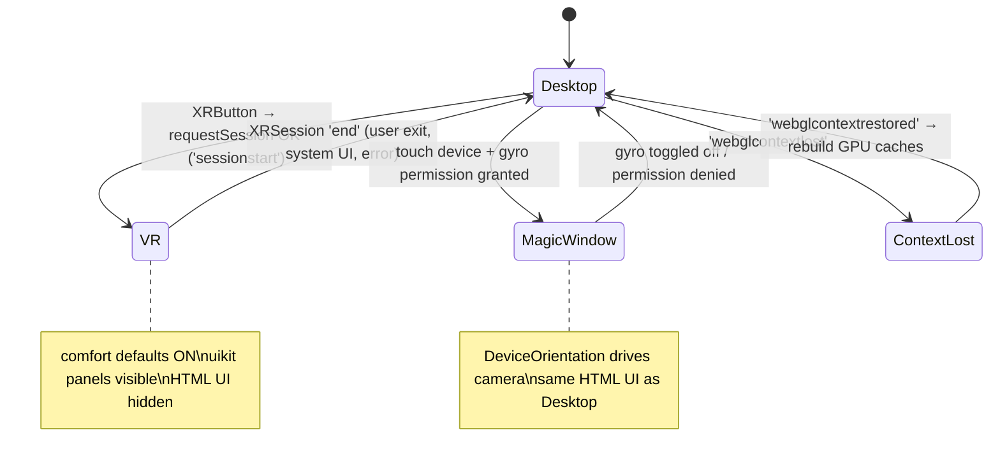
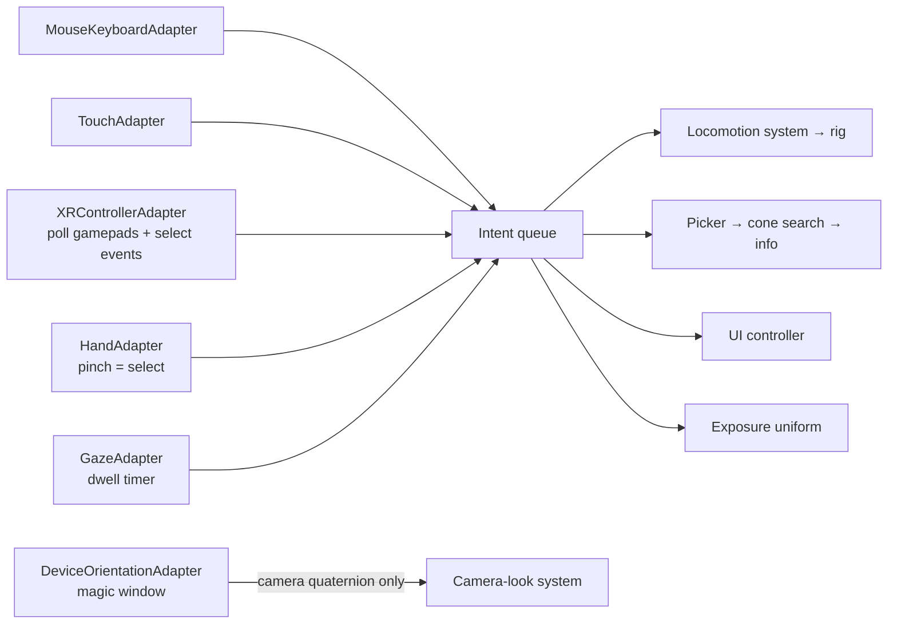

# 05 — Desktop-First, VR-Ready: Renderer, Input, UX, Lifecycle

```yaml
doc: 05-webxr-vr
status: blueprint (no code exists yet — this doc specifies what to build)
audience: implementing AI/engineer with NO other context beyond this docs/ folder
depends_on:
  - docs/research/threejs-webxr.md     (versions, XR wiring, emulator, magic window)
  - docs/research/performance-quest.md (frame budgets, foveation, FFR caveats)
  - docs/04-star-catalog-pipeline.md   (camera-relative rendering contract, exposure intent)
hard_constraints: |
  - The developer has NO VR headset. Everything must be developed and CI-tested on
    desktop via the Immersive Web Emulator / IWER. VR is an ADDITIVE mode.
  - iOS Safari has NO WebXR (verified 2026) — phones get a DeviceOrientation
    "magic window", never a broken Enter-VR button.
  - Anything marked "VERIFY:" must be checked at implementation time; a fallback is given.
```

---

## 1. Principles

1. **Desktop-first**: mouse + keyboard + HTML UI is the primary, always-working experience.
   XR is an enhancement entered through one button; exiting XR must restore desktop state
   perfectly.
2. **One scene, one state, many inputs**: every input device produces the same small set of
   *app intents* (§5). No system below the input layer knows whether a command came from a
   mouse, a Quest controller, a pinching hand, or a gaze dwell.
3. **One render loop**: `renderer.setAnimationLoop` everywhere (mandatory for XR — it switches
   between window rAF and `XRSession.requestAnimationFrame` transparently). Never call
   `requestAnimationFrame` directly.
4. **Comfort is default-on** in VR (vignette + snap turn + constant-velocity flight); users
   opt *out*, never opt in.

## 2. Stack & pinned versions (verified on npm 2026-06-11)

| Package | Version | Notes |
|---|---|---|
| `three` | **0.184.0** (r184) | Pin EXACTLY (no `^`); no semver — upgrade one release at a time against https://github.com/mrdoob/three.js/wiki/Migration-Guide |
| `@types/three` | 0.184.1 | Keep in lockstep with `three` |
| `vite` | 8.0.16 | `npm create vite@latest vr-astro -- --template vanilla-ts` |
| `typescript` | 6.0.3 | |
| `@pmndrs/uikit` | 1.0.73 | VR in-scene UI (vanilla Three.js API) — §6 |
| `iwer` | 2.2.1 | scripted/CI WebXR emulation — §8 |
| `@vitejs/plugin-basic-ssl` | 2.3.0 | LAN/phone HTTPS testing only (localhost needs no cert) |

**Renderer decision: `THREE.WebGLRenderer`.** Rationale (research-verified):
native-WebGPU-backend XR is closed against the *unreleased* r185 milestone
(https://github.com/mrdoob/three.js/issues/28968), and the WebGL-backend `WebGPURenderer`
path has an open multiview right-eye projection bug
(https://github.com/mrdoob/three.js/issues/32538). Wrap construction in a `createRenderer()`
factory so a later swap is one file. **Do not enable multiview anywhere** until #32538 is
verified fixed.

## 3. Renderer + XR session setup (`src/xr/`)

```ts
// src/xr/renderer.ts
import * as THREE from 'three';
import { XRButton } from 'three/addons/webxr/XRButton.js';

export function createRenderer(canvasParent: HTMLElement): THREE.WebGLRenderer {
  const renderer = new THREE.WebGLRenderer({
    antialias: true,
    powerPreference: 'high-performance',
    // NO logarithmicDepthBuffer — see doc 04 §B1 (stars render depth-free)
  });
  renderer.setPixelRatio(Math.min(window.devicePixelRatio, 2)); // desktop cap; ignored in XR
  renderer.setSize(window.innerWidth, window.innerHeight);
  renderer.xr.enabled = true;
  // 'local-floor' = standing/room scale (three.js default). For this seated/standing
  // planetarium either works; set explicitly and BEFORE any session starts:
  renderer.xr.setReferenceSpaceType('local-floor');
  // Foveation: three.js DEFAULTS TO 1.0 (max) — VERIFY in r184 WebXRManager source.
  // High foveation visibly dims/shimmers peripheral point stars (high-contrast content
  // is FFR's worst case). Start low:
  renderer.xr.setFoveation(0.3);
  // Set BEFORE session start only; cannot change mid-session:
  renderer.xr.setFramebufferScaleFactor(1.0); // drop to 0.9 if profiling says GPU-bound
  canvasParent.appendChild(renderer.domElement);
  return renderer;
}

export function mountXRButton(renderer: THREE.WebGLRenderer, parent: HTMLElement): void {
  // XRButton picks immersive-ar if supported, else immersive-vr → forward-compatible.
  // It renders "VR NOT SUPPORTED" automatically when navigator.xr is absent/unsupported.
  const btn = XRButton.createButton(renderer, {
    optionalFeatures: ['hand-tracking', 'layers'],
    // VERIFY: exact sessionInit options shape accepted by XRButton.createButton in r184 —
    // read examples/jsm/webxr/XRButton.js when scaffolding. Fallback: call
    // navigator.xr.requestSession('immersive-vr', sessionInit) manually and hand the
    // session to renderer.xr.setSession(session).
  });
  parent.appendChild(btn);
}
```

```ts
// src/xr/session.ts — session tuning + the single animation loop
export function startLoop(renderer: THREE.WebGLRenderer, frame: FrameFn): void {
  renderer.setAnimationLoop((timeMs: number, xrFrame?: XRFrame) => {
    // xrFrame is defined only while presenting. ZERO allocations in here (perf doc).
    frame(timeMs, xrFrame);
  });
}

renderer.xr.addEventListener('sessionstart', async () => {
  const session = renderer.xr.getSession()!;
  // Frame-rate tuning (Quest Browser ≥16.4; defaults: 90 Hz on Quest 2/3):
  // Our sky app is a slow-camera experience — 72 Hz on Quest-2-class buys 2.6 ms/frame.
  const rates = (session as any).supportedFrameRates as Float32Array | undefined;
  if (rates && (session as any).updateTargetFrameRate) {
    const target = pickFrameRate(rates); // 72 on Quest-2-class, else 90; never promise 120
    try { await (session as any).updateTargetFrameRate(target); } catch { /* keep default */ }
  }
  appState.set({ mode: 'vr' });   // input/UI systems react (§5, §6)
});

renderer.xr.addEventListener('sessionend', () => {
  appState.set({ mode: 'desktop' });  // §10 restores camera, controls, HTML UI, canvas size
});
```

### 3.1 Camera rig (required by the locomotion + precision design)

```ts
// Never move the XR camera directly — the headset pose overwrites camera-local transform
// every frame. All locomotion moves the RIG; the renderer camera stays at rig-local pose.
const rig = new THREE.Group();      // yaw/snap-turn + position happens here
rig.add(camera);
scene.add(rig);
```

Precision contract with doc 04 §B5: the **authoritative world camera position is float64 in
JS** (`cameraPosF64 = rigPosF64 + headLocalPos`, head-local offsets are metres-scale so f32 is
fine for that term). Rendering uses chunk offsets computed in f64; `rig.position` itself holds
only a *small* render-local value — when the f64 position grows beyond ~1e4 pc from the last
rebase, rebase the render origin (move all per-chunk offsets, not the vertices).

## 4. App modes — state machine



## 5. Input abstraction (`src/input/`)

### 5.1 App intents — the single vocabulary

```ts
// src/input/intents.ts
export type AppIntent =
  | { type: 'look';        deltaYaw: number; deltaPitch: number }    // radians (desktop/touch only; XR look = head)
  | { type: 'fly';         dir: THREE.Vector3; throttle: number }    // dir normalized, rig-local; throttle 0..1
  | { type: 'setFlySpeed'; multiplier: number }                      // log-scale speed wheel
  | { type: 'select';      ray: THREE.Ray }                          // world-space pick ray
  | { type: 'openPanel';   panel: 'search' | 'info' | 'layers' | 'settings' | null } // null = close
  | { type: 'setExposure'; stops: number }                           // [-4, +4] → doc 04 §B6.1
  | { type: 'snapTurn';    direction: -1 | 1 }
  | { type: 'recenter';    };                                        // reset view to origin/selected

export interface IntentSink { dispatch(i: AppIntent): void }
```

Systems consuming intents: locomotion (fly/snapTurn/recenter/setFlySpeed), camera-look
(look), picker (select → cone-search → info panel, per the object-info doc), UI controller
(openPanel), star renderer (setExposure).

### 5.2 The ray abstraction (shared picker)

```ts
// Implemented by MousePointer, TouchPointer, XRControllerPointer, GazePointer.
export interface PointerLike {
  /** Writes the current pointing ray (world space). Returns false if unavailable this frame. */
  getRay(out: THREE.Ray): boolean;
  /** Hover ray may differ from select ray only for GazePointer (dwell). */
}
```

One shared `THREE.Raycaster` + `Points.threshold` picker consumes whichever `PointerLike` is
active. **Throttle hover raycasts to ≤ 15 Hz and reuse a preallocated hit array**
(`Raycaster.intersectObjects` allocates — GC tenuring in XR frame loops causes hitches,
verified in research). Network lookups (SIMBAD cone search etc.) are debounced and run fully
outside the frame loop.

### 5.3 Mapping tables (normative)

**Desktop (mouse + keyboard):**

| Input | Intent |
|---|---|
| Left-drag | `look` (pointer-drag yaw/pitch; sky-viewer style, not orbit) |
| Click (< 5 px move, < 300 ms) | `select` with mouse NDC ray |
| `W A S D` | `fly` dir (forward/strafe), throttle 1 |
| `R / F` | fly up / down (world-up = three +Y) |
| `Shift` (held) | throttle boost ×10 |
| Mouse wheel | `setFlySpeed` (log scale: each notch ×1.3) |
| `+ / -` | `setExposure` ±0.25 stops |
| `/` | `openPanel: search` (focus the HTML search box) |
| `I` | `openPanel: info` |
| `L` | `openPanel: layers` |
| `Esc` | `openPanel: null` |
| `Home` | `recenter` |

**Touch (phones/tablets, also magic-window mode):**

| Input | Intent |
|---|---|
| 1-finger drag | `look` (when gyro is ON, drag applies an additional yaw offset) |
| Tap | `select` |
| 2-finger pinch | camera FOV zoom 25°–90° (sky-viewer zoom; not an AppIntent — camera-local) |
| 2-finger drag up/down | `fly` forward/back at low throttle |
| HTML buttons | `openPanel`, `setExposure` slider, `recenter` |

**XR controllers (`xr-standard` gamepad mapping; verify per-profile at runtime):**

| Input | Intent |
|---|---|
| Head pose | look (free — never synthesize `look` intents in XR) |
| Right thumbstick X (past 0.6, edge-triggered) | `snapTurn` ±1 |
| Left thumbstick X/Y | `fly` (rig-local strafe/forward), throttle = stick magnitude |
| Right thumbstick Y | fly up/down (comfort: disabled by default, toggle in settings) |
| Trigger (`selectstart`/`selectend` on either controller Group) | `select` with that controller's target ray |
| Squeeze (held) + left stick Y | `setFlySpeed` |
| `A`/`X` button (buttons[4]) | `openPanel: info` on hovered object |
| `B`/`Y` button (buttons[5]) | toggle `openPanel: settings` (wrist/HUD panel) |
| Long-press B/Y (> 1 s) | `recenter` |

Buttons/axes indices follow the WebXR `xr-standard` layout (`buttons[0]` trigger, `[1]`
squeeze, `[3]` stick click, `[4]`/`[5]` A-B/X-Y; `axes[2]/[3]` thumbstick). VERIFY against the
actual `@webxr-input-profiles` profile JSON for Quest Touch at implementation time; read
`inputSource.gamepad` in the frame loop (poll — gamepad state has no events).

**Hands (`hand-tracking` optional feature):**

| Input | Intent |
|---|---|
| Pinch (index+thumb) | `select` — three.js fires the same `selectstart/selectend` on the hand input source's controller Group; NO special code path |
| Pinch on uikit UI elements | UI interaction (uikit handles its own raycast) |
| Locomotion | none in v1 — hands users fly via UI buttons ("fly to" on the info panel) and recenter. Two-hand "grab space" drag is a v2 experiment |

**Gaze (3-DoF viewers, Vision Pro transient-pointer):**

| Input | Intent |
|---|---|
| `targetRayMode === 'gaze'` input source select | `select` (same controller-Group events) |
| Dwell ≥ 1,200 ms on a hoverable (reticle fills) | `select` — only enabled when no hand/controller input source exists |

Key implementation fact (research-verified): three.js maps **all** WebXR `select*` events onto
`renderer.xr.getController(i)` Groups regardless of `targetRayMode` — trigger, pinch, gaze,
and Vision Pro pinch all arrive through one code path. The dwell timer is the only extra.

### 5.4 Controller/hand models

```ts
import { XRControllerModelFactory } from 'three/addons/webxr/XRControllerModelFactory.js';
import { XRHandModelFactory } from 'three/addons/webxr/XRHandModelFactory.js';

const cmf = new XRControllerModelFactory();   // ignores hand input sources by design
const hmf = new XRHandModelFactory();
for (const i of [0, 1]) {
  const grip = renderer.xr.getControllerGrip(i);
  grip.add(cmf.createControllerModel(grip));
  scene.add(grip);
  const hand = renderer.xr.getHand(i);
  hand.add(hmf.createHandModel(hand, 'mesh'));
  scene.add(hand);
  const ray = renderer.xr.getController(i);    // target-ray space; select events land here
  ray.addEventListener('selectstart', onSelectStart);
  ray.addEventListener('selectend', onSelectEnd);
  scene.add(ray);
}
```

**Self-host the profile assets**: `XRControllerModelFactory` defaults to fetching GLTFs from
`https://cdn.jsdelivr.net/npm/@webxr-input-profiles/assets@1.0/dist/profiles` — copy that
folder into `public/webxr-profiles/` at build time and point the factory at it (VERIFY: the
setter is `.setPath()` — confirm method name in the r184 source; fallback: pass the path as a
constructor/loader option per source).



## 6. UI strategy

**Decision (research-verified):** HTML/CSS overlay on desktop + mobile; **`@pmndrs/uikit`
(vanilla API) in-scene panels in VR**. Justification:

- `three-mesh-ui` is dormant — last release v6.5.4 on **2023-03-24**; do not adopt.
- `@pmndrs/uikit` v1.0.73 (2026-05-27, ~weekly releases) has a first-class vanilla Three.js
  API (https://pmndrs.github.io/uikit/docs/getting-started/vanilla) and powers Meta IWSDK's
  spatial UI — the strongest maintenance signal available.
- WebXR **DOM Overlay is handheld-AR-only** (Chrome on Android) — it is NOT an option for
  VR-headset UI; never plan around it.
- Hand-rolled quads were rejected: search results lists, sliders and text layout in VR are
  exactly the flexbox/text problems uikit already solves.

```ts
// src/ui/vrPanel.ts — uikit integration requirements (from its vanilla docs)
import { reversePainterSortStable, Container, Text } from '@pmndrs/uikit';

renderer.localClippingEnabled = true;
renderer.setTransparentSort(reversePainterSortStable);

const panelRoot = new Container({
  flexDirection: 'column', padding: 16, borderRadius: 16,
  backgroundColor: '#101020', backgroundOpacity: 0.85,
});
rig.add(panelRoot);                       // lazy-follow placement below
// In the frame loop (only on the root): panelRoot.update(deltaSeconds);
```

Rules:
- **One state store drives both UIs** (a tiny observable store, e.g. hand-rolled or zustand
  vanilla): selected object, open panel, exposure stops, layer list. The HTML overlay and the
  uikit panel are two *views* of the same store — they cannot drift, and `setExposure` from
  either lands in the same uniform (doc 04 §B6.1).
- Panel placement in VR: 1.2 m from the head, 15° below the horizon, **lazy-follow** (re-orient
  toward the user only when the panel leaves a 30° comfort cone, animated over 0.5 s). Attach
  to the rig, not the camera (camera-locked UI causes nausea).
- HTML overlay is hidden (`display:none`) while presenting; uikit panels are removed from the
  scene outside VR. Both react to the `mode` field of the store (§4).
- VR text input (search): v1 sidesteps a VR keyboard — the search panel in VR shows a curated
  "tour" list (planets later, named stars from `names.json`, Messier list). Free-text search
  remains a desktop/mobile feature. VERIFY: revisit if uikit ships a maintained keyboard
  component.
- Render order: uikit panels render after stars; uikit manages its own transparency sorting
  (hence `reversePainterSortStable`).
- VERIFY: uikit under `WebGPURenderer` is untested (its setup uses WebGL-ish hooks) —
  irrelevant while we ship WebGLRenderer; recheck on any renderer migration.

## 7. Comfort (VR)

Defaults: **comfort ON**. Settings panel exposes: vignette on/off, snap-turn angle
(30°/45°/smooth), smooth-turn speed, stick-Y vertical flight on/off.

1. **Vignette during flight** — a camera-attached, screen-covering quad (rendered last,
   `depthTest:false`, normal alpha blending) whose shader darkens the periphery; strength
   eases in over 150 ms whenever `|fly throttle| > 0` or any turn is active, eases out over
   300 ms:

```glsl
// vignette fragment shader (quad in camera space at z = -0.5, scaled to cover FOV per eye)
varying vec2 vUv;                  // -1..1
uniform float uStrength;           // 0..1
void main() {
  float r = length(vUv);
  // At full strength the clear aperture is ~55% of the view; edges fade smoothly:
  float inner = mix(1.5, 0.55, uStrength);
  float outer = mix(1.9, 0.85, uStrength);
  float a = smoothstep(inner, outer, r);
  gl_FragColor = vec4(0.0, 0.0, 0.0, a);
}
```

   (FFR caveat from the perf research: we render direct to the XR framebuffer — the vignette
   is a scene quad, NOT a post-process pass, precisely so FFR keeps working.)

2. **Snap turn** — default ON, 30°. Edge-triggered on right-stick X crossing ±0.6 with reset
   below ±0.3 (§5.3). The turn is **instantaneous** (a 60 ms black fade-blink is an optional
   setting; never animate the rotation). Smooth turn (90°/s, vignette forced on) is opt-in.

3. **No acceleration without comfort-off** — default locomotion is **constant-velocity**: the
   stick maps to velocity directly (with a 100 ms low-pass to kill stick jitter, not an
   acceleration curve). Speed changes happen through the discrete `setFlySpeed` wheel, between
   flights. With "comfort mode off", an eased acceleration profile (0.5 s ramp) is allowed.
   Speed is auto-scaled by context: `speedBase = clamp(distanceToNearestLoadedStar, 0.05 pc,
   500 pc) / 2 s` so flight always feels purposeful without comfort-destroying warp speeds.

4. **No roll, no pitch locomotion** in VR: flight direction uses head yaw + stick, vertical
   motion only via the (default-off) stick-Y option. The horizonless star field tolerates
   pitch better than most scenes, but locked roll is non-negotiable.

5. **Frame-rate floor**: the comfort system listens to the frame-time governor (perf doc):
   sustained > budget → first drop `framebufferScaleFactor` to 0.9 on next session start,
   then reduce star budgets (doc 04 §B7) — never let VR judder.

## 8. Headset-free testing (mandatory dev loop — no headset exists on this team)

### 8.1 Immersive Web Emulator (interactive)

1. Install the extension: Chrome Web Store ID `cgffilbpcibhmcfbgggfhfolhkfbhmik`
   ("Immersive Web Emulator", by Meta; repo
   https://github.com/meta-quest/immersive-web-emulator).
2. `npm run dev` → open `http://localhost:5173`. **localhost is a secure context — no
   certificates needed** for emulator testing.
3. Open DevTools → **"WebXR" tab**. Select an emulated device (Quest 3). The page's
   `navigator.xr` now reports `immersive-vr` supported (reload the tab after install).
4. Click the app's "ENTER VR" button (XRButton).
5. Use the panel's 3D viewport to move/rotate the emulated headset and both Touch
   controllers; trigger/grip/joystick widgets + keyboard shortcuts emulate inputs.
6. Verify per session: stereo render (two viewports), controller rays + select picks,
   snap turn, uikit panel interaction, clean exit (§10).
   VERIFY: hand-tracking emulation in the current store build (historically absent) — use
   IWER synthetic input sources for hand-path testing if missing.

### 8.2 IWER (scripted/CI)

```ts
// test/xr-harness.ts — runs in Playwright/Vitest browser mode; injects a fake navigator.xr
import { XRDevice, metaQuest3 } from 'iwer';
const device = new XRDevice(metaQuest3);
device.installRuntime();
// device exposes scripted head/controller poses + input events for assertions.
// VERIFY: exact iwer@2.2.1 API names against https://github.com/meta-quest/immersive-web-emulation-runtime
```

CI smoke suite (must stay green): enter `immersive-vr` → render 100 frames → assert
`renderer.info.render.calls` within budget table (doc 04 §B7) → synthetic `selectstart` on a
star → assert pick event → end session → assert desktop restore (§10 checklist).

### 8.3 Real devices later

- Quest over USB: `adb reverse tcp:5173 tcp:5173` → open `http://localhost:5173` *on the
  Quest* (secure context, zero certs); desktop `chrome://inspect` for DevTools.
- Phones on LAN: `vite --host` + `@vitejs/plugin-basic-ssl` (accept the warning), or a
  `cloudflared`/`ngrok` tunnel for a real HTTPS URL (required for iOS gyro permission, §9).

## 9. Phone "magic window" mode

iOS Safari has **no WebXR** in 2026 (immersive-vr exists only in visionOS Safari). The
universal phone fallback is gyro look-around via `deviceorientation`.

### 9.1 Permission flow (iOS 13+ rules, unchanged through 2026)

`DeviceOrientationEvent.requestPermission()` exists on iOS, **must be called from a user
gesture**, page must be **HTTPS** (or localhost). Never call it on page load.

```ts
// Show this only on touch devices, as a visible "👀 Look around with your phone" button.
async function enableGyroLook(): Promise<boolean> {
  const D = DeviceOrientationEvent as any;
  if (typeof D?.requestPermission === 'function') {          // iOS 13+
    try {
      if ((await D.requestPermission()) !== 'granted') return false;
    } catch { return false; }                                 // thrown if not in a gesture
  }
  // Android Chrome: no prompt needed (subject to Permissions-Policy).
  window.addEventListener('deviceorientation', orientationAdapter.onEvent);
  appState.set({ mode: 'magic-window' });
  return true;
}
// On false: stay in Desktop mode (drag-look). Show a one-line toast, never a modal error.
```

VERIFY: whether iOS remembers the grant across sessions (per-site behavior on current iOS) —
assume NOT remembered; keep the button visible whenever mode ≠ magic-window.

### 9.2 Vendored orientation controller

three.js **removed `DeviceOrientationControls`** from its examples (~r134 — VERIFY exact
release in the Migration Guide; irrelevant to the fix). Vendor the standard quaternion mapper
(algorithm of the removed control, reimplemented):

```ts
// src/input/deviceOrientation.ts — alpha/beta/gamma + screen orientation → camera quaternion
const zee = new THREE.Vector3(0, 0, 1);
const euler = new THREE.Euler();
const q0 = new THREE.Quaternion();
const q1 = new THREE.Quaternion(-Math.sqrt(0.5), 0, 0, Math.sqrt(0.5)); // -PI/2 about X

export function setQuaternionFromOrientation(
  out: THREE.Quaternion,
  alphaDeg: number, betaDeg: number, gammaDeg: number, screenOrientDeg: number,
): void {
  const alpha = THREE.MathUtils.degToRad(alphaDeg);
  const beta = THREE.MathUtils.degToRad(betaDeg);
  const gamma = THREE.MathUtils.degToRad(gammaDeg);
  const orient = THREE.MathUtils.degToRad(screenOrientDeg);
  euler.set(beta, alpha, -gamma, 'YXZ');       // device frame
  out.setFromEuler(euler);
  out.multiply(q1);                             // look out the back of the device
  out.multiply(q0.setFromAxisAngle(zee, -orient)); // compensate screen rotation
}
```

Plus a drag-offset yaw so users can combine gyro + one-finger drag (§5.3 touch table).

### 9.3 Sky alignment (point phone at the sky)

True-north anchoring needs `deviceorientationabsolute` (Android) or `webkitCompassHeading`
(iOS). VERIFY: both flagged in research as needing on-device testing (compass noise, iOS
permission persistence). **v1 ships relative orientation + a manual "align" affordance** (drag
to match a recognizable star/horizon), with compass-true alignment as a flagged enhancement.

## 10. Session lifecycle edge cases

### 10.1 Entering/exiting XR (the restore contract)

```ts
let savedDesktopState: {
  rigPos: THREE.Vector3; rigQuat: THREE.Quaternion;
  camQuat: THREE.Quaternion; fov: number;
} | null = null;

renderer.xr.addEventListener('sessionstart', () => {
  savedDesktopState = captureDesktopPose();
  desktopControls.enabled = false;
  htmlOverlay.hidden = true;
  vrUI.attach();                       // uikit panels into the scene
  comfort.applyDefaults();             // vignette+snap ON unless user changed settings
});

renderer.xr.addEventListener('sessionend', () => {
  // Fires for ALL exit paths: app button, Quest system UI, browser kill, errors.
  // NEVER key restore logic off our own "Exit VR" button.
  vrUI.detach();
  htmlOverlay.hidden = false;
  desktopControls.enabled = true;
  if (savedDesktopState) restoreDesktopPose(savedDesktopState);
  renderer.setSize(window.innerWidth, window.innerHeight); // XR resized the drawing buffer
  renderer.setPixelRatio(Math.min(window.devicePixelRatio, 2));
  camera.aspect = window.innerWidth / window.innerHeight;
  camera.updateProjectionMatrix();
});
```

Also: `navigator.xr?.addEventListener('devicechange', refreshXRButtonVisibility)` (headset
plugged/unplugged on desktop).

### 10.2 Page visibility

```ts
document.addEventListener('visibilitychange', () => {
  if (document.hidden) {
    chunkFetcher.pause();              // don't burn data in background
    networkLookups.cancelInflight();   // SIMBAD/TAP debounce reset
    clock.stop();                      // so dt doesn't explode on resume
  } else {
    clock.start();
    chunkFetcher.resume();
  }
});
```

- rAF auto-stops when the tab is hidden — do not also tear down the loop.
- Clamp `dt` to ≤ 100 ms in the frame fn regardless (sleep/wake, debugger pauses).
- **XRSession visibility is separate**: listen on `session.addEventListener
  ('visibilitychange', ...)` for `visible | visible-blurred | hidden`. On `visible-blurred`
  (Quest system overlay open): keep rendering, suppress input intents (sticks may report
  stale values), pause dwell timers. On `hidden`: stop locomotion entirely.

### 10.3 WebGL context loss

```ts
renderer.domElement.addEventListener('webglcontextlost', (e) => {
  e.preventDefault();                  // REQUIRED to allow restoration
  appState.set({ contextLost: true }); // show a "re-initializing" overlay; loop keeps idling
});
renderer.domElement.addEventListener('webglcontextrestored', () => {
  // three.js recompiles its own programs and re-uploads geometries/textures whose CPU-side
  // arrays still exist. Our responsibilities:
  tilePool.rebuild();      // raw-GL TEXTURE_2D_ARRAY (HiPS doc) is gone — reallocate, refill
                           // from the decoded-tile CPU cache / service worker
  starChunks.reuploadAll();// geometries rebuilt from the retained ArrayBuffer LRU (doc 04 §B2)
  appState.set({ contextLost: false });
});
```

Rules that make this work:
- **Never null out chunk ArrayBuffers or set `BufferAttribute.array = undefined`** to "save
  memory" — they are the context-restore source (and the LRU already bounds them).
- Dev-test with `WEBGL_lose_context`:
  `renderer.getContext().getExtension('WEBGL_lose_context')!.loseContext()` then
  `.restoreContext()` — this is an acceptance test (§11).
- An XR session typically dies with the context; the `sessionend` path (§10.1) runs too —
  both handlers must be idempotent.

### 10.4 Resize / orientation

```ts
window.addEventListener('resize', () => {
  if (renderer.xr.isPresenting) return;   // XR manages its own framebuffer
  renderer.setSize(window.innerWidth, window.innerHeight);
  camera.aspect = window.innerWidth / window.innerHeight;
  camera.updateProjectionMatrix();
});
// orientationchange on phones arrives as resize; the DeviceOrientation adapter reads
// screen.orientation.angle each event (§9.2) so no extra handling is needed.
```

### 10.5 Failed session requests

`XRButton` already renders "VR NOT SUPPORTED" / "VR NOT ALLOWED" states. Additionally catch
`requestSession` rejections (permission policy, user dismissal) → toast, stay in Desktop mode,
log to console with the error name. Never gate app startup on `navigator.xr` existing.

## 11. Acceptance criteria (Definition of Done)

1. **Desktop-only correctness**: app fully usable (look, fly, select, panels, exposure) with
   no `navigator.xr` present (Firefox without extension, Safari).
2. **Emulator round-trip**: with Immersive Web Emulator, enter VR → all §5.3 controller
   intents function → exit VR → desktop pose, controls, canvas size, and HTML UI restored
   exactly (automated checklist via IWER in CI; 10 consecutive enter/exit cycles leak nothing:
   `renderer.info.memory` stable ±0).
3. **Input parity**: every intent in §5.1 reachable from desktop, touch, XR controllers, and
   (select/UI at minimum) hands + gaze, per the §5.3 tables.
4. **Comfort defaults**: first VR entry has vignette + snap turn active with no configuration;
   smooth turn requires an explicit settings change that persists (localStorage).
5. **iOS magic window**: on an iPhone over HTTPS, the gyro button prompts only on tap;
   "deny" leaves drag-look working; "allow" gives stable horizon-correct look-around in both
   portrait and landscape.
6. **Lifecycle**: simulated context loss (`WEBGL_lose_context`) restores the full scene (sky
   tiles + stars + UI) within 3 s with no page reload; backgrounding the tab for 60 s and
   returning causes no time-jump teleport (dt clamp) and resumes fetches.
7. **No frame-loop allocations** added by input/UI systems (allocation timeline flat while
   moving sticks + hovering UI).
8. **Budgets**: in emulated VR, `renderer.info.render.calls` ≤ the doc 04 §B7 table values
   for the Quest 2 column (the emulator can't measure GPU time, but call counts are
   enforceable on desktop).

## 12. Open questions / VERIFY ledger

| # | Item | Plan |
|---|---|---|
| 1 | r185 (~June/July 2026): native WebGPU XR + Quest Browser WebXR-WebGPU binding | Re-evaluate renderer factory after release; until then WebGLRenderer |
| 2 | Multiview bug three.js #32538 (+ AA flicker #32151) | Track; multiview stays OFF |
| 3 | three.js r184 default foveation = 1.0? | Read WebXRManager source; we set 0.3 explicitly either way |
| 4 | `XRButton.createButton` sessionInit options shape in r184 | Read addon source at scaffold time; manual `requestSession` fallback documented in §3 |
| 5 | `XRControllerModelFactory` custom asset path API (`setPath()`?) | Read source; self-hosting the profiles folder is required regardless |
| 6 | Quest 2/3/3S `supportedFrameRates` + whether `updateTargetFrameRate(72)` works on Quest 3 browser | Feature-detected at runtime (§3); harmless if rejected |
| 7 | Hand-tracking emulation in current IWE store build / iwer 2.2.x | Use IWER synthetic input sources as fallback for hand tests |
| 8 | iOS `webkitCompassHeading` / `deviceorientationabsolute` for true-north sky alignment + permission persistence | v1 ships relative orientation + manual align (§9.3); on-device test later |
| 9 | Vision Pro transient-pointer → three.js select events | Community reports when visionOS becomes a priority; gaze path (§5.3) is the design |
| 10 | uikit vanilla API under WebGPURenderer | Recheck on renderer migration only |
| 11 | Quest Browser cert handling for LAN HTTPS (basicSsl vs mkcert) | Prefer `adb reverse` (no certs) once a device exists |
