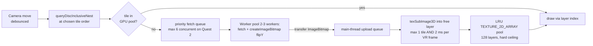

# 06 — Performance Engineering

> Part of the VR Astronomy App blueprint. Companion docs: `07-pitfalls.md` (failure modes),
> `08-testing.md` (perf regression tests). Source research: `docs/research/performance-quest.md`,
> `docs/research/star-rendering.md`, `docs/research/threejs-webxr.md`, `docs/research/hips-format.md`.
>
> Everything tagged **VERIFY:** is an estimate or an unconfirmed platform behavior that must be
> measured before being treated as fact. Everything else is sourced from verified vendor docs or
> live probes (2026-06-11).

---

## 1. Targets and frame budgets

| Platform | Refresh target | Frame budget | Notes |
|---|---|---|---|
| Quest 2 (VR) | **72 Hz (requested)** | **13.7 ms** | Browser defaults to 90 Hz; request 72 via `session.updateTargetFrameRate(72)` to convert 11.1 ms into 13.7 ms. Slow-camera sky app — legitimate per Meta guidance. **VERIFY:** that 72 is in `session.supportedFrameRates` on current Quest Browser (forum reports circa 2023 said the browser forced 90). Fallback: design to 11.1 ms. |
| Quest 3 / 3S (VR) | 90 Hz | **11.1 ms** | XR2 Gen 2 ≈ 2× Quest 2 GPU. 120 Hz is opportunistic only (system toggle gated). |
| Desktop | 60–144 Hz | **16.6 ms** @60 | Discrete GPUs have huge headroom; integrated GPUs (Intel Iris class) should be treated as "Quest 3-ish". |
| Mobile 2D (magic window) | 60 Hz | 16.6 ms | iOS Safari has no WebXR; this is plain 3D canvas. |

Frame-rate control API (Quest Browser ≥ 16.4 — verified Meta docs,
https://developers.meta.com/horizon/documentation/web/webxr-frames/):

```ts
renderer.xr.addEventListener('sessionstart', async () => {
  const session = renderer.xr.getSession()!;
  const rates = session.supportedFrameRates;          // e.g. Float32Array [72, 80, 90, 120]
  if (isQuest2Class() && rates?.includes(72)) await session.updateTargetFrameRate(72);
});
```

CPU rule of thumb (Meta, verified): any single piece of app logic taking **> 2 ms should be
considered for optimization**. ~1000 individual draw calls will likely drop a Quest below 72 fps
from CPU submission cost alone.

**Tune for Quest 2 as the worst case.** Quest 3/3S share a GPU ≈ 2× faster; desktop is 10×+.

---

## 2. The budget table

Per-platform hard budgets. Dev builds must assert against these every frame (see §4.1).
All rows are derived from verified ceilings (Meta docs, WebGL limits) but the composite
numbers are **engineering estimates — VERIFY on real hardware in the first device-test pass**.

| Budget item | Quest 2 (VR, 72 Hz) | Quest 3/3S (VR, 90 Hz) | Desktop (60 Hz) | Mobile 2D |
|---|---|---|---|---|
| Frame budget | 13.7 ms | 11.1 ms | 16.6 ms | 16.6 ms |
| JS (script) time/frame | ≤ 4 ms | ≤ 4 ms | ≤ 6 ms | ≤ 6 ms |
| — of which app systems (tile mgmt, LOD, picking) | ≤ 2 ms | ≤ 2 ms | ≤ 3 ms | ≤ 3 ms |
| GPU time/frame | ≤ 9 ms | ≤ 8 ms | n/a (vsync) | n/a |
| Draw calls total | ≤ 80 | ≤ 150 | ≤ 300 | ≤ 100 |
| — sky tile mosaic | ≤ 4 (texture array, merged geometry) | ≤ 4 | ≤ 8 | ≤ 4 |
| — star point chunks | ≤ 48 | ≤ 64 | ≤ 128 | ≤ 32 |
| — UI / labels / misc | ≤ 20 | ≤ 30 | ≤ 50 | ≤ 20 |
| Triangles | ≤ 300 k | ≤ 750 k | ≤ 2 M | ≤ 300 k |
| Points rendered (post-cull) | ≤ 300 k | ≤ 600 k | ≤ 2 M | ≤ 200 k |
| — of which additive bright-star sprites | ≤ 5 k | ≤ 10 k | ≤ 50 k | ≤ 3 k |
| Max point sprite size | 6 px | 8 px | 16 px | 8 px |
| GPU tile pool (512² RGBA8 + mips) | 128 layers ≈ 170 MiB | 192 ≈ 256 MiB | 384 ≈ 510 MiB | 96 ≈ 128 MiB |
| Decoded CPU-side tile cache (ImageBitmaps) | 64 tiles | 96 | 256 | 48 |
| Tile uploads per frame | 1 (≤ 2 ms) | 1–2 | 2–4 | 1 |
| Concurrent tile fetches | 6 | 8 | 12 | 4 |
| Total GPU texture memory (everything) | ≤ 350 MiB (**VERIFY:** undocumented ceiling, needs on-device stress test) | ≤ 512 MiB | ≤ 1 GiB | ≤ 256 MiB |
| JS heap, steady state (**VERIFY:** estimate) | ≤ 256 MiB | ≤ 384 MiB | ≤ 1 GiB | ≤ 192 MiB |
| Steady-state allocations per frame | **0** | **0** | **0** | **0** |
| `framebufferScaleFactor` | 0.9 (0.8 under load) | 1.0 (0.9 under load) | n/a | DPR cap 2 |
| `fixedFoveation` | 0.5 sky / 0.3 star field | 0.4 / 0.2 | n/a | n/a |

Memory arithmetic backing the tile-pool rows: one 512×512 RGBA8 tile = 1.0 MiB, ×1.33 with
mips ≈ 1.33 MiB. 64 tiles ≈ 85 MiB, 128 ≈ 170 MiB, 256 ≈ 340 MiB, 512 ≈ 680 MiB.

---

## 3. Strategies per subsystem

### 3.1 HiPS tile pipeline (fetch → decode → upload → draw)



Rules (all justified in `research/performance-quest.md` §4–6):

1. **One WebGL2 `TEXTURE_2D_ARRAY` is the GPU tile pool.** Allocate once with
   `gl.texStorage3D(gl.TEXTURE_2D_ARRAY, mipLevels, gl.SRGB8_ALPHA8, 512, 512, N)`
   (N = 128 on Quest 2). Eviction = overwrite a layer index; zero reallocation ever.
   Merged sphere-patch geometry with a per-vertex `layerIndex` attribute + `sampler2DArray`
   in a custom `ShaderMaterial` → **≤ 4 draw calls for the entire sky**. Reject per-tile
   meshes (one texture bind per tile = state-change death on Quest 2: material switch ≈ +64%
   draw-call cost, shader switch ≈ +175%) and texture atlases (mip bleeding, repacking).
2. **Decode off the main thread.** Workers run `fetch(url)` → `blob()` →
   `createImageBitmap(blob, { imageOrientation: 'flipY', premultiplyAlpha: 'none',
   colorSpaceConversion: 'none' })` and `postMessage` with transfer. This also absorbs the
   alasky `.webp`-without-Content-Type gotcha (`createImageBitmap` sniffs the bytes).
3. **Throttle uploads to a per-frame budget.** Maintain an upload queue; per XR frame upload at
   most **1 tile** and stop when `performance.now()` delta ≥ **2 ms** (desktop: 2–4 tiles).
   **VERIFY:** real `texSubImage3D` 1 MiB upload + mip cost on Adreno 650 — decides whether
   1 tile/frame is conservative or optimistic.
4. **Mips:** generate once per upload batch, not per tile. Stretch goal: build mip level 1 from
   the HiPS parent-order tile (HiPS hierarchy = free mip data). **VERIFY:** parent-derived mips
   may seam at tile borders — visual check required before adopting.
5. **Three caches, three ceilings:** GPU pool (layers, small) → decoded CPU ImageBitmap cache
   (medium) → browser HTTP cache + service worker (large, free). Never let three.js
   "garbage collect" textures — it doesn't; explicit `texture.dispose()`/layer reuse only.
6. **Bootstrap with `Norder3/Allsky.{jpg|png}`** (one request = whole sky at order 3) so the
   sphere is never black; stream real tiles over it. Never render HEALPix orders 0–2.
7. **No KTX2 for live HiPS tiles** — servers only serve JPEG/PNG/FITS and runtime Basis
   *encoding* is infeasible. **Do** pre-encode our own static assets (sprite atlases, baked
   low-order base layer, UI textures) to KTX2/ETC1S and load via three.js `KTX2Loader`
   (WASM transcoder in its WorkerPool): ~4–8× less GPU memory and faster uploads.
8. **Stretch optimization (feature-detected, Quest only):** render the tile mosaic into an
   equirect/cubemap target *only when tiles change* and hand it to an `XREquirectLayer` /
   `XRCubeLayer` so the XR compositor re-projects it for free. Meta measured **2.4 ms GPU /
   >25% total GPU-load savings** for compositor layers. Ship the in-scene textured sphere
   first; three.js does not manage secondary layers natively (custom `XRWebGLBinding` code).

### 3.2 Star field (points overdraw control)

Adreno is a tile-based GPU: additive-blended fragments pay **full overdraw** — fill rate, not
vertex count, is the wall. Cost scales ~linearly with pixels per point; a 16 px soft sprite
costs ~256× the fill of a 1 px point.

1. **Two-tier rendering.** Tier 1: the bulk (99.9 %) as `THREE.Points` at 1–2 px, trivial
   fragment shader, one draw call per chunk. Tier 2: only the brightest few thousand stars as
   additive instanced-quad sprites (`InstancedBufferGeometry`, billboard built in the vertex
   shader). Caps: 5 k sprites / 6 px on Quest 2 (see budget table).
2. **Hard `gl_PointSize` clamp**, read at startup from
   `gl.getParameter(gl.ALIASED_POINT_SIZE_RANGE)` (spec guarantees only 1.0; Apple M-series
   reports 64; **VERIFY:** Quest Browser/Adreno value, assumed ~1023). Route any size excess
   into intensity (energy conservation: ×(s/c)²) instead of pixels.
3. **No sorting, no depth:** additive blending is order-independent; `depthWrite: false`,
   `depthTest: false`, fixed `renderOrder` (sky −100 → stars 10 → opaque → UI).
4. **Chunked `Points` objects + manual frustum culling** by bounding sphere (chunk offsets
   computed in f64, camera pinned at origin). 48–64 chunk draws with the *same* shader are
   cheap (same-state redraw ≈ 25 % of a state-changing call). Keep chunks just outside the
   frustum loaded — VR head rotation is fast.
5. **Magnitude-stratified octree LOD** (Gaia Sky pattern): root holds the globally brightest
   stars, deeper nodes add fainter ones; per-chunk `uFade` 0→1 over 300–500 ms on load
   (additive fades are pop-free by construction).
6. **VR stereo:** one shared tile/star visibility query per frame (the sky is at infinity;
   per-eye divergence is negligible). **VERIFY:** `gl_PointCoord`/Points behavior if multiview
   is ever enabled — historically fragile; instanced sprites are the fallback.

### 3.3 Foveation (FFR)

- three.js **defaults `renderer.xr.setFoveation` to 1.0 (max)** — set it explicitly.
  High foveation visibly dims/shimmers peripheral stars (high-contrast content is FFR's worst
  case). Settings: **0.5 for sky-imagery scenes, 0.3 for the star field on Quest 2**
  (0.4/0.2 on Quest 3); it is per-frame adjustable, so switch with the active scene mode.
- FFR applies **only to the final XR framebuffer**: no post-processing chains
  (`EffectComposer`) and no mid-frame render-target switches in VR mode, or FFR silently stops
  working. Render directly to the XR framebuffer. (The v2 HDR star pipeline must therefore be
  desktop-first and re-validated on Quest before shipping in VR.)
- Verify FFR is actually active with `adb shell ovrgpuprofiler -t` (render-stage widths shrink).

### 3.4 Dynamic resolution & degradation policy

Mid-session vs pre-session levers differ — this matters:

| Lever | When changeable | Step |
|---|---|---|
| `renderer.xr.setFoveation(v)` | per frame | 0.3 → 0.5 → 0.7 |
| Star/sprite budget (chunks drawn, sprite cap, max point size) | per frame | −25 % per step |
| Tile uploads per frame | per frame | already 1 in VR |
| `session.updateTargetFrameRate(72)` | in session | 90 → 72 (Quest 2 default plan) |
| `XRView.requestViewportScale(view.recommendedViewportScale)` | per frame, **feature-detect** (`'requestViewportScale' in xrView`) | UA-recommended |
| `renderer.xr.setFramebufferScaleFactor(v)` | **before session start only** (three.js) | 1.0 → 0.9 → 0.8 |

Frame-time governor (build in milestone 1): keep a 120-frame ring buffer of frame deltas;
compute p95. If p95 > budget for > 2 s → apply the next mid-session lever; hysteresis: only
step back up after 10 s under 80 % of budget. Persist the steady-state choice and apply the
matching `framebufferScaleFactor` at the *next* session start. Treat `requestViewportScale` as
progressive enhancement only (**VERIFY:** Quest Browser support; ChromeStatus data stale).

Desktop equivalent: cap `setPixelRatio(Math.min(devicePixelRatio, 2))`; drop to 1.5/1.0 under
the same governor.

### 3.5 JS / GC discipline

Verified failure mode (immersive-web/webxr#1010): per-frame objects alive at rAF end get
tenured to old-space; after minutes a major GC fires and drops frames.

- **Zero allocations in the steady-state frame loop.** No `new`, spreads, `Array.map`, string
  concatenation, or arrow-closure creation inside `setAnimationLoop`. Module-scope scratch
  `Vector3`/`Matrix4`/`Quaternion`/`Ray` objects; pooled tile-request and chunk-load objects;
  reused `Float32Array` staging buffers.
- `Raycaster.intersectObjects` allocates — throttle gaze picking to ≤ 15 Hz and reuse a target
  array; all TAP/SIMBAD/hips2fits network strictly outside the frame loop, debounced.
- Pre-warm pools during the loading screen. Acceptance: Chrome DevTools allocation timeline
  shows a **flat** steady-state heap (no sawtooth) over 60 s of camera motion.

### 3.6 Draw-call hygiene

- Unique shader programs in the whole app: ≤ ~10.
- Sky = 1 merged geometry per visible HiPS order (≤ 4 calls). Stars = 1 call per resident
  chunk, same material instance across chunks (uniforms via `onBeforeRender` per chunk or
  per-chunk cloned uniforms with the same program). UI batched via `@pmndrs/uikit`'s own
  batching; labels in 1–2 instanced text/sprite draws.
- Geometry is never the bottleneck here (80 tiles × 16 quads × 2 tris ≈ 2,560 tris): this app
  is **fragment/texture-bound**; spend effort there.

---

## 4. Measurement plan

### 4.1 Always-on dev stats overlay (built in milestone 1)

A `DevHUD` (HTML on desktop, uikit panel in VR, toggled with `?debug=1`) showing per frame:

- frame time p50/p95/p99 from the ring buffer; current Hz; XR session state;
- `renderer.info.render.calls`, `.triangles`, `.points`;
  `renderer.info.memory.textures`, `.geometries`;
- tile pipeline: queue depths (fetch/decode/upload), GPU pool occupancy, evictions/s;
- star system: chunks resident/drawn, points drawn, sprites drawn;
- JS heap (`performance.memory.usedJSHeapSize`, Chrome-only).

**Budget assertion mode:** in dev builds, compare every counter against the §2 table for the
detected platform; log a one-line warning (rate-limited) on violation, and fail the automated
perf test (08-testing §6) on sustained violation. This is the cheap continuous regression guard.

### 4.2 Desktop profiling

| Tool | Use | Caveat |
|---|---|---|
| Chrome DevTools Performance + Allocation timeline | JS time, GC sawtooth, long tasks | primary daily tool |
| Spector.js | WebGL call stream, state changes, draw-call inspection | its per-command "duration" is **CPU time, not GPU time** |
| `chrome://tracing` | browser-process trace incl. texture uploads | |
| Immersive Web Emulator (Chrome Web Store id `cgffilbpcibhmcfbgggfhfolhkfbhmik`) + `iwer@2.2.1` | XR code paths without a headset | **cannot measure real XR perf** |

### 4.3 On-device (Quest) profiling — weekly pass once hardware exists

The team currently has **no headset**; emulator-only perf validation is impossible. Plan a
physical Quest 3S dev unit (worst-thermals XR2 Gen 2 device) or a device-cloud slot before the
VR milestone exit. On device:

1. **OVR Metrics Tool** HUD (via Meta Quest Developer Hub): FPS, stale frames, tears, CPU/GPU
   utilization and clock levels.
2. **`adb shell ovrgpuprofiler -t`**: render-stage trace, per-pass GPU ms; confirms FFR active.
3. **Chrome DevTools remote**: `adb forward tcp:9222 localabstract:chrome_devtools_remote`,
   then desktop `chrome://inspect` → JS profiler + tracing on the headset browser.
4. **RenderDoc for Oculus (Meta fork)**: per-draw GPU timings for the worst frame.
5. Meta's bound-classification method (see §5 step 0).

First-device-session measurement checklist (fills the **VERIFY** gaps):

- [ ] `gl.getParameter(gl.ALIASED_POINT_SIZE_RANGE)` in Quest Browser
- [ ] `session.supportedFrameRates` on Quest 2/3/3S; does `updateTargetFrameRate(72)` apply?
- [ ] Texture-memory ceiling stress test: allocate texture-array layers until context loss;
      set the LRU ceiling at ≤ 60 % of that
- [ ] Per-tile `texSubImage3D` + mip cost (ms) on device
- [ ] `XRView.requestViewportScale` presence
- [ ] Point-count ceiling: scripted scene at 100k/200k/400k/600k points → frame time curve
- [ ] FFR visual artifact check on the star field at 0.3/0.5/0.7

### 4.4 Automated perf test scene

A dedicated route (`/perf`) renders a deterministic worst-case scene from committed fixtures
(no network): order-7 sky mosaic fully populated from the fixture tile set + 300 k fixture
stars + 5 k sprites, camera flying a fixed 30 s spline (galactic plane crossing + pole + fast
180° turn). It records per-frame `performance.now()` deltas and `renderer.info` counters and
emits a JSON report. CI asserts the *deterministic* counters (draw calls, points, textures,
zero steady-state allocations); wall-clock thresholds are enforced only on known hardware
(dev machine / future device lane) — full procedure in `08-testing.md` §6.

---

## 5. Optimization escalation ladder ("we're below 72 fps — now what")

Work the ladder **in order**; re-measure after every rung; stop at the first rung that
restores budget. Never skip step 0.

**Step 0 — classify the bound (Meta method, 5 minutes):**
- Disable all rendering (early-return before `renderer.render`). Frame time unchanged →
  **CPU-bound** → branch A. Frame time collapses → GPU-bound.
- GPU-bound: set framebuffer scale to ~0.01 (or shrink canvas). Frame time collapses →
  **fragment-bound** → branch B. Barely moves → **vertex/submission-bound** → branch C.

**Branch A — CPU-bound (JS or driver submission):**
1. Check the DevHUD: draw calls > budget? Merge — sky must be ≤ 4 calls (texture array), star
   chunks must share one program; cut label/UI draws.
2. Profile JS: any system > 2 ms? Move tile-list computation and HEALPix queries to a
   debounce (camera-moved threshold), not per-frame; throttle raycast picking to 15 Hz.
3. GC sawtooth in the allocation timeline? Hunt per-frame allocations to zero (§3.5).
4. Texture uploads stealing time? Drop to 1 tile every 2 frames; verify decode is in workers.
5. Still CPU-bound on Quest only: reduce visible star chunks (coarser octree cut), then accept
   72 Hz (if not already requested).

**Branch B — fragment-bound (the expected case for this app):**
1. Raise foveation one step (0.3 → 0.5 → 0.7) — free, per-frame.
2. Cut additive-sprite overdraw: halve the sprite cap and max sprite size (6 → 4 px). Bright
   clusters/galactic plane are the killer; clamp per-cluster sprite density.
3. Reduce bulk point size 2 px → 1.5 px; cap points drawn (drop deepest LOD tier).
4. Drop `framebufferScaleFactor` 0.9 → 0.8 (next session start; Meta blesses 0.8–0.9).
5. Request 72 Hz if somehow still at 90.
6. Sky still expensive? Prototype the `XREquirectLayer` compositor path (verified ~2.4 ms /
   25 % GPU savings class) — biggest single GPU win available.
7. Last resort: simplify the star fragment shader (drop the halo term), disable the v2 HDR
   pipeline in VR.

**Branch C — vertex/submission-bound (unlikely; geometry is tiny):**
1. Confirm point counts vs budget; cut deepest octree tier.
2. Reduce tile-mesh subdivision (n=4 → n=2 per tile at high orders; keep n≥4 at order 3).
3. Check for accidental per-frame geometry rebuilds (`setAttribute`/`needsUpdate` storms).

**Cross-cutting sanity checks before declaring victory:**
- FFR actually on? (`ovrgpuprofiler -t`); no mid-frame render-target switches.
- `renderer.info.memory.textures` stable (no leak → no driver paging).
- Thermals: re-run after 15 min sustained on Quest 3S (**VERIFY:** same GPU as Quest 3, tighter
  thermal envelope assumed).

---

## 6. Acceptance criteria (performance)

1. Desktop (mid-2020s discrete GPU): 60 fps sustained with full sky + 2 M points, p95 ≤ 16.6 ms.
2. Desktop (integrated GPU class): 60 fps with sky + 300 k points.
3. Quest 2 via emulator-equivalent budget proxy: all §2 deterministic budgets met (draw calls,
   points, texture pool, zero allocations) in the automated perf scene.
4. Quest 2 on hardware (once available): p95 frame time ≤ 13.7 ms at 72 Hz across the 30 s
   perf spline; zero stale-frame bursts > 5 frames in OVR Metrics.
5. Steady-state JS heap flat over 5 min of continuous flythrough (no major GC > 4 ms in trace).
6. Tile pipeline: pole-to-pole 360° pan at order 9 produces no frame > 2× budget
   (upload throttling holds) and no visible black sky (Allsky fallback holds).
