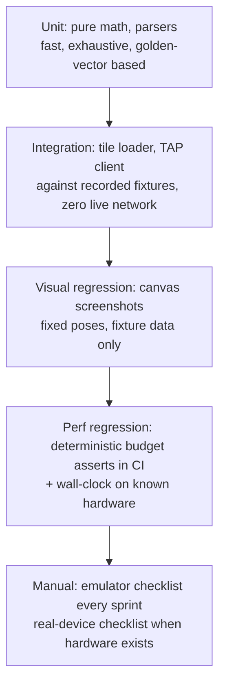

# 08 — Testing Strategy

> Part of the VR Astronomy App blueprint. Companion docs: `06-performance.md` (budgets the
> perf tests enforce), `07-pitfalls.md` (the failure modes these tests exist to catch).
> Source research: `docs/research/healpix-math.md`, `hips-format.md`, `tap-apis.md`,
> `threejs-webxr.md`, `performance-quest.md`, `gaia-pipeline.md`.

## 1. Principles and shape



Hard rules:

1. **CI never touches the live network.** All CDS/SIMBAD/VizieR/tile responses are recorded
   fixtures committed to the repo. Live-probe scripts exist but run manually (they also
   re-verify the CORS/etiquette facts from research).
2. **Golden vectors come from reference implementations** (healpy for HEALPix, astropy for
   coordinates), generated by committed Python scripts, with the generated JSON fixtures also
   committed — CI needs Node only, never Python.
3. **Determinism over realism** for visual/perf tests: fixed seeds, fixed camera poses, fixed
   DPR, no live data, `antialias: false`.
4. What we cannot test without hardware (real Quest frame rates, texture ceilings, FFR
   artifacts) is tracked as an explicit manual checklist (§7.2), not silently skipped.

### 1.1 Tooling

| Tool | Version | Role |
|---|---|---|
| `typescript` | 6.0.3 (verified npm 2026-06-11) | `tsc --noEmit` typecheck gate |
| `vite` | 8.0.16 (verified) | build |
| `three` / `@types/three` | 0.184.0 / 0.184.1 — pinned exactly (verified) | runtime under test |
| `vitest` | latest 3.x/4.x — **VERIFY exact version on npm at scaffold time** | unit + integration runner (vite-native) |
| `@vitest/browser` or `playwright` | **VERIFY versions** | real-browser WebGL tests + screenshots |
| `pixelmatch` + `pngjs` | **VERIFY versions** | screenshot diffing |
| `msw` (Mock Service Worker) | **VERIFY version** | network interception for integration tests |
| `iwer` | 2.2.1 (verified) | scripted fake WebXR sessions in automated tests |
| `healpy`, `astropy`, `numpy` (Python, dev-only) | healpy ≥ 1.16 — **VERIFY** | fixture generation, offline |

Repo layout for test assets:

```
tools/fixtures/gen_healpix_fixtures.py     # healpy golden vectors → JSON
tools/fixtures/gen_coord_fixtures.py       # astropy golden vectors → JSON
tools/fixtures/record-hips-fixtures.sh     # curl real tiles/properties → binary fixtures
tools/fixtures/record-tap-fixtures.sh      # curl real TAP/cone/Sesame responses → JSON/XML
test/fixtures/healpix/*.json
test/fixtures/coords/*.json
test/fixtures/hips/DSSColor/{properties,Norder3/Allsky.jpg,Norder3/Dir0/Npix*.jpg,Moc.json}
test/fixtures/hips/RubinFirstLook/{properties,Norder3/Dir0/Npix433.webp}
test/fixtures/tap/{simbad-cone-m31.json,simbad-tap-cone.json,vizier-gaia-cone.json,sesame-m31.xml,simbad-sim-id-npe.txt}
test/fixtures/chunks/{golden-16b.bin,truncated.bin,manifest.json}
test/visual/baselines/*.png
```

---

## 2. What each layer must catch (traceability to 07-pitfalls)

| Test layer | Pitfalls covered |
|---|---|
| HEALPix unit (§3.1) | F1 (library swap safety), B8 (pole math), C2 (MOC skip logic) |
| Coordinate unit (§3.2) | A5 (galactic frame), B6 (magnitude math) |
| Binary parser unit (§3.3) | A4 (int64), F5 (Float16), E7 (decompression) |
| Tile-loader integration (§4.1) | C2 (404s), C3 (webp), B1 (throttling logic), C11 (order pick) |
| TAP-client integration (§4.2) | C1, C6, C7, C8 (rate limiter), A4 |
| Visual regression (§5) | B4, B5, B7, B8, B9, A5, F2 (upgrade safety net) |
| Perf regression (§6) | 06-performance budgets, E5 (GC), B1 |
| Manual VR (§7) | E1–E4, B10, B11 |

---

## 3. Unit tests (vitest, jsdom/node environment, no WebGL)

### 3.1 HEALPix math against healpy-generated golden vectors

The single most important unit suite: it pins `healpix-ts@1.1.0` behavior, guards any future
library swap or in-house port, and resolves the research's open questions (corner ordering,
box-query semantics) as executable facts.

**Fixture generation** — `tools/fixtures/gen_healpix_fixtures.py`, run manually by a dev,
output committed. Sketch (full script in repo):

```python
#!/usr/bin/env python3
"""Generate HEALPix golden vectors with healpy. Output: test/fixtures/healpix/*.json
Run: pip install healpy numpy && python gen_healpix_fixtures.py"""
import json, numpy as np, healpy as hp

rng = np.random.default_rng(42)                      # fixed seed — fixtures are stable
NSIDES = [1, 2, 8, 64, 1024, 2048]                   # orders 0,1,3,6,10,11 (HiPS tile range)

def edge_cases():
    eps = 1e-9
    thetas = [eps, np.pi/2, np.pi - eps, np.arccos(2/3), np.arccos(-2/3)]  # poles + belt/cap seams
    phis   = [0.0, eps, np.pi/4, np.pi/2, np.pi, 2*np.pi - eps]            # face boundaries
    return [(t, p) for t in thetas for p in phis]

out = {"ang2pix": [], "pix2ang": [], "corners": [], "disc": []}
for nside in NSIDES:
    pts = list(zip(rng.uniform(0, np.pi, 200), rng.uniform(0, 2*np.pi, 200))) + edge_cases()
    for theta, phi in pts:
        out["ang2pix"].append({"nside": nside, "theta": theta, "phi": phi,
                               "ipix": int(hp.ang2pix(nside, theta, phi, nest=True))})
    for ipix in rng.integers(0, 12 * nside * nside, 50):
        t, p = hp.pix2ang(nside, int(ipix), nest=True)
        out["pix2ang"].append({"nside": nside, "ipix": int(ipix), "theta": t, "phi": p})
        b = hp.boundaries(nside, int(ipix), step=1, nest=True)   # shape (3, 4) unit vectors
        out["corners"].append({"nside": nside, "ipix": int(ipix),
                               "vecs": b.T.tolist()})            # 4 × [x,y,z]
    for _ in range(10):                                          # cone fixtures
        vec = hp.ang2vec(rng.uniform(0, np.pi), rng.uniform(0, 2*np.pi))
        radius = rng.uniform(0.001, 0.5)
        strict = hp.query_disc(nside, vec, radius, inclusive=False, nest=True)
        # certified-overlap set: dense samples strictly inside the disc → their pixels MUST appear
        boundary = sample_cone(vec, radius * 0.999, n=2048)      # helper: ring + interior samples
        must = sorted({int(hp.vec2pix(nside, *v, nest=True)) for v in boundary})
        out["disc"].append({"nside": nside, "vec": vec.tolist(), "radius": radius,
                            "strictInside": sorted(map(int, strict)), "mustContain": must})
json.dump(out, open("test/fixtures/healpix/golden.json", "w"))
```

**Assertions** (`test/unit/healpix.spec.ts`):

```ts
import { ang2PixNest, pix2AngNest, cornersNest, queryDiscInclusiveNest } from 'healpix-ts';
import golden from '../fixtures/healpix/golden.json';

test('ang2pix matches healpy exactly', () => {
  for (const c of golden.ang2pix)
    expect(ang2PixNest(c.nside, c.theta, c.phi)).toBe(c.ipix);   // exact integer equality
});

test('pix2ang centers match healpy to 1e-12', () => { /* abs diff ≤ 1e-12, phi mod 2π */ });

test('corners match healpy.boundaries — pins the N,W,S,E ordering', () => {
  // Research flags healpy corner order as asserted-but-undocumented. This test FREEZES it:
  // for each fixture pixel, each of our 4 corner vectors must equal healpy's vector at the
  // same index within 1e-12 per component. If a library swap permutes the order, this fails.
});

test('query_disc: superset of strict, contains all certified-overlap cells, bounded overfetch', () => {
  for (const c of golden.disc) {
    const got = new Set<number>();
    queryDiscInclusiveNest(c.nside, c.vec as V3, c.radius, p => got.add(p));
    for (const p of c.strictInside) expect(got.has(p)).toBe(true);   // no holes (centers inside)
    for (const p of c.mustContain)  expect(got.has(p)).toBe(true);   // no holes (true overlap)
    expect(got.size).toBeLessThanOrEqual(4 * c.strictInside.length + 16); // looseness sanity cap
  }
});

test('hierarchy: parent/children/descendant-range invariants', () => {
  // parent(child) === ipix for all 4 children; descendants(ipix,Δ) is the contiguous
  // range [ipix*4^Δ, (ipix+1)*4^Δ); use Math.floor()/multiply, NOT >> above order 14.
});
```

Note on disc-query assertions: research suggested "JS ⊆ healpy(inclusive=True, fact=64)", but
the michitaro/healpix-ts algorithm (`center distance ≤ radius + max_pixrad`) is intentionally
looser than healpy's refined inclusive test, so strict subset can fail by an epsilon margin.
The certified-overlap (`mustContain`) + bounded-overfetch pair above tests what the tile loader
actually needs: **no holes in the sky, no gross over-fetch**.

Additional unit specs in this family:

- **Tile URL builder:** `Dir = floor(N/10000)*10000` — cases N=0, 9999, 10000, 10302 (spec
  example → `Norder6/Dir10000/Npix10302.fits`), 2752671 (verified live URL → `Dir2750000`).
- **Order selection** (`pickOrder`): screen-pixel→order table from the spec (order 3 = 51.5″/px
  … order 11 = 0.20″/px at 512 px tiles); clamps to `[max(3, hips_order_min), hips_order]`;
  generalizes the +9 shift via `log2(hips_tile_width)` (256 px tile case).
- **properties parser:** real `properties` fixture from DSS2 (verified content in
  research/hips-format §2) + edge cases (CRLF, comments, missing optional keys, `hips_frame`
  galactic); asserts the 9 mandatory keywords are demanded.
- **Allsky slicer:** order-3 grid math — width `floor(sqrt(768)) = 27` tiles, tile n →
  `{x:(n%27)*64, y:floor(n/27)*64}`; cell size derived from `image.width/27`, not hardcoded.

**Acceptance:** 100 % of golden vectors pass; suite runs < 5 s; the same suite passes
unmodified against the vendored `@hscmap/healpix` fallback (proves swapability — F1).

### 3.2 Coordinate conversions

Fixtures from astropy (`tools/fixtures/gen_coord_fixtures.py`, seed 42, committed JSON):

- **RA/Dec ↔ HEALPix θ/φ:** `θ = π/2 − dec`, `φ = ra` (radians) — round trips at 1e-12.
- **ICRS ↔ galactic:** 100 random points through astropy `SkyCoord.transform_to('galactic')`;
  our fixed 3×3 rotation matrix must agree to ≤ 1 mas. Includes the galactic poles/center and
  the Mellinger-frame case (pitfall A5).
- **ra/dec/distance → scene XYZ:** the exact Three.js axis-mapping convention chosen in the
  architecture doc, fixtured for Polaris, Sirius, Sgr A* direction, and both equatorial poles
  (catches sign/handedness flips — these are silent killers).
- **Magnitude math:** `M = m − 5(log10 d − 1)` and the shader-side inverse; intensity
  `10^(−0.4Δm)` spot values (Δm = 5 → ×0.01 exactly); the saturation→sqrt size growth curve is
  monotonic and continuous at I = 1.

### 3.3 Binary chunk parser with synthetic chunks

The chunk format is defined in the data-pipeline doc of this blueprint (SoA, 16 B/star:
3×float32 chunk-local position + uint8 palette color index + float16 G magnitude + 1 spare;
little-endian; header carries f64 chunk origin + count + format version).

- **Golden bytes test:** `test/fixtures/chunks/golden-16b.bin` is hand-assembled in the test
  (DataView writes) for 3 known stars; parser output must match field-for-field. This pins
  endianness and offsets independently of the Python writer.
- **Writer↔parser round trip:** the Python pipeline's writer (run offline) produced
  `manifest.json` + a tiny 100-star chunk from a fixed input CSV — committed; the TS parser
  must reproduce the CSV values within quantization tolerance (positions ≤ 1e-3 pc, mags
  ≤ 1/256).
- **Float16 decode:** known bit patterns — `0x3C00→1.0`, `0x0000→0`, `0x8000→−0`,
  `0x7BFF→65504`, `0x0001→5.96e−8` (subnormal), `0x7C00→Infinity`, `0x7E00→NaN`; both the
  native `Float16Array` path and the software fallback (pitfall F5) run the same table.
- **Compression:** `.bin.gz` fixture decoded via `DecompressionStream('gzip')`; brotli path
  feature-detected and skipped (not failed) where unsupported.
- **Hostile input:** truncated buffer, wrong magic/version, count×stride ≠ payload length,
  NaN positions → parser throws typed errors, never returns partial garbage; fuzz with 1,000
  random-mutation corruptions (seeded), assert "throws or parses, never hangs/crashes".
- **int64 ids (if/when the format carries them):** read via `getBigUint64`, compare against
  string fixtures `"170226393632735260"` — a `Number`-roundtrip test must FAIL by construction
  (guards pitfall A4).

### 3.4 Misc pure-logic units

- LRU caches (tile pool layer allocation, response cache): eviction order, hard-ceiling
  behavior, dispose callbacks fired exactly once.
- Rate limiter (the single CDS gate, pitfall C8): fake timers — 20 queued calls never exceed
  5/s; burst + drain; per-key dedupe of identical in-flight URLs.
- MOC membership test: JSON MOC fixture (`{order:[pixels]}` from MOCServer, recorded) —
  inside/outside points, and "skip fetch outside coverage" decision logic (pitfall C2).
- Frame governor state machine (06-performance §3.4): synthetic frame-time series → expected
  lever sequence; hysteresis honored.

---

## 4. Integration tests (vitest + msw; browser mode where ImageBitmap is needed)

### 4.1 Tile loader against a mock tile server

**Recording:** `tools/fixtures/record-hips-fixtures.sh` (run manually, output committed —
~30 files, < 2 MB total):

```bash
#!/usr/bin/env bash
set -euo pipefail
B="https://alasky.cds.unistra.fr/DSS/DSSColor"
D="test/fixtures/hips/DSSColor"
curl -fsS "$B/properties"                       -o "$D/properties" --create-dirs
curl -fsS "$B/Norder3/Allsky.jpg"               -o "$D/Norder3/Allsky.jpg"
for n in 0 271 301 432 433; do                  # a small Orion-area neighborhood
  curl -fsS "$B/Norder3/Dir0/Npix$n.jpg"        -o "$D/Norder3/Dir0/Npix$n.jpg"
done
curl -fsS "https://alasky.cds.unistra.fr/MocServer/query?ID=CDS%2FP%2FSDSS9%2Fcolor&get=moc&fmt=json" \
     -o "test/fixtures/hips/SDSS9/Moc.json"     --create-dirs
# Rubin FirstLook webp tile — served with NO Content-Type (pitfall C3); preserve that in mocks
curl -fsS "https://alasky.cds.unistra.fr/Rubin/CDS_P_Rubin_FirstLook/Norder3/Dir0/Npix433.webp" \
     -o "test/fixtures/hips/RubinFirstLook/Norder3/Dir0/Npix433.webp" --create-dirs
curl -fsS "https://alasky.cds.unistra.fr/Rubin/CDS_P_Rubin_FirstLook/properties" \
     -o "test/fixtures/hips/RubinFirstLook/properties"
```

**Mock server:** msw handlers serve the fixture tree; configurable behaviors per test:
404 for out-of-coverage paths, 500/timeout on the primary host with success on the
`alaskybis` mirror URL, **webp responses with the Content-Type header stripped**, ETag/304
revalidation.

**Scenarios (acceptance criteria):**

1. Cold start: `properties` parsed → Allsky fetched and sliced → 768 order-3 entries available
   before any individual tile resolves.
2. Camera at Orion, order 7 requested → loader requests exactly the
   `queryDiscInclusiveNest` set (asserted against the §3.1 golden cone), capped at the
   concurrency budget (6), prioritized center-out.
3. Partial survey (SDSS MOC fixture): zero HTTP requests issued for cells outside the MOC;
   a forced 404 inside coverage is cached as negative and **never retried** (pitfall C2).
4. Mirror failover: primary 500 ×2 → same tile fetched from `alaskybis` URL; no duplicate
   GPU upload.
5. Webp-without-Content-Type decodes via `createImageBitmap` (browser-mode test) — pitfall C3.
6. LRU: pool size 8 forced; 12 tiles streamed; evictions follow LRU; `dispose`/layer-reuse
   invoked exactly once per eviction; resident count never exceeds 8 (pitfall E2 logic).
7. Upload throttle: with a fake 2 ms budget clock, ≤ 1 upload per simulated VR frame; queue
   drains in order of screen-space priority.

### 4.2 TAP/cone/Sesame client against recorded fixtures

**Recording:** `tools/fixtures/record-tap-fixtures.sh` captures (all verified-working URLs
from research/tap-apis):

```bash
# SIMBAD modern cone (the gaze/click primary)
curl -fsS 'https://simbad.cds.unistra.fr/cone?RA=10.6847&DEC=41.2687&SR=0.02&MAXREC=5&RESPONSEFORMAT=json' \
  -o test/fixtures/tap/simbad-cone-m31.json
# SIMBAD TAP sync JSON (cone ADQL with otype + V mag, POST form-encoded)
curl -fsS 'https://simbad.cds.unistra.fr/simbad/sim-tap/sync' \
  --data-urlencode REQUEST=doQuery --data-urlencode LANG=ADQL --data-urlencode FORMAT=json \
  --data-urlencode "QUERY=SELECT TOP 50 basic.main_id, basic.ra, basic.dec, basic.otype, flux.flux AS V_mag FROM basic LEFT JOIN flux ON flux.oidref = basic.oid AND flux.filter = 'V' WHERE CONTAINS(POINT('ICRS', ra, dec), CIRCLE('ICRS', 10.6847, 41.2687, 0.1)) = 1" \
  -o test/fixtures/tap/simbad-tap-cone.json
# VizieR Gaia DR3 cone (the browser path to Gaia, table name is quoted!)
curl -fsS 'https://tapvizier.cds.unistra.fr/TAPVizieR/tap/sync' \
  --data-urlencode REQUEST=doQuery --data-urlencode LANG=ADQL --data-urlencode FORMAT=json \
  --data-urlencode 'QUERY=SELECT TOP 100 Source, RA_ICRS, DE_ICRS, Gmag, Plx FROM "I/355/gaiadr3" WHERE 1=CONTAINS(POINT('"'"'ICRS'"'"', RA_ICRS, DE_ICRS), CIRCLE('"'"'ICRS'"'"', 10.6847, 41.2687, 0.05))' \
  -o test/fixtures/tap/vizier-gaia-cone.json
# Sesame XML (note: cds.unistra.fr path — sesame.unistra.fr is dead DNS)
curl -fsS 'https://cds.unistra.fr/cgi-bin/nph-sesame/-oxp/SNV?M31' -o test/fixtures/tap/sesame-m31.xml
```

Plus one **hand-written** fixture: `simbad-sim-id-npe.txt` — an HTTP-200 body containing a
Java NullPointerException dump (replicating the verified legacy-endpoint bug) to prove our
client rejects garbage-200s gracefully.

**Scenarios (acceptance criteria):**

1. Cone result parsed by reading the `columns`/`metadata` arrays — a test permutes column
   order in the fixture and parsing still works (pitfall C6 defensive-parsing rule).
2. `Source` (Gaia id) survives as a string end-to-end; a canary asserts the raw JSON id and
   parsed id match character-for-character (pitfall A4). If TAP JSON numbers prove lossy for
   real ids, the client must switch that query to `FORMAT=csv` — the test encodes whichever
   decision the implementation takes.
3. Sesame XML → `{name, raDeg, decDeg, otype}` via `DOMParser`; unresolvable-name fixture
   yields a typed NotFound, not a throw.
4. Timeout/abort: msw delay > client budget (10 s) → AbortController fires, UI-level promise
   rejects with Timeout type; no retry storm (max 1 retry, jittered).
5. Rate limiter integration: 25 lookups queued → wall-clock (fake timers) ≥ 4 s, order
   preserved, duplicate URLs deduped to one request (pitfall C8).
6. hips2fits URL builder: exact path `/hips-image-services/hips2fits` (bare path 404s —
   pitfall C4), params encoded, ≤ 512×512 enforced, mirror fallback on failure.

---

## 5. Visual regression (Playwright, headless Chromium)

WebGL rasterization differs across GPUs/drivers, so:

- Baselines are generated **in the CI environment** (headless Chromium → SwiftShader software
  GL) and compared only CI-to-CI. Dev machines run the suite in "report-only" mode.
- Compare with `pixelmatch`, per-pixel threshold 0.1, fail if **> 0.5 %** of pixels differ;
  diff images uploaded as CI artifacts. (Exact hash comparison is too brittle even on
  SwiftShader; if SwiftShader proves deterministic in practice, tighten to hash equality.)

**Determinism requirements** (enforced by a `?testMode=1` app flag):

- Canvas fixed 800×600, `devicePixelRatio` forced to 1, `antialias: false`,
  `preserveDrawingBuffer: true` (or `readPixels` immediately after a synchronous render).
- All network through the fixture server (msw in the page or a static fixture host) — never
  live CDS in CI.
- Star data from one committed 10 k-star fixture chunk; fixed exposure uniform; time uniform
  frozen at 0; LOD fades disabled; render exactly N=3 frames then capture.

**Fixed camera poses** (each is one spec):

| id | pose | what it locks |
|---|---|---|
| `allsky_galcenter_fov120` | ra 266.4°, dec −28.9°, fov 120°, Allsky only | Allsky slicing, overall orientation |
| `orion_belt_order7` | ra 84.05°, dec −1.20°, fov 8° | **tile UV orientation (pitfall B9)** — the first baseline ever committed, validated by eye against Aladin Lite before freezing |
| `ncp_pole_fov30` | dec +90°, fov 30° | polar cell distortion + subdivision (B8) |
| `tile_seam_closeup` | centered on a tile boundary, fov 2° | edge filtering/seams (B7) |
| `mellinger_galactic` | galactic center in Mellinger fixture | frame rotation (A5) |
| `starfield_origin` | camera at origin toward Orion, sky+stars | colorspace + additive pipeline (B4/B5) |
| `starfield_100pc` | camera at (0, 0, 100 pc) | camera-relative offsets (A1), sky fade |
| `graycard` | synthetic 50 % gray tile through both material paths | sRGB double-encode canary (B4) |

**Workflow:** any intentional rendering change updates baselines via
`npm run visual:update` in CI (label-gated job), with the diff reviewed in the PR. Three.js
upgrades (pitfall F2) must show a clean or explained visual diff before merge.

---

## 6. Performance regression

### 6.1 Deterministic budget asserts (every CI run)

The `/perf` scene (06-performance §4.4: fixture order-7 mosaic + 300 k fixture stars + 5 k
sprites, 30 s camera spline compressed to 300 frames in test mode) runs in headless Chromium;
after the run it asserts **machine-independent** counters from `renderer.info` and app
telemetry against the 06 §2 table for the "Quest 2" profile:

- draw calls ≤ 80 (sky ≤ 4, star chunks ≤ 48), triangles ≤ 300 k, points ≤ 300 k;
- GPU tile pool resident ≤ 128 layers; `renderer.info.memory.textures` stable over the run
  (start vs end delta ≤ 2);
- tile uploads never exceeded 1/frame; fetch concurrency never exceeded 6;
- visible-tile sets along the spline exactly match a committed golden list (catches LOD
  regressions without any timing dependence).

### 6.2 Wall-clock (known hardware only)

`npm run perf:local` produces `perf-report.json` (p50/p95/p99 frame ms, worst frame, upload
stall count) and compares against a per-machine baseline file (`perf-baselines/<machine-id>.json`)
with ±20 % tolerance. Run manually on the dev machine before release tags; later, a
self-hosted runner or device lane makes it CI. CI's SwiftShader numbers are recorded as
trend-only artifacts with a single generous catastrophic-regression gate
(median frame < 100 ms) — software GL timing is not a real-GPU proxy.

### 6.3 GC / allocation canary

In the perf scene, after 100 warm-up frames: force `gc()` if exposed
(`--js-flags=--expose-gc`), snapshot `performance.memory.usedJSHeapSize`, run 1,000 frames,
snapshot again. **Assert heap growth < 1 MB** (pitfall E5: zero steady-state allocations).
Chrome-only; skipped elsewhere.

### 6.4 Pipeline throughput checks (offline, in the data-pipeline repo/job)

Chunk encode + gzip of the 1.9 M-star set completes; output sizes within ±15 % of the
documented expectations (~31 MB raw at 16 B/star); decode throughput in Node ≥ 50 MB/s.
**VERIFY:** real compression ratios (research estimate ~3× after quantize+delta — benchmark
here and update `deploy` doc numbers).

---

## 7. Manual VR test scripts

### 7.1 Emulator checklist (every sprint; Immersive Web Emulator + IWER)

Setup: Chrome + Immersive Web Emulator extension (Web Store id
`cgffilbpcibhmcfbgggfhfolhkfbhmik`), DevTools → "WebXR" tab; app on `http://localhost:5173`
(secure context, no certs needed). Automated subset: `iwer@2.2.1` injected in Playwright runs
session start/end and controller-select smoke tests in CI.

- [ ] "Enter VR" button appears only when `navigator.xr` reports support; desktop UI hides on
      entry, in-headset uikit panel appears
- [ ] Enter VR → sky + stars render in both emulated eyes; no one-eye-black (would indicate
      multiview/projection issues — pitfall B11)
- [ ] Drag emulated headset through ±90° pitch and full yaw: no tile holes, no pole artifacts,
      Allsky fallback fills unloaded regions
- [ ] Controller ray + `selectstart` on a bright star → info panel with SIMBAD fixture/live
      data; gaze fallback (`targetRayMode: 'gaze'`) triggers the same path
- [ ] Locomotion: fly 100 pc toward Orion — no jitter (A1), sky fades per design (A3),
      chunk fades pop-free
- [ ] Open DevTools Performance during VR: zero steady-state allocations in the frame loop
- [ ] End session from the emulator (not the app UI): desktop mode restores — OrbitControls
      re-enabled, camera sane, resize correct (pitfall E3)
- [ ] Re-enter VR in the same tab: works (session re-init has no stale state)
- [ ] Emulated `visibilitychange`/session blur: app pauses prefetch, resumes cleanly

### 7.2 Real-device checklist (Quest 3S target; first hardware session — fills VERIFY gaps)

Setup: developer mode + USB, `adb reverse tcp:5173 tcp:5173`, open `http://localhost:5173`
in Quest Browser; `adb forward tcp:9222 localabstract:chrome_devtools_remote` + desktop
`chrome://inspect` for console; OVR Metrics Tool HUD on.

Measurements (record into `docs/research/device-notes.md`):

- [ ] `gl.getParameter(gl.ALIASED_POINT_SIZE_RANGE)`
- [ ] `session.supportedFrameRates`; does `updateTargetFrameRate(72)` take effect (HUD
      confirms)?
- [ ] Texture stress scene: allocate array layers until context loss → record ceiling; set
      LRU ≤ 60 % of it
- [ ] Per-tile upload cost (ms) from the DevHUD histogram
- [ ] `'requestViewportScale' in view` feature detect result
- [ ] Point-count ladder 100 k/200 k/400 k/600 k → frame-time curve
- [ ] FFR sweep 0.0/0.3/0.5/0.7/1.0 on the star field — note visible artifacts; verify FFR
      active via `adb shell ovrgpuprofiler -t`

Functional:

- [ ] Sustained 15-min session (thermals) — frame rate stable, no tab kill
- [ ] Remove headset 30 s / re-don: session resumes or ends cleanly per E3 design
- [ ] System menu overlay + return: no frozen frame
- [ ] Controller models load from **our origin** (self-hosted profiles — pitfall F4): check
      network panel shows no jsDelivr requests
- [ ] Storage: `navigator.storage.estimate()` sane; offline revisit works after airplane-mode
      toggle (SW cache)
- [ ] Hand tracking (controllers down): rays/select still work via `XRHandModelFactory` path

### 7.3 Phone manual checklist (per release)

- [ ] iPhone Safari: no "Enter VR" offered; drag look-around works; gyro button → permission
      prompt → look-around tracks; HTTPS only (pitfall E1)
- [ ] Android Chrome: `deviceorientation` works without prompt; WebXR AR not offered (we're
      VR-only)
- [ ] Memory: 10 min of browsing on a mid-range phone without a tab reload

---

## 8. CI outline (GitHub Actions)

```yaml
# .github/workflows/ci.yml
name: CI
on:
  push: { branches: [main] }
  pull_request:
concurrency: { group: '${{ github.workflow }}-${{ github.ref }}', cancel-in-progress: true }

jobs:
  check:
    runs-on: ubuntu-latest
    steps:
      - uses: actions/checkout@v4
      - uses: actions/setup-node@v4
        with: { node-version: lts/*, cache: npm }
      - run: npm ci
      - run: npm run typecheck          # tsc --noEmit (strict)
      - run: npm run lint --if-present  # eslint (incl. custom no-alloc-in-frame-loop rule, stretch)
      - run: npx vitest run --coverage  # unit + integration (msw fixtures, no network)

  browser-tests:
    runs-on: ubuntu-latest
    needs: check
    steps:
      - uses: actions/checkout@v4
      - uses: actions/setup-node@v4
        with: { node-version: lts/*, cache: npm }
      - run: npm ci
      - run: npx playwright install --with-deps chromium
      - run: npm run test:visual        # §5 — fixture server, pixelmatch vs committed baselines
      - run: npm run test:perf-budgets  # §6.1 deterministic asserts + §6.3 GC canary
      - if: failure()
        uses: actions/upload-artifact@v4
        with: { name: visual-diffs, path: test/visual/__diffs__/ }

  build:
    runs-on: ubuntu-latest
    needs: check
    steps:
      - uses: actions/checkout@v4
      - uses: actions/setup-node@v4
        with: { node-version: lts/*, cache: npm }
      - run: npm ci
      - run: npm run build              # vite build → dist/ (includes _headers)
      - uses: actions/upload-artifact@v4
        with: { name: dist, path: dist/ }
  # Deploy job (wrangler pages deploy) is defined in the deploy doc; it depends on all three.
```

Notes:

- Fixture generation (Python/healpy, curl recordings) is **not** in CI — scripts + outputs are
  committed; a scheduled monthly `live-probes.yml` workflow (allowed network) re-runs the
  recording scripts in *check mode* (diff against fixtures, open an issue on drift — catches
  CDS schema/CORS changes and the `2.7-SNAPSHOT` cone-service evolving, pitfall C6).
- `npm run visual:update` runs only via a label-gated workflow so baselines change
  deliberately.
- Action versions (`checkout@v4`, `setup-node@v4`, `upload-artifact@v4`) — **VERIFY:** current
  majors at scaffold time; the Vite official deploy workflow referenced in the deploy doc is
  the template.

### 8.1 Definition of done (testing) per phase

| Phase | Gate |
|---|---|
| P0 pipeline | §3.3 round-trip + §6.4 throughput green; NaN/range asserts in pipeline output |
| P1 sky | §3.1 + §4.1 green; `orion_belt_order7` baseline approved vs Aladin Lite; seam + pole poses committed |
| P2 stars | §3.2/§3.3 green; starfield poses committed; GC canary green |
| P3 info | §4.2 green incl. rate limiter + BigInt canary |
| P4 VR | §7.1 emulator checklist 100 %; iwer smoke test in CI; §7.2 scheduled when hardware exists |
| P5 deploy | build artifact served from staging passes visual suite against production headers |
