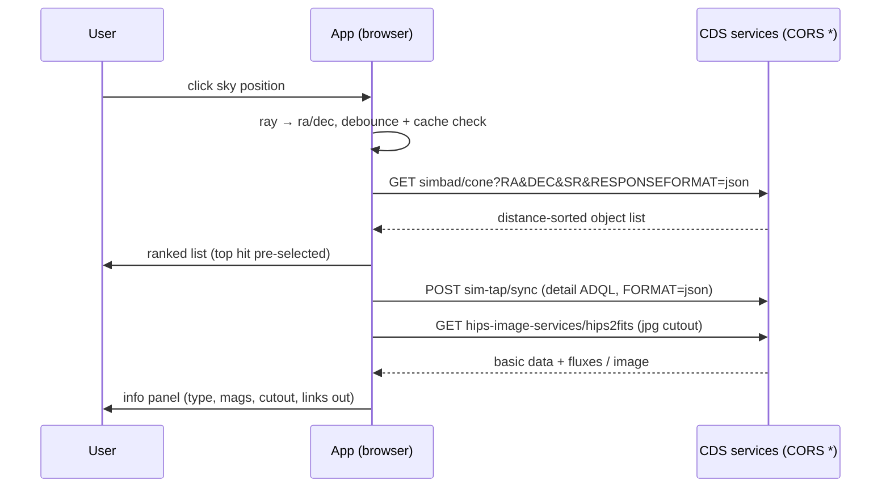

# PHASE 5 — Data layer: object info, name search & cutouts

```yaml
milestone: M5
depends_on:
  - HiPS sky sphere rendering with a survey registry (layer descriptors parsed from /properties)  # PHASE-1/2
  - Camera controller with programmatic orientation control (point camera at ra/dec)              # PHASE-3/4
  - A picking abstraction that yields a sky direction (ray) from mouse click                      # PHASE-3/4
design_docs: docs/01-architecture.md, docs/02-data-sources.md, docs/07-pitfalls.md
research:    docs/research/tap-apis.md (primary), docs/research/hips-format.md §hips2fits
deliverable: Click/gaze any sky position → ranked object list → rich info panel with cutout;
             type a name → camera flies there. All browser-direct, no backend.
exit_criteria:
  - Click Sirius → correct SIMBAD data rendered in < 2 s
  - Search "M31" → camera flies to RA 10.6847, Dec +41.2688
  - `npx tsc --noEmit` clean, `npx vitest run` green
  - CDS request etiquette enforced (≤ 5 req/s aggregate) and verified by test
```

**Every endpoint in this phase was live-verified CORS-open (`Access-Control-Allow-Origin: *`) on
2026-06-11** — see `docs/research/tap-apis.md` §0 for the probe table. Re-verify before relying on
them (one `curl -s -D - -o /dev/null -H "Origin: https://example.com" <url>` per endpoint).

**Hard rules for this phase**

- JSON everywhere. Never parse VOTable (the only npm parser, `jsvotable`, is GPL-3.0 and stale —
  banned). SIMBAD TAP and VizieR TAP take `FORMAT=json`; SIMBAD `/cone` takes
  `RESPONSEFORMAT=json`; Sesame is XML parsed with built-in `DOMParser`.
- The dead hostname trap: **`sesame.unistra.fr` does not resolve in DNS** (verified). The only
  Sesame endpoint allowed in this codebase is `https://cds.unistra.fr/cgi-bin/nph-sesame`.
- The path trap: hips2fits lives at `/hips-image-services/hips2fits`; the bare `/hips2fits` path
  is a 404 (verified).
- Never use SIMBAD legacy `sim-id`/`sim-coo` for JSON — `output.format=json` returns an HTTP 200
  containing a server-side Java NullPointerException (verified bug). Legacy endpoints are allowed
  only as outbound HTML links for the user.
- All ESA Gaia archive hosts (`gea.esac.esa.int` and mirrors) are **CORS-blocked** — any live Gaia
  query from the browser goes through VizieR TAP table `"I/355/gaiadr3"` instead.



---

## Module map (create under `src/data/` and `src/ui/`)

```
src/data/
  rateLimiter.ts     token-bucket limiter shared by ALL CDS calls
  lruCache.ts        generic LRU (string key → value, max entries)
  tap.ts             TapClient (sync TAP, FORMAT=json) + row helpers
  simbad.ts          coneSearch() + objectDetail() + otype decoding
  sesame.ts          resolveName() via nph-sesame, DOMParser
  cutouts.ts         hips2fits URL builder + mirror failover
  index.ts           singletons: simbadTap, vizierTap, cdsLimiter, queryCache
src/ui/
  SearchBox.ts       name/coordinate search input
  InfoPanel.ts       object info panel (HTML/CSS; VR mirror comes in PHASE-6)
  ObjectList.ts      ranked cone-search result list
src/interaction/
  skyPicker.ts       click/gaze → ra/dec → lookup orchestration (debounce lives here)
```

---

## Step group 1 — Etiquette layer: rate limiter + cache

CDS enforces roughly 5–6 requests/second per IP and can blacklist an IP for ~1 hour on abuse
(SIMBAD FAQ / astroquery docs — MEDIUM confidence, treat the limit as real). One shared limiter
fronts every CDS call in the app: TAP, cone, Sesame, hips2fits, MocServer.

### 1.1 Token-bucket rate limiter

```ts
// src/data/rateLimiter.ts
export class RateLimiter {
  private queue: Array<() => void> = [];
  private tokens: number;
  constructor(private maxPerSecond = 4) {           // 4, not 5 — leave headroom for tile fetches
    this.tokens = maxPerSecond;
    setInterval(() => {
      this.tokens = this.maxPerSecond;
      while (this.tokens > 0 && this.queue.length > 0) { this.tokens--; this.queue.shift()!(); }
    }, 1000);
  }
  acquire(): Promise<void> {
    if (this.tokens > 0) { this.tokens--; return Promise.resolve(); }
    return new Promise((res) => this.queue.push(res));
  }
}
export const cdsLimiter = new RateLimiter(4);
```

Note: the `setInterval` lives outside the render loop and allocates nothing per frame. HiPS tile
fetches from PHASE-1 should **also** be routed through `cdsLimiter` if they are not already —
check and unify (one decision-log entry if you change PHASE-1 code).

### 1.2 LRU cache

```ts
// src/data/lruCache.ts
export class LruCache<V> {
  private map = new Map<string, V>();
  constructor(private maxEntries = 500) {}
  get(k: string): V | undefined {
    const v = this.map.get(k);
    if (v !== undefined) { this.map.delete(k); this.map.set(k, v); }  // bump recency
    return v;
  }
  set(k: string, v: V): void {
    if (this.map.has(k)) this.map.delete(k);
    this.map.set(k, v);
    if (this.map.size > this.maxEntries) this.map.delete(this.map.keys().next().value!);
  }
}
```

### 1.3 Acceptance (step group 1)

- [ ] Vitest: limiter allows ≤ 4 acquisitions per simulated second (use `vi.useFakeTimers()`),
      queues and releases the 5th in the next window.
- [ ] Vitest: LRU evicts the least-recently-used entry at capacity; `get` bumps recency.
- [ ] Commit: `feat(data): shared CDS rate limiter and LRU cache`

---

## Step group 2 — TapClient

One class, two instances (SIMBAD TAP and VizieR TAP). Verified endpoints:

| Instance | Sync endpoint |
|---|---|
| `simbadTap` | `https://simbad.cds.unistra.fr/simbad/sim-tap/sync` |
| `vizierTap` | `https://tapvizier.cds.unistra.fr/TAPVizieR/tap/sync` |

Both return, for `FORMAT=json`, the shape `{"metadata":[{name,description,datatype,unit,ucd},…],
"data":[[row],…]}` (verified live). **No VOTable fallback is needed or allowed.** Use POST
(`application/x-www-form-urlencoded`) so long ADQL never hits URL-length limits.

### 2.1 Implementation

```ts
// src/data/tap.ts
import { cdsLimiter } from './rateLimiter';
import { LruCache } from './lruCache';

export interface TapColumnMeta {
  name: string; description?: string; datatype?: string; unit?: string; ucd?: string;
}
export interface TapResult { metadata: TapColumnMeta[]; data: unknown[][]; }

export class TapError extends Error {
  constructor(public status: number, public body: string) {
    super(`TAP error ${status}: ${body.slice(0, 200)}`);
  }
}

const tapCache = new LruCache<TapResult>(300);

export class TapClient {
  constructor(private syncUrl: string) {}

  async query(adql: string, maxrec?: number): Promise<TapResult> {
    const params = new URLSearchParams({
      REQUEST: 'doQuery', LANG: 'ADQL', FORMAT: 'json', QUERY: adql,
    });
    if (maxrec !== undefined) params.set('MAXREC', String(maxrec));
    const cacheKey = this.syncUrl + '?' + params.toString();
    const hit = tapCache.get(cacheKey);
    if (hit) return hit;

    await cdsLimiter.acquire();
    const r = await fetch(this.syncUrl, { method: 'POST', body: params });
    if (!r.ok) throw new TapError(r.status, await r.text());
    const json = (await r.json()) as TapResult;
    if (!Array.isArray(json.metadata) || !Array.isArray(json.data)) {
      throw new TapError(200, 'unexpected TAP JSON shape');
    }
    tapCache.set(cacheKey, json);
    return json;
  }
}

/** Read rows as objects, keyed by metadata column names — NEVER hardcode column indexes.
 *  (SIMBAD /cone reports server "2.7-SNAPSHOT"; column layouts may evolve.) */
export function rowsToObjects(res: TapResult): Array<Record<string, unknown>> {
  const names = res.metadata.map((m) => m.name);
  return res.data.map((row) =>
    Object.fromEntries(names.map((n, i) => [n, row[i]])));
}

export const simbadTap = new TapClient('https://simbad.cds.unistra.fr/simbad/sim-tap/sync');
export const vizierTap = new TapClient('https://tapvizier.cds.unistra.fr/TAPVizieR/tap/sync');
```

### 2.2 VizieR quirk

VizieR table names contain `/` and must be double-quoted in ADQL: `FROM "I/355/gaiadr3"`.
Column mapping to ESA names: `Source`→`source_id`, `RA_ICRS`→`ra` (Ep=2016.0), `Plx`→`parallax`,
`Gmag`→`phot_g_mean_mag` (verified). Example live-Gaia cone query (used later for "Gaia data for
this star" panel section, optional in this phase):

```sql
SELECT TOP 20 Source, RA_ICRS, DE_ICRS, Gmag, BPmag, RPmag, Plx, pmRA, pmDE, RV
FROM "I/355/gaiadr3"
WHERE 1 = CONTAINS(POINT('ICRS', RA_ICRS, DE_ICRS), CIRCLE('ICRS', 101.2872, -16.7161, 0.01))
```

### 2.3 Acceptance (step group 2)

- [ ] Vitest with mocked `fetch`: `query()` POSTs the right params, parses the `{metadata,data}`
      fixture, caches (second identical call performs zero fetches), throws `TapError` on 400/500.
- [ ] Manual (run once in a dev console, real network):
      `await simbadTap.query("SELECT TOP 1 main_id, ra, dec FROM basic WHERE main_id = '* alf CMa'")`
      returns one row. VERIFY: confirm `'* alf CMa'` is Sirius's canonical `main_id` — if the row
      comes back empty, resolve via Sesame first (step group 3) and re-test; record the actual id
      in this file.
- [ ] Commit: `feat(data): TapClient with JSON parsing, caching and CDS rate limiting`

---

## Step group 3 — Sesame name resolver + search box + fly-to

### 3.1 Sesame client

Endpoint (the ONLY working one — others are dead DNS or fragile redirects):
`https://cds.unistra.fr/cgi-bin/nph-sesame/-oxp/SNV?<urlencoded name>`
- `-oxp` = XML output; `SNV` = try SIMBAD, then NED, then VizieR.
- Verified response for `M31` contains `<jradeg>10.68470833</jradeg><jdedeg>41.26875</jdedeg>`,
  `<oname>`, `<otype>`.

```ts
// src/data/sesame.ts
import { cdsLimiter } from './rateLimiter';
import { LruCache } from './lruCache';

export interface ResolvedName {
  name: string; raDeg: number; decDeg: number; otype?: string;
}
const sesameCache = new LruCache<ResolvedName | null>(200);

export async function resolveName(raw: string): Promise<ResolvedName | null> {
  const name = raw.trim();
  if (!name) return null;
  const hit = sesameCache.get(name.toLowerCase());
  if (hit !== undefined) return hit;

  await cdsLimiter.acquire();
  const url = `https://cds.unistra.fr/cgi-bin/nph-sesame/-oxp/SNV?${encodeURIComponent(name)}`;
  const r = await fetch(url);
  if (!r.ok) throw new Error(`Sesame HTTP ${r.status}`);
  const doc = new DOMParser().parseFromString(await r.text(), 'application/xml');
  const resolver = doc.querySelector('Resolver');           // first resolver that succeeded
  const ra = resolver?.querySelector('jradeg')?.textContent;
  const de = resolver?.querySelector('jdedeg')?.textContent;
  const result: ResolvedName | null = (ra && de) ? {
    name: resolver!.querySelector('oname')?.textContent ?? name,
    raDeg: parseFloat(ra), decDeg: parseFloat(de),
    otype: resolver!.querySelector('otype')?.textContent ?? undefined,
  } : null;
  sesameCache.set(name.toLowerCase(), result);
  return result;
}
```

### 3.2 Search box UI

Plain HTML (`<input type="search">` + result flyout) in the desktop overlay. Behavior:

1. On Enter (not on keystroke — Sesame is not an autocomplete service), call `resolveName`.
2. While pending: spinner in the input. On null: inline "No object found for '…'".
3. On success: call `flyTo(raDeg, decDeg)` and open the info panel for that position
   (reuse step group 4/5 with `SR=0.02`).
4. Bonus (cheap): if the input parses as two floats (`"10.68 41.27"` or `"10.68, +41.27"`),
   skip Sesame and fly straight to those ICRS degrees.

### 3.3 Camera fly-to

Add to the camera controller (orientation-only in sky mode; in 3D flythrough mode keep position
and orient only):

```ts
// signature to implement in the existing camera controller module
flyTo(raDeg: number, decDeg: number, durationMs = 1200): Promise<void>
```

- Compute the target direction with the SAME `raDecToVector3` helper the sky sphere uses
  (PHASE-1; do not reimplement — a second copy with a different axis convention is the classic
  "everything is mirrored" bug, see docs/07-pitfalls.md).
- Slerp the camera quaternion from current to target with ease-in-out
  (`t' = t*t*(3-2t)`), driven from the main animation loop (no `setInterval`).
- Zoom: if current FoV > 10°, also animate FoV down to ~5° for point targets; leave FoV alone for
  extended objects (otype starts with `G` for galaxies — keep ~1–2° so M31 fits).

### 3.4 Acceptance (step group 3)

- [ ] Vitest: `resolveName` parses a saved Sesame XML fixture for M31 → `{raDeg: 10.6847…, decDeg: 41.26875}`;
      returns null for a "Nothing found" fixture; caches.
- [ ] Manual: type `M31` in the search box → camera animates to RA 10.6847, Dec +41.2688 (verify
      Andromeda visible in the DSS2 layer at FoV ≈ 2°); type `Sirius` → camera lands on the
      brightest star in Canis Major; type `xyzzy123` → friendly error, no crash.
- [ ] Commit: `feat(search): Sesame name resolution, search box, camera fly-to`

---

## Step group 4 — Click/gaze cone search → ranked object list

### 4.1 Cone search client (SIMBAD `/cone` — the modern REST endpoint, RECOMMENDED primary)

`GET https://simbad.cds.unistra.fr/cone?RA=<deg>&DEC=<deg>&SR=<deg>&MAXREC=10&RESPONSEFORMAT=json`
Returns `{request_parameters, data_origin, columns:[{name,unit,…}], data:[[…]]}` —
**distance-sorted** (default `ORDER_BY=distance`), which is exactly what picking needs.

```ts
// src/data/simbad.ts (excerpt)
export interface ConeHit {
  mainId: string; raDeg: number; decDeg: number;
  otype?: string; distanceDeg: number;
  raw: Record<string, unknown>;
}

export async function coneSearch(raDeg: number, decDeg: number, srDeg: number,
                                 maxRec = 10): Promise<ConeHit[]> {
  // cache key: position rounded to ~0.4 arcsec so repeated clicks on one star hit cache
  const key = `cone:${raDeg.toFixed(4)}:${decDeg.toFixed(4)}:${srDeg.toFixed(4)}`;
  /* LruCache as in tap.ts … */
  await cdsLimiter.acquire();
  const url = `https://simbad.cds.unistra.fr/cone?RA=${raDeg}&DEC=${decDeg}&SR=${srDeg}` +
              `&MAXREC=${maxRec}&RESPONSEFORMAT=json`;
  const r = await fetch(url);
  if (!r.ok) throw new Error(`cone HTTP ${r.status}`);
  const json = await r.json();
  // Read columns DEFENSIVELY by name — server is "2.7-SNAPSHOT", layout may change:
  const col = (n: string) => (json.columns as Array<{ name: string }>)
      .findIndex((c) => c.name === n);
  const iId = col('main_id'), iRa = col('ra'), iDec = col('dec'),
        iOt = col('otype'), iDist = col('distance');
  // VERIFY: exact column names of /cone JSON ('main_id' vs 'MAIN_ID', 'distance' unit=deg).
  // Run one real request, paste the columns array into a vitest fixture, and adjust.
  return (json.data as unknown[][]).map((row) => ({
    mainId: String(row[iId]), raDeg: Number(row[iRa]), decDeg: Number(row[iDec]),
    otype: iOt >= 0 ? String(row[iOt]) : undefined,
    distanceDeg: Number(row[iDist]),
    raw: Object.fromEntries((json.columns as Array<{name:string}>).map((c, i) => [c.name, row[i]])),
  }));
}
```

### 4.2 Picking orchestration with debounce

```ts
// src/interaction/skyPicker.ts — behavior spec
```

1. **Search radius scales with zoom**: `srDeg = clamp(currentFovDeg / 50, 0.005, 0.5)`.
   Rationale: a click should cover ~20 screen pixels of sky regardless of zoom.
2. **Click (desktop / VR trigger)**: immediate lookup (user-initiated, no debounce), but
   **dedupe in-flight** — a second click while a lookup is pending cancels the old one
   (`AbortController` passed to fetch) and starts the new one.
3. **Gaze/hover (VR dwell, wired fully in PHASE-6)**: expose
   `lookupAtDirection(dir: Vector3, mode: 'click' | 'dwell')`; for `'dwell'` require the
   direction to be stable (< 0.5° movement) for **500 ms** before firing, and never fire more
   than once per 2 s. The raycast itself is throttled to ≤ 15 Hz per docs/06-performance.md.
4. Network calls NEVER run inside the render loop — picking enqueues a microtask.

### 4.3 Ranked list UI

`ObjectList.ts`: render the cone hits as a clickable list. Ranking = the server's distance order
(nearest first). Pre-select row 0 and immediately load its detail (step group 5). Each row shows:
`main_id`, decoded otype label (step 5.2), distance in arcsec (`distanceDeg * 3600`, 1 decimal).
If zero hits: panel shows "No catalogued object within {sr×3600}″ — try zooming in" plus the
clicked coordinates in both degrees and HMS/DMS.

HMS/DMS formatting helper (put in `src/data/format.ts`, unit-test it):
RA: divide degrees by 15 → hours; `12h34m56.7s`. Dec: `+41°16′07″`.

### 4.4 Acceptance (step group 4)

- [ ] Vitest: `coneSearch` parses a saved real-response fixture (capture one live response for
      RA=101.2872 DEC=-16.7161 SR=0.02 and commit it under `src/data/__fixtures__/`); defensive
      column lookup works when column order is shuffled in the fixture.
- [ ] Vitest: debounce — simulated dwell that wobbles > 0.5° never fires; stable dwell fires once.
- [ ] Manual: click on Sirius → list appears with `* alf CMa` (or the verified main_id) as row 0.
      Click empty sky far from the galactic plane at low zoom → "no object" message, no crash.
- [ ] Commit: `feat(picking): cone-search sky picking with ranked result list`

---

## Step group 5 — Object detail: types, magnitudes, links out

### 5.1 Detail ADQL (one POST per selected object)

```sql
SELECT b.main_id, b.ra, b.dec, b.otype, b.sp_type,
       b.plx_value, b.pmra, b.pmdec, b.rvz_radvel,
       a.U, a.B, a.V, a.G, a.R, a.I, a.J, a.H, a.K
FROM basic b
JOIN ident i ON i.oidref = b.oid
LEFT JOIN allfluxes a ON a.oidref = b.oid
WHERE i.id = '<mainId from the cone hit>'
```

- `ident.id` accepts the canonical `main_id` string verbatim — that is why we pass the cone
  result's `main_id` rather than user input (user input goes through Sesame instead).
- VERIFY: the exact magnitude column set of `allfluxes` (`V` and `G` are verified working;
  `U,B,R,I,J,H,K` are expected but unconfirmed). Confirm once with
  `SELECT column_name FROM TAP_SCHEMA.columns WHERE table_name = 'allfluxes'`
  against SIMBAD TAP, then freeze the column list and update this file.
- Escape single quotes in `main_id` by doubling them (`'` → `''`) before splicing into ADQL.

### 5.2 Object type decoding

SIMBAD `otype` is a terse code (`SB*`, `PN`, `G`, `QSO`…). Decode via the `otypedef` table,
fetched once and cached in `localStorage` (key `simbad-otypedef-v1`):

```sql
SELECT otype, label, description FROM otypedef
```

VERIFY: column names of `otypedef` (`otype/label/description` expected from research; confirm via
`TAP_SCHEMA.columns WHERE table_name='otypedef'`). Fallback if the table shape surprises: ship a
static JSON of the ~200 most common codes generated from one manual TAP query at build time.

Display rule: show `label` ("Spectroscopic binary"), tooltip `description`, keep the raw code in
parentheses for astronomers.

### 5.3 Info panel content (`InfoPanel.ts`)

Layout (desktop HTML/CSS; the VR mirror in PHASE-6 reads the same state object — design the
panel as a pure render of a `SelectedObjectState`, no fetch logic inside the component):

```
┌──────────────────────────────────┐
│ * alf CMa            [SB*] ✕    │  ← main_id + decoded otype chip
│ Spectroscopic binary             │
│ RA 06h45m08.9s  Dec −16°42′58″   │  ← HMS/DMS + (deg) on hover
│ V −1.46   G −1.09   K −1.35      │  ← only non-null fluxes, sorted U→K
│ Sp A1V    plx 379.21 mas         │  ← omit row if null
│ pm −546.0, −1223.1 mas/yr  RV …  │
│ ┌──────────────────────────────┐ │
│ │  hips2fits cutout (300×300)  │ │  ← step 5.4
│ └──────────────────────────────┘ │
│ [SIMBAD ↗] [ESASky ↗] [Copy coords] │
│ Data: SIMBAD/CDS Strasbourg      │  ← attribution, always visible
└──────────────────────────────────┘
```

Links out (open in new tab, `rel="noopener"`):
- SIMBAD object page (HTML — legacy endpoint is fine for HTML):
  `https://simbad.cds.unistra.fr/simbad/sim-id?Ident=<encodeURIComponent(mainId)>`
- ESASky deep link:
  `https://sky.esa.int/?target=<encodeURIComponent(mainId)>&fov=0.5&sci=true`
  VERIFY: this URL-param scheme comes from docs/research/existing-projects.md (style observed,
  not contract-verified). Open it once manually; if params changed, consult
  https://www.cosmos.esa.int/web/esdc/esasky-javascript-api and fix.

Scientific honesty rule (docs/00-vision.md): every value rendered comes from the SIMBAD response;
if a field is null, omit the row — never substitute or estimate. The panel footer must say where
data came from.

### 5.4 hips2fits cutout viewer

```ts
// src/data/cutouts.ts
const HIPS2FITS_HOSTS = [
  'https://alasky.cds.unistra.fr/hips-image-services/hips2fits',
  'https://alaskybis.cds.unistra.fr/hips-image-services/hips2fits',  // verified mirror
];

export function cutoutUrl(opts: {
  hipsId: string;          // e.g. 'CDS/P/DSS2/color' — from the active survey's registry entry
  raDeg: number; decDeg: number;
  fovDeg: number;          // default 0.25; use 1.5 for otype G* (extended galaxies)
  width?: number; height?: number;  // default 300×300; NEVER exceed 50 Mpixels total
  format?: 'jpg' | 'png';
  hostIndex?: 0 | 1;
}): string {
  const p = new URLSearchParams({
    hips: opts.hipsId, ra: String(opts.raDeg), dec: String(opts.decDeg),
    fov: String(opts.fovDeg), width: String(opts.width ?? 300),
    height: String(opts.height ?? 300), projection: 'TAN', coordsys: 'icrs',
    format: opts.format ?? 'jpg',
  });
  return `${HIPS2FITS_HOSTS[opts.hostIndex ?? 0]}?${p}`;
}
```

Panel usage: ``; on `error`, retry once with
`hostIndex: 1` (alaskybis), then show a placeholder. The `hips` parameter should default to the
**currently active sky survey's** ID so the cutout matches what the user sees; offer a small
survey dropdown on the cutout (DSS2 color / Pan-STARRS / SDSS9 / current).

Cutouts are user-triggered only (a panel open), never per-frame, and the browser HTTP cache +
(PHASE-8) service worker handles re-requests. HEAD requests return 405 — never preflight with
HEAD, just GET.

### 5.5 Acceptance (step group 5)

- [ ] Vitest: detail-ADQL builder escapes `'` correctly (test with id `M'1` fake); panel renderer
      omits null rows; HMS/DMS formatter matches known values
      (RA 101.28716° → `06h45m08.9s`; Dec −16.71612° → `−16°42′58″`).
- [ ] Manual: click Sirius → panel shows V ≈ −1.46 (±0.05), sp type starting `A1`, parallax
      ≈ 379 mas; cutout image loads and visibly contains a bright star; both outbound links open
      the right object.
- [ ] Manual: click M31 core → otype decodes to an AGN/galaxy label; cutout at fov 1.5° shows the
      galaxy.
- [ ] Commit: `feat(panel): object info panel with otype decoding, fluxes, cutout, links`

---

## Step group 6 — Wire-up, perf hygiene, and phase acceptance

### 6.1 Final wiring checklist

- [ ] `skyPicker` is the ONLY entry point for lookups; SearchBox routes through
      `flyTo` + `skyPicker.lookupAt(ra, dec, srOverride)`.
- [ ] All CDS calls (`tap.ts`, `simbad.ts`, `sesame.ts`) go through `cdsLimiter`.
      hips2fits `` loads are exempt from the limiter (browser-managed, user-triggered,
      ≤ 2 per panel open) — but document this in a code comment.
- [ ] No fetch/JSON work in the animation loop. Confirm with a 30 s DevTools performance
      recording while clicking around: no long tasks > 16 ms attributable to data code on the
      rAF track.
- [ ] AbortController cancels stale lookups when a new click lands.
- [ ] Errors surface as a non-blocking toast ("SIMBAD unreachable — retry") — placeholder
      component now, unified in PHASE-8.

### 6.2 PHASE-5 ACCEPTANCE TESTS (all must pass before PHASE-6)

| # | Test | Pass criterion |
|---|---|---|
| A1 | Search `Sirius` → camera flies; click the star; measure `performance.now()` from `pointerup` to panel fully rendered (instrument with `performance.mark/measure`) | Correct SIMBAD data (main_id = Sirius's canonical id, V ≈ −1.46) in **< 2000 ms** on a normal connection, < 200 ms on repeat click (cache) |
| A2 | Search `M31` | Camera animates to RA 10.6847 ± 0.01, Dec +41.2688 ± 0.01 (assert via camera-state debug readout), Andromeda visible in DSS2 layer |
| A3 | Search `NGC 6543`, `Vega`, `Crab Nebula`, `HD 189733` | All resolve and fly; panels show plausible otype + at least one magnitude |
| A4 | Click empty sky (e.g. RA 180, Dec +45, FoV 5°) | "No catalogued object" message with coordinates; no exception |
| A5 | Kill network (DevTools offline) → click | Toast, app keeps rendering, retry works after network restore |
| A6 | Burst test: 20 rapid clicks across the Pleiades | DevTools network tab shows ≤ 4 CDS requests in any 1 s window; no 429/blacklist behavior |
| A7 | `npx tsc --noEmit` and `npx vitest run` | Clean / green |

- [ ] Commit: `feat(data-layer): complete M5 — object info, search, cutouts` and update the
      "Current status" line in `plan/AGENT_INSTRUCTIONS.md`.

### Deferred from this phase (do NOT build now)

- VR/uikit mirror of the panel → PHASE-6.
- Service-worker caching of cutouts/queries → PHASE-8.
- VizieR multi-catalog cross-match panel section ("more data": Gaia row via `"I/355/gaiadr3"`)
  — optional stretch, only if A1–A7 pass with time to spare.
- Live ESA Gaia archive access — never from the browser (CORS-blocked, verified). If a DR4-era
  need appears, that is the documented ~15-line serverless-proxy fallback in
  docs/research/tap-apis.md §5 — requires human approval per AGENT_INSTRUCTIONS (backend rule).
