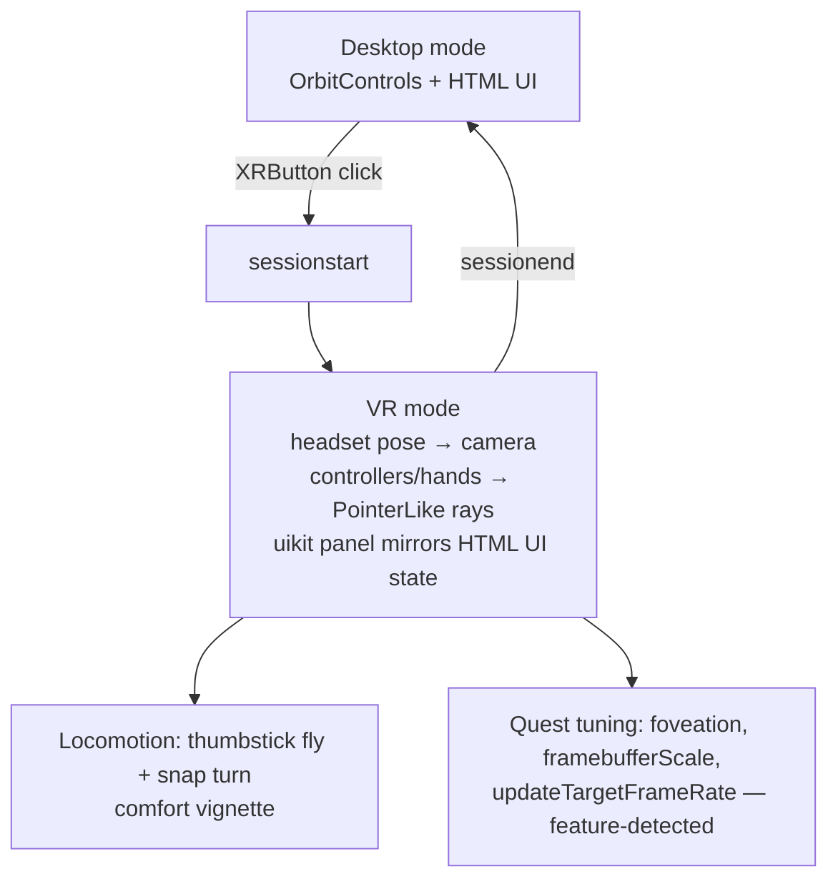

# PHASE 6 — WebXR VR mode (additive, headset-free development)

```yaml
milestone: M6
depends_on:
  - Complete desktop app: HiPS sky, star field, picking, search, info panel (PHASE-1..5)
  - Camera-in-rig scene graph (if PHASE-3 did not parent the camera under a rig Group, refactor first — step 1.2)
design_docs: docs/05-webxr-vr.md (primary), docs/06-performance.md, docs/01-architecture.md
research:    docs/research/threejs-webxr.md, docs/research/performance-quest.md
deliverable: An "Enter VR" button that turns the same scene into an immersive session with
             controller/hand ray interaction and in-VR UI panels — plus a phone "magic window"
             gyro mode. Developed and verified entirely in the Immersive Web Emulator + IWER
             (the team has NO headset).
exit_criteria:
  - Full feature parity in the emulator (every desktop interaction reachable in VR without keyboard)
  - Desktop mode completely unaffected when not presenting
  - Perf budgets from docs/06-performance.md hold on desktop; Quest-specific knobs implemented
    and feature-detected (cannot be measured without a device — flagged, not skipped)
  - `npx tsc --noEmit` clean, `npx vitest run` green (incl. IWER smoke test)
```

**Renderer decision (locked for this phase):** `THREE.WebGLRenderer` with `three@0.184.0` pinned.
Native-WebGPU-backend XR is closed against the **unreleased** r185
(github.com/mrdoob/three.js/issues/28968) and WebGL-backend multiview has an open right-eye
projection bug (#32538). Do not enable multiview; do not migrate renderers mid-phase. Renderer
construction must already live behind a `createRenderer()` factory (PHASE-0) — verify, don't assume.



---

## Step group 1 — Session wiring

### 1.1 Pre-flight verifications (do these FIRST, update docs with findings)

- [ ] VERIFY: read `node_modules/three/examples/jsm/webxr/XRButton.js` (r184) and confirm the
      exact `createButton(renderer, sessionInit)` options shape (`optionalFeatures` passthrough).
      Research flagged this as unconfirmed. Record the actual signature in docs/05-webxr-vr.md.
- [ ] VERIFY: read `node_modules/three/src/renderers/webxr/WebXRManager.js` and confirm the
      default foveation value (research memory says 1.0 = max foveation — bad for point stars).
      Record the finding; step 5.1 depends on it.
- [ ] Confirm `navigator.xr` exists on `http://localhost:5173` (localhost IS a secure context —
      no certs needed for emulator work).

### 1.2 Camera rig (refactor if missing)

The XR system writes the headset pose into the camera's **local** transform every frame. All app
locomotion must therefore move a parent rig, never the camera:

```ts
// src/engine/cameraRig.ts
export const cameraRig = new THREE.Group();   // locomotion writes position/yaw here
cameraRig.add(camera);                        // XR + desktop controls write camera-local pose
scene.add(cameraRig);
```

Desktop OrbitControls/fly controls keep mutating the camera as before when not presenting; in XR
they are disabled (1.3) and the rig is the only thing the app moves. Audit every
`camera.position.set/copy` call site in the codebase and reroute locomotion to the rig now —
this is the highest-regression-risk step of the phase; do it as its own commit with the full
desktop acceptance tests of PHASE-1..5 re-run afterwards.

### 1.3 Enable XR

```ts
import { XRButton } from 'three/addons/webxr/XRButton.js';

renderer.xr.enabled = true;
renderer.xr.setReferenceSpaceType('local-floor');   // default; fine for standing/seated sky viewing
document.body.appendChild(XRButton.createButton(renderer, {
  optionalFeatures: ['hand-tracking', 'layers'],    // VERIFY shape per 1.1
}));

renderer.xr.addEventListener('sessionstart', () => app.enterXR());
renderer.xr.addEventListener('sessionend',   () => app.exitXR());
```

`app.enterXR()` / `exitXR()` responsibilities (write as one function pair, unit-testable):

| enterXR | exitXR |
|---|---|
| disable desktop controls (`controls.enabled = false`) | re-enable + `controls.update()` |
| hide HTML overlay UI (CSS class, not unmount — state survives) | show HTML overlay |
| attach uikit panel + controller rays | detach them |
| apply Quest tuning (step 5) | restore desktop pixel ratio |
| switch picker source: mouse → XR pointers | switch back |

The animation loop is already `renderer.setAnimationLoop` from PHASE-0 (mandatory for XR — the
session drives its own rAF). If any code still uses `requestAnimationFrame`, fix it now.

### 1.4 Acceptance (step group 1)

- [ ] Desktop unaffected: all PHASE-5 acceptance tests still pass with XR code merged but no
      session active.
- [ ] Emulator: "ENTER VR" button appears, click → stereo render (two views visible in the
      emulated headset), `renderer.xr.isPresenting === true`; exit → desktop restored, controls
      work, no console errors, no duplicate event listeners on re-entry (enter/exit 3×).
- [ ] Commit: `feat(xr): session wiring, camera rig, enter/exit lifecycle`

---

## Step group 2 — Input: controllers, hands, ray select

### 2.1 Controller models (self-hosted profiles)

`XRControllerModelFactory` fetches controller GLTFs from
`https://cdn.jsdelivr.net/npm/@webxr-input-profiles/assets@1.0/dist/profiles` by default.
Self-host for production:

```bash
npm i -D @webxr-input-profiles/assets@1.0   # VERIFY exact latest 1.0.x on npm before pinning
cp -r node_modules/@webxr-input-profiles/assets/dist/profiles public/profiles
```

```ts
import { XRControllerModelFactory } from 'three/addons/webxr/XRControllerModelFactory.js';
import { XRHandModelFactory } from 'three/addons/webxr/XRHandModelFactory.js';

const cmf = new XRControllerModelFactory();
// VERIFY: method to point the factory at '/profiles' (research says .setPath() exists but is
// unconfirmed — read the r184 source; if absent, pass a configured GLTFLoader instead).
const hmf = new XRHandModelFactory();

for (const i of [0, 1] as const) {
  const grip = renderer.xr.getControllerGrip(i);
  grip.add(cmf.createControllerModel(grip));
  cameraRig.add(grip);                                   // rig, not scene — rides with locomotion

  const hand = renderer.xr.getHand(i);
  hand.add(hmf.createHandModel(hand, 'mesh'));
  cameraRig.add(hand);

  const ray = renderer.xr.getController(i);              // target-ray space
  ray.add(makeRayLine());                                // thin line + dot reticle where ray hits sky
  cameraRig.add(ray);
}
```

Note `XRControllerModelFactory` explicitly ignores hand input sources (verified in source) —
hands require `XRHandModelFactory`. Hand pinch fires the same `selectstart/select/selectend`
events on the controller Groups, so no separate select path is needed.

### 2.2 PointerLike abstraction (formalize what PHASE-3/5 sketched)

```ts
// src/interaction/pointers.ts
export interface PointerLike {
  /** Write the current pointing ray; return false if unavailable this frame. */
  getRay(out: THREE.Ray): boolean;
  /** 'click' = explicit select; 'dwell' = stable gaze (VR fallback) */
  readonly kind: 'mouse' | 'xr-controller' | 'xr-gaze';
}
```

- `MousePointer`: unprojects mouse NDC through the camera (existing PHASE-3 code, wrapped).
- `XRControllerPointer(i)`: ray from `renderer.xr.getController(i)` world transform
  (origin = position, direction = −Z). Reuse preallocated `Vector3`/`Quaternion` scratch —
  **zero allocations per frame** (docs/06-performance.md GC rule).
- `select` events from BOTH controllers and hands route into the same
  `skyPicker.lookupAtDirection(dir, 'click')` from PHASE-5. Gaze fallback (Vision Pro
  transient-pointer, cardboard-class) needs no special code: WebXR maps those onto the same
  controller select events.
- Raycast-on-hover for the reticle/highlight is throttled to ≤ 15 Hz, reusing one hit array.

### 2.3 Locomotion (3D star-field mode) + comfort

Thumbstick input comes from `inputSource.gamepad` (read in the frame loop via
`renderer.xr.getSession().inputSources`; cache references on `connected` events — do not iterate
allocating per frame):

- **Right stick Y** → fly along the camera's world forward; speed scales with context
  (sky mode: disabled; flythrough: `speed = baseSpeed * distanceToNearestChunkCenter` style
  scaling from PHASE-4, capped).
- **Right stick X (flick)** → snap turn: yaw the rig ±30° when |x| > 0.8, then require return
  to |x| < 0.2 before the next snap. No smooth turn by default.
- **Comfort vignette**: a camera-attached ring mesh (additively faded radial texture, renders
  last, `depthTest:false`) whose opacity ramps with locomotion speed (0 at rest → 0.7 at max).
  Pure shader/material work, no post-processing pass — FFR forbids mid-frame render-target
  switches (docs/research/performance-quest.md §2).
- **Comfort settings object** (persisted to `localStorage`): `{ snapTurn: true, vignette: true,
  speedScale: 1.0, seatedMode: false }`. `seatedMode` raises the rig so the horizon matches a
  seated user (offset +0.4 m). Expose all four in both the HTML settings and the VR panel.

### 2.4 Acceptance (step group 2)

- [ ] Emulator: controller models render at the emulated controller poses; moving a controller in
      the DevTools WebXR panel moves the ray; trigger press on a star opens the (VR) info panel.
- [ ] Emulator: thumbstick forward flies through the star field with vignette; snap turn rotates
      in 30° steps exactly once per flick.
- [ ] Vitest: snap-turn debounce logic (pure function: stick samples in → yaw deltas out).
- [ ] DevTools allocation timeline during 30 s of VR interaction: flat sawtooth, no per-frame
      allocations from `pointers.ts`/locomotion (zero-allocation gate, docs/06).
- [ ] Commit: `feat(xr): controllers, hands, ray select, locomotion + comfort`

---

## Step group 3 — In-VR UI panels (@pmndrs/uikit, vanilla API)

**Decision (from docs/research/threejs-webxr.md): `@pmndrs/uikit@1.0.73`** — actively maintained
(weekly releases through May 2026), vanilla Three.js API, powers Meta IWSDK spatial UI.
three-mesh-ui is dormant since 2023 (banned). DOM Overlay is handheld-AR-only (not a VR option).

### 3.1 Install + integration requirements

```bash
npm i @pmndrs/uikit@1.0.73   # re-verify latest 1.0.x at install time per AGENT_INSTRUCTIONS
```

```ts
import { reversePainterSortStable, Container, Text } from '@pmndrs/uikit';

renderer.localClippingEnabled = true;
renderer.setTransparentSort(reversePainterSortStable);

const vrPanelRoot = new Container({ flexDirection: 'column', /* sizes in meters */ });
cameraRig.add(vrPanelRoot);
// In the animation loop (XR only): vrPanelRoot.update(delta) — update() ONLY on the root.
```

VERIFY: the exact vanilla-API class names/props against
https://pmndrs.github.io/uikit/docs/getting-started/vanilla at install time (the research
captured the integration requirements verbatim, but uikit releases weekly — the `Container`
constructor shape may have moved). If the API has drifted badly, fallback option: render the
HTML `InfoPanel` to a `CanvasTexture` quad (uglier text, zero new deps) — record the choice in
docs/DECISIONS.md.

### 3.2 Panel set (mirror desktop state, do not fork logic)

All panels are pure renders of the SAME state stores the HTML UI uses (PHASE-5
`SelectedObjectState`, layer registry, comfort settings). One `syncVrUi(state)` function maps
state → uikit component props.

1. **Info panel** — main_id, otype label, magnitudes, cutout (load the hips2fits JPEG as a uikit
   image — same `cutoutUrl()`), buttons: \[Fly to] \[Close]. Outbound links are desktop-only
   (opening tabs ends the XR session — show "open on desktop" hint instead).
2. **Quick menu** (toggled by left-controller `squeeze` or Y button):
   survey layer switcher (one button per registry entry), star-exposure slider,
   comfort toggles, "Exit VR" button.
3. **Search**: no keyboard in VR — provide a "Tour targets" list instead (Sirius, M31, Orion
   Nebula, Pleiades, Crab, Sgr A* region…, defined in `src/data/tourTargets.ts` with ICRS
   coordinates) that reuses `flyTo`. Full text search remains a desktop feature; do not attempt
   a VR keyboard in v1.

Placement: panel floats 1.2 m in front of the camera at session start, world-anchored (not
head-locked — head-locked UI is a comfort violation); a grip-drag repositions it. Hide when
empty.

uikit interaction: uikit components handle pointer events from controller rays — wire its event
system to the controllers per the vanilla docs section on XR interaction. VERIFY: uikit's
pointer-events wiring for plain three.js controllers (the docs cover it; capture the exact
snippet into docs/05-webxr-vr.md when implemented).

### 3.3 Acceptance (step group 3)

- [ ] Emulator: trigger-click a star → VR info panel shows the same data the desktop panel would
      (compare by clicking the same star on desktop afterwards).
- [ ] Emulator: quick menu opens/closes; switching survey layer visibly swaps the sky; exposure
      slider works; every comfort toggle works.
- [ ] Emulator: all tour targets fly correctly.
- [ ] State sync: change layer in VR, exit VR → HTML UI shows the same layer selected.
- [ ] Commit: `feat(xr-ui): uikit VR panels mirroring desktop state`

---

## Step group 4 — Emulator test checklist (run end-to-end, every time this phase changes)

Setup (once):

1. Install Chrome/Edge. Install **Immersive Web Emulator** from the Chrome Web Store
   (id `cgffilbpcibhmcfbgggfhfolhkfbhmik`, by Meta).
2. `npm run dev` → open `http://localhost:5173` (secure context — no cert needed).
3. Open DevTools → **WebXR** tab appears. Select device "Meta Quest 3".

Checklist (all must pass):

| # | Action | Expected |
|---|---|---|
| E1 | Console: `await navigator.xr.isSessionSupported('immersive-vr')` | `true` |
| E2 | Click ENTER VR | Stereo render; no console errors; HTML overlay hidden |
| E3 | Drag headset transform in WebXR tab | View pans correspondingly; sky stays glued to world (no head-locked sky) |
| E4 | Move controller; aim ray at a bright star | Reticle/highlight on the star (hover raycast working) |
| E5 | Press trigger (emulator button/shortcut) | VR info panel opens with correct object |
| E6 | Aim at panel buttons, trigger | Buttons respond (uikit events) |
| E7 | Left squeeze / Y | Quick menu toggles |
| E8 | Switch survey layer from quick menu | Sky imagery swaps |
| E9 | Right-stick forward (flythrough scene) | Locomotion + vignette |
| E10 | Right-stick flick left/right | Single 30° snap turns |
| E11 | Tour target "M31" | Camera rig orients to Andromeda |
| E12 | Exit VR (button in quick menu AND browser back) | Desktop restored: OrbitControls live, HTML UI matches VR state |
| E13 | Re-enter VR, repeat E5 | No duplicated panels/listeners |
| E14 | Emulated hands (if the current extension build supports hand emulation — VERIFY; research flags it as historically absent) | Pinch = select. If unsupported in emulator: mark "untested on hands, code path additive" in docs/05 |

Automated IWER smoke test (CI-capable, `iwer@2.2.1`):

```ts
// tests/xr.smoke.test.ts — runs in vitest browser mode or Playwright
import { XRDevice, metaQuest3 } from 'iwer';      // VERIFY import names against iwer 2.2 docs
const xrDevice = new XRDevice(metaQuest3);
xrDevice.installRuntime();                         // injects navigator.xr
// boot app, then:
// - request 'immersive-vr' session via the same code path as XRButton
// - assert renderer.xr.isPresenting === true within 2 s
// - advance frames; assert renderer.render called with ArrayCamera of 2 views
// - end session; assert desktop controls re-enabled
```

- [ ] Commit: `test(xr): emulator checklist doc + IWER smoke test`

---

## Step group 5 — Quest tuning + perf pass (against docs/06-performance.md budgets)

The team has no headset: everything here must be **feature-detected and fail-safe**, verified in
the emulator for code-path correctness, and explicitly flagged as needing on-device validation
(ROADMAP "device validation" item). Do not delete these knobs because the emulator can't prove
them.

### 5.1 Session tuning block

```ts
renderer.xr.addEventListener('sessionstart', async () => {
  const session = renderer.xr.getSession()!;
  // Frame rate: 72 on Quest-2-class buys 13.7 ms vs 11.1 ms budget (verified Meta API, Browser ≥16.4)
  const rates = session.supportedFrameRates;            // may be undefined in emulator
  if (rates?.includes(72) && isQuest2Class()) await session.updateTargetFrameRate(72);
  else if (rates?.includes(90)) await session.updateTargetFrameRate(90);
});
// BEFORE session start only:
renderer.xr.setFramebufferScaleFactor(0.9);   // Meta-recommended 0.8–0.9 when GPU-bound
// Foveation: stars are the worst case for FFR (bright point on black shimmers in the periphery).
renderer.xr.setFoveation(0.3);                // 0.3 starfield / up to 0.5 for HiPS-sky-only scenes
// VERIFY (step 1.1): if r184 default is 1.0, this lowering is mandatory, not optional.
```

`isQuest2Class()`: UA-string sniff for Quest Browser + heuristic; default to the conservative
branch when unknown. VERIFY on device eventually: forum reports (2023-era) said Quest Browser
forced 90 Hz — `updateTargetFrameRate(72)` may reject; catch and log, never crash.

### 5.2 Perf gate (run on desktop now; on device when available)

Budgets are **gates, not suggestions** (AGENT_INSTRUCTIONS). From docs/06-performance.md
(Quest 2 column): ≤ 80 draw calls, ≤ 4 for the sky mosaic, ≤ 300 k points post-cull, ≤ 6 px max
point sprite, ≤ 1 tile upload/frame, 0 steady-state allocations/frame, ≤ 350 MiB total GPU
texture memory.

- [ ] The dev HUD (PHASE-1; `renderer.info` overlay) gains budget assertions: turning any line
      red when over budget, with a `console.warn` once per excursion.
- [ ] In the emulator XR session, sweep the worst views (galactic plane at order ~7, dense
      star-field cluster): HUD stays within budget on the desktop GPU. Record numbers in
      docs/06-performance.md "measured" column.
- [ ] 60 s DevTools performance capture in XR: no GC major pauses, no rAF task > 8 ms on a
      desktop machine (proxy for the 4 ms Quest JS budget — desktop is faster; if desktop
      exceeds 8 ms, Quest will certainly fail).
- [ ] VR renders directly to the XR framebuffer: **no EffectComposer/post-processing passes, no
      mid-frame render-target switches** while presenting (breaks FFR; verified Meta caveat).
      The comfort vignette must be a scene mesh, not a pass — re-check.
- [ ] OPTIONAL stretch (skip unless ahead of schedule): `XREquirectLayer` compositor path for the
      sky sphere (verified ~2.4 ms / 25 % GPU savings class on Quest). Feature-detect
      `XRWebGLBinding.createEquirectLayer`; ship the in-scene sphere as default.
- [ ] Commit: `perf(xr): session tuning, budget assertions, FFR-safe pipeline`

---

## Step group 6 — Phone "magic window" mode

iOS Safari has **no WebXR** in 2026 (verified) — phones get pointer-drag look-around everywhere
plus opt-in gyro. three.js removed `DeviceOrientationControls` (~r134), so vendor a controller.

### 6.1 Vendored controller (port of the removed three.js implementation, MIT)

```ts
// src/interaction/gyroLook.ts — quaternion mapping, zero allocations per event
const zee = new THREE.Vector3(0, 0, 1);
const euler = new THREE.Euler();
const q0 = new THREE.Quaternion();
const q1 = new THREE.Quaternion(-Math.SQRT1_2, 0, 0, Math.SQRT1_2); // -PI/2 around X

export function orientationToQuaternion(
  out: THREE.Quaternion,
  alphaRad: number, betaRad: number, gammaRad: number, screenOrientRad: number,
): void {
  euler.set(betaRad, alphaRad, -gammaRad, 'YXZ');
  out.setFromEuler(euler);
  out.multiply(q1);                                       // camera looks out the back of device
  out.multiply(q0.setFromAxisAngle(zee, -screenOrientRad)); // screen rotation compensation
}
```

### 6.2 Permission flow (iOS 13+ pattern, unchanged through 2026)

- A visible "Look around with your phone 🧭" button (never auto-request). In its **click**
  handler: `DeviceOrientationEvent.requestPermission()` if the function exists (iOS); resolves
  `'granted'|'denied'`; requires HTTPS (LAN testing: `@vitejs/plugin-basic-ssl` + `vite --host`,
  accept the cert warning on the phone).
- Android Chrome: no prompt; same listener.
- On grant: blend gyro orientation with the existing touch-drag controls (gyro sets the base
  orientation; drag applies an additional yaw/pitch offset — the Google Cardboard-era hybrid).
- Compass alignment ("hold phone at the real sky"): **deferred to a later milestone.**
  VERIFY first on real devices: `webkitCompassHeading` (iOS) vs `deviceorientationabsolute`
  (Android) behavior is flagged unverified in research. Without it, gyro mode starts oriented
  to wherever the camera was — acceptable v1.

### 6.3 Acceptance (step group 6)

- [ ] Chrome DevTools sensor emulation (More tools → Sensors → orientation): rotating the virtual
      device rotates the view correctly (no roll inversion — the classic bug; test all four
      screen orientations).
- [ ] On a real phone over LAN HTTPS: button → prompt (iOS) → look-around works; deny → graceful
      message, drag controls still work.
- [ ] Commit: `feat(mobile): gyro magic-window mode with gesture-gated permission`

---

## PHASE-6 ACCEPTANCE TESTS (all must pass before PHASE-7)

| # | Test | Pass criterion |
|---|---|---|
| A1 | Full emulator checklist E1–E14 (step group 4) | All pass; E14 may be waived only with the documented emulator limitation |
| A2 | Feature-parity matrix: list every desktop interaction (select object, info panel, layer switch, exposure, fly-to targets, comfort settings, exit) | Each row has a working VR input path — **no keyboard required anywhere in VR** |
| A3 | IWER smoke test in CI | Green |
| A4 | Desktop regression: PHASE-5 acceptance A1–A7 | Still pass |
| A5 | Perf gate (step 5.2) | HUD within budgets in emulator XR on the dev machine; zero steady-state allocations |
| A6 | Magic-window on one real phone | Works per 6.3 |
| A7 | `npx tsc --noEmit` + `npx vitest run` | Clean / green |

Open items to carry into ROADMAP (not blockers):
- On-device Quest validation (frame rate, `supportedFrameRates`, real texture-memory ceiling,
  `ALIASED_POINT_SIZE_RANGE`) — requires acquiring a device or a device cloud; **escalate to the
  human** per AGENT_INSTRUCTIONS (spending money).
- Hand-tracking end-to-end test if the emulator build lacks it.
- visionOS transient-pointer verification (community reports only).
