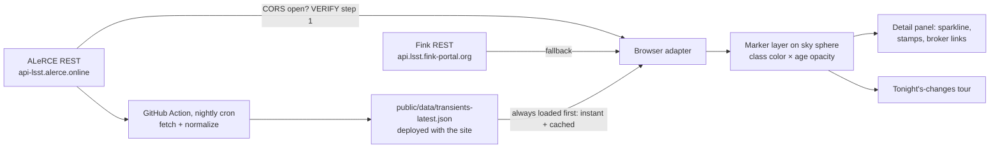

# PHASE 7 — Live-sky transient layer (Rubin/LSST alerts) + LSST readiness

```yaml
milestone: M7
depends_on:
  - Sky sphere + raDecToVector3 helper (PHASE-1), picking + info panel (PHASE-5), fly-to (PHASE-5),
    VR UI panels (PHASE-6 — tour mode must work in VR too)
design_docs: docs/01-architecture.md (TransientProvider interface), docs/02-data-sources.md,
             docs/07-pitfalls.md (BigInt IDs, nJy fluxes)
research:    docs/research/lsst-rubin.md (primary — all broker endpoints live-verified 2026-06-11)
deliverable: "What changed tonight" — real Rubin/LSST transients from the last 72 h as markers on
             the sky, with classification/age styling, a detail panel (light-curve sparkline +
             cutout stamps), and a guided tour mode. Plus the LSST-readiness checklist so future
             public Rubin data drops in as configuration.
exit_criteria:
  - Real transients detected within the last 72 h render at correct sky positions
    (3 spot-checked against the broker's own web explorer)
  - Works with zero backend if broker CORS is open; otherwise the documented static-snapshot
    fallback is active (GitHub Action, still $0/no-server)
  - int64 IDs survive round-trips (no precision loss), fluxes displayed as AB magnitudes
  - `npx tsc --noEmit` clean, `npx vitest run` green
```

**Context (verified 2026-06-11):** Rubin pixel/catalog data is locked behind data-rights RSP
accounts (all RSP APIs return 401 anonymously), but the **alert stream is world-public** —
streaming since 2026-02-24, ~800 k alerts night one. Anonymous REST access to real Rubin
transients was live-verified against two brokers:

| Broker | Base | Style | Verdict |
|---|---|---|---|
| **ALeRCE (PRIMARY)** | `https://api-lsst.alerce.online/` | GET + query params, OpenAPI at `/object_api/openapi.json`, `/lightcurve_api/openapi.json`, Swagger UI at `/object_api/docs` | Cleanest browser fit; verified returning real LSST objects anonymously |
| **Fink (SECONDARY)** | `https://api.lsst.fink-portal.org` | POST + JSON bodies; `GET /api/v1/schema` for discovery | Verified working but observed intermittent 502s — retry/backoff mandatory |

The same numeric `diaObjectId` (e.g. `170226393632735260`) resolves in both brokers — IDs are
broker-portable.

**Two traps (both verified, both will silently corrupt data if ignored):**
1. `diaObjectId` is an int64 **larger than 2^53** — `JSON.parse` → `Number` corrupts it.
   All IDs are strings in our code; see step 2.2.
2. Broker photometry is in **nJy flux**, not magnitudes:
   `mag_AB = -2.5 * log10(flux_nJy * 1e-9 / 3631)` ≈ `31.4 - 2.5*log10(flux_nJy)`.
   Convert at the adapter boundary; the UI only ever sees AB magnitudes.



---

## Step group 1 — CORS gate (decides the architecture; do this before writing any adapter)

Research explicitly did NOT capture broker CORS headers (open question). Test now:

```bash
# From a terminal — look for access-control-allow-origin in the response headers:
curl -s -D - -o /dev/null -H "Origin: https://example.com" \
  "https://api-lsst.alerce.online/object_api/list_objects?survey=lsst&page_size=1"
curl -s -D - -o /dev/null -H "Origin: https://example.com" \
  -H "Content-Type: application/json" -X POST \
  -d '{"ra":150.0,"dec":0.5,"radius":60}' \
  "https://api.lsst.fink-portal.org/api/v1/conesearch"
# POST + application/json triggers a preflight in browsers — also probe OPTIONS for Fink:
curl -s -D - -o /dev/null -X OPTIONS -H "Origin: https://example.com" \
  -H "Access-Control-Request-Method: POST" \
  -H "Access-Control-Request-Headers: content-type" \
  "https://api.lsst.fink-portal.org/api/v1/conesearch"
```

Then confirm from a real browser context (`fetch` from the dev origin in DevTools console).

**Decision matrix — record the outcome in docs/DECISIONS.md and update docs/02-data-sources.md:**

| Outcome | Architecture |
|---|---|
| ALeRCE CORS open | Direct browser calls (primary path below) + snapshot for first paint |
| ALeRCE closed, Fink open | Swap primary/secondary adapter order |
| Both closed | **Static-snapshot-only** (step group 4) for v1 — still zero backend. A ~15-line Cloudflare Worker proxy is the documented alternative but requires human approval (backend rule in AGENT_INSTRUCTIONS) |

Regardless of outcome, build the snapshot path (step 4): it gives instant first paint, absorbs
broker 502 flakiness, and keeps us a polite client (one fetch per night vs per user).

- [ ] Commit: `docs(transients): broker CORS probe results + architecture decision`

---

## Step group 2 — TransientProvider interface + ALeRCE adapter

### 2.1 Interface (from docs/01-architecture.md; create if the architecture doc deferred it)

```ts
// src/data/transients/types.ts
export interface TransientSummary {
  id: string;                  // diaObjectId AS STRING — never Number
  raDeg: number; decDeg: number;
  className?: string;          // e.g. 'SN' (classifier output)
  classProb?: number;          // 0..1
  nDet: number;
  firstMjd: number; lastMjd: number;
  latestMagAB?: number; latestBand?: string;
  provider: 'alerce' | 'fink' | 'snapshot';
}
export interface PhotPoint { mjd: number; band: string; magAB: number; magErrAB?: number; }

export interface TransientProvider {
  readonly id: 'alerce' | 'fink';
  listRecent(opts: { sinceMjd: number; minProb?: number; limit: number }): Promise<TransientSummary[]>;
  coneSearch(raDeg: number, decDeg: number, radiusArcsec: number): Promise<TransientSummary[]>;
  lightcurve(id: string): Promise<PhotPoint[]>;
  /** May return null if stamps are unavailable (see step 5.3 fallback). */
  stampUrl(id: string, kind: 'science' | 'template' | 'difference'): string | null;
}
```

MJD helper (unit-test with a known date):

```ts
// Unix epoch 1970-01-01T00:00Z = JD 2440587.5 = MJD 40587.0
export const mjdNow = () => Date.now() / 86400000 + 40587.0;
export const mjdToDate = (mjd: number) => new Date((mjd - 40587.0) * 86400000);
```

### 2.2 int64-safe JSON parsing (shared utility, used by every adapter)

```ts
// src/data/transients/safeJson.ts
// Quote any bare integer of 16+ digits appearing as a value of known int64 keys
// BEFORE JSON.parse touches it. Keys observed in verified responses: oid, diaObjectId.
const INT64_KEYS = /"(oid|diaObjectId)"\s*:\s*(\d{15,})/g;
export function parseWithBigIds(text: string): unknown {
  return JSON.parse(text.replace(INT64_KEYS, '"$1":"$2"'));
}
```

Vitest: `parseWithBigIds('{"oid":170226393632735260}')` yields the exact string
`"170226393632735260"` (the naive `JSON.parse` test value would end in `…260` corrupted to
`…256` — assert the difference explicitly so the test documents the trap).

### 2.3 ALeRCE adapter (verified endpoints)

```ts
// src/data/transients/alerce.ts
const BASE = 'https://api-lsst.alerce.online';
// Verified live 2026-06-11 (HTTP 200, anonymous):
//   GET /object_api/list_objects?survey=lsst
//     params: survey, class_name, classifier, probability, n_det, firstmjd, lastmjd,
//             ra, dec, radius, oid, ranking, page, page_size
//   GET /lightcurve_api/detections?oid=...&survey_id=lsst   (also /lightcurve, /forced-photometry)
//   GET /lightcurve_api/conesearch/objects_by_coordinates?ra&dec&radius&neighbors
//   POST /stamps_api/stamp
```

`listRecent` implementation notes:
- Filter: `survey=lsst&firstmjd=<sinceMjd>&page_size=<limit>` — VERIFY: whether
  `firstmjd`/`lastmjd` params act as ≥ / ≤ bounds (likely `firstmjd` = min-first-detection).
  Read `GET /object_api/openapi.json` (verified to exist) and pin the semantics; if range params
  are min-bounds only, fetch and post-filter `lastMjd >= sinceMjd` client-side.
- Verified response fields per object: `oid`, `meanra`, `meandec`, `firstmjd`, `lastmjd`,
  `n_det`, `n_forced`, `class_name`, `classifier_name` (`stamp_classifier_rubin_beta`),
  `classifier_version`, `probability`. Map `meanra/meandec` → `raDeg/decDeg`.
- Latest magnitude requires the lightcurve endpoint — do NOT fetch lightcurves in the list call
  (n+1 requests); leave `latestMagAB` undefined until the detail panel opens.
- All responses through `parseWithBigIds`; never `r.json()` for broker payloads.
- Caveat from research: the classified LSST stream is young (`stamp_classifier_rubin_beta` had
  few objects in June 2026). If a `minProb` filter empties the list, retry once with the filter
  dropped and tag results "unclassified" — never render an empty layer without explaining why.

`lightcurve`: GET `/lightcurve_api/detections?oid=<id>&survey_id=lsst`; convert `psfFlux` (nJy)
→ AB mag at the boundary; drop points with non-positive flux from the magnitude series (they are
non-detections — VERIFY against the OpenAPI whether detections can carry negative difference
fluxes; if so, render them separately as upper-limit ticks, not magnitudes).

### 2.4 Fink adapter (secondary)

```ts
// src/data/transients/fink.ts
const BASE = 'https://api.lsst.fink-portal.org';
// Verified live: POST /api/v1/objects   {"diaObjectId":"170226393632735260"}
//                POST /api/v1/conesearch {"ra":150.0,"dec":0.5,"radius":60}   (radius ARCSEC)
//                GET  /api/v1/schema (endpoint discovery)
// Known broken: ZTF-style /api/v1/latests is 404 on the LSST host.
```

- VERIFY: the Fink LSST replacement for class-based "latest" queries — check `GET /api/v1/schema`
  and https://api.lsst.fink-portal.org docs UI at implementation time. If none exists,
  Fink remains lookup/conesearch-only (sufficient for a secondary).
- Wrap every call in retry-with-backoff (3 tries: 0.5 s / 2 s / 8 s) + a circuit breaker
  (after 3 consecutive failures, mark provider down for 10 min) — intermittent 502s were
  observed live on this API.
- Fink fields are prefixed: `r:*` = Rubin alert fields (`r:diaObjectId`, `r:ra`, `r:dec`,
  per-band `r:g_psfFluxMean`…), `f:*` = Fink value-added. Lightcurves live at `/api/v1/sources`
  (was 502-flaky during research — VERIFY shape on first success and pin a fixture).

### 2.5 Acceptance (step group 2)

- [ ] Vitest: `parseWithBigIds` precision test (2.2); MJD round-trip
      (`mjdToDate(60836) ≈ 2025-06-10T00:00Z` — recompute, don't trust this comment);
      nJy→AB conversion (`flux 3631e9 nJy → mag 0.000`, `flux 10000 nJy → 21.40`).
- [ ] Vitest: adapters against committed real-response fixtures (capture one
      `list_objects` page and one `detections` response with `curl` and commit them).
- [ ] Manual (node script or browser, network on): `alerce.listRecent({sinceMjd: mjdNow()-3, limit: 50})`
      returns ≥ 1 object with sane coordinates (0 ≤ ra < 360, −90 ≤ dec ≤ 90).
- [ ] Commit: `feat(transients): TransientProvider + ALeRCE/Fink adapters with int64-safe parsing`

---

## Step group 3 — Markers on the sky sphere

### 3.1 Marker layer

`src/render/transientMarkers.ts` — one `THREE.Points` object (single draw call, within the
docs/06 budget) with custom `ShaderMaterial`:

- Position: `raDecToVector3(raDeg, decDeg)` (the PHASE-1 helper — same axis convention as the
  sky sphere, no exceptions) scaled to `0.995 × skySphereRadius` so markers render just inside
  the imagery; `depthTest: false`, drawn after the sky, before UI.
- Per-vertex attributes: `classColor` (vec3), `ageDays` (float), `prob` (float).
- Vertex shader: `gl_PointSize = mix(14.0, 6.0, clamp(ageDays/3.0, 0., 1.)) * sizeScale;`
  (clamped ≤ the per-platform max sprite size from docs/06 — 6 px in VR).
- Fragment: ring + center-dot sprite drawn procedurally from `gl_PointCoord` (no texture
  fetch); `alpha = mix(1.0, 0.25, clamp(ageDays/3.0, 0., 1.))` — **newer = bigger + brighter**.
- A subtle 1 Hz pulse (`sin(uTime)`) ONLY for markers with `ageDays < 1` ("tonight").

Class → color palette (`src/data/transients/palette.ts`, also rendered as a legend in the UI):

| class_name | color | note |
|---|---|---|
| SN (+SN-like) | `#ff9f43` orange | supernova candidates |
| AGN / QSO | `#a55eea` purple | nuclear/accretion |
| VS / periodic (variable star classes) | `#48dbfb` cyan | |
| asteroid / SSO (`f:is_sso` on Fink) | `#7bed9f` green | movers — position is per-epoch! show with dashed ring |
| unclassified / other | `#ced6e0` gray | |

VERIFY: the actual `class_name` vocabulary of `stamp_classifier_rubin_beta` v2.x — list distinct
values from a real `list_objects` page and extend the palette; unknown classes fall through to
gray (never crash on a new label).

### 3.2 Layer behavior

- Toggle in the layer menu: "Tonight's sky (Rubin alerts)" — default ON, with the timestamp of
  the data ("alerts as of 2026-06-11 09:17 UT" from the snapshot metadata / fetch time).
- Markers participate in picking: nearest marker within 0.5° of the pick ray (angular test on
  unit vectors — `acos(dot) < 0.5°`; reuse the throttled raycast budget, simple linear scan is
  fine for ≤ ~2000 markers).
- Refresh: on app load + manual refresh button. NO polling loop (be a polite client; the data
  changes nightly).
- Honest-data rule: markers carry classification probabilities — the UI must show
  `SN 87%`, not `Supernova`. Below 50% or unclassified: "unclassified transient".

### 3.3 Acceptance (step group 3)

- [ ] Markers render at correct positions: pick 3 transients, paste their `meanra/meandec` into
      the search box (coordinate mode from PHASE-5 step 3.2.4) — the camera lands exactly on the
      marker each time.
- [ ] Cross-check the same 3 objects in the broker's own explorer
      (`https://lsst.alerce.online/` — search by oid; VERIFY the object-page URL shape when
      first used) — class and position match what we display.
- [ ] HUD: transient layer adds exactly 1 draw call; no per-frame allocations.
- [ ] Commit: `feat(transients): sky markers with class/age styling and picking`

---

## Step group 4 — Nightly snapshot (GitHub Action → static JSON)

Purpose: instant first paint, CORS independence, broker-flakiness absorption, politeness.
This is NOT a backend (static file generation on a scheduler) — allowed under the v1 rules.

### 4.1 Fetch script

`scripts/fetch-transients.mjs` (plain Node 22+, no deps; reuses the same normalization logic —
extract `normalizeAlerce()` into a shared `scripts/lib/` module imported by both the app adapter
and this script, or duplicate knowingly with a sync-comment):

1. `listRecent` equivalent against ALeRCE (last 72 h, `page_size=200`, paginate up to 1000
   objects max), retry ×3.
2. On total ALeRCE failure: try Fink conesearch sweep? **No** — too many calls; instead emit the
   previous snapshot unchanged and set `"stale": true` (the UI shows "last successful update …").
3. Output `public/data/transients-latest.json`:

```json
{
  "generatedUtc": "2026-06-12T09:17:03Z",
  "sinceMjd": 60835.0,
  "provider": "alerce",
  "stale": false,
  "transients": [ { "id": "170226393632735260", "raDeg": 149.98, "decDeg": 0.54,
                    "className": "SN", "classProb": 0.997, "nDet": 60,
                    "firstMjd": 61135.0, "lastMjd": 61178.98 } ]
}
```

### 4.2 Workflow

```yaml
# .github/workflows/transients-snapshot.yml
name: Nightly transient snapshot
on:
  schedule:
    - cron: '17 10 * * *'   # 10:17 UT — after the Chilean observing night ends
  workflow_dispatch: {}
permissions: { contents: write }
jobs:
  snapshot:
    runs-on: ubuntu-latest
    steps:
      - uses: actions/checkout@v4
      - uses: actions/setup-node@v4
        with: { node-version: 'lts/*' }
      - run: node scripts/fetch-transients.mjs
      - name: Commit snapshot if changed
        run: |
          git config user.name 'transient-bot'
          git config user.email 'actions@users.noreply.github.com'
          git add public/data/transients-latest.json
          git diff --cached --quiet || git commit -m 'chore(data): nightly transient snapshot'
          git push
```

(The commit triggers the normal deploy workflow from PHASE-8. If deploy minutes become a
concern, switch to `wrangler r2 object put` of the JSON instead of a commit — note in
docs/DECISIONS.md if you do.)

### 4.3 Client load order

1. Fetch `data/transients-latest.json` (same-origin, instant, SW-cached in PHASE-8) → render
   markers immediately.
2. If the step-1 CORS gate concluded "direct allowed": background-refresh from ALeRCE and merge
   (snapshot entries updated in place by id; `provider` flag flips to `alerce`).
3. If both fail: layer shows last data with its `generatedUtc` and a "stale" badge. Never an
   empty sky without explanation.

### 4.4 Acceptance (step group 4)

- [ ] `node scripts/fetch-transients.mjs` produces valid JSON locally; vitest validates the file
      against a schema (zod or hand-rolled validator).
- [ ] `workflow_dispatch` run on GitHub succeeds end-to-end (requires the repo to exist —
      if CI is not yet set up, defer this checkbox to PHASE-8 and note it).
- [ ] App boots and renders markers from the snapshot with network throttled to offline-after-load.
- [ ] Commit: `feat(transients): nightly snapshot pipeline + snapshot-first client loading`

---

## Step group 5 — Transient detail panel

Extends the PHASE-5 info panel with a transient variant (same `SelectedObjectState` store, a
`kind: 'transient'` discriminant).

### 5.1 Content

```
┌────────────────────────────────────┐
│ Rubin transient 1702263…35260  ✕  │   ← id truncated middle, full on copy
│ SN candidate — 99.7% (stamp_classifier_rubin_beta v2.0.1) │
│ First seen: 2026-05-30 (12 d ago)  │   ← mjdToDate(firstMjd)
│ Last seen:  2026-06-11 (0.4 d ago) │
│ 60 detections                      │
│ ▁▂▄▆█▆▅  light curve (sparkline)   │   ← 5.2
│ [sci] [tmpl] [diff] stamps         │   ← 5.3
│ [ALeRCE ↗] [Fink ↗]                │
│ Alerts: Rubin Observatory via ALeRCE │  ← attribution
└────────────────────────────────────┘
```

### 5.2 Light-curve sparkline (no chart library — ~60 lines of SVG)

- Fetch `lightcurve(id)` on panel open (debounced, cached by id).
- One `<svg>` 280×80: x = mjd (last 30 d window), y = AB mag **inverted** (brighter = up —
  astronomers will notice if you get this wrong), one polyline + dots per band.
- Band colors (ugrizy convention): u `#56b4e9`, g `#009e73`, r `#e69f00`, i `#d55e00`,
  z `#cc79a7`, y `#999999`. Legend chips under the plot.
- Error bars as 1 px vertical lines when `magErrAB` present. Tooltip on dot hover:
  `g 21.43 ± 0.05, MJD 61178.98 (2026-06-11)`.
- VR: render the same SVG to a `CanvasTexture` for the uikit panel (uikit image component),
  regenerate only when data changes.

### 5.3 Cutout stamps

Research could not complete an end-to-end stamp fetch (Fink 502s during the probe window) —
treat the whole feature as VERIFY-gated:

1. VERIFY: `POST https://api-lsst.alerce.online/stamps_api/stamp` — discover the exact request
   body and response format (PNG bytes? FITS? base64?) from `/object_api/docs` Swagger UI or the
   `alerce` Python client source (github.com/alercebroker/alerce_client). Pin a fixture.
2. If PNG/JPEG bytes: render the three stamps (science/template/difference) as `` from a
   blob URL. If FITS-only: **do not write a FITS decoder in this phase** — fall through to 3.
3. **Fallback (always implemented):** a hips2fits context cutout of the transient's position
   (`cutoutUrl({hipsId: activeSurveyId, raDeg, decDeg, fovDeg: 0.05})`, PHASE-5 code) labeled
   "archival sky at this position" — honest about not being the alert image — plus the broker
   links where users can see real stamps.

Links out: `https://lsst.alerce.online/object/<id>` (VERIFY exact path on first use) and the
Fink LSST portal object page (VERIFY path via `lsst.fink-portal.org`).

### 5.4 Acceptance (step group 5)

- [ ] Click a marker → panel with classification + probability + dates; sparkline renders for an
      object with ≥ 5 detections; magnitudes in plausible range (16–25 AB).
- [ ] Sparkline y-axis inverted (verify against the broker explorer's plot for the same object).
- [ ] Stamps appear OR the labeled archival fallback appears — never a broken image slot.
- [ ] Commit: `feat(transients): detail panel with light curve and stamps`

---

## Step group 6 — "Tonight's sky changes" tour mode

1. Build the tour list: snapshot transients filtered `lastMjd >= mjdNow()-1.5`, sorted by
   `classProb` desc then `nDet` desc, top 10. If < 3 results, widen to 72 h and retitle
   "Recent sky changes".
2. UI: "▶ What changed tonight" button (desktop top bar + VR quick menu). Sequence per stop:
   `flyTo(ra, dec)` (1.2 s) → open detail panel → dwell 8 s (or until Next) → next.
   Controls: Next / Prev / Pause / Exit; VR: same buttons on the uikit panel.
3. During the tour, dim non-tour markers to 30% opacity for focus; restore on exit.
4. Edge case: empty snapshot (cloudy night / broker outage) → button shows disabled state with
   "No alert data for tonight (last data: <date>)".

### Acceptance (step group 6)

- [ ] Tour visits ≥ 3 real transients with correct camera landings and panels; Pause/Prev/Exit
      all work; VR tour works in the emulator end-to-end (PHASE-6 E-checklist style).
- [ ] Commit: `feat(transients): tonight's-changes tour mode`

---

## Step group 7 — LSST-readiness checklist (configuration seams for the public-data future)

Rubin imagery/catalogs will eventually arrive shaped exactly like what we already consume
(HiPS / TAP / SODA≈hips2fits / REST lists — DMTN-230: public releases planned as static public
HiPS on Google Cloud Storage). Make "Rubin DR1 goes public" a config change, not a refactor:

- [ ] **Survey registry entries prepared** (`src/data/surveys.ts`):
      - `rubin-firstlook` ACTIVE now: base `https://alasky.cds.unistra.fr/Rubin/CDS_P_Rubin_FirstLook`
        (ID `CDS/P/Rubin/FirstLook`, order 12, png+webp, ~29 deg², ODbL-1.0,
        copyright RubinObs/NOIRLab/SLAC/NSF/DOE/AURA) — if PHASE-1/2 didn't add it, add it now
        as a featured partial-coverage layer **with its MOC loaded** (0.06% sky coverage looks
        broken without the coverage boundary).
      - `rubin-dr1` PLACEHOLDER entry: `{ enabled: false, rootUrl: null, note: 'flip when public' }`.
- [ ] **Auth seam, unimplemented:** the HiPS tile fetcher and the registry descriptor accept an
      optional `authHeaders?: () => Promise<Record<string,string>>` hook that is `undefined`
      everywhere. Do NOT build token plumbing (no data rights = no testable path).
- [ ] **Discovery watch:** document (in docs/02-data-sources.md) the periodic re-probe —
      `https://alasky.cds.unistra.fr/MocServer/query?expr=ID%3D*Rubin*&get=record&fmt=json` —
      to catch new public Rubin HiPS (e.g. around DP2, Jul–Sep 2026). Optional: extend the
      nightly snapshot Action to run this query and fail-loudly (issue comment) when a new
      record appears.
- [ ] **The flip list** (verbatim checklist for the future agent, keep in this file):
      1. New public Rubin HiPS announced → fetch `{base}/properties`, read `hips_order`,
         `hips_tile_width` (do NOT assume 512 — generalize the +9 order shift to
         `log2(hips_tile_width)` if needed), `hips_tile_format`, `obs_copyright`.
      2. Add registry entry + MOC URL; attribution string into the About page (PHASE-8).
      3. Cutouts: try `hips2fits?hips=<new ID>` first (worked for FirstLook); else wire the
         RSP SODA shape into `CutoutService`.
      4. Catalog cone searches: add a TAP provider entry if/when a public Rubin TAP exists.
      5. Re-run PHASE-5 acceptance tests against the new layer.
- [ ] **Forward-looking dates in UI copy are provisional** ("when public") — DP2 Jul–Sep 2026
      (rights-only), DR1 unannounced (≥ late 2027), public DR ~2 years after that. Never promise
      dates in the UI.
- [ ] Commit: `chore(lsst): readiness seams — registry placeholder, auth hook, discovery watch`

---

## PHASE-7 ACCEPTANCE TESTS (all must pass before PHASE-8)

| # | Test | Pass criterion |
|---|---|---|
| A1 | Load app with fresh snapshot | **Real transients from the last 72 h render at correct sky positions** — 3 objects spot-checked against `lsst.alerce.online` (position to < 0.01°, class label matches) |
| A2 | Marker click → detail panel | Classification + probability + dates correct; light curve renders; magnitudes 16–25 AB; id displayed losslessly (compare full string to broker page) |
| A3 | Tour mode | ≥ 3 stops, desktop AND VR (emulator) |
| A4 | Broker outage simulation (block `*.alerce.online` in DevTools) | Snapshot still renders; stale/provider badge correct; no errors |
| A5 | Snapshot Action (`workflow_dispatch`) | Green run, valid JSON committed |
| A6 | Perf: transient layer | +1 draw call, no frame-loop allocations, marker count ≤ 2000 enforced |
| A7 | `npx tsc --noEmit` + `npx vitest run` | Clean / green |
